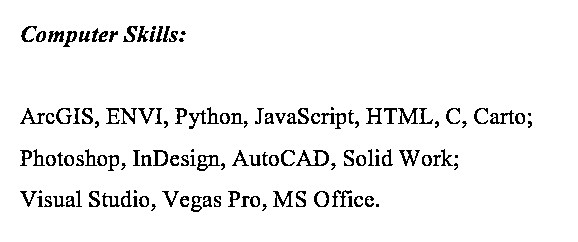
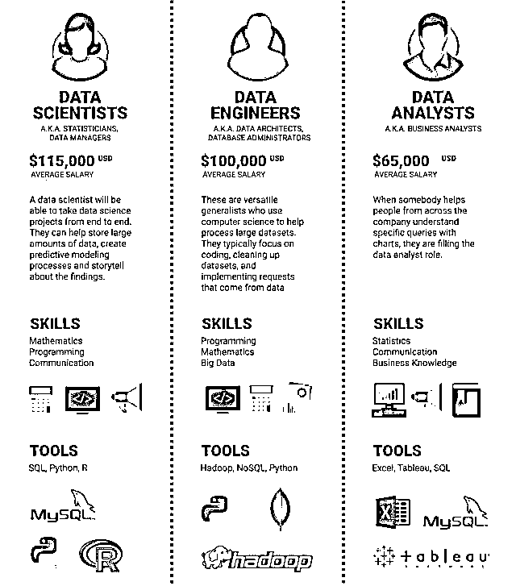

# 【必备】职场上有哪些性价比高的编程语言？

> 原文：[`mp.weixin.qq.com/s?__biz=MzAxNTc0Mjg0Mg==&mid=2653288783&idx=1&sn=800b957fafd6122c18c3a005ccd49e32&chksm=802e3b5ab759b24c14fa6c658cf731a357fd4b8197c23d0c44addb52a4b3e7115fdd2e3c5b1e&scene=27#wechat_redirect`](http://mp.weixin.qq.com/s?__biz=MzAxNTc0Mjg0Mg==&mid=2653288783&idx=1&sn=800b957fafd6122c18c3a005ccd49e32&chksm=802e3b5ab759b24c14fa6c658cf731a357fd4b8197c23d0c44addb52a4b3e7115fdd2e3c5b1e&scene=27#wechat_redirect)

本文来源：UniCareer

学**计算机**比金融**更好进投行？**

**咨询数据分析师**分分钟年薪百万？

各种**编程语言**和**统计软件**

成了热门的**简历必备关键词**

可你简历上写的

**C,C++,JAVA,VB,VC,FoxPro**

**Delphi,SQL,PHP,ASP,JSP...**

**讲真，面试官可能都不会用**

（简历示例）

**咨询数据分析师**和**量化岗**常用的编程语言**一样**吗？

**IT 咨询**对**编程要求**是不是**非常高**？

**金融交易岗**经常使用哪些**数据语言**？

**零基础**如何**速成**编程语言？

**职场中那些性价比高的编程语言**

**1\. 为什么写了很高级的编程语言却被拒？**

@Uni 德勤咨询导师 Jade

> 很多中国学生的简历我都看不懂，因为**简历上写的那些编程语言实在是太高深了**！

> 之前在 Event 认识一个妹子，刚毕业想进四大，她简历上写的那些编程语言特别高级，但还是一直找不到工作。

> 我觉得原因很可能是，**老板看你太优秀，会的东西太高级，觉得你****over-qualified****，不敢要你，怕面试都问不出问题。****Entry-level****的工作讲真不期待你会那么多。**

下面来一起看一看，**不同的岗位现实中对编程语言的要求是怎样的？**

1

**咨询行业**

**数据分析咨询顾问**

一般 2-3 个月就会换项目，**工作内容不固定**，可能上一个项目是做代码相关，而下一个项目是做系统维护或是客户培训。

*   **常用语言：**

    **Excel**，**VBA**，**SQL**最为常用，是比较基本的语言，**R**和**Python**会的话也很好。

**IT 咨询顾问**

IT 咨询顾问包括**IT 战略，数字化转型，业务系统整合以及 ERP**。按以上顺序，对经验和技术背景的要求也依次下降，顾问数量则依次上升。

**ERP 顾问**是做 IT 咨询的一个大方向，**一般不需要懂编程**，不过需要对 ERP 软件很了解，包括操作流程，实施流程等。而且需要熟练掌握相关业务，比如财务，物流，仓储，人力等等。

*   **常用语言：**

    懂数据库语言比较实用，如**SQL**。

2

**金融行业**

**数据岗**

工作内容主要包含数据管理，概率建模（Statistical Modeling），和数据的可视化（data visualization）。

*   **数据管理**需要用**SQL**去做一些**很简单的编程**，把数据分析的结果用数据库的方式实现出来。

*   **概率建模**主要用到的工具是**R 和 SAS**。这个部分比较**偏向统计分析**，也会涉及很多统计模型，比如 Decision Tree、Naive Bayes 和 Random Forests 等等。

*   **数据可视化**需要用到**数据库和统计分析软件**，主要用的工具就是**Qlikview**。

*   **常用语言：**

    **SQL，R，SAS，Qlikview。**

**量化岗**

如果是量化研究平台，**Python/R/Matlab**是必须的，**数据库**相关知识也必须掌握，你的职责是配合研究员实现其策略思想，回溯，调试参数，**得出策略的可行性**。

如果是量化交易平台，**C++/JAVA**是必须的，需要的**编程技能也更高**。除了需要精通数据结构，还需要了解多线程编程等。**主要职责是将策略实现出来**，运行在生产环境，根据行情信号来出发交易。

*   **常用语言：**

    **Python，R，Matlab，C++，JAVA。**

**风控岗**

风控岗下有很多分支，例如：风险管理， 变革管理，风险分析，模型验证等。大部分 Risk 岗位会比较倾向于编程实现能力，**编程语言更是因机构和岗位而异**，从 Python/C++到 SQL 到 R/SAS 什么的都有。

*   **常用语言：**

    **Python，C++，SQL，SAS。**

**交易岗**

投行交易员的招人标准除了一些衍生产品和定价方法，对市场的把握，还有就是一定的编程能力**（C++/C#最好，VBA 是必备）**，虽然有专门的量化组支持技术问题，但一些职位较高的交易员不是很喜欢直接和量化组打交道，需要一些懂编程和系统的初级交易员。

*   **常用语言：**

    **C++，C#，VBA。**

**IBD/行研部/VC/PE**

投行 IBD，行研部门以及在 VC/PE 工作，**对编程语言能力要求不高。**用的比较多的应该也就是 Word，PowerPoint，Excel（VBA 是很有用，学好 VBA 就差不多了）。

3

**数据行业**

 **数据科学家** 

数据科学家是一些**能综合运用编程和统计技术**的人，他们致力于通过各种方式让将数据更发挥作用。数据科学家在公司里面的责任，是从数据中挖掘价值，为公司的商业决策提供依据，职位比数据分析师高。需要的核心技能包括**数学、编程、和交流能力**。

*   **常用语言：**

    **SQL、Python、R。**

**数据工程师**

数据工程师主要职责是**经营及维护数据**。将需要的数据从不同来源、格式的数据源中提取出来，转换类型以方便使用，最后归档入数据库。一般来说，数据工程师需要有一定的 CS 背景，**需要能够编程**。需要的核心技能包括**编程、数学、和大数据**。

*   **常用语言：**

    **Hadoop、SQL、Python。**

**数据分析师**

数据分析师是比较**初级的数据岗位**。平时工作主要用回归模型做回归分析、拿 Excel 处理数据、难度高一点的需要用 Tableau 做效果图。不需要很高深的编程语言北京，需要的核心技能包括**统计学、交流能力、和商业知识**。

*   **常用语言：**

    **Excel、Tableau、SQL。**

**2\. 各类编程语言对比**

**1****机器语言：** 

机器语言编写的程序无明显特征，难以记忆，不便阅读和书写，且依赖于具体机种，局限性很大。

**2****汇编语言：** 

实质和机器语言相同，直接对硬件操作。但是指令采用英文缩写的标识符，**容易识别和记忆**。用汇编语言所能完成的操作不是一般高级语言能够实现的，源程序经汇编生成的可执行文件小，执行速度快。

**3****高级语言：** 

**与汇编语言相对**，不特指某种具体语言，而包括很多编程语言，像最简单的编程语言 PASCAL 语言也属于高级语言。

和汇编语言相比，将许多相关的机器指令合成为单条指令，去掉了与具体操作有关但与完成工作无关的细节，例如使用堆栈、寄存器等，简化程序指令，同时，无需编程者具有太多的专业知识。

**3\. 职场中性价比最高的语言**

**1****可以速成的语言：** 

大部分的机器语言、汇编语言和部分高级语言都属于需要丰富专业知识的，基本上零基础想速成的话可以和它们告别了，比较容易速成的有：**Python，Matlab，JavaScript。**

**2****性价比最高的语言：**

职场中性价比最高的几个编程语言：

**－ SQL**

**－ Python**

**－ R**

……

**最推荐的是学会 SQL 以及它的变体**。2017 年 SQL 是 10 大常用语言，这个趋势应当会持续很长时间。

此外，判断是否学习某个工具或某种语言的重点在于市场的发展。比如，**对于数据可视化方面，可以学习 Tableau**，就是因为 Tableau 公司在发展壮大。学习常用的软件可以让你的技能变得更有市场。

**3****如何入门**

**业务方向学习路线：**

*   没有专业基础（统计学、金融、数学、计算机专业）的可以从**统计学**、**SQL**开始学习。

*   对数学过敏的也可以先跳过统计学从**Excel、SPSS**开始，先熟练应用工具。

**技术方向学习路线:**

*   计算机专业背景的、走技术线的可以从**Hadoop**技术和**R****语言**开始学习。 

**知识在于分享**

**在量化投资的道路上**

**你不是一个人在战斗**