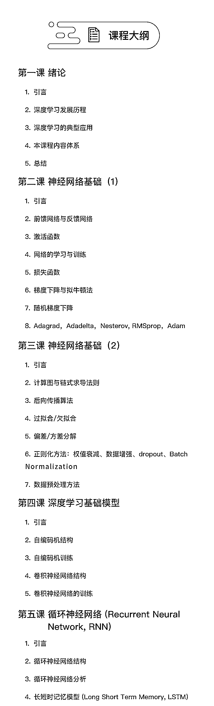
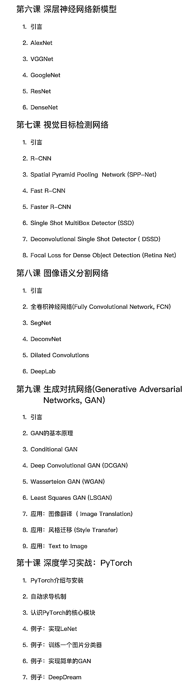

# 深度学习弯道超车，领先行业不止一点点 摘要：老师等等我，我要上车

> 原文：[`mp.weixin.qq.com/s?__biz=MzAxNTc0Mjg0Mg==&mid=2653288779&idx=1&sn=1ec35019a8451242efa613503a055bec&chksm=802e3b5eb759b248b3832fb06ed0e79b671aa0e61f46cec56825c2314301abbbcaad6f9d57c9&scene=27#wechat_redirect`](http://mp.weixin.qq.com/s?__biz=MzAxNTc0Mjg0Mg==&mid=2653288779&idx=1&sn=1ec35019a8451242efa613503a055bec&chksm=802e3b5eb759b248b3832fb06ed0e79b671aa0e61f46cec56825c2314301abbbcaad6f9d57c9&scene=27#wechat_redirect)

高校录取通知书已经开始发放了。 

“一家四人上清北”、“工地拌浆小伙收到北大录取通知书”这样的热搜不断霸屏，你是不是也会在心里问自己：当年再努力一点，会不会和现在不一样？每个人都曾经因为是上清华还是上北大而犹豫不决，后来才知道这世上有一个词叫多虑。

再后来就更羡慕“别人家的大学”了。羡慕他们可以更早的接触到新鲜的技术和硬件设施，接触更多的前沿事物，羡慕他们的导师随便一位可能就是业内的大咖，无论知识还是技能都是战斗力满满，很多学生很早就在老师的带领下打怪升级。

经历过校招的小伙伴一定都知道，很多大厂对于 985、211 的学生都是格外青睐的。这种青睐不无道理。

如果 你已经看到这里了，那就接下我这个福利吧：**给你一个和中科院学生师出同门的机会！**

虽然没有上名校，但是依旧可以拜名师学习。

**主讲老师**

**向世明**

*   中科院自动化所模式识别国家重点实验室研究员

*   中国科学院大学兼职教授、博士生导师

*   模式识别与机器学习领域近十年教学经验

为硕士生或博士生主讲《模式识别》和《机器学习导论》等课程，在高水平国际期刊或主流会议上发表论文 100 余篇以第一作者在 IJCV、IEEE T-PAMI、IEEE T-IP、IEEE T-NNLS、IEEE- T-KDE、IEEET-SMC-B、IEEE T-MM 和 PR 上发表论文十余篇。

**孟高峰**

*   中科院自动化所模式识别国家重点实验室副研究员

*   研究方向包括图像处理、计算机视觉和机器学习等

*   丰富的教学经验，为硕士生主讲《机器学习导论》等课程

在高水平国际期刊或主流会议上发表论文 50 余篇。以第一作者在 IJCV、IEEE T-PAMI、IEEE T-IP、ICCV、CVPR ECCV 等顶级国际杂志和国际会议发表论文十余篇。

**课程大纲**  

**开课时间：8 月 16 日**

👇👇👇课程详情，请点击**【阅读原文】**