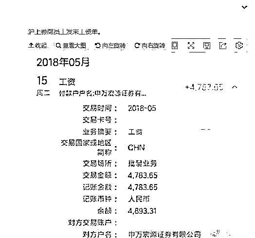
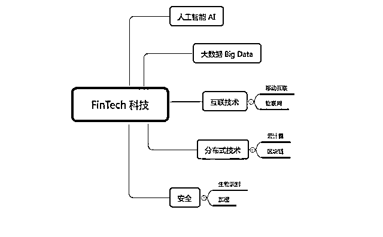
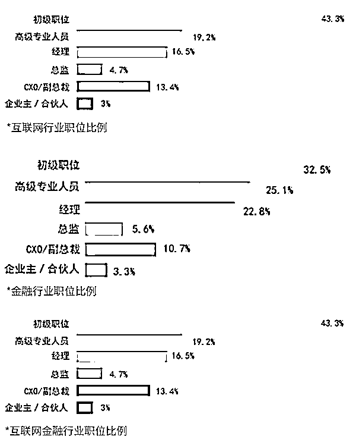

# 曾经年薪百万如今月薪 4K，你还要去券商？

> 原文：[`mp.weixin.qq.com/s?__biz=MzAxNTc0Mjg0Mg==&mid=2653288776&idx=1&sn=a16cde5f0cd058d790cb3841432f7ad6&chksm=802e3b5db759b24b619b58a2e25eba2118a8b8d5bf8de8ad4bbb0059efb8c917a7076342dad5&scene=27#wechat_redirect`](http://mp.weixin.qq.com/s?__biz=MzAxNTc0Mjg0Mg==&mid=2653288776&idx=1&sn=a16cde5f0cd058d790cb3841432f7ad6&chksm=802e3b5db759b24b619b58a2e25eba2118a8b8d5bf8de8ad4bbb0059efb8c917a7076342dad5&scene=27#wechat_redirect)

文章来自：UniCareer 

**插个话题**

就在这几天，有一个段子：

**有人会 Juila 嘛？**

期初小编也一脸懵逼

然后看了一些报道，原来如此···

**正文**

金融小年，券商的日子不太好过 **券商经纪业务和自营业绩双双触底
起薪 70 万的传说成为了泡影**

**申万宏源大刀阔斧裁员降薪
三高金饭碗瞬间被打破**

申万某员工拿着 4000 多的工资条“哭穷”

众多吃瓜群众表示

连金融精英都活不起了

我们还有出路吗？

 

**一心非要从投行/券商/PE/VC 中做选择的你，
如今该怎么办？**

01

券商进入低迷时期

A 股大盘指数跌跌不休，让二级市场成交量表现低迷，直接导致券商经纪业务和自营业绩双双触底。前不久资管新规靴子落地，**资管业务全面受限，投行业务战线紧缩**，无疑，往昔风光无限的券商行业正在经历一场寒冬。

简单来说，曾经风光的“牛市”已经过去，如今迎来的“熊市”令之前拿着高薪的券商精英们变成了靠天吃饭的“金融民工”。

在 98 家从事 IPO 保荐业务的券商中只有 44 家参与上半年的 IPO 盛宴中，参与数量不足一半。而在 44 家参与的券商中，**只有 31 家有所收获，剩余 13 家均无项目**。这就意味着无项目可做，成为了目前券商们的常态。

面对这样的现实，**多家券商采取措施，要么降薪，要么缩招**。而真正面对寒冬的，就是被降薪的券商员工和满腔热忱立志进入券商的人们。

*图片来源于网络

02

除了降薪，更怕的是被取代

除了降薪，缩招，最可怕的莫过于裁员。而更可怕的是，自己的工作被一群冰冷的机器所取代。

2000 年，高盛在纽约总部的美国现金股票交易柜台雇佣了 600 名交易员，但今天，这里只剩下两名交易员“留守空房”。**而取而代之的，不是更专业的人才，而是 FinTech。**

*图片来源于网络丨 08 年与 16 年瑞银集团交易大厅的变化

什么是 FinTech？**毕马威对金融科技公司（Fintech）的理解是：**

> **非传统企业以科技为尖刀切入金融领域，用更高效率的科技手段抢占市场，提升金融服务效率及更好地管理风险。**

*图片来源于网络

FinTech 到底有多恐怖？学霸君高考机器人 Aidam 与高考状元同台 PK，**用了不到 10 分钟完成了今年数学高考卷，得分 134（满分 150 分）**。

*图片来源于网络

也就是说，在不需要想象力和创造力的情况下，一份“机械式”的工作，将会被 FinTech 代替，比如卖方交易员。

而且这已经不是预测，而是现实

> *   **摩根大通开发的一款金融合同解析软件 COIN，原先律师和贷款人员****每年需要 360000 小时才能完成的工作，COIN 只需几秒就能完成****。**
>     
>     
> *   **2017 年 5 月 26 日，普华永道推出机器人流程自动化解决方案。**
>     
>     
> *   **2017 年 3 月贝莱德( Black Rock ) 宣布****裁掉 40 多个主动型基金部门的岗位，其中包括 7 名投资组合经理****，转而用机器人代替**
>     
>     
> *   **2016 年 3 月 10 日，德勤与 Kira Systems 联手，正式将人工智能引入会计、税务、审计等工作当中**
>     
>     
> *   **中国五大行自 2014 年开始首次联合裁员，****2014 年银行业裁员合计 1.7 万人，到 2016 年该数据已上升为 5 万余人**
>     
>     
>     
>     ......

*图片来源于网络 

03

难道金融梦就这样放弃了？

券商降薪，缩招的消息，人工智能的取代，造成的不仅是员工们的恐慌，担心自己放弃金融梦的应届生们同样很恐慌。然而，这并不是金融梦的终结。

某银行 CEO 表示：“新技术和机器人的使用并不能够直接完全替代人力资源，**至少它还不能像人一样变通和思考。”**

与此相反，**一些“技术过硬”的员工将会获得升职机会**，当机械化的任务被委托给机器人时，**他们会得到更多有趣的工作。**

1

什么样的人才算“技术过硬”？

试想一下，当每天有十万条、百万条数据需要整理，做定期分析，其他人只懂得一条条复制粘贴到 Excel 中，而你却能利用 Python 一键导入。不仅大大方便了自己，提高工作效率。还让领导看得到，你是一个懂编程的人。

**做一个投资里最会写程序的，也是写程序里最懂投资的。**互联网金融依托的还是互联网技术，所以身处于金融行业而懂得互联网的部分知识，当金融行业变革时，能够迅速变通并适应的人就会获得升迁，也被称为稀缺人才。

与互联网行业 10—50 万人才存量，金融行业 50 万以上人才存量相比，**互联网金融行业目前人才存量仅为 1—5 万**，**其发展成熟势必需要吸纳更多的人才**。
*图片来源于网络丨行业人才存量对比

2

互联网金融急缺高级人才

从互联网金融行业、金融行业、互联网行业的职级结构对比中，我们发现，互联网金融行业的初级职位人才比例处于互联网行业与金融行业之间，但其**总监及其以上的高级管理人才比例却远低于互联网行业与金融行业。**

**这意味着高级管理人才的培养和吸纳将成为互联网金融行业人力资源建设的重点**，期待成长为管理岗的初级人才，期待更好平台的现管理人才可以持续关注互联网金融行业。

*三大行业职位比例对比 

04

金融变革后，什么岗位最缺人才？

1

数据和金融分析方向

瑞银集团创新主管维罗尼卡·兰格曾明确表示瑞银目前正在为人工智能领域招聘更多人才。包括**数据科学家、架构师和商业分析师**。

**求职秘籍：**

数据分析并没有想象中那么难，哪怕是文科生或者从零开始学都来得及。数据分析岗位主要分为四个阶段。

*   **数据专员：**基本学会 Excel（VBA 最好学会；会做透视表；熟练用筛选、排序、公式），做好 PPT

*   **初级数据分析师：**除了 Excel 和 VBA，还要会 SQL，懂业务。

*   **中级数据分析师：**统计学熟练（回归、假设检验、时间序列、简单蒙特卡罗），可视化，PPT 和 Excel 一定要溜。

*   第四阶段分为很多种类，**数据科学家、可视化工程师、大数据工程师、数据挖掘师等：**此类职位需要精通的比较多，如机器学习，统计学，大数据技术等。

2

量化分析方向

目前高级金融人才奇缺，量化分析师更是存在巨大供需缺口，**至少还有 95％的空缺**。

**求职秘籍：**

量化分析对学历有一定要求，一般需要硕士学位。一个量化团队会有很多岗位，不需要你会所有技能，但要熟练你适合的岗位。

*   **专门做模型的**，一般数学比较好；

*   **专门做策略的**，一般统计学比较好，其他理工专业会分析数据、有交易逻辑的也可以；

*   **专门做算法的**，一般数学系、工程专业、物理专业都是可以的；

*   **专门做系统的**，一般计算机专业或者计算机能力强的比较多；

*   **专门做销售的**，如果了解量化和衍生品的概念和卖点，即使不会用模型定价，但**是销售能力强**，也是可以的。

3

资产管理方向

随着投行前台的大幅裁员，**资管领域同时扩招了 13.2%**。着重发展财富管理和资产管理业务，已经成为了商业银行转型的重要方向。

**求职秘籍：**

资产管理方向之前只招清北复交常青藤，最近也开始扩招应届生了，但门槛并不低。

*   在投资行业有发展，**需要大量前期的知识积累**，建议先从实习抓起

*   **拥有投资经验和投资领域权威证书 CFA**的人才会是资产管理公司的首选

*   要擅长与人打交道，**高情商和人际交流技巧很重要**

*   熟练运用 SPSS、 Excel 等工具分析数据。除了需要了解统计建模和预测之外，金融建模也是需要掌握的技能。

3

风险管理方向

**目前风险管理人才基础薄弱，**面对未来的发展趋势，金融业对风险管理的人才缺口是巨大的。

*   不管是电话面试还是现场，准备一些数学题，例如**最大拟然估值、p 值、变量挑选、蒙特卡洛模拟、中值定律以及随机分析**这种

*   需要活用诸如 VBA、MATLAB 等编程软件

*   CFA、CERA、ASA 证书，**不是必须要的但至少能锦上添花**

*图片来源于网络丨从业人员具备技能

**不让人工智能取代自己，这场金融行业的变革，你能把握住机会吗？**

**知识在于分享**

**在量化投资的道路上**

**你不是一个人在战斗**