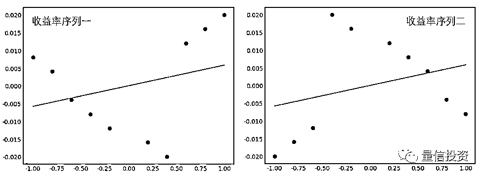

# 用 IC 评价因子效果靠谱吗？

> 原文：[`mp.weixin.qq.com/s?__biz=MzAxNTc0Mjg0Mg==&mid=2653288763&idx=1&sn=b0ecda8c0a1d8049061fad9ee9ace7d2&chksm=802e3b2eb759b238f53a3b94353560af5c607fddf483b5c225d7f4616184ca96e750a6a137a1&scene=27#wechat_redirect`](http://mp.weixin.qq.com/s?__biz=MzAxNTc0Mjg0Mg==&mid=2653288763&idx=1&sn=b0ecda8c0a1d8049061fad9ee9ace7d2&chksm=802e3b2eb759b238f53a3b94353560af5c607fddf483b5c225d7f4616184ca96e750a6a137a1&scene=27#wechat_redirect)

****

摘

要

传统的 IC 或者 Rank IC 在评价因子选股效果时不够合理，有一些陷阱。基于 IC 进行因子配置不十分靠谱。本文提出对 IC 的一些改进，并建议使用加权 IC 来评判因子效果。

**1**

**IC 和 Rank IC** 

在多因子选股实务中，人们热衷于动态评价因子在单期截面上的选股效果。为实现这个目标，**通常的做法是用当期个股的因子取值（记为 x）和下一期个股的收益率（记为 y）在截面上计算信息系数（information correlation），简称 IC。**IC 的计算方法通常有两种：x 和 y 的相关系数，以及 x 和 y 的秩相关系数（见下图）。第一种就是我们常说的 IC，第二种可以称作 Rank IC。

这里简单介绍下秩相关系数。

**秩****相关系数（rank correlation coefficient）**和相关系数类似，不同的是它考察的是两个随机变量之间的**单调相关性（monotonic correlation）**。秩相关性对变量之间的线性或非线性相关性不做假设。在计算秩相关系数时，使用的并不是观测值本身的数值，而是它们在各自样本中的排序。秩相关系数的取值在 -1 到 1 之间。

在统计学中，有多种计算秩相关系数的方法，其中最流行的要数 Spearman 秩相关系数，它以 Charles Spearman 命名。假设有两个随机变量 x 和 y 的 n 对儿观测值，Spearman 秩相关系数 r_s 的计算过程如下：

1\. 首先将 x 和 y 的观测值转换成它们对应的排序 x_r 和 y_r。

2\. 对 x_r 和 y_r 采用传统的线性相关系数公式，则可得到 r_s：

下图是某因子在一段时间内的滚动 Rank IC 移动平均，从中我们能对常见选股因子 IC 的取值范围有个大概的了解。

从上面的定义可知，**无论使用 IC 还是 Rank IC，都希望它越大越好，越大说明因子选股的能力越强（也可以越小越好，那就反过来用因子）。**我们也经常能在一些策略中看到使用 IC（或者 IR，即 IC 的均值除以标准差）的高低来动态进行因子的配置。

上面这些用法的核心前提是 IC 能够正确反映因子选股的能力。然而，真的是这样吗？**如果这个核心前提不成立，那么基于 IC 的各种因子择时、因子配置、因子打分恐怕难言靠谱。**

**2**

**IC 中的陷阱** 

本节通过一个假想的例子说明 IC 和 Rank IC 计算中存在的陷阱。假设有十支股票，它们的因子取值从大到小如下表所示。此外，考虑这十支股票的两组假想的收益率序列。

很容易计算该因子和这两组收益率序列的相关系数均为 0.2909。**如果仅仅看 IC 这个单一指标的话，我们会认为该因子在当期的选股能力很不错。**但 IC 背后还有很多故事可讲。我们不妨把因子和这两组收益率序列画出来，并各自做一条线性回归线来看一看。

另 y 代表收益率，x 代表因子，则线性回归表达式为：

上式中斜率 b 和 x 与 y 的相关系数 ρ 满足如下关系：

由于这两组收益率和因子的相关系数均为 0.2909，因此我们也以预期它们和因子的线性回归斜率相同。事实上，结果也正是如此（下图，斜率均为 0.0058）：

虽然 IC 一样，但是画出图来才看到这两组收益率序列和因子的关系大相径庭。假设从业务逻辑来说，个股的收益率和因子呈正相关，因此我们要选因子取值大的股票。但是，这个逻辑在上面两组收益率序列中会得到截然不同的结果：对于序列一，使用最大的因子取值可以选出收益率最高的股票；而对于序列二，使用最大的因子取值却选出了收益率相当差的股票。面对如此结果，IC 无辜吗？

如果使用 Rank IC 代替 IC，得到的也是同样的结论。这两组收益率和因子的秩相关系数均等于 0.3212。从这个数字背后解读不出任何超过这个数字本身的东西。

在量化投资中，我们喜欢并追寻能够精确计算出的数字。但这么做的前提是该数字有意义。在统计学家中流传着一个说法：

“

*Numerical calculations are exact, but graphs are rough.*

*译：数值计算是精确的，而图形是粗糙的。*

”

单一的统计量，比如上面的 IC 或者 Rank IC 却难以体现出图形反映出来的因子和收益率之间更多的关系。这说明如果我们仅仅看中 IC，可能会步入数据的陷阱。

仅关注统计量而忽视图形信息本身最著名的例子当属**安斯库姆四重奏（Anscombe’s quartet）**。安斯库姆四重奏是四组基本的统计特性一致的数据，但由它们绘制出的图形则截然不同。每一组数据都包括了 11 个 (x, y) 点。这四组数据由统计学家弗朗西斯·安斯库姆（Francis Anscombe）于 1973 年构造，他的目的是用来说明在分析数据前先绘制图表的重要性，以及离群值对统计的影响之大。

下图就是这四组数据绘制出来的图形，可见它们截然不同：

1\. 第一组描绘了 x 和 y 之间近似的线性关系；

2\. 第二组中 x 和 y 表现出了明显的非线性关系；

3\. 第三组中 x 和 y 之间存在线性关系，但由于一个明显的 outlier 的存在改变了数据的统计结果；

4\. 第四组 x 和 y 本来没有线性关系，但由于一个显著 outlier 的存在也使得它们“好像有线性关系”。

这四组数据和它们的统计特征如下图所示。

**这个例子完美的诠释了统计量（比如本文的 IC）不能反映出数据的全部信息。更危险的是，一旦它们被错误解读和使用，将会导致完全错误的结果。**

**3**

**改进的 IC** 

上一节的例子是为了说明当使用个股的因子取值和下期收益率在截面上回归时，得到的 IC 或者 Rank IC 不能很好的反映出因子选股的效果。对于这种情况，可以考虑以下两种改进方法。

**第一种方法是按照因子取值把个股分成 n 档（比如十档），然后将每一档视作一个投资组合，计算投资组合收益率和投资组合因子在截面上的 IC 或 Rank IC。**每一个投资组合中，可以按照等权或者市值加权来计算投资组合的收益率和因子取值。

**因子描述的是一揽子股票所共同承担（或者暴露于的）的某一方面的系统性风险。使用因子选股是为了规避个股特异性收益率的风险。**因此，比起个股，我们更应该关注一揽子股票的收益率和相应因子取值之间的相关性。这就是使用因子构建投资组合、再计算 IC 的初衷。投资组合的收益率是一揽子股票的均值，也可以更好的消除收益率上的噪音。

**第二种方法仍然从个股收益率和因子取值的 IC 出发，但是在计算时根据因子的业务逻辑（大到小、还是小到大的关系）来给 x 和 y 的取值赋权，从而得到 weighted IC。**由于结合了从业务逻辑出发的权重，这个加权 IC 能更好的反映因子的选股能力。

下面以上一节的因子取值和两组收益率序列为例解释这一做法。假设从业务出发，因子取值越大越好。将十组 (x_i, y_i) 样本点按照因子值 x 从大到小排序，并假设它们的权重按指数衰减，系数为 0.9。这十组样本点的权重为：

有了权重向量（记为 w），就可以计算 x 和 y 之间的**加权均值、加权方差、加权协方差、以及加权相关系数（weighted correlation coefficient）**：

根据上述定义，很容易计算出因子和这两组收益率序列的加权相关系数。它们分别为 0.4494（因子和第一组收益率序列），以及 0.0908（因子和第二组收益率序列）。从加权 IC 来看，显然**第一组的收益率序列比第二组收益率序列更能说明因子的选股能力。**

同样的，为了绘图说明加入权重的优势，对 x 和 y 进行 **weighted least squares 回归（WLS）**：

令 X 代表系数矩阵（包括截距项系数 1 和 x），W 表示由权重 w_i 作为第 i 个对角元素构成的对角矩阵，则带权重回归的解为：

利用线性代数的运算法则，不难求出上式右侧的第一项逆矩阵为：

回归式中右侧第二项为：

因此，加权回归的系数为（其中 a 为截距，b 为斜率）：

费了半天劲写出了 a 和 b 的表达式（其实从求解的角度，给出矩阵形式的求解足够了）只是想说明下面这件事儿。如果我们比较加权相关系数 ρ(x, y, w) 以及加权方差（标准差）var(x, w) 和 var(y, w)，以及斜率 b，则不难发现，和 OLS 一样，在加权回归中，ρ 和 b 仍然满足如下关系：

下面就来画图比较一下 WLS 回归和上一节 OLS 回归的结果。对于这两组收益率序列，OLS 回归的结果相同。但从选股的角度，我们知道如果因子对应的是第一组收益率，则该因子远比其对应第二组收益率有效。但是 OLS 回归（和普通的 IC）无法体现这一点。而采用改进的 WLS（以及 weighted IC）来衡量的话，如果因子产生了第一组收益率序列，则它的 WLS 回归斜率为 0.01（大于 OLS 的斜率 0.0058）；如果因子产生了第二组收益率序列，则它的 WLS 回归斜率仅为 0.0017（小于 OLS 的斜率）。**这说明通过使用基于因子业务规则的权重系数，WLS 比 OLS 更能判断因子和收益率之间的关系。**

**4**

**结语** 

在我上统计课的时候，教授总是反复强调，拿来数据先画出来看一看。**我们之所以能够相信统计量，是以搞清楚了数据内在的结构、形态为前提的。**如果没有这个前提，盲目的相信统计量就会导致错误的判断。金融数据已经信噪比极低了，我们当然不希望因为自己使用不当再加入不必要的噪音。

**很多时候数据关系越复杂，统计量传递出来的信息可能越失真。**

2017 年，来自 Autodesk Research 的 Matejka 和  Fitzmaurice 构建了当代版的“安斯库姆四重奏”（Matejka and Fitzmaurice 2017）。他们用计算机算法可以生成 x 均值、y 均值、x 标准差、y 标准差、以及 x 和 y 相关系数相同的复杂数据集。比如下图中的 12 个完全不同的数据集就在上述五个统计量中取值完全一致 —— x 均值 54.26，y 均值 47.83，x 标准差 16.76，y 标准差 26.93，x 和 y 相关系数 -0.06。

先别忙着惊讶，上述这些数据集都是由下面这张恐龙数据集（也有同样的统计量）构建来的！

有的朋友也许会说，IC 不够，再引入更多的统计量就行了。我们当然可以计算更高阶矩的统计量，但是因为数据的信噪比极低，这些样本数据计算出来的高阶统计量也存在大量误差。本文提出的改进方法属于从因子和收益率之间的内在逻辑出发 —— 比如分档构建组合、或者给不同的权重。这些都是**以内在的逻辑为先验**，以期更好的判断因子的选股能力。

如果你在使用 IC 或者 Rank IC（以及 IR）来动态的评价、配置因子，那么本文希望能引发你的思考。在评价因子选股效果的道路上，我们也许还有很长的路要走。

**参考文献**

Matejka, J. and G. Fitzmaurice (2017). *Same Stats, Different Graphs: Generating Datasets with Varied Appearance and Identical Statistics through Simulated Annealing.* CHI 2017 Conference proceedings: ACM SIGCHI Conference on Human Factors in Computing Systems.

**知识在于分享**

**在量化投资的道路上**

**你不是一个人在战斗**