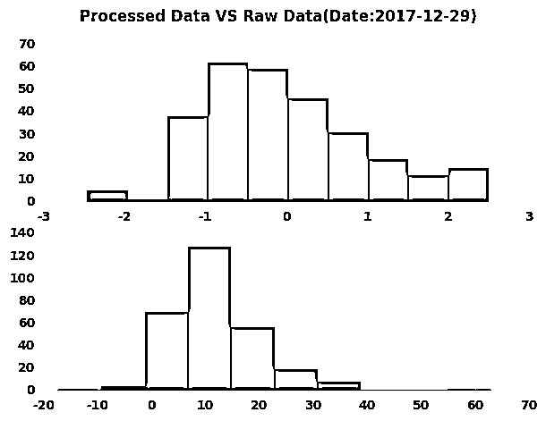

# 【中国市场】2018 第二季度因子表现，我都惊呆了！

> 原文：[`mp.weixin.qq.com/s?__biz=MzAxNTc0Mjg0Mg==&mid=2653288751&idx=1&sn=e7160377ecf214e3ed6924629d24e758&chksm=802e3b3ab759b22c500fc2f626bf4c120ff1fadf0371994a3e9dbea673bf70e68893251c722c&scene=27#wechat_redirect`](http://mp.weixin.qq.com/s?__biz=MzAxNTc0Mjg0Mg==&mid=2653288751&idx=1&sn=e7160377ecf214e3ed6924629d24e758&chksm=802e3b3ab759b22c500fc2f626bf4c120ff1fadf0371994a3e9dbea673bf70e68893251c722c&scene=27#wechat_redirect)

今天我们全面解读来自 Style Analytics 公司的研究报告：

**中国第二季度因子收益报告**

Style Analytics 是一家面向投资专业人士的独立全球软件提供商。Style Analytics 之前被称为 Style Research，拥有超过 20 年的因子分析经验，为 30 个国家的 280 多家投资机构提供服务。 

欢迎大家使用：由**Wind**旗下**万矿**量化云平台提供的一款**基于 Python 的因子分析函数库。**用 Wind 数据对因子进行一站式测试和研究！

**点击图片****，了解 WindAlpha 使用说明、案例**

**数据获取与处理**

对原始数据进行了剔除停牌、ST、新上市、缺失值处理，同时做了去极值、标准化，中性化处理。

**原始数据与处理后的数据分布对比**

**单因子分析**

对于因子分析，进行了 4 个维度的分析：

*   **IC 序列分析、IC 衰弱**

*   **收益率分析**

*   **换手率分析**

*   **板块分析**

**** 

**多因子组合分析**

主要的组合得分计算有以下几种方法： 

*   等权法：该方法对所有因子同等看待，不论其有效性的优劣

*   IC 加权：根据 IC 均值的大小决定因子的权重，IC 高的因子，权重就大，IC 的均值为滚动计算

*   ICIR 加权：根据因子 ICIR 的大小决定因子的权重，ICIR 越大，权重越大，ICIR 的值为滚动计算

**AlphaModel**

AlphaModel 是一个类，实例化为对象后可以一键对因子进行以上几个维度的分析，也能构建组合进行选股。

**计算方法**

为了计算单个因子的相对回报，我们首先创建一个单因子投资组合。所选时间段的证券根据单一权益因子按降序排序。

***市值=全市场的前 70％**

**因子定义**

**价值因子**** | **收益因子********| ****成长因子**** | ****质量因子******** 

**规模因子**** | **波动因子********| ****动量因子**** ****

**具体每个大类下的小类因子定义，在文末查询**

**因子结果分析**

**风格因子表现 （前 50％）**

**1 个月 - 行业中性（A 股、B 股、H 股）**

**风格因子表现 （前 50％）**

**3 个月 - 行业中性**（A 股、B 股、H 股）****

**风格因子表现 （前 50％）**

**6 个月 - 行业中性****（A 股、B 股、H 股）******

**风格因子表现 （前 50％）**

**年初至今 - 行业中性******（A 股、B 股、H 股）********

**风格因子表现 （前 50％）**

**1 年 - 行业中性******（A 股、B 股、H 股）********

**风格因子表现 （前 50％）**

**3 年年化 - 行业中性**（A 股、B 股、H 股）****

**风格因子表现 （前 50％）**

**5 年年化 - 行业中性**（A 股、B 股、H 股）****

**知识在于分享**

**在量化投资的道路上**

**你不是一个人在战斗**