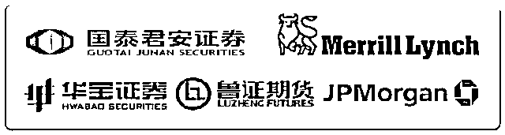
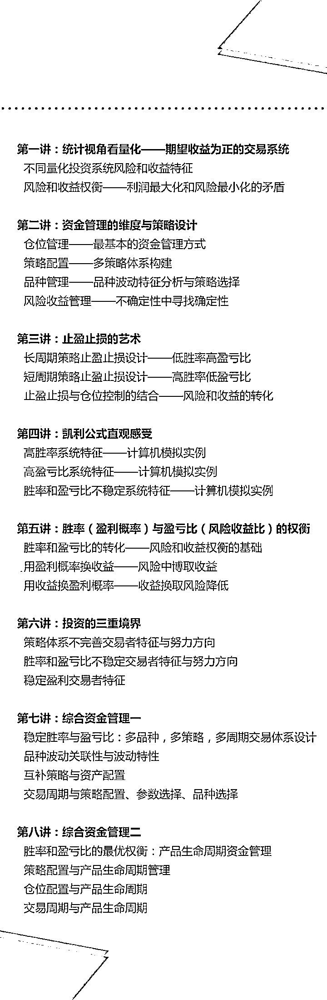
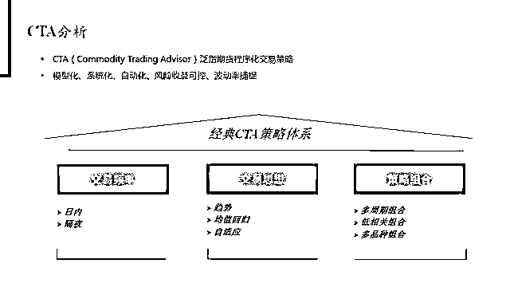
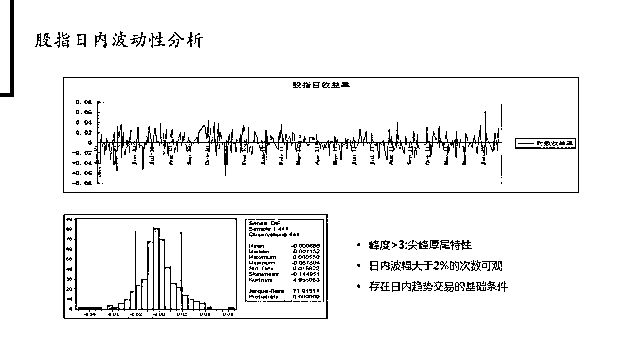
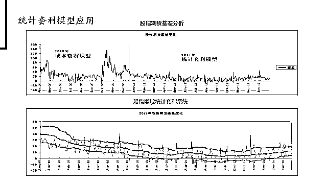
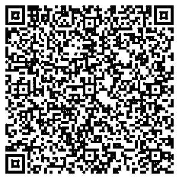

# 量化投资大佬是如何做资金管理与风控体系设计的？

> 原文：[`mp.weixin.qq.com/s?__biz=MzAxNTc0Mjg0Mg==&mid=2653288736&idx=1&sn=e18bdc2f81172e2abd44494eb4196576&chksm=802e3b35b759b223f53122715d9d6740effab8f75bf5f811d0fd7c4ccc19b4139c443d87b61d&scene=27#wechat_redirect`](http://mp.weixin.qq.com/s?__biz=MzAxNTc0Mjg0Mg==&mid=2653288736&idx=1&sn=e18bdc2f81172e2abd44494eb4196576&chksm=802e3b35b759b223f53122715d9d6740effab8f75bf5f811d0fd7c4ccc19b4139c443d87b61d&scene=27#wechat_redirect)

一位量化投资大佬的自述：

2017 年实盘账户收益合计是 48.76%

跑赢上证指数 41.37%，你相信吗？

2013 年，量化交易占到美股总交易量 14%

2017 年，已提高到 27%

运用量化策略的对冲基金

1 季度的规模就达 9320 亿美元

占整个行业的比例接近三分之一

毫无疑问量化投资已经是大势所趋

交易监管制度的完善，创新产品的推出

以及投资者的日趋成熟

量化投资在我国市场的应用前景不言而喻

Quant，其实一直在你身边

对你或许只是似曾相识，但我真的怕你相见恨晚

鉴于此，华尔街学堂

本期推出量化投资精品专题课

**《量化投资:资金管理与风控体系设计》**

线上课程

** //  导师信息  //**

> 为了保证课程质量，我们邀请**国内顶级量化投资团队，他们都毕业于知名高校，来自于国内外顶级金融机构，从事量化投资工作超过 5 年**，拥有优秀且稳定的量化投资业绩。

> **谢老师**

- 北京大学金融学硕士，历任宜信普泽金融工程师、嵌入期权结构化产品投资经理，鲁证期货黄金和指数挂钩型结构化分级产品高级顾问，华宝证券高级投资经理，冠恒大华投资管理有限公司副总裁，通过程序化策略管理资产规模累计超过 60 亿元人民币。长期负责嵌入场外期权结构化产品设计和运作，高频交易系统搭建和策略开发，国内早期场外期权实践者。

> **罗老师**

- 中国科学院理学博士，历任鲁证期货北京营业部研发总监，海川天地投资管理有限公司基金经理。多家期货公司高频交易和阿尔法策略团队负责人或高级顾问，长期负责 Alpha 策略开发，高频交易系统搭建，具有较长时间的股票量化投资实践经验，国内早期高频交易实践者。

 **//  课程内容  //**

** //  适合人群  //**

*   金融统计类背景的同学/工作人士，希望能够在课本之外工作之余进一步了解量化投资在金融市场的实战应用

*   非金融统计类专业背景的同学/工作人士，希望能够系统性了解量化投资以及在投资中的实际应用 

*   在证券公司/基金/银行/期货公司/交易所等相关领域工作的职场新人，希望进一步提升自己的竞争力

*   希望通过学习系统掌握量化投资相关的实务技能，为后续跳槽/转行做必要的知识技能准备与提升

**//  课件展示  //**

**//  课程特色  //**

理论和实践结合

统计实例讲解

全面讲述资金管理体系

从本质上讲解资金管理维度的风险和收益权衡

**//  课程详情  //**

****优惠期价****：****前 60 名交费学员，每****人 399 元****

**课程原价****：****499 元**

****学习周期********：******一年内随时随地可学习**************

**上课时间****：****交费后**即可学****

**课程形式****：****在线录****播视频**+PPT 课件****

**上课地点****：****华尔街学堂官网**

**                  www.wallstreets.cn**

**团购返现**

如果你带着你的小伙伴一起报名

3 人以上（含 3 人）可享受团购价

**每人将获得 50 元返现**

团购学员请联系课程助教微信

微信号: wangxy9510

** 报 名 方 式**

**本次课程通过此二维码报名**

**报名后添加课程小助手入课程群**

↓↓↓戳此码报名↓↓↓

**详情可咨询 ****助教微****信【yuanlx8622******】********

****（助教会在 24 小时内回复，请耐心等待）****

****如未能添加上助教请******在【华尔街学堂公众号】后台**

****留言：课程名+微信号（或手机号）****

****我们会主动联系您****

**//  Q&A  //**

**Q：如何****上课?**

**A：****上课流程操作如下**

1\. 长按本文上方二维码完成付费

2\. 付费后添加课程助教微信 wangxy9510

3\. 请把您的付费截图发给助教

4\. 向助教提供您的手机号(国内)或邮箱(国外)

5\. 由助教开通您的付费课程，给您注册密码

6\. 打开官网→登录账号→点击我的学习→开始学习

**Q：**请问有事错过或者**可以看回放**吗？

**A：**可以的，**课程视频一年内会留存供复习使用**，本次课程方式是录播+直播形式，正式课件是录播好的，随时随地可以学习，问题答疑选用直播形式，如果您错过了，我们会整理成文档，以便您回顾学习。                           

**Q：请问购买课程之后能否开具发票？**

A：可以申请发票，发票为电子版普通发票，购买后可以添加助教微信向助教申请。

*****以上产品最终解释权归华尔街学堂所有*****