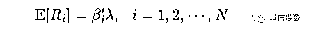
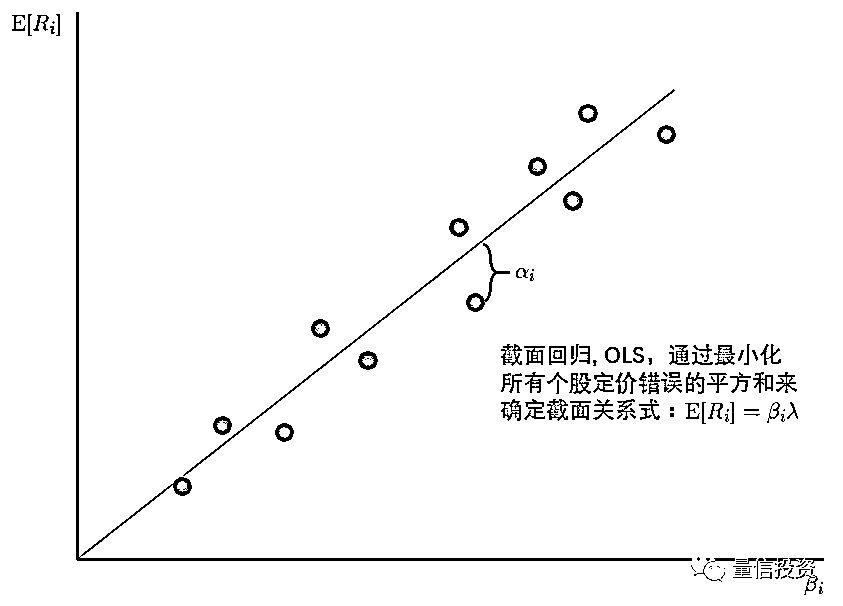

# 如果你研究多因子模型，这篇文章看不懂就别玩了！

> 原文：[`mp.weixin.qq.com/s?__biz=MzAxNTc0Mjg0Mg==&mid=2653288731&idx=1&sn=e0a2d591fc10a43a72057d03f70fd1d2&chksm=802e3b0eb759b21831b38824a4ca2a8ee7c145a451fbef945795fd45858ca0bdd027263d4a8b&scene=27#wechat_redirect`](http://mp.weixin.qq.com/s?__biz=MzAxNTc0Mjg0Mg==&mid=2653288731&idx=1&sn=e0a2d591fc10a43a72057d03f70fd1d2&chksm=802e3b0eb759b21831b38824a4ca2a8ee7c145a451fbef945795fd45858ca0bdd027263d4a8b&scene=27#wechat_redirect)

****

摘

要

收益率均值和因子暴露在截面上的关系就是多因子模型研究的问题。本文讨论一些平时在使用多因子模型时遇到的常见问题，如截面回归 vs 时序回归、使用 portfolio returns 和宏观经济指标作为因子有什么不同、以及因子暴露应该如何确定等。

**0**

**引言**

本文的题目是股票多因子模型的回归检验。说它重要，是因为在多因子模型被用于资产定价（选股）越来越普及的今天，**很多人不一定搞清楚了多因子模型中常见的时间序列回归、截面回归之间到底有什么区别，以及它们在本质上又是何其相似；不一定搞清楚在使用多因子模型给资产定价时，需要关注的 statistical tests 目标到底是什么；不一定搞清楚在回归残差存在时序或截面相关性时，模型参数的 standard errors 可能完全是不准确的以至于给出错误的推断……**

本文旨在讨论一些平时在使用多因子模型时可能遇到的各种困惑（比如什么时候用截面回归、什么时候用时序回归；使用 portfolio returns 作为因子和其他比如宏观经济指标作为因子有什么不同等）。由于篇幅有限，我会把写作重点放在对核心概念的解读上。此外，在本文中还会涉及对 Barra 模型的一些思考。

文章的最后一节将会安利写作时使用的主要参考文献（下文中对于时序和截面回归的讲解、以及对 Fama-MacBeth 回归的说明来自 John Cochrane 的经典教材 Asset Pricing 以及他在芝加哥大学的同名网上课程的相关部分），感兴趣的小伙伴在阅读本文后可以进一步参考。

最后一个小建议：请在一个能静下心来思考的心境下和环境中阅读此文。

**1**

**多因子模型的回归测试** 

**多因子模型是 Asset Pricing（资产定价）的一种常见方法**（其他的方法还包括 consumption-based model 等）。一个多因子模型（假设 K 个因子）的表达式如下：

其中 R_i 代表股票 i 的超额收益；β_i 为股票 i 的 K × 1 阶因子暴露（factor exposure，也称因子载荷 factor loading）向量；λ 为 K × 1 阶因子收益率均值向量；E[.] 为数学求期望公式。

**多因子模型研究的核心问题是股票的（超额）收益率期望在截面上（即不同的股票之间）为什么会有差异** —— 根据模型，如果一支股票在因子上的暴露（β_i）高，则它的期望收益（E[R_i]）也应该更高。

“

*The central economic question is why **average returns** vary **across** assets; **expected returns** of an asset should be high if that asset has high **betas** or **risk exposure to factors** that carry high risk premia.*

”

虽然本文才刚开始，不过让我们停一停，take a break。我想再强调一下上面这句话：**多因子模型研究的是个股收益率均值在截面上（cross-sectional）的差异。我们不关心个股的收益率 R_i 在时间序列上是如何随着每期因子收益率来波动的（这是 model of variance），我们只关心 R_i 的期望 E[R_i] 在截面上和对应的 β_i 之间的关系（这是 model of the mean）。**

我们选择的因子代表了收益率的一种结构。一旦结构给定后，个股（或者任何一个投资组合）的预期收益率就完全由它在这些因子上的暴露决定了 —— 暴露高，预期收益率就高；预期收益率是因子暴露的线性函数。**怎样找到最好的因子结构 —— 即哪些因子使得个股在截面上的预期收益率区分度高 —— 就是因子模型研究的问题。**

仍然晦涩？用下面这个图解释一下（因为要做图，所以假设单因子，比如 CAPM 模型）。下图中横坐标为 β_i，纵坐标为 E[R_i]，每个点代表一支股票。根据因子模型，每个股票的预期收益率 E[R_i] 和 β_i 成正比。图中这条直线就代表 E[R_i] = β_i × λ，它的斜率 λ 就是因子的预期收益。由于所有的股票收益率都仅仅是样本数据，因此即便 E[R_i] = β_i × λ 完美满足，在每个样本内，E[R_i] 和 β_i × λ 之间也有残差，正如图中的 α_i 所示。

因为一共有 N 支股票，因此这张图中的直线反映的是 N 个 E[R_i] 和 N 个对应的 β_i 在截面上的关系 —— 正如前文反复强调的，**多因子模型反映的是收益率均值和因子暴露在截面上的关系。**

我们最熟悉的因子模型无疑是 CAPM，它因为只有一个市场因子所以是多因子模型的一个特例。人们最早的猜测是市场因子的收益率和个股在该因子上的 β 就可以解释截面上不同股票收益率之间的区别。但大量的实证结果显示如果我们把个股的 E[R_i] 和它们针对市场因子的 β_i 画出来，则实际的斜率较模型的结果来说太小了，说明仅仅用单一市场因子无法很好的解释 E[R_i] 在截面上的差别。

这之后，Black、Jensen 以及 Scholes 提出了 Black CAPM，它在 CAPM 的基础上又加入了一个因子，使得这个双因子模型更好的解释 E[R_i] 在截面上的差别。再后来，Fama 和 French 提出了大名鼎鼎的三因子模型，它在市场因子的基础上加入 HML 和 SMB 两个因子。这些努力都是为了能够更好的解释我们在股票收益率数据中观察到的 E[R_i] 在截面上的差别。

拿来一个多因子模型，应该怎么定量的评估它能否很好的解释 E[R_i] 呢？我们应该关注三点：**Estimate（估计）**、**Standard Errors（标准误）**、以及 **Test（检验）**，见下表。

对于截面关系式 E[R_i] = β_i’λ + α_i，我们使用回归分析（既可以通过时序回归、也可以是截面回归，后面会具体讲）确定参数 α、β、λ 的估计值和标准误。**只有有了准确的（无偏且相合）估计值和正确的标准误，才能评价因子是否有效**（比如正确计算因子收益率 λ 的置信区间，从而判断这个因子是否有风险溢价）。下文会谈到，由于残差 α 在截面以及时序（特别是截面）上有相关性，因此在标准误的计算上必须格外小心。

在上述截面关系式中，α_i 代表了个股 i 的**定价错误（pricing error）**。如果我们能够在统计上证明所有股票的 α_i 都很接近零，那么这个多因子模型就是很好的模型 —— 这些因子能够较好的解释个股截面预期收益率的差别。因此，多因子模型的回归检验中的重中之重、也是**我们唯一关注的 test，就是所有这些 α_i 联合起来是否在统计上足够接近零。**

“

*We want to know whether all the pricing errors are **jointly** equal to zero.*

”

根据上述说明，多因子模型的回归检验可以简单总结成以下几点：

1\. 挑选因子，计算个股在这些因子上的暴露 β_i；

2\. 找到个股（超额）收益率均值 E[R_i] 和因子暴露 β_i 在截面上的关系；

3\. 计算每个个股的定价错误 α_i，联合检验这些 α_i 是否在统计上为零。

无论我们用什么因子（基本面因子、宏观经济因子、技术面因子）；无论在确定截面关系时我们采用时序回归还是截面回归；对多因子模型的最终评判都转化成一个核心问题 —— 这些 α_i 联合起来是否在统计上为零。

下面先来看看如何通过时间序列回归找到截面关系。

**2**

**时间序列回归** 

如果模型中的**因子是 portfolio returns（即使用投资组合收益率作为因子）**，那么可以通过**时间序列回归（time-series regression）**来分析 E[R_i] 和 β_i 在截面上的关系。

例如，Fama and French (1993) 提出了影响深远的三因子模型，它里面的三个因子，即市场、HML、SMB 都是投资组合的收益率。其中 HML 和 SMB 是通过 BP 和市值将股票排序然后做多一部分并同时做空一部分来构建的投资组合。以 HML 为例，它代表着 high book-to-market ratio 公司相对于 low book-to-market ratio 公司的超额收益。该因子叫做 HML 因子而非 BP 因子，其意义也是强调因子本身是一个投资组合的收益率，而非 BP。Fama 和 French 用这三个投资组合的收益率来解释个股或者其他投资组合在截面上的收益率。顺便提一句，关于三因子模型的重要性以及其作用，Fama and French (1996) 给出了非常详尽的解读，非常值得一读。

令 f_t 表示 t 期因子向量（不同投资组合的收益率）；使用 f_t 对每支个股 i 的收益率 R_it 做时间序列回归：

上述时间序列回归中，回归方程右侧的 regressors 是因子收益率 f_t，左侧的变量是 R_it，回归得到的系数是个股 i 在因子上的暴露 β_i，截距 α_i，以及随机的残差 ε_it。

将上述时间序列回归结果在时序上取均值可得（下式中 E_T[.] 中下标 T 表示在时序上取均值）：

上式正是个股期望收益率和因子暴露在截面上的关系式。**当因子本身是投资组合时，我们只需要在时序上做回归得到因子暴露和截距。****虽然只做了时序回归，但是通过在时序上取均值就可以从时序回归中得出 E[R_i] 和 β_i 在截面上的关系。**比较上面两个关系式不难发现，**时间序列回归中的截距 α_i 恰恰就是截面关系式中的个股 i 的定价错误。**

Black, Jensen and Scholes (1972) 基于如上的论述给出了时序回归法中求解因子预期收益率的简单方法 —— **因子收益率 f_t 在时序上的均值就是因子的预期收益率**：

下面仍然以单因子这种最简单的情况来画图看看通过上述时间序列回归得到的预期收益率和 β_i 的截面关系长什么样子。图中的红色直线为 E[R_i] = β_iE[f]，当 β_i = 0 时，E[R_i] = 0；此外，如果我们用给因子模型解释因子投资组合自己，由于因子组合的 β_i = 1，因此有 E[R_i] = E[f]。以上论述说明**时间序列回归得到的 E[R_i] = β_iE[f] 这条直线一定会经过 (0, 0) 和 (1, E[f]) 两点。**

****

图中所有蓝黑色的点代表着个股；红色的点代表着因子投资组合。时间回归再按时间求均值而得到的因子模型 E[R_i] = β_iE[f] 就是经过原点和红点的那条红色直线。**所有蓝黑色点（个股）到这条红线的距离就是个股的定价错误 α_i，这条时序回归得到的直线并不是以最小化 α_i 的平方和为目的求出的，这是时序回归和下一节要介绍的截面回归的最大差别（截面回归是以最小化 α_i 的平方和为目标的）。**

得到了回归模型的参数，下一步就是计算各种参数的标准误、以及检验我们唯一关注的问题：所有股票的错误定价 α_i 联合起来是否在统计上为零。

在时间序列回归残差 ε_it 不相关且方差相同（homoskedastic）时，时序回归参数的标准误可以由 OLS（ordinary least square）的标准公式给出。此外，如果 ε_it 满足 IID Normal，Gibbons, Ross and Shanken (1989) 给出了 α_i 的检验统计量（又称为 GRS test statistic）：

然而，一旦 ε_it 之间存在相关性或者异方差性，传统 OLS 的标准误公式就是错误的，且上述 α_i 的检验统计量也是有问题的。在这种情况下，就要请出大杀器 Generalized Method of Momentums（GMM）。它由 Lars Peter Hansen 于 1982 年提出（Hansen 1982），GMM 可以解决 OLS 中残差的相关性和异方差性的问题，得到准确的估计以及标准误。GMM 是 Hansen 于 2013 获得诺贝尔经济学奖的原因之一，足见其在计量经济学中的重要性。具体如何使用 GMM 超出本文的范畴，感兴趣的读者可以参考本文最后一节安利的参考文献。

以上就是通过时间序列回归得到多因子模型的过程。最重要的三点总结如下：

1\. 因子必须是 portfolio returns，才可只进行时间序列回归而无需进一步的截面回归；时序回归得到了投资品在这些因子上的暴露 β_i；时序回归中得到的 α_i（截距项）就是截面关系上个股的定价错误。

2\. 将时序回归结果在时间上取均值，就得到个股收益率和因子暴露在截面上的关系。该关系的确定不以最小化 α_i 的平方和为目标。

3\. 在时序回归残差 ε_it 满足 IID Normal 的条件下，可以通过 GRS test 来检验 α_i；否则则可以通过 GMM 来检验 α_i。

**3**

**截面回归** 

下面来看看**截面回归（cross-sectional regression）**。**截面回归的最大好处是，因子可以不是 portfolio returns。**比如因子可以是 GDP、CPI、利率这些宏观经济指标。显然，它们的因子取值不是收益率，因子收益率需要通过截面回归得到。但是在那之前，我们必须先通过时间序列回归得到个股在不同因子上的暴露。**因此，截面回归的第一步仍然是时序回归，以确定因子暴露。**

有的小伙伴可能会问，那些因子取值（比如 GDP 的取值、CPI 的取值）不能直接当作 β_i 吗？答案是否定的。首先这没有意义，因为时序上我们关注的是这些因子的变化对个股收益率变化的解释程度（model of variance），这由个股收益率对这些因子的**敏感程度**，即时序回归的系数 β_i，而非因子本身的大小决定。第二，行业不同、基本面存在差异的公司受宏观经济的影响也不同，因此它们在同样宏观经济指标上的暴露势必不同。

一般的，假设因子不是 portfolio returns，首先进行时序回归确定 β_i：

上式和前一节时序回归中的表达式几乎一样，唯一的例外是这里的截距项我特意用了 a_i，而非 α_i，这是因为如果因子本身不是投资组合收益率，则该截距并不是稍后我们通过截面回归得到的个股的定价错误。

得到 β_i 后，进行第二步 —— **截面回归，从而确定每个因子的预期收益率。**在截面回归时，回归表达式的右侧 regressors 是 β_i，左侧是个股的预期收益率（即在整个 T 期的收益率均值）E[R_i]。因此，截面回归的表达式为：

回归的目标是找到因子预期收益率 λ，和代表股票定价错误的残差 α_i。仍以单因子为例说明通过截面回归得到的个股收益率均值和因子暴露的关系（下图）。假设在截面回归时采用 OLS。此外，定价理论暗示除 α_i 之外，截面收益率均值应该仅由 β_i 决定，因此**一般来说截面回归没有截距项**（当然我们也可以加上）。在这样的假定下，**截面回归 OLS 将通过原点并最小化所有个股残差 α_i 的平方和。**

当残差 α_i 满足 IID 时，回归测试的 estimate、standard errors、以及我们关注的 α_i 的检验分别为：

虽然上面给出了 OLS 截面回归下各种关注变量的表达式，但不幸的是，这并没有太多用。这是因为在**截面上个股的残差存在明显的相关性。**这种相关性虽然不会影响 OLS 的估计，但是会使 OLS 给出的标准误存在巨大的误差（低估）。为此，可以使用 **GLS（generalized least squares）**取代 OLS。GLS 考虑了残差的协方差因此可以得到准确的标准误。**但是，由于必须估计残差的协方差矩阵，在现实中使用 GLS 存在巨大的障碍。**如果有上千支股票，那么协方差矩阵中有太多的参数需要估计，不切实际。

怎么办呢？再次请出大杀器 —— GMM，它可以轻松的求出我们需要的各种量（Hansen 功不可没啊）。另外值得一提的是，在截面回归时用到的 β_i 并不是已知、真实的，而是从时间序列回归得出的估计值，它们称为 generated regressors，存在误差。Shanken (1992) 给出了解决该问题的修正方法，称为 Shanken correction。利用 Shanken correction 和 GMM，就可以检验 α_i 是否为零了。

好了，又到了我们小结的时候了：

1\. 截面回归不要求因子是 portfolio returns，应用更加广泛（当然因子也可以是 portfolio returns）。但是截面回归的第一步仍然是通过时间序列回归得到的是投资品在因子上的暴露 β_i。第二步才是截面回归。因此截面回归又称为 two-pass regression estimate。

2\. 得到 β_i 后，使用个股的平均收益率 E[R_i] 和 β_i 进行截面回归（一共 N 个点，每个点对应一对儿 E[R_i] 和 β_i），回归得到因子的期望收益率 λ 和个股的残差 α_i。常见的回归方法是 OLS —— 以最小化残差平方和为目标，或 GLS —— 考虑残差之间的相关性。

3\. 由于 β_i 是估计值，且 α_i 的协方差矩阵难以估计，更方便的办法是使用大杀器 GMM 得到准确的估计以及检验 α_i 是否为零。

**4**

**时序回归 vs 截面回归** 

前面两节分别介绍了时序回归和截面回归。有意思的一点是，当因子是投资组合时，我们既可以使用时序回归又可以使用截面回归。那么它们二者的区别是什么呢？

下图以单因子为例，直观的比较了二者的区别。在时序回归中，我们仅仅在时序上对每支个股做一次回归，然后通过在在时序上取均值（E_T[.]）来得到隐含的截面关系，因此时序回归的 E[R_i] = β_iλ 必然经过原点和作为因子投资组合的平均收益率所对应的点 (1, E_T[f])。反观截面回归，它利用时序回归得到的 β_i 和股票在时序上的均值 E[R_i] 进行了第二次回归。以 OLS 为例，这个截面回归将要最小化所有个股残差 α_i 的平方和。

****

**和时序回归得到的最终 E[R_i] = β_iλ 关系式相比，截面回归利用了所有个股的数据。从某种意义上来说，这更合理。对于时序回归，因子的平均收益率就是该因子组合在 T 期收益率上的均值：λ = E_T[f]。而对于截面回归来说，因子收益率通过 OLS 或 GLS 确定，取值和 E_T[f] 不同。这是二者最大的区别。**

此外，当多个因子同时进行截面回归时，根据 Barra 纯因子模型的理论，得到的因子收益率是纯因子组合的收益率 —— 即截面回归后得到的因子组合中个股的权重与最初构建因子时使用的个股权重会有所不同。纯因子组合较其他因子组合有一定的优势，这有助于更好的评判因子的风险溢价。

时序回归和截面回归有时也被同时使用来检验模型（选择的因子）是否有意义。考虑下面这个例子。假如我们选了一个因子，E[R_i] 和 β_i 在截面上的关系如图中那些蓝黑色圆点表示。如果我们进行时序回归（图中红线），会得到一个正的因子预期收益率；而如果我们进行带有截距项 γ 的截面回归，即 E[R_i] = γ + β_iλ + α_i），则会得到完全不同的结果（图中蓝线）：负的因子预期收益率。两个模型的背离说明因子的选择有问题，需要进一步考察。

**5**

**Fama-MacBeth 回归** 

1973 年，Fama 和 MacBeth 提出了 Fama-MacBeth Regression（Fama and MacBeth 1973），目的是为了检验 CAPM。Fama-MacBeth 也是一个**两步截面回归检验方法**；**它非常巧妙排除了残差在截面上的相关性对标准误的影响**，在业界被广泛使用。这篇文章也是计量经济学领域被引用量最高的文章之一。

Fama-MacBeth 回归的第一步仍然是通过时间序列回归得到个股收益率在因子上的暴露 β_i，这一步和本文第三节截面回归中的第一步一致。

在第二步截面回归中，**Fama-MacBeth 在每个时间 t 上进行了一次截面回归，**这是 Fama-MachBeth 和上面的截面回归最大的不同：

比较一下上式和本文第三节截面回归中的表达式。在一般的截面回归中，我们首先在时序上对 R_it, t = 1, 2,…,T 取均值，得到个股的平均收益率 E[R_i]。之后用 E[R_i] 和 β_i, i = 1, 2, …, N 在截面上做回归，因此这里只做了一次截面回归。

而 Fama-MacBeth 截面回归时在每个 t 做一次独立的截面回归（如果有 T = 500 期数据，这就意味着进行 500 次截面回归），然后把这 t 次截面回归得到的参数取均值作为回归的 estimate：

**上述方法的巧妙之处在于它把 t 期的回归结果当作 t 个独立的样本。**参数的 standard errors 刻画的是样本统计量在不同样本间是如何变化的。在传统的截面回归中，我们只进行一次回归，得到 λ 和 α 的一个样本估计。而在 Fama-MacBeth 截面回归中，我们把 T 期样本点独立处理，得到 T 个 λ 和 α 的样本估计。由此便能很容易且正确的求出 λ 和 α 的标准误：

此外，通过 T 个 α  的估计值，很容易求出残差的协方差矩阵并由此检验个股的定价错误是否联合为零。从上面的描述不难看出，Fama-MacBeth 截面回归和传统截面回归的区别是：

Fama-MacBeth 截面回归先在不同的 t 上分别用 R_it 和做回归，再把回归的结果 λ_t 和 α_it 在时序上取均值得到 λ = E[λ_t] 和 α = E[α_it]；

传统截面回归是先把 R_it 在时序上取均值得到 E[R_it] 然后再进行一次截面回归，直接得到 λ 和 α。

所以简单来说，**Fama-MacBeth 先回归再均值；而传统截面回归先均值再回归。****当截面回归中的 regressor，即 β_i，在所有 T 期上不变时，上述两种截面回归得到的 estimate 是一致的**（Fama-MacBeth 在处理残差的截面相关性上仍然有优势）。

在 Fama and MacBeth (1973) 中，作者在时序回归求解 β_i 时采用了滚动窗口，因此 β_i 在不同的 t 是会发生变化的。如果我们用所有样本数据来一次估计 β_i，那么它们在所有 T 期的取值相同。

有上面的介绍可知，Fama-MacBeth 回归的最大优点是它排除了残差截面相关性对标准误的影响。股票的残差收益率在截面上具有很高的相关性，因此该修正对于准确计算标准误至关重要。下面来说说它的不足。

首先，**Fama-MacBeth 回归对于残差在时序上的相关性无能为力。**如果残差在时序上存在相关性，则需要对 Fama-MacBeth 回归得到的标准误进一步修正。Petersen (2009) 分析了不同的回归技术在分析面板数据（panel data）时由于忽略残差的时序或截面相关性而导致不准确的标准误（低估了其真实值）。这篇文章非常值得一读。其次，上文提到，在截面回归中用到的 β_i 并不是已知的，而是通过时间序列得到的估计值（generated regressors），因此存在误差。Fama-MacBeth 回归对此也无能为力，需要 Shanken correction。

如今我们有了 GMM 这样的大杀器，能够方便的处理残差的各种相关性。但不要忘记，Fama-MacBeth 回归比 GMM 早提出了近 10 年！在没有 GMM 或其他更先进方法的年代，Fama-MacBeth 回归通过在截面回归时“先回归、再均值”的思路巧妙的排除了残差截面相关性的影响，得到了学术界的广泛认可，影响深远。时至今日，在计量经济学做面板分析的文章中，仍有约 1/3 的文章采用 Fama-MacBeth 回归（Petersen 2009）。

Fama-MacBeth 回归的要点总结如下：

1\. Fama-MacBeth 回归也是一种截面回归，因子可以是 portfolio returns，也可以是别的指标。和普通截面回归一样，它的第一步也是通过时间序列回归得到的是投资品在因子上的暴露 β_i。

2\. 得到 β_i 后，在每期（共 T 期）的截面上使用个股的收益率 R_it 和 β_i 进行截面回归，回归得到该期因子的收益率 λ_t 和个股的残差 α_it。通过 T 次截面回归、得到 T 个的估计后，将它们取均值得到因子收益率均值 λ = E[λ_t] 和个股残差均值 α = E[α_it]。

3\. Fama-MacBeth 回归排除了残差截面相关性对标准误的影响，但是对时序相关性无能为力。

**6**

**对 Barra 模型的思考** 

本节是开放性的讨论，陈述对 Barra 模型的一些思考。Barra 模型和本文第二、三节介绍的时序和截面回归都有所不同。

Barra 的多因子模型考虑了行业因子和来自基本面和技术面的风格因子。**Barra 的模型也是截面回归模型。**但是和本文中介绍的模型不同之处是：**在 Barra 模型中，因子暴露并非来自时间序列回归，而是直接来自基本面或者技术面数据本身。**我查阅了前后几代 Barra 的文档，比如 Grinold and Kahn (1994)，Menchero et al. (2011)，Orr et al. (2012)，得到的都是上述结论。

举个例子，比如我们熟悉的 Book-to-Market ratio。在 Fama-French 三因子模型中，BP 被用来构建了一个 HML 投资组合，而这个投资组合的收益率作为因子，个股在这个因子上的暴露由时间序列回归确定，与个股实际的 BP 无关。而在 Barra 模型中，BP 直接被用来当作因子，个股在因子上的暴露就是使用财报中 Book value 和股价计算出来的比例经过必要的标准化确定的。

有了因子暴露后，Barra 和传统截面回归一样，是通过截面回归来确定每个因子的收益率（纯因子模型）。所以，**Barra 模型（业界代表）和学术界流行的因子模型最大的不同就是因子暴露 β 的确定。**

对于风格因子来说（行业因子我们一会儿另说），这两种确定 β 的方法在我看来各有千秋。**时间序列回归得到的 β，它的变化注定是缓慢的，且回归中也有大量的噪声。直接用基本面或者技术面数据作为 β，可以更快的捕捉公司的变化。**

然而，**使用基本面或者技术面数据直接作为 β 则必须进行标准化（原始数据拿来直接当作因子暴露会有很大问题）。**我在本文反复强调了因子模型是分析个股平均收益率在截面上随 β 的变化，即预期收益率的大小完全由股票在因子上的暴露大小决定。试想一下，如果我们用不经过标准化的市值作为因子暴露，如果公司 A 的市值是 B 的市值的 100 倍，那难道我们能说市值因子的收益率对 A 的收益率的影响是对 B 的收益率的影响的 100 倍吗？显然是不能的。所以对于市值因子，常见的是首先取对数，然后再进行标准化。对于其他的风格因子，也需要采用相应的标准化处理。在 Barra 的文档中对如何标准化因子暴露有详细的说明。

对于行业因子，Barra 将因子暴露处理成 binary 变量 —— 比如工商银行在银行业的暴露是 1，在其他行业的暴露为 0（对于业务涉及不同行业的大公司，Barra 允许该公司以不同权重属于多个行业）。我认为这个处理值得考量。假如某个公司属于行业 X，但是它的收益率和行业 Y 更相关，那么从建模的角度是不是把该公司算作行业 Y 更有道理？对于行业因子暴露，可以尝试使用个股的收益率和行业的收益率做时间序列回归，将回归系数当作行业因子的暴露。我不清楚 Barra 是否尝试过上述方法，但这是一个值得思考的问题。

**7**

**结语** 

首先，感谢你看到这里。我知道文章很长，我写的也很痛苦，但我觉着它很重要。

本文介绍了股票多因子模型的回归检验。希望你看完后能够对常见的时序回归、截面回归、Fama-MacBeth 回归、以及 Barra 模型等有更深的理解；对如何确定因子暴露，如何计算因子收益率，以及回归检验的终极目标是什么（所有残差 α_i 是否在统计上为零）有清晰的认识。

作为你看到这里的感谢和鼓励，我放个彩蛋 —— **检验 is NOT everything！**

考虑下面两个因子模型，图中每个点代表一个股票。图中给出了它们残差 α_i 的置信区间。按照统计检验的思路，左图中大部分残差的置信区间都和那条截面回归关系式没有交集，说明我们要拒绝原假设，即 α_i 统计上不为零；右图中大部分残差的置信区间和截面回归关系式相交，我们接受原假设。但显然，左边的模型更好的反映出股票收益率和因子暴露在截面上的关系；而右边的模型表现出的关系则非常弱（从这些点看不出 E[R_i] 随 β_i 的增大而增大）。所以，从 economic sense 来说，显然左边的模型更好。

最后再来一点点评价。**从投资的角度，我们希望因子本身有清晰合理的解释，但是从多因子模型的角度来说，只要这些因子收益率均值能在截面上解释个股的预期收益率，那这个模型就是好模型**（所以在因子选股时，我们会重点关注因子的 IC 和 IR 这些指标）。因子开发属于 empirical work，HML、SMB 是从 real stock return 中挖掘出来的，它们在解释截面收益率均值时有很好的效果。至于 HML，SMB 为什么有效、背后的含义是什么，搞清楚它们能提升我们使用因子的信心，但是对于评价一个因子模型的好坏并不重要。

好了，这回真的写完了！最后就是来安利我写作本文是最重要的参考文献：芝加哥大学 Booth 商学院的 John Cochrane 教授的著作 Asset Pricing（Cochrane 2005）。该书曾获得 Paul A. Samuelson Award for Outstanding Scholarly Writing on Lifelong Financial Security，足见其地位。它值得任何对资产定价感兴趣的人认真读、仔细读、反复读。

除了这本书外，对我帮助巨大的是 UChicago Online 发布到网上的 Cochrane 教授的 Asset Pricing 这门课程。感兴趣的朋友可以搜来看一看（大概要翻墙）。Cochrane 教授讲的非常生动、到位，听完再结合他的书一看，那收获自然是大大的。

在介绍 Asset Pricing 这门课的时候，Cochrane 教授谈到：

“

*The math in real, academic, finance is not actually that hard. Understanding how to use the equations, and see what they really mean about the world... that's hard, and that's what I hope will be uniquely rewarding about this class.*

*译：在现实和学术中，金融中的数学其实并不难。难的是理解如何使用这些方程，以及它们对这个世界的真正意义。这是我希望这门课能带给你独特收获的地方。*

”

我也真心希望本文在你使用多因子模型的道路上起到一点点帮助。

**参考文献**

Black, F., M. C. Jensen, and M. Scholes (1972). The Capital Asset Pricing Model: Some empirical Tests. In *Michael Jensen, Ed., Studies in the Theory of Capital Markets*, Praeger, New York NY.

Cochrane, J. H (2005). *Asset Pricing (revised edition)*. Princeton University Press.

Fama, E. F. and K. R. French (1993). Common Risk Factors in the Returns on Stocks and Bonds. *Journal of Financial Economics*, Vol. 33(1), 3 – 56.

Fama, E. F. and K. R. French (1996). Multifactor Explanations of Asset Pricing Anomalies. *The Journal of Finance*, Vol. 51(1), 55 – 84.

Fama, E. F. and J. D. MacBeth (1973). Risk, Return, and Equilibrium: Empirical Tests. *The Journal of Political Economy*, Vol. 81(3), 607 – 636.

Gibbons, M. R., S. A. Ross, and J. Shanken (1989). A Test of the Efficiency of a Given Portfolio. *Econometrica*, Vol. 57(5), 1121 – 1152.

Grinold R. and R. N. Kahn (1994). Multiple-Factor Models of Portfolio Risk. In *A Practitioners Guide to Factor Models*.

Hansen, L. P. (1982). Large Sample Properties of Generalized Method of Moments Estimators. *Econometrica*, Vol. 50(4), 1029 – 1054.

Menchero, J., D. J. Orr, and J. Wang (2011). *The Barra US Equity Model (USE4).* MSCI Barra Research Notes.

Orr, D. J., I. Mashtaler, and A. Nagy (2012). *The Barra China Equity Model (CNE5), Empirical Notes.* MSCI.

Petersen, M. A. (2009). Estimating Standard Errors in Finance Panel Data Sets: Comparing Approaches. *The Review of Financial Studies*, Vol. 22(1), 435 – 480.

Shanken, J. (1992). On the Estimation of Beta-Pricing Models. *The Review of Financial Studies*, Vol. 5(1), 1 – 33.

**知识在于分享**

**在量化投资的道路上**

**你不是一个人在战斗**