# 【最新】2018 第二季度因子收益报告系列一（US）

> 原文：[`mp.weixin.qq.com/s?__biz=MzAxNTc0Mjg0Mg==&mid=2653288714&idx=1&sn=9a6d4abe4d6c38ee8dd8a2cf19c0bcd5&chksm=802e3b1fb759b2090290070272d447aa46351dfedfe1b8363436cb3770e0e8da5340de8625b6&scene=27#wechat_redirect`](http://mp.weixin.qq.com/s?__biz=MzAxNTc0Mjg0Mg==&mid=2653288714&idx=1&sn=9a6d4abe4d6c38ee8dd8a2cf19c0bcd5&chksm=802e3b1fb759b2090290070272d447aa46351dfedfe1b8363436cb3770e0e8da5340de8625b6&scene=27#wechat_redirect)

今天我们全面解读来自 Style Analytics 公司的研究报告：

**美国第二季度因子收益报告**

Style Analytics 是一家面向投资专业人士的独立全球软件提供商。Style Analytics 之前被称为 Style Research，拥有超过 20 年的因子分析经验，为 30 个国家的 280 多家投资机构提供服务。 

明天为大家分享

***新兴市场第二季度因子收益报告***

**计算方法**

为了计算单个因子的相对回报，我们首先创建一个单因子投资组合。所选时间段的证券根据单一权益因子按降序排序。 

At the beginning of a calendar month, we select securities for our single factor portfolio by starting at the top of this sorted list and accumulating securities until the aggregate market cap of our single factor portfolio equals 50% of the total region market cap. This effectively gives us a “top half” of the market by our single factor (eg. the cheapest stocks according to Book-to-Price).* The set of securities are held until the end of the calendar month. The one month performance of that single factor portfolio is then measured versus the entire market.（因子排序，月表现调整）

**调整说明：**

For regions representing a single country (e.g. US), market and fundamental data at the individual security level (e.g. Book-to-Price) is adjusted such that sector-average relative data is used. This is termed “Sector Adjusted” analysis.

For regions representing multiple countries (e.g. Asia Pacific), market and fundamental data at the individual security level (e.g. Book-to-Price) is adjusted such that sector-average, within its country of domicile, relative data is used. This is termed “Country and Sector Adjusted” analysis.

这些调整的基本原理是确保我们不会将因素影响与行业或国家影响混为一谈。

***市值=全市场的前 70％**

**因子定义**

**价值因子**** | **收益因子********| ****成长因子**** | ****质量因子******** 

**规模因子**** | **波动因子********| ****动量因子**** ****

**具体每个大类下的小类因子定义，在文末查询**

**因子结果分析**

**风格因子表现 （前 50％）**

**1 个月 - 行业中性**

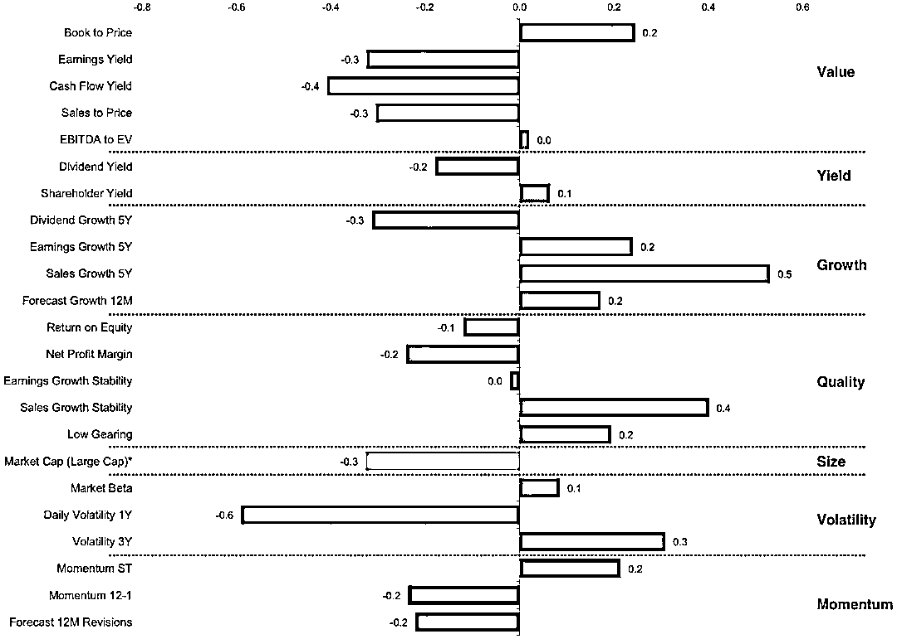

**风格因子表现 （前 50％）**

**3 个月 - 行业中性**

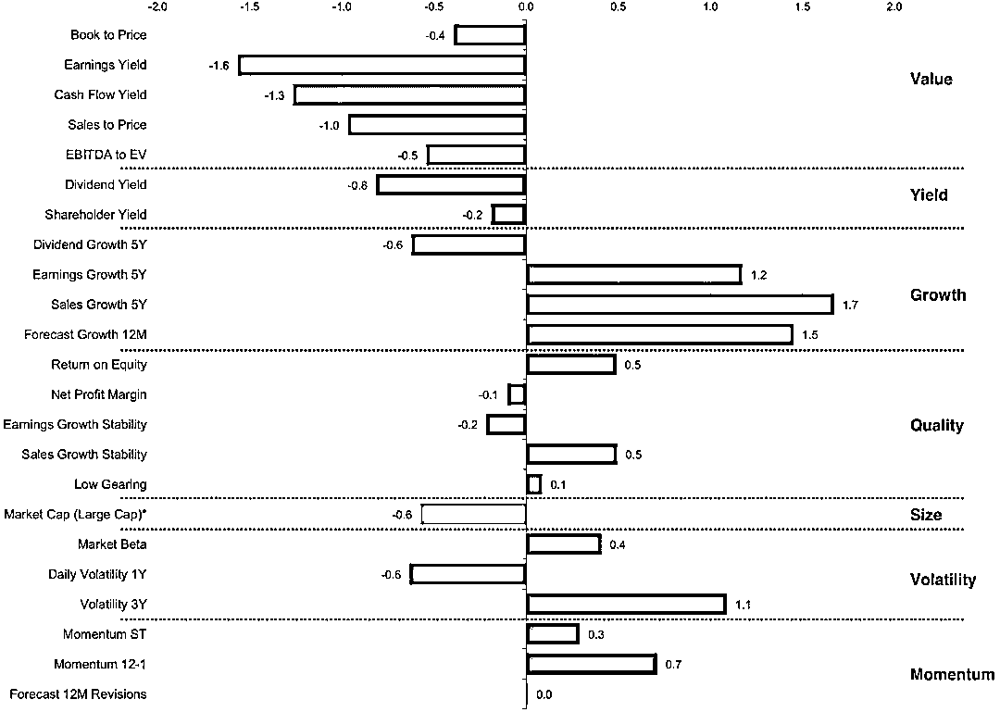

**风格因子表现 （前 50％）**

**6 个月 - 行业中性**

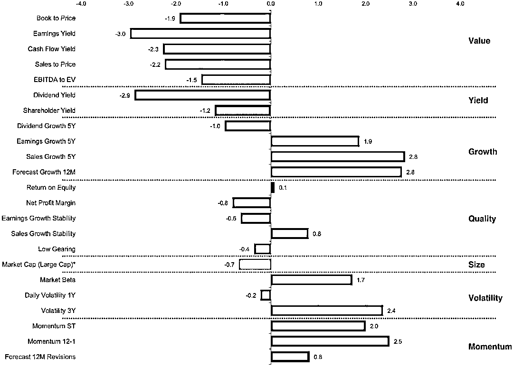

**风格因子表现 （前 50％）**

**年初至今 - 行业中性**

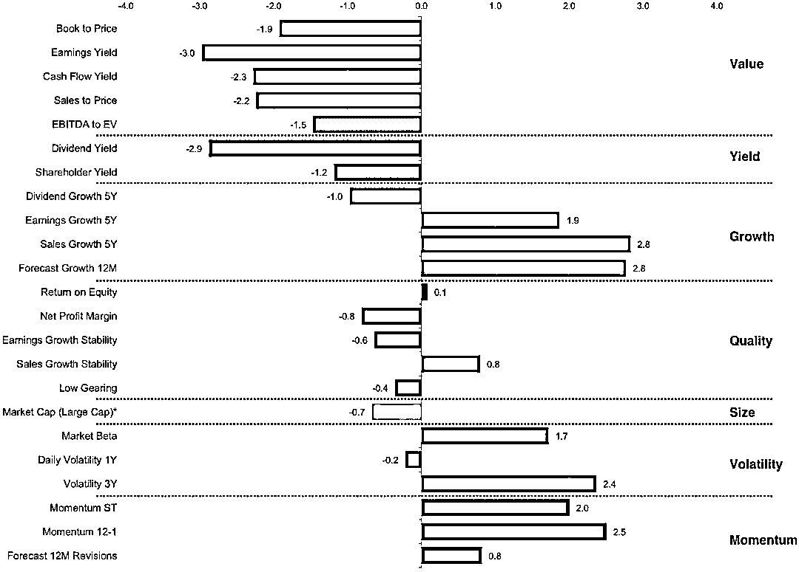

**风格因子表现 （前 50％）**

**1 年 - 行业中性**

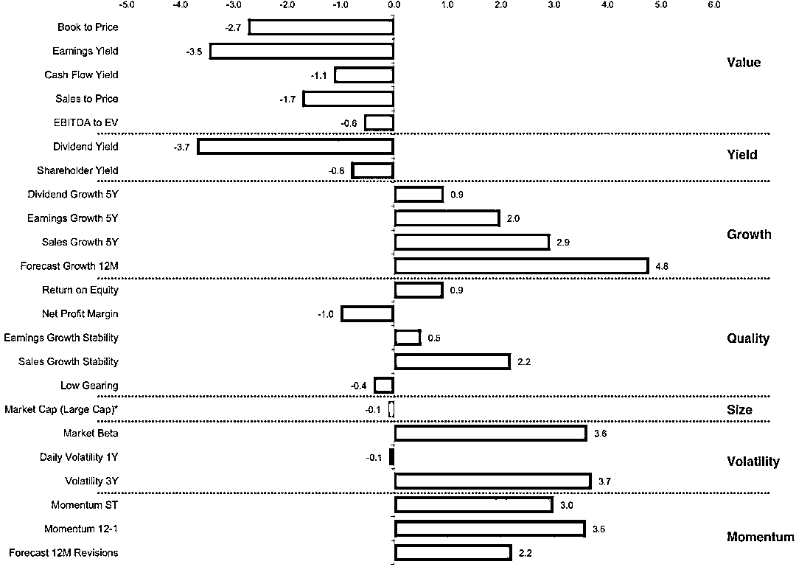

**风格因子表现 （前 50％）**

**3 年年化 - 行业中性**

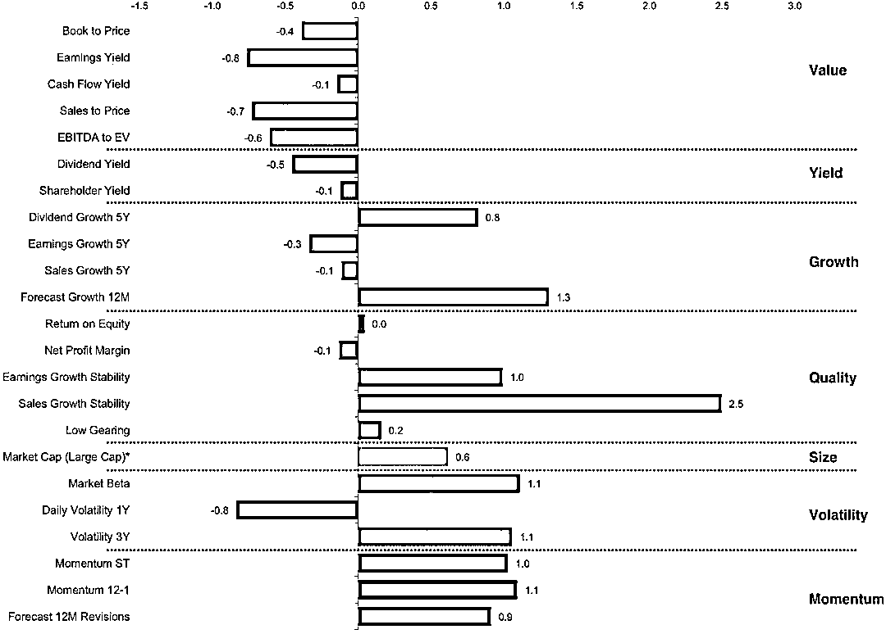

**风格因子表现 （前 50％）**

**5 年年化 - 行业中性**

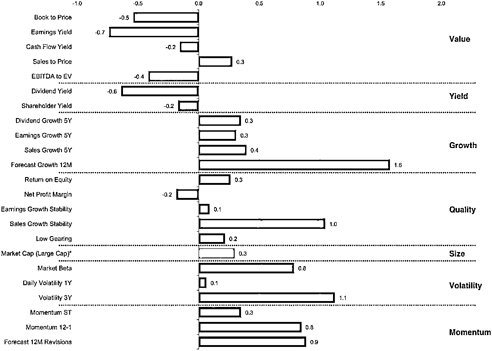

**风格因子表现 （前 50％）**

**2017 年 - 行业中性**

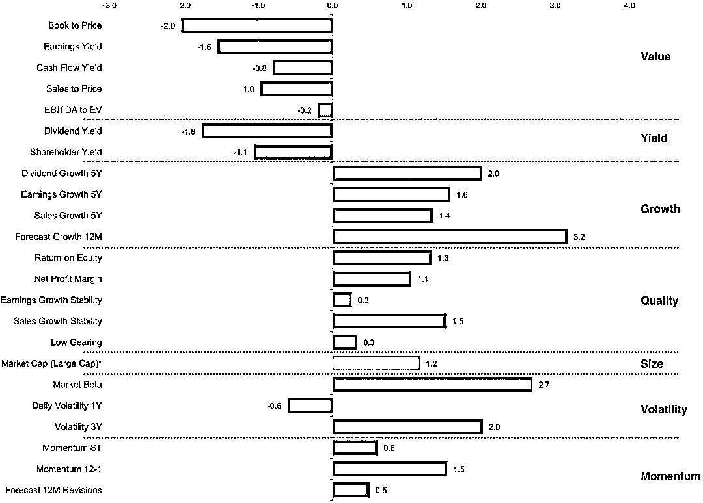

**风格因子表现 （前 50％）**

**2016 年 - 行业中性**

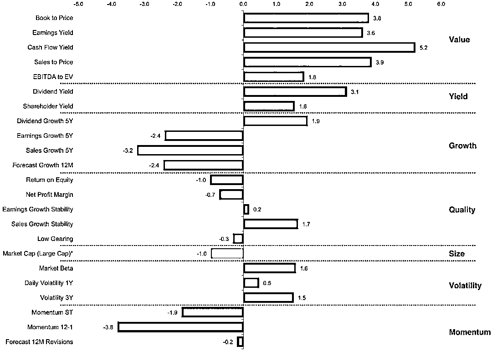

**风格因子表现 （前 50％）**

**2015 年 - 行业中性**

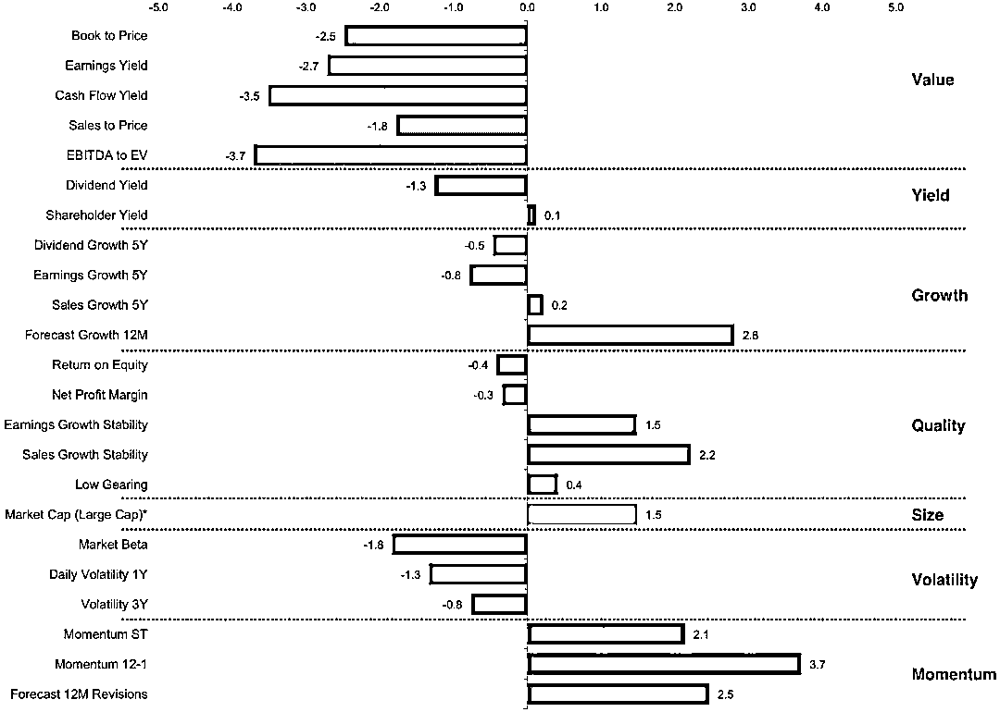

**风格因子表现 （前 50％）**

**2014 年 - 行业中性**

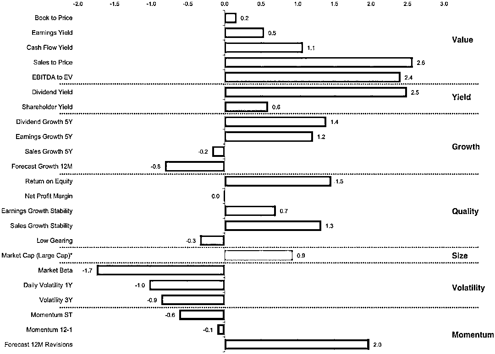

**风格因子表现 （前 50％）**

**2013 年 - 行业中性**

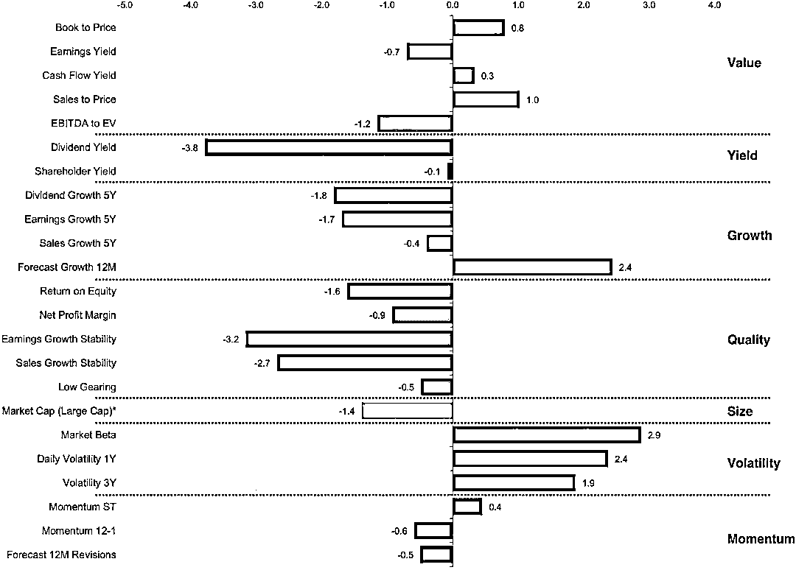

**价值因子**

**Book to Price**

> The ratio of the company’s book value (the sum of shareholders’ equity plus accumulated retained earnings from the P & L Account) to its share price.
> 
> This factor has been one of the most successful measures of the intrinsic value of company shares.

**Earnings Yield**

> Annual earnings (adjusted for amortizations of intangibles, extraordinary charges and credits) per share divided by the share price.
> 
> This factor measures the worth of a company’s shares according to the company’s ability to support each share with after tax earnings.

**Cash Flow Yield**

> Annual cash flow per share divided by the share price.
> 
> This factor is related to earnings yield but also includes other items, specifically: depreciation, amortizations, and provisions for deferred liabilities. It is intended to capture the cash availability of the company as a multiple of the share price, and offers a value criteria based on the stream of accessible cash earnings

**Sales to Price**

> Net sales per share divided by the share price.
> 
> This factor measures the worth of a company’s shares according to the annual sales volume supporting the company business. The item is considered by many analysts to be less susceptible to manipulation than other valuation criteria; it is however, a less comprehensive measure of a company’s range of activities.

**EBITA to EV**

> The ratio of the company's EBITDA to Enterprise Value. EBITDA is Earnings before interest, taxes and depreciation and is calculated by taking the pretax income and adding back interest expense on debt and depreciation, depletion and amortization and subtracting interest capitalized.
> 
> Enterprise Value is defined as "market capitalization + total debt + preferred stock - cash and cash equivalents".

**收益因子**

**Dividend Yield**

> The annual dividend paid per share divided by the share price.
> 
> This factor measures the value of company shares according to the stream of dividend income resulting from share ownership.

**Shareholder Yield**

> The sum of Net Buyback Yield, Dividend Yield and Net Debt Paydown Yield.
> 
> This factor measures the proportion of a company's value distributed to shareholders through dividend payments, share repurchases and debt reduction.

**成长因子**

**Earnings Growth 5Y**

> The average annual growth rate of earnings (adjusted for amortizations of intangibles, extraordinary charges and credits) over a trailing five years.
> 
> Earnings Growth is, perhaps, the clearest of the growth criteria. However, it is subject to the distortions of reporting conventions and manipulation and, particularly in some markets, only known after a considerable lag.

**Sales Growth 5Y**

> The average annual growth rate of net sales per share over a trailing five years.
> 
> Although growth in sales per share might be only a narrow measure of a company’s business growth, and may be subject to a number of distortions, it is less subject to differences in reporting conventions or manipulation than many other balance sheet or profit and loss items.

**Forecast Growth 12M**

> Consensus forecast growth of earnings over the next 12 months. The 12 month growth is calculated on a pro-rata basis from the forecasts for each of the company's next 2 annual reporting periods.

**Dividend Growth 5Y**

> The average annual growth rate of dividends over a trailing five years.

**质量因子**

**Return on Equity**

> Net Income after preferred dividends divided by the book value of shareholders’ common equity.
> 
> RoE measures the profitability of the operations of the company as a proportion of the total amount of equity in the company. Since RoE multiplied by the reinvestment rate (the proportion of earnings not paid as dividends but reinvested in the company) gives the warranted growth rate of a company, RoE is a traditional measure of a company's growth potential.

**Net Profit Margin**

> The "net margin", annual net income before preferred dividends (plus policyholders' surplus for insurance companies), divided by annual net sales.
> 
> This measure attempts to assess the company's potential for profitable, sustained expansion or growth.

**Low Gearing**

> The negative of debt to equity. Low geared companies can regarded as being of higher "quality" as they are less burdened by debt repayment costs.

**Earnings Growth Stability**

> This 'quality' factor is calculated as the negative of the standard deviation of earnings growth over the most recent 3 years of growth data.

**Sales Growth Stability**

> This 'Quality' factor is calculated as the negative of the standard deviation of Sales Growth over the most recent 3 years of growth data.

**规模因子**

**Market Cap**

> The market capitalization of the stock.
> 
> The average size statistic of a portfolio is the weighted (by holding value) average size of the securities held. The average size statistic of a benchmark (or total market) is the weighted (by holding value) average size of the securities within the benchmark (or total market)

**流动因子**

**Market Beta**

> The "slope coefficient", (β), from the simple regression:
> 
> Security monthly return = α + β * market monthly return + random error.
> 
> The regression is carried out over 36 month periods. Where sufficient information is not available, β=1 is assumed.

**Daily Volatility 1Y**

> The standard deviation of the last year of daily total returns, expressed as an annualized percentage.

**Volatility 3Y**

> The standard deviation of the last 36 months of total returns, expressed as an annualized percentage.

**动量因子**

**Momentum ST**

> Calculated using a 6 month "memory" of monthly total returns. The past period returns are weighted using a "decay ratio" of 2/3, per month. This weighted historic return factor measures the degree of performance trend following. It is useful in recognizing trading character of specific markets and in noticing occasional changing patterns through the market cycle.

**Momentum 12-1**

> The total return of the stock over the last 12 months, excluding the total return over the most recent month since reversal effects are often associated with one-month returns.

**Forecast 12M Revisions**

> IBES balance of Earnings forecast revisions for the over the next 12 months.
> Calculated as the difference between the number of upwards revisions minus the number of downwards revisions (as sampled over the past 1M period), expressed as a percentage of the number of estimates.
> 
> The 12 month earnings revisions is calculated on a pro-rata basis from the forecasts for each of the company's next 2 annual reporting periods.

**知识在于分享**

**在量化投资的道路上**

**你不是一个人在战斗**