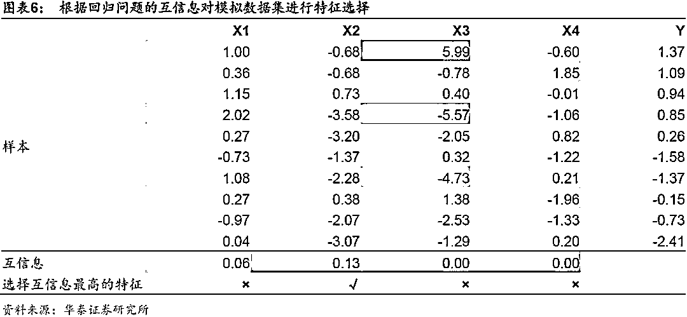
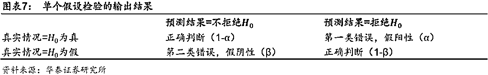
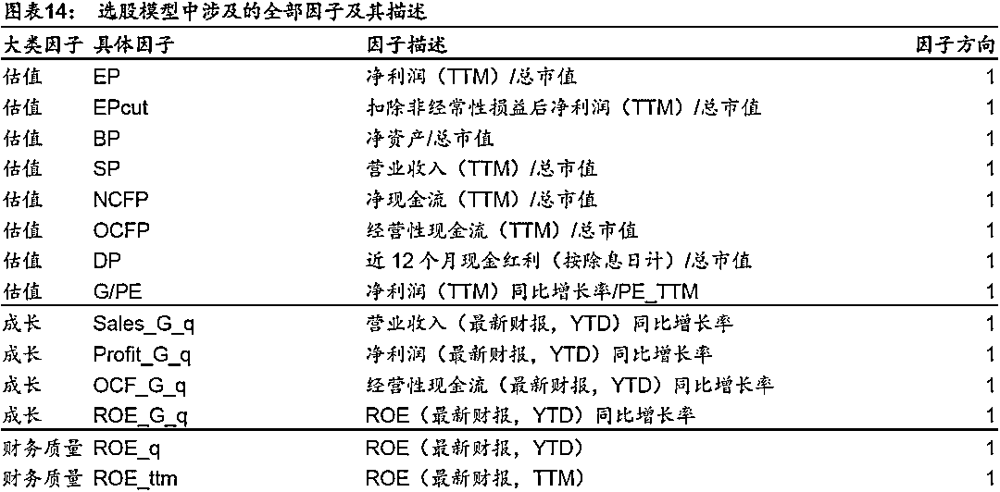
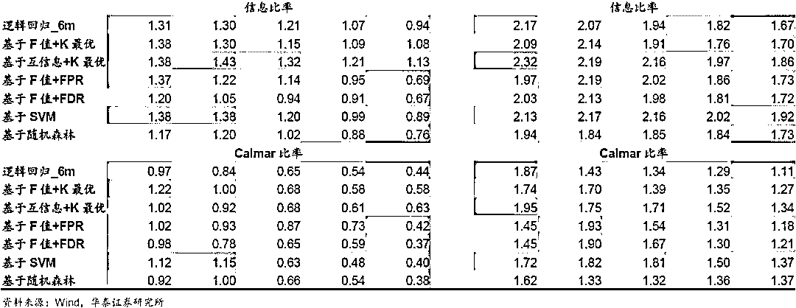

# 特征！特征！特征！——人工智能选股之特征选择

> 原文：[`mp.weixin.qq.com/s?__biz=MzAxNTc0Mjg0Mg==&mid=2653288696&idx=1&sn=579344d33a8c05c38ed7c335ff7f869c&chksm=802e3aedb759b3fbcba469319c35f3ae1a128f3d1bb63d2437b9441804b2745e17cce3e1a2e6&scene=27#wechat_redirect`](http://mp.weixin.qq.com/s?__biz=MzAxNTc0Mjg0Mg==&mid=2653288696&idx=1&sn=579344d33a8c05c38ed7c335ff7f869c&chksm=802e3aedb759b3fbcba469319c35f3ae1a128f3d1bb63d2437b9441804b2745e17cce3e1a2e6&scene=27#wechat_redirect)

**摘要**

**特征选择是人工智能选股策略的重要步骤，能够提升基学习器的预测效果**

特征选择是机器学习数据预处理环节的重要步骤，核心思想是从全体特征中选择一组优质的子集作为输入训练集，从而提升模型的学习和预测效果。我们将特征选择方法应用于多因子选股，发现特征选择对逻辑回归 _6m、XGBoost_6m 基学习器的预测效果有一定提升。我们以全 A 股为股票池，以沪深 300 和中证 500 为基准，构建行业中性和市值中性的选股策略。基于 F 值和互信息的方法对于逻辑回归 _6m、XGBoost_6m、XGBoost_72m 基学习器的回测表现具有明显的提升效果。

**随着入选特征数的增加，模型预测效果先上升后下降**

特征个数并非越多越好。以逻辑回归 _6m 和 XGBoost_6m 为基学习器时，随着入选特征数的增加，模型的 AUC 先上升后下降；对于我们的 70 个特征而言，入选特征数在 50 左右效果最好。以 XGBoost_72m 为基学习器时，随着入选特征数的增加，模型的 AUC 先上升后持平。以基于 F 值+FPR 方法对逻辑回归 _6m 进行特征选择为例，统计入选特征的频次，发现入选频次高的特征以价量类因子为主。

**特征选择是预处理的重要步骤，意义在于减少时间开销，并避免过拟合**

特征选择是特征预处理的重要环节之一，其意义在于：1）减少时间开销；2）避免过拟合；3）使模型容易被解释。特征选择方法主要包括过滤式、包裹式、嵌入式三类，最常用的方法为过滤式。“过滤”的标准可以来自于无监督学习，如特征本身的方差、熵等；可以是围绕特征和标签构建的统计指标，如 F 值、互信息、卡方等；也可以由其它模型提供，如 L1 正则化线性模型的回归系数、树模型的特征重要性等。

**面对海量因子时特征选择方法能够大幅提升模型的开发效率**

特征选择本质上是一种降维手段，没有引入新的信息，因此难以给基学习器的效果带来质的改变。特征选择的优势在于，当我们面对海量的原始特征，仅靠人力无法逐一筛选时，该方法将大幅提升机器学习模型的开发效率。实际上，由于本文使用的 70 个原始特征均为经单因子测试确证有效的因子，所以特征选择方法更多地是起到锦上添花的作用，如果原始特征包含部分无效的因子，那么特征选择方法可能会对选股策略效果带来更明显的改善。

风险提示：特征选择方法高度依赖基学习器的表现。该方法是对历史投资规律的挖掘，若未来市场投资环境发生变化导致基学习器失效，则该方法存在失效的可能。

**本文导言**

构建机器学习模型的最终目的是希望通过机器从输入的训练集中“学习”出某种客观存在的规律，学习的效果主要取决于两个因素：1）机器学习模型的优劣，2）输入训练集的质量。在华泰人工智能选股系列的过往报告中，我们主要围绕第一个因素，探讨不同的机器学习模型及其选股效果。而后者，即如何从全体特征中选择一组优质的子集作为输入训练集，则是本文探究的出发点。

通常来说，对于给定数量的训练样本，分类或回归模型的预测能力随着特征数量的增加呈现先增强后减弱的趋势，这主要是由于：随着特征数量（维度）的增加，样本将变得更加稀疏，因而更容易找到一种理想的分类或回归方式；但当特征数量超过一定量后，过多的特征将导致模型在训练集上表现良好，而对新数据的泛化能力较差，导致过拟合的发生；同时过多的特征将大幅增加模型的时间开销，造成维数灾难。降维方法主要分为两类：特征提取和特征选择。前者经过某种映射从原始特征中提取出新特征，改变了原始的特征空间；而后者通过某种评价准则从原始特征中选出部分特征，没有改变原始的特征空间。

本篇报告中，我们将着重探讨基于特征选择的降维方法，并分别应用于不同基学习器，对模型的预测能力和构建的选股策略进行测试和对比。简单来说，特征选择是从已有的原始特征集合中选取一个用于构建后续模型的特征子集的过程，它是一个重要的数据预处理过程。有效的特征选择将会减轻过拟合问题，提高模型的泛化能力和预测准确性；同时，降维后的模型具有更低的时间成本，也更容易被理解和解释。我们的报告主要关注如下几个方面的问题：

1）常用的特征选择方法有哪些，原理是什么？

2）在多因子选股问题的背景下，模型的预测能力随着因子数量的增加会发生怎样的变化？

3）特征选择方法选出的是哪些因子？

4）如何根据模型的预测结果构建策略组合进行回测？全部 A 股票池内选股效果如何，相比单一的基学习器有哪些方面的提升？

**特征选择方法简介**

特征选择（Feature Selection）作为一种数据降维方式，是机器学习算法的重要步骤之一，在工程领域有着广泛的应用，但在量化领域受到的关注有限。本质上，特征选择从原始的特征集合中选择部分特征作为子集，其目的是为了节省算法的时间开销，同时提升学习算法性能。作为特征选择的奠基性论文之一，Guyon 和 Elisseeff 在 2003 年提出，依据特征选择是否独立于基学习器，可将特征选择方法大致分为过滤式（Filter）、包裹式（Wrapper）和嵌入式（Embedding）三大类。

过滤式方法先使用特征选择对原始特征集合进行“过滤”，再基于过滤后的特征训练基学习器，这一特征选择过程与后续基学习器的训练无关。与过滤式特征选择不同，包裹式方法考虑后续基学习器的性能并以之作为特征子集优劣的评价准则，该方法为给定的基学习器“量身定做”了最优的特征子集，由于包裹式特征选择需要多次训练基学习器，该方法的时间成本远大于过滤式方法。与前两种方法中特征选择过程与基学习器训练过程有明显的分界不同，嵌入式方法将两者融为一体，即在基学习器训练过程中自动完成了特征选择，例如 Lasso 回归本质上即为一种嵌入式特征选择方法。

综合比较三大类特征选择方法，包裹式选择的时间开销较大并且效率较低，嵌入式选择本质上属于独立的机器学习算法，过滤式选择效率较高因而被广为采用。本篇报告将着重关注过滤式方法，介绍不同过滤式特征选择的原理，分析其优劣并系统测试其对不同基学习器的提升效果。下面我们将过滤式特征选择细分为非监督式特征选择、单变量特征选择和基于模型的特征选择三类予以探讨。特征选择主要方法如下图所示。

**非监督式特征选择**

非监督式特征选择不借助标签 Y 而仅依赖特征 X 本身，根据特征的方差、熵、平滑度等指标遴选特征。下面我们以移除低方差特征为例，介绍典型的非监督式特征选择方法。通常来说，如果一个特征能够较好地区分训练样本，它在所有样本上的分布应当具备一定的变异性。如果样本在某个特征上的变异性很小，那么这个特征对样本的区分能力可能也较小。因此在进行特征选择时，可以考虑移除所有方差小于某一阈值的特征。

图表 2 展示了一组包含 10 个样本的模拟数据集，X1、X2、X3、X4 为 4 组特征，Y 为标签。对于原始特征集合 X = [X1, X2, X3, X4]，我们希望移除所有方差低于阈值 1 的特征。如下表所示，我们计算每个特征的方差，得到 X1 的方差为 0.73 < 1，因此该特征将被移除，其余特征被保留最终得到新的特征子集 X’ = [X2, X3, X4]。

由于该特征选择方法仅考虑输入特征 X 而没有考虑标签 Y，该方法同时适用于基学习器为监督学习和非监督学习的场景。然而，在我们的人工智能选股实践中，由于原始因子均为已确证有效的因子，并且经预处理转换为 N(0,1)的分布，移除低方差特征的意义不大，后续我们将不单独进行测试。

**单变量特征选择的统计指标**

单变量特征选择是常用的监督式特征选择方法之一，该方法针对每个特征单独计算某个统计指标，并基于该统计指标根据某一筛选标准进行特征选择。从通俗的角度看，大学通过高考成绩选拔考生就是一种特征选择的过程，全体考生相当于全部原始特征，高考分数相当于单个统计指标，选择排名靠前的一定数量考生相当于筛选标准。单变量特征选择可依赖的统计指标包括 F 值、互信息、卡方等；筛选标准包括选择固定数量特征、选择固定比例特征、根据 FPR/FDR/FWE 选择特征等。

**分类模型的 F 值**

当基学习器为分类模型时，可借助方差分析（ANOVA）的 F 值衡量每个特征和标签的关联度，最终选择关联度较高的特征。方差分析常用来研究控制变量的不同水平是否对观测变量产生显著影响，该方法认为：观测变量值的变动会受到控制变量和随机扰动两个方面的影响，可将观测变量总的离差平方和分解为组间离差平方和与组内离差平方和两部分：

其中，SST 为总离差平方和，SSA 为组间离差平方和，SSE 为组内离差平方和。通过构造 F 统计量可以比较总离差平方和中各部分所占的比例：

其中，k 为控制变量的组数，n 为样本总数，k-1 和 n-k 分别为 SSA 和 SSE 的自由度。

基于虚无假设 H0：控制变量对观测变量没有影响，构造 F 值并根据样本值进行计算。对于给定的显著性水平α，如果计算得到的 F 值大于 Fα，则拒绝虚无假设 H0，此时组间离差平方和在总离差平方和中所占的比例更大，我们认为控制变量对观测变量有显著影响；否则，我们无法拒绝虚无假设，即认为控制变量对观测变量的影响不显著。

使用 F 值对分类模型进行特征选择时，我们假设不同特征对分类结果贡献程度的差异，主要源于各个特征在不同标签下的组间离散程度与组内离散程度之比存在差异。对每个特征，计算 F 值并得到对应的 p 值。F 值越大，该特征的组间离散程度越大而组内离散程度越小，特征与标签的关联度越高。如下表所示，对于模拟的原始特征集合，我们选择关联度排名前三的特征，最终得到新的特征子集 X’ = [X1, X3, X4]。 

**回归模型的 F 值**

当基学习器为回归模型时，可借助单变量线性回归及其对应方差分析的 F 值衡量每个特征 X 和标签 Y 的关联度，最终选择关联度较高的特征。线性回归是确定两个或两个以上变量间线性相关关系的统计方法，F 值通过回归后的方差分析表输出，并与给定的显著性水平进行比较，以检验回归方程的线性关系是否显著。当 F 检验结果显著时，可推断回归方程中至少有一个回归系数是显著的，但并不一定所有的回归系数都是显著的。对单变量线性回归而言，自变量只有一个，F 检验结果显著即可判断回归系数显著，即因变量与自变量具有显著的线性相关关系。

具体地，对单个特征 X 和标签 Y 进行线性回归时，计算回归方程的 F 值及其对应的 p 值。线性回归的虚无假设 H0：回归系数为 0。对于给定的显著性水平α，如果计算得到的 F 值大于 Fα，则拒绝虚无假设 H0，即认为回归系数显著异于 0，进而推断两个变量间存在一定的线性关系。

使用 F 值对回归模型进行特征选择时，对每个特征，计算 F 统计量的值，F 值越大，我们越有理由拒绝原假设，特征与标签的关联度越高。如下表所示，对于模拟的原始特征集合，我们选择关联度排名前三的特征，最终得到新的特征子集 X’ = [X1, X2, X3]。

**分类和回归模型的互信息**

在概率论和信息论中，互信息常用于度量两个随机变量之间的关联程度。不同于相关系数仅能够捕捉两个随机变量之间的线性相关性，互信息方法可以捕捉两个变量之间的任何统计依赖性；但由于互信息依赖非参方法，它通常需要更多的样本来进行精确估计。

两个离散随机变量 X 和 Y 的互信息定义为：

其中，p(x,y)是 X 和 Y 的联合概率分布函数，p(x)和 p(y)分别是 X 和 Y 的边缘概率分布函数。上述计算方法适用于基学习器为分类模型的情形。

在连续随机变量的情形下，求和替换为二重定积分：

其中，p(x, y)是 X 和 Y 的联合概率密度函数，p(x)和 p(y)分别是 X 和 Y 的边缘概率密度函数。上述计算方法适用于基学习器为回归模型的情形。

直观上，互信息反映了联合分布 p(x, y)与边际分布乘积 p(x)p(y)的相似程度，它能够度量 X 和 Y 共享的信息，量化了已知两个变量其中一个时，另一个变量不确定性的减少程度。例如，如果 X 和 Y 相互独立，则已知 X 不会对 Y 提供任何信息，反之亦然，则 p(x, y) = p(x)p(y)，两者的互信息为零。

在使用互信息进行特征选择时，特征与标签之间的互信息越大，两者之间共享的信息越多，那么两者的关联度越高。如下表所示，对于模拟的原始特征集合，我们选择互信息最高的特征，最终得到分类问题下新的特征子集为 X’ = [X1]，回归问题下新的特征子集为 X’ = [X2]。

**分类模型的卡方**

卡方检验是数理统计中一种常用的检验两个变量之间相关性的方法，其核心思想是计算实际值与理论值的偏差来判断两者是否相关。其中，理论值为根据虚无假设 H0（两个变量相互独立）计算得到的结果；实际值为根据样本直接观测的结果。如果两者偏差足够小，该误差可能由测量手段不精或偶然事件等所致，我们无法拒绝虚无假设，即认为：两个变量之间相互独立。如果两者偏差足够大，我们认为这样的误差不是来自随机因素，那么有理由拒绝虚无假设，即认为两个变量具有一定的相关性。计算偏差程度的公式为：

其中，E 为理论值，xi 为实际值序列。分子的平方表达可以解决偏差正负抵消的问题，分母除以理论值有利于减少理论值量纲对偏差度量的影响。但由于卡方统计量通常适用于非负的频率数据，不适用于多因子选股问题，本文不对基于卡方的单变量特征选择进行测试。

**单变量特征选择的筛选标准**

在计算出每个特征的某项统计指标后，我们还需要根据一定的筛选标准进行特征选择。筛选标准包括选择固定数量特征、选择固定比例特征、根据 FPR/FDR/FWE 选择特征等。

**选择固定数量或比例的特征**

该筛选标准根据每个特征的统计指标，保留固定前 K 个最优的特征（简称 K 最优），或者固定比例最优的特征。该方法的优点是逻辑清晰，计算简便。缺点是 K 值的选取缺乏明确的数学意义。在我们的人工智能选股实践中，由于采用滚动训练的方式，每个截面期都进行模型训练。当使用 K 最优方法进行特征选择时，每个截面期选出的特征数完全相同。

**根据 FPR/FDR/FWE 选择**

该筛选标准使用常见的假设检验，根据某种错误测度进行特征筛选。在数理统计的单个假设检验问题中，可能出现的推断输出结果如下表所示。

当虚无假设 H0 为真，而预测结果为拒绝 H0 时，这种情况称为假阳性，此时我们虚报了原本不存在的统计差异。这种错误也称为第一类错误，发生的概率称为假阳性率（False Positive Rate，FPR）。类似地，当虚无假设 H0 为假，而预测结果为接受 H0 时，这种情况称为假阴性，此时我们漏报了原本存在的统计差异。这种错误也称为第二类错误，发生的概率称为假阴性率（False Negative Rate，FNR）。假设检验的显著性水平α为发生第一类错误的最大概率。基于每个特征计算得到的统计指标及对应 p 值，该筛选标准选择 p 值小于显著性水平α的特征作为特征子集。

当同时对多个假设进行检验时，情况将变得更为复杂，此时每个检验均存在第一类错误。例如同时检验 m 个假设时，对于给定的检验法则，得到的可能输出结果如下表所示。

其中，m0 和 m1 分别为 H0 为真和 H0 为假的个数，R 是 m 个检验中的拒绝总数，V 是 m 个检验中发生第一类错误（假阳性）的总数，T 是发生第二类错误（假阴性）的总数。与单个假设检验类似，多重假设检验问题首先需要考虑的问题是如何提出一种合理的错误测度来衡量总体检验所发生的第一类错误。

FDR（False Discovery Rate）即错误发现率，是多重假设检验的一种错误测度方式，它是错误的拒绝次数与拒绝总数比值的期望，公式表达为：

其中，I{R>0}为示性函数，当 R>0 时示性函数值为 1，当 R=0 示性函数值为 0。在多重假设检验中，可以通过给定的显著性水平α控制错误发现率，进而推导出单个假设检验即每个特征对应的最大 p 值。特征的 p 值低于显著性水平则予以保留。

FWE（Family-Wise Error Rate）即总体错误率，是多重假设检验的另一种错误测度方式，它是指在多重假设检验中至少有一个检验发生第一类错误的概率，公式表达为：

由定义可知，FWE 对错误的控制较为严格，是一种保守的错误测度。与 FDR 类似，在对多个特征同时进行筛选时，可以通过给定的显著性水平α控制总体错误率，进而推导出单个假设检验即每个特征对应的最大 p 值。特征的 p 值低于显著性水平则予以保留。

假设共进行 m 次显著性检验，得到 m 个 p 值；在显著性水平α = 0.05 下，各评价准则的特征选择依据及严格程度如下表所示。

下面我们借助一组模拟数据说明如何根据 FPR/FDR/FWE 进行特征选择。假设对于某 10 个特征组成的原始特征集合，计算得到 10 个 F 值和相应的 p 值。我们定义显著性水平α = 0.05。各种筛选标准的选择特征结果如下表所示。

与选择固定数量或比例特征的筛选标准相比，根据 FPR/FDR/FWE 的筛选标准选择得到的特征数量不固定，取决于训练样本。因而在我们的人工智能选股实践中，每个截面期选出的特征数可能不同。另外值得注意的是，FPR 和 FWE 两种筛选标准实质上“等价”，即假设共 m 个特征，前者的显著性水平α取 0.05 等价于后者的α取 0.05*m。

本文对单变量特征选择方法进行测试时，将使用 F 值和互信息作为评价特征的统计指标。在筛选标准方面，选择固定数量特征和选择固定比例特征两者等价，我们仅测试前者；根据 FPR 和 FWE 筛选两者等价，因此我们仅测试 FPR 和 FDR 两种方法。

**基于模型的特征选择**

基于模型的特征选择是另一种常用的监督式特征选择方法，这里的“模型”指任何在拟合后具有回归系数或特征重要性属性的学习器。如果特征的回归系数或特征重要性小于阈值，我们就认为该特征和标签的关联度不高，将予以剔除。按照学习器的类型，该方法可大致分为基于 L1 正则化的方法和基于树模型的方法。

**基于 L1 正则化的方法**

使用 L1 正则化进行惩罚的线性模型有稀疏解，即部分特征的系数为 0，因而可以用于基学习器的特征选择。具体而言，我们保留系数非 0 的特征，剔除系数为 0 的特征。L1 正则化方法惩罚系数的大小影响特征选择的严格程度。惩罚系数越大，保留的特征越少；反之惩罚系数越小，保留的特征越多。对于回归模型，L1 正则化方法通常采用 Lasso 回归；对于分类模型，通常采用 L1 正则化的线性 SVM 或逻辑回归。关于 L1 正则化、Lasso 回归、SVM 的具体方法详见华泰人工智能选股系列报告的第二篇广义线性模型和第三篇支持向量机模型。

下表展示了采用 L1 正则化的 SVM 对分类问题进行特征选择的过程。取惩罚系数 C = 0.1，对于模拟的原始特征集合，以各个特征的 SVM 系数作为选择标准，最终得到新的特征子集 X’ = [X3]。

**基于树模型的方法**

树模型能够计算特征重要性，可以用于基学习器的特征选择。具体而言，我们剔除重要性低于一定阈值的特征，保留重要性高于一定阈值的特征。所选的阈值越大，保留的特征越少；反之所选的阈值越小，保留的特征越多。这里的树模型包括但不限于随机森林模型和 AdaBoost 模型。关于随机森林、AdaBoost 模型、计算特征重要性的具体方法详见华泰人工智能系列报告的第五篇随机森林模型和第六篇 Boosting 模型。

下表展示了使用随机森林模型对分类问题进行特征选择的过程。取阈值为所有特征重要性的均值，对于模拟的原始特征集合，以各个特征重要性作为特征选择的标准，最终得到新的特征子集 X’ = [X3, X4]。

**特征选择方法测试流程**

**测试流程**

本文测试的基学习器为华泰人工智能系列研究报告总结得出的 3 种选股效果较好的方法：逻辑回归 _6m、XGBoost_6m 和 XGBoost_72m。特征选择的测试方法包含如下步骤：

1\. 数据获取：

    a) 股票池：全 A 股。剔除 ST 股票，剔除每个截面期下

        一交易日停牌的股票，剔除上市 3 个月内的股票，

        每只股票视作一个样本。

     b) 回测区间：2011 年 1 月 31 日至 2018 年 7 月 2 日。月

         度滚动回测。

2\. 特征和标签提取：每个自然月的最后一个交易日，计算之前报告里的 70 个因子暴露度，作为样本的原始特征；计算下一整个自然月的个股超额收益（以沪深 300 指数为基准），作为样本的标签。因子池如图表 14 所示。

3\. 特征预处理：该步骤较为复杂，我们将在下一小节进行详细说明。

4\. 训练集和交叉验证集的合成：在每个月末截面期，选取下月收益排名前 30%的股票作为正例（y = 1），后 30%的股票作为负例（y = -1）。将训练样本合并，随机选取 90%的样本作为训练集，余下 10%的样本作为交叉验证集。

5\. 样本内训练：对每个基学习器，使用 6 个月或 72 个月训练数据对基于原始特征集合和选择后特征子集的训练集进行逐一训练。

6\. 交叉验证调参：由于本篇报告侧重于探究特征选择对模型的影响，此处直接选取之前报告中基学习器的最优参数作为模型的最优参数。

7\. 样本外测试：确定最优参数后，以 T 月月末截面期所有样本预处理后的特征作为模型的输入，得到每个样本的预测值 f(x)。将预测值视作合成后的因子，进行单因子分层回测，回测方法和之前的单因子测试报告相同。

8\. 模型评价：我们以分层回测的结果作为模型筛选标准。我们还将给出测试集的正确率、AUC 等衡量模型性能的指标。

**特征预处理**

本节我们将具体介绍本篇报告中所使用的特征预处理方法。对每个特征，首先进行如下的预处理：

a）中位数去极值：设第 T 期某因子在所有个股上的暴露度序列为 Di，Dm 为该序列中位数，Dm1 为序列 |Di—Dm|的中位数，则将序列 Di 中所有大于 Dm+5Dm1 的数重设为 Dm+5Dm1，将序列 Di 中所有小于 Dm—5Dm1 的数重设为 Dm—5Dm1；

b）缺失值处理：得到新的因子暴露度序列后，将因子暴露度缺失的地方设为中信一级行业相同个股的平均值；

c）行业市值中性化：将填充缺失值后的因子暴露度对行业哑变量和取对数后的市值做线性回归，取残差作为新的因子暴露度；

d）标准化：将中性化处理后的因子暴露度序列减去其现在的均值、除以其标准差，得到一个新的近似服从 N(0, 1)分布的序列。

基于初步预处理后的原始特征集合，对每种特征选择方法中的参数进行遍历，选择交叉验证集 AUC（以 2010 年为测试集的对应的验证集的 AUC）最大的参数作为该方法下的最优参数，如下表所示。

**特征选择方法测试结果**

**选择特征个数和入选频次分析**

在使用特征选择对基学习器进行改进时，入选的特征个数越多是否模型改进效果越好？经选择保留的特征分属哪些大类风格因子？我们首先以基于 F 值+FDR 方法对逻辑回归 _6m 模型进行特征选择为例，展示模型改进效果与特征个数的关系，如下图所示。

随着入选特征个数的增加，特征选择方法对模型的改进效果先增加后下降，在特征个数为 50 左右达到峰值。由此可见，特征并非越多越好。对其它以逻辑回归 _6m 和 XGBoost_6m 为基学习器的特征选择方法，模型的改进效果与特征个数的关系类似。对以 XGBoost_72m 为基学习器的特征选择方法，随着特征个数的增加，特征选择方法对模型的改进效果先增加后持平。

进一步，我们以基于 F 值+FDR（α = 0.01）对逻辑回归 _6m 进行特征选择为例，分析该特征选择方法下各个特征的入选频次。在滚动回测的 89 个月中，每个特征被选择的总月数如下表所示。入选频次排名前列的因子主要是动量反转、换手率和波动率因子，排名靠后的因子为财务质量、杠杆因子。

**对比测试**

在特征预处理一节中，我们给出了每种特征选择方法下的最优参数。对于每个基学习器，我们使用原始特征集合和经上述参数选择的特征子集，分别进行模型的训练和测试，观察不同特征选择方法下的模型改进效果。

**模型 AUC 对比分析**

三个基学习器在不同特征选择方法下的测试集 AUC 如下表所示。

我们发现，对于逻辑回归 _6m 和 XGBoost_6m 基学习器，各种特征选择方法对基学习器均有一定提升，可见选择部分特征进行模型训练能够更好地学习特征与标签之间的规律。不同方法的提升效果各异，其中基于 F 值+FDR 方法对 AUC 的提升效果最好。对于 XGBoost_72m 基学习器，各种特征选择方法的 AUC 相差不大，对基学习器的 AUC 没有明显改进效果，可能是由于 XGBoost_72m 基学习器本身已具备较高的 AUC，提升空间有限。

**构建策略组合及回测对比分析**

对于三个基学习器及特征选择后的改进模型，我们构建了全 A 选股策略并进行回测，各项指标详见下表。

以逻辑回归 _6m 为基学习器时，收益端提升明显的模型为基于 F 值+K 最优、基于互信息+K 最优、基于 SVM 的特征选择方法。回撤端提升明显的模型为基于 F 值+FPR 方法。从信息比率和 Calmar 比率来看，基于 F 值+K 最优、基于互信息+K 最优方法优于基学习器，其余特征选择方法对基学习器的提升不明显。

以 XGBoost_6m 为基学习器并以沪深 300 作为基准时，回测表现较好的是基于 F 值+FDR 方法，其余特征选择方法对基学习器没有提升作用。以 XGBoost_6m 为基学习器并以中证 500 作为基准时，回测表现较好的是基于互信息+K 最优、基于随机森林的方法，其余特征选择方法对基学习器没有提升作用。

以 XGBoost_72m 为基学习器时，回测表现较好的是基于 F 值+K 最优、基于互信息+K 最优、基于 F 值+FPR、基于 F 值+FDR 四种方法，在年化超额收益、超额收益最大回撤、信息比率、Calmar 比率四项指标上相对于基学习器均有明显提升。对于基于 SVM 和基于随机森林这两类基于模型的方法，其回测表现反而弱于基学习器。

**选股策略表现对比分析**

我们有选择性地展示 XGBoost_72m 基学习器及其改进模型在不同基准下的月度超额收益图，如下图所示。

**总结与展望** 

以上我们对逻辑回归 _6m、XGBoost_6m、XGBoost_72m 三种基学习器及其特征选择后的改进模型进行了系统的测试，并且构建了以沪深 300 和中证 500 为基准的全 A 选股策略，初步得到以下几个结论：

一、特征选择作为特征预处理的重要步骤之一，其核心思想是从全体特征中选择一组优质的子集作为输入训练集，从而提升模型对客观规律的学习效果。特征选择的重要作用在于：1）减少时间开销；2）避免过拟合；3）使模型容易被解释。特征选择方法包括过滤式、包裹式、嵌入式三类，最常用的方法为过滤式。“过滤”的标准可以来自于无监督学习，如特征本身的方差、熵等；可以是围绕特征和标签构建的统计指标，如 F 值、互信息、卡方等；也可以由其它模型提供，如 L1 正则化线性模型的回归系数、树模型的特征重要性等。

二、入选特征个数并非越多越好。以逻辑回归 _6m 和 XGBoost_6m 为基学习器时，随着入选特征数的增加，模型的 AUC 先上升后下降；对于我们的 70 个特征而言，入选特征数在 50 左右效果最好。以 XGBoost_72m 为基学习器时，随着入选特征数的增加，模型的 AUC 先上升后持平。以基于 F 值+FPR 方法对逻辑回归 _6m 进行特征选择为例，统计入选特征的频次，发现入选频次高的特征以价量类因子为主。

三、总体来看，特征选择方法对基学习器的 AUC 和选股策略回测表现有一定提升，不同方法的提升效果不尽相同，和基学习器密切相关。在 AUC 方面，基于 F 值+FPR、基于 F 值+FDR 方法对逻辑回归 _6m 和 XGBoost_6m 基学习器的改进明显，各种特征选择方法对 XGBoost_72m 基学习器的 AUC 没有明显的提升。我们以全 A 股为股票池、分别以沪深 300 和中证 500 为基准，利用三个基学习器及其改进模型构建行业中性和市值中性的选股策略。对逻辑回归 _6m 基学习器，基于 F 值+K 最优、基于互信息+K 最优方法具有明显的提升效果。对 XGBoost_6m 基学习器，基于 F 值+FDR、基于互信息+K 最优方法分别对以沪深 300、中证 500 为基准的选股策略具有明显的提升效果。对 XGBoost_72m 基学习器，基于 F 值+K 最优、基于互信息+K 最优、基于 F 值+FPR、基于 F 值+FDR 四种方法具有明显的提升效果。

四、基于特征选择构建的选股策略对年化超额收益的提升在 3%以内。特征选择本质上是一种降维，没有改变原始的特征空间，也没有引入新的信息，难以对基学习器的学习效果有质的提升，更多的是一种“锦上添花”。本文使用 70 个原始特征均为通过单因子测试确证有效的因子，从逻辑上看似乎没有必要再进行特征选择。如果原始特征包含一部分无效的因子，那么特征选择对基学习器的提升效果可能更为明显。另外，本文使用的原始特征数目并不大，当我们面对海量的原始特征，仅靠人力无法逐一进行筛选时，那么本文介绍的特征选择方法将大幅提升机器学习模型的开发效率。

通过以上的测试和讨论，我们初步理解了特征选择方法在量化选股模型中的具体应用方式。未来还有以下几个方向可以深入研究：1）本文仅测试了 6 种最具代表性的过滤式特征选择方法，存在更多的过滤式方法有待测试，例如基于互信息+FPR、基于互信息+FPR、基于 AdaBoost 模型等。2）由于算力有限以及其它原因，本文并没有系统性地测试包裹式和嵌入式特征选择方法，未来我们将进行尝试。3）我们会持续关注特征选择技术的发展，并尝试把最新的研究成果应用到量化投资中。