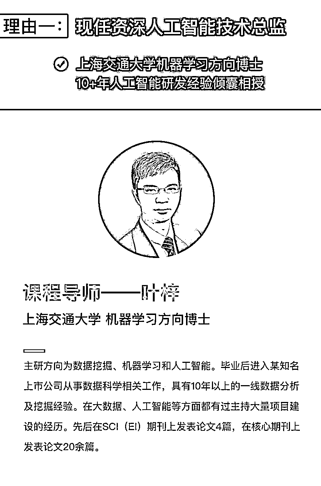
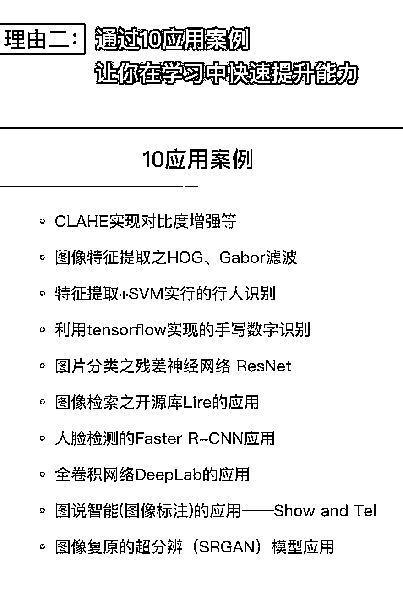
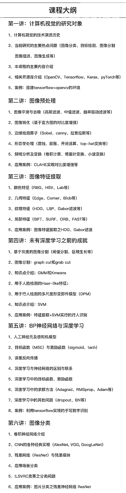
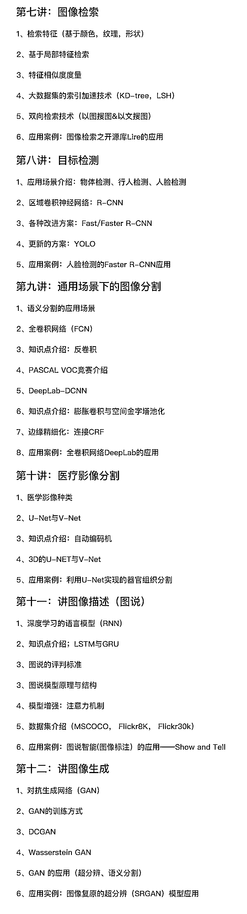

# 无人驾驶、人脸识别，这些牛 X 哄哄的技术都是怎么实现的？

> 原文：[`mp.weixin.qq.com/s?__biz=MzAxNTc0Mjg0Mg==&mid=2653288687&idx=1&sn=4ae87d6355b0c4ae907b73574112016d&chksm=802e3afab759b3ec18feceed16f8a14cb0cae3da77b78eba678d744f40f988e62eb5f4978c2c&scene=27#wechat_redirect`](http://mp.weixin.qq.com/s?__biz=MzAxNTc0Mjg0Mg==&mid=2653288687&idx=1&sn=4ae87d6355b0c4ae907b73574112016d&chksm=802e3afab759b3ec18feceed16f8a14cb0cae3da77b78eba678d744f40f988e62eb5f4978c2c&scene=27#wechat_redirect)

面对人工智能五花八门的分支方向，程序员如何选择？

有个原则很适合程序员，选**落地最成熟的。**

与其投身于溢满泡沫，不知道什么时候“爆炸”的领域，不如选择已经过验证，正在落地实施的。

例如，**投身计算机视觉领域，**实现无人驾驶、人脸识别这些被行业巨头认可并重金投入的好行当。

计算机视觉面临的是一个**巨大的人才缺口**。

百度、京东、小米、滴滴、今日头条、美图等众多互联网巨头在不同的招聘渠道上都有超多计算机视觉领域相关的职位需求。 

如果你想为自己的未来多做些储备，并确信自己有足够的学习能力。我建议你进来试试，接受挑战。

**来吧，还等什么？**

**《计算机视觉的深度学习实践》**

原价    ¥ 899.00 

现超 500 人报名

已至底价    ** ¥ 399.00 **

**>>  ****点击文末阅读原文参团**  **<<**

参团，咨询，查看课程，请点击**【阅读原文】**

**↓↓↓**