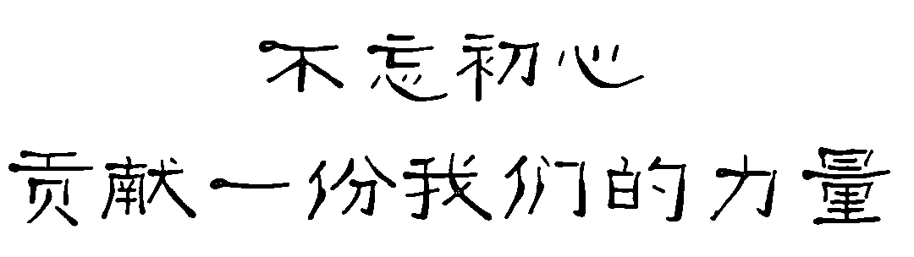

# 【干货来啦】2018 上半年所有券商金工研报前 50（打包带走）

> 原文：[`mp.weixin.qq.com/s?__biz=MzAxNTc0Mjg0Mg==&mid=2653288683&idx=1&sn=e986298df44c954e405f01814c0745a7&chksm=802e3afeb759b3e824b7de6aac11e857fc306ad06f7afe466209923726d3a423aa65f0cf611e&scene=27#wechat_redirect`](http://mp.weixin.qq.com/s?__biz=MzAxNTc0Mjg0Mg==&mid=2653288683&idx=1&sn=e986298df44c954e405f01814c0745a7&chksm=802e3afeb759b3e824b7de6aac11e857fc306ad06f7afe466209923726d3a423aa65f0cf611e&scene=27#wechat_redirect)

2018 年 7 月 18 日，公众号推出了一篇文章：

[**券商研究实力榜出炉！我们只看金融工程（附热点研报排行）**](https://mp.weixin.qq.com/s?__biz=MzAxNTc0Mjg0Mg==&mid=2653288675&idx=1&sn=f9673de6c66cc34972680b4baf5d3f57&chksm=802e3af6b759b3e064e6d36589efa86ab0db84cef2e86135440556aee7d3604f83d151309adb&scene=21#wechat_redirect)

答应给大家分享排名前 50 的研报，今天出来啦！

**文末获取**

我们统计了 2018 上半年，所有券商金融工程的研报阅读排名（互联网综合统计，仅代表公众号观点）：

**（点击图片查看高清）**

获取研报

在**后台**输入

**2018 上半年前 50**

**后台获取方式介绍**

**往期金工研报汇总**

**综合**

[各大券商 1](http://mp.weixin.qq.com/s?__biz=MzAxNTc0Mjg0Mg==&mid=2653283257&idx=2&sn=49c78925e7f3535b9cad95bf91574519&scene=21#wechat_redirect) | [各大券商 2](http://mp.weixin.qq.com/s?__biz=MzAxNTc0Mjg0Mg==&mid=2653283773&idx=1&sn=d4604682da0c5563be9da16717d11bf9&scene=21#wechat_redirect) 

[海通（百篇）](http://mp.weixin.qq.com/s?__biz=MzAxNTc0Mjg0Mg==&mid=2653284202&idx=1&sn=f94bdefe70ddcb538ca463ba1c5e5205&chksm=802e257fb759ac69899d8544937600c22637697591fce25d1ed1b72414d975eeeba7cc58c9d8&scene=21#wechat_redirect) |  [广发（最全）](http://mp.weixin.qq.com/s?__biz=MzAxNTc0Mjg0Mg==&mid=2653284199&idx=1&sn=4ec9cac078f8057744349c9c953decb2&chksm=802e2572b759ac6438362451289132ab4bb631da5b41e9f2b2545eb5efe50e0d14d6bd3d3015&scene=21#wechat_redirect) | [国泰君安（精华）](http://mp.weixin.qq.com/s?__biz=MzAxNTc0Mjg0Mg==&mid=2653284196&idx=1&sn=85245caf9148fb965df1c56c963984ba&chksm=802e2571b759ac6772582aea40781bddd6f148f144edc9b8b08606749f3c2c012b907441d59d&scene=21#wechat_redirect)

**2016 年金工共 600 篇**

[第 1 部分](http://mp.weixin.qq.com/s?__biz=MzAxNTc0Mjg0Mg==&mid=2653284668&idx=1&sn=1d099b61ac8a378f39ef99203cfb85af&chksm=802e2b29b759a23f1ce824e84ab55601f8da41ace7877cac3fe97900f1a7147c97a732481841&scene=21#wechat_redirect) | [第 2-4 部分](http://mp.weixin.qq.com/s?__biz=MzAxNTc0Mjg0Mg==&mid=2653284678&idx=1&sn=0c29d884ada86f565b5849057fe5cdb6&chksm=802e2b53b759a245db87fe77c211e8f987464d0d188305808b412fb2d36cbc9f4bb707fedde9&scene=21#wechat_redirect) | [第 5-9 部分](http://mp.weixin.qq.com/s?__biz=MzAxNTc0Mjg0Mg==&mid=2653284702&idx=1&sn=c150e541adb6f852459b085a086bf97f&chksm=802e2b4bb759a25de30c981d25e8db6c90e409e0c8ec5303ad0b3fa673abfc01fd4832842c16&scene=21#wechat_redirect)

**2017 年金工全年 1000+篇**

[1-3 月](https://mp.weixin.qq.com/s?__biz=MzAxNTc0Mjg0Mg==&mid=2653286032&idx=1&sn=f931e3de55ba425049553d524173b57e&chksm=802e2c85b759a5935002ab01161a92be5ba6c7a5ba64ad12d8be55490fa328973835008ab2dc&scene=21#wechat_redirect) | [4-6 月](https://mp.weixin.qq.com/s?__biz=MzAxNTc0Mjg0Mg==&mid=2653286032&idx=1&sn=f931e3de55ba425049553d524173b57e&chksm=802e2c85b759a5935002ab01161a92be5ba6c7a5ba64ad12d8be55490fa328973835008ab2dc&scene=21#wechat_redirect) | [7 月](https://mp.weixin.qq.com/s?__biz=MzAxNTc0Mjg0Mg==&mid=2653286133&idx=1&sn=c8ef7e2df827698971c71c270ec08a65&chksm=802e2ce0b759a5f63de0fb7f635e8959c4f25a5c761d165a0a2312d08e48e48e408dde572642&scene=21#wechat_redirect) | [8 月](https://mp.weixin.qq.com/s?__biz=MzAxNTc0Mjg0Mg==&mid=2653286262&idx=1&sn=8fe879fc4a5189cf027b7496da82681f&chksm=802e2d63b759a47535c7a0dfe279672f10821edcdeb49c6f099a7388feef39e8faeb2aaf30e3&scene=21#wechat_redirect) | 9 月 | [10 月](https://mp.weixin.qq.com/s?__biz=MzAxNTc0Mjg0Mg==&mid=2653286510&idx=1&sn=b64aab20dc1ba2e56776aa34090d361d&chksm=802e327bb759bb6d558caf6a2aaf4e86bfaf31a3558573f58c7f5f24d1526756ec0ac1d3a820&scene=21#wechat_redirect) | [11 月](https://mp.weixin.qq.com/s?__biz=MzAxNTc0Mjg0Mg==&mid=2653286772&idx=1&sn=f8ca457e87587ed73aa3d81903336db5&chksm=802e3361b759ba7775e1879e1c8a0b9b917d9ff43649e68c85b17b434d516acfc0ec758968a7&scene=21#wechat_redirect) | [12 月](https://mp.weixin.qq.com/s?__biz=MzAxNTc0Mjg0Mg==&mid=2653287361&idx=1&sn=b659d13209d14bfc2cc9865ca1c42042&chksm=802e31d4b759b8c2548c5f128f0a7b6d59dbc3a89b2f8f49fcdf197736ad2cb1c25182928e51&scene=21#wechat_redirect)

**2017 年最热**

## [2017 年最热门的 50 篇券商金工研报](https://mp.weixin.qq.com/s?__biz=MzAxNTc0Mjg0Mg==&mid=2653287411&idx=1&sn=f1151b0ad87f5b45e99aca7ddf1f412e&chksm=802e31e6b759b8f064653deee672eb2fb6d73e4743a077b3456659e1f9b58c7cfe8e3ff1271b&scene=21#wechat_redirect)

**2018 年热点**

[热点 1](https://mp.weixin.qq.com/s?__biz=MzAxNTc0Mjg0Mg==&mid=2653288446&idx=1&sn=9c9eff76734dc2a9f1b046eb9184704a&chksm=802e35ebb759bcfdf5843d5b0892c8c2142e15a62454e31846fd979c215ae56ebab2a717cefa&scene=21#wechat_redirect) | [热点 2](https://mp.weixin.qq.com/s?__biz=MzAxNTc0Mjg0Mg==&mid=2653288146&idx=1&sn=bd43689e8b566872b93a6026f35480cc&chksm=802e34c7b759bdd1efa8b23b409321c14f3f056ad11375f28ca603a4315237a852f159b0fe55&scene=21#wechat_redirect)

**知识在于分享**

**在量化投资的道路上**

**你不是一个人在战斗**

********