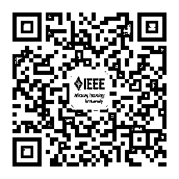
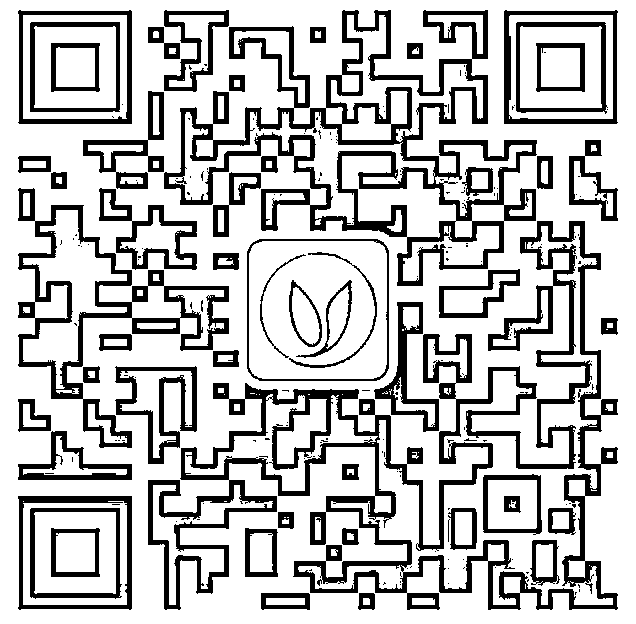
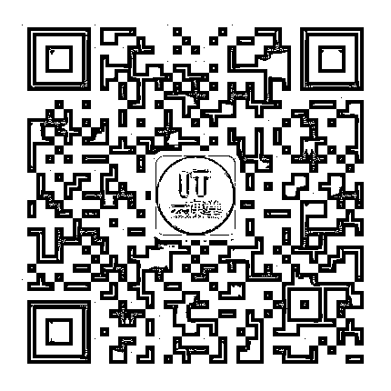

# 搞量化的，你可以不看，但你不能不屑！

> 原文：[`mp.weixin.qq.com/s?__biz=MzAxNTc0Mjg0Mg==&mid=2653288677&idx=1&sn=e9e841e271a2eb9cc2aee3d9712fc8ad&chksm=802e3af0b759b3e67c96bc0db958f9948da086d58ab1f39a7d5e509e0146c10c3a918de51bd0&scene=27#wechat_redirect`](http://mp.weixin.qq.com/s?__biz=MzAxNTc0Mjg0Mg==&mid=2653288677&idx=1&sn=e9e841e271a2eb9cc2aee3d9712fc8ad&chksm=802e3af0b759b3e67c96bc0db958f9948da086d58ab1f39a7d5e509e0146c10c3a918de51bd0&scene=27#wechat_redirect)

当下最热门、最棒的业界大号

精彩原创、实用干货、技能学习

你不能错过！！！

**开源中国**

**▲长按图片识别二维码关注**

开源中国 www.oschina.net 是目前备受关注、具有强大影响力的开源技术社区，拥有超过 200 万的开源技术精英。我们传播开源的理念，推广开源项目，为 IT 开发者提供一个发现、使用、并交流开源技术的平台。

开源中国微信公众平台将每天为您送上开源软件推荐、技术干货分享、好看好玩 OSChina 戏精剧场，还有精选的一手开源资讯早点等你哦！

**机器学习算法与自然语言处理**

**▲长按图片识别二维码关注**

一个哈工大 nlp 在读博士的技术提升之路，为您提供一系列我在学习路上的笔记，经验以及感悟。自然语言处理领域排名第一，机器学习算法领域排名第一，与君成长！

**优达学城 Udacity**

**▲长按图片识别二维码关注**

优达学城（Udacity）是 Google 无人车之父 Sebastian Thrun 创立的终身学习平台，与 Google、Facebook、IBM 等行业领袖打造前沿技术课程，让你在家也能学习人工智能编程基础、数据分析、深度/机器学习、区块链开发、无人驾驶等技能，突破职业年薪天花板 

关注回复**“apollo”**，免费加入百度 Apollo x Udacity 共同打造的“无人驾驶入门”新课，零基础也能学！

**马哥 Linux 运维**

**▲长按图片识别二维码关注**

马哥 Linux 运维是国内顶级的 Linux 云计算、Python 全能开发高薪就业技能学习平台，目前有 10 多位腾讯、百度、阿里等一线技术专家定期做 Linux 运维、Python 开发、云计算、大数据、服务架构等方面技术分享和行业交流，100000+IT 人订阅，每天都有精选技术干货，长按二维码可免费获得价值 1980 元的 Linux 云计算+python 全能开发学习路线图一份。

**量化投资与机器学习**

**▲长按图片识别二维码关注**

作为微信全网量化&量化投资搜索排名第一的技术类公众号。编辑部汇集了一群来自清华、北大、复旦、人大、中科大、上交、华中科技大、同济、武大、北邮、川大、上财、东财、央财、西财、中大、暨大、华师、华工、LSE、NUS 等海内外优秀院校毕业的博士、硕士和相关研究从业人员。为大家带来关于量化投资和机器学习相关的知识和干货。版块语言分为：Python 、MATLAB 、R 。涉及领域有：量化投资，机器学习，人工智能。

**TGO 鲲鹏会**

**▲长按图片识别二维码关注**

TGO 鲲鹏会 是极客邦科技 / InfoQ 旗下面向高端技术管理者的微信公众号，每日分享最全面的技术管理干货与技术圈一线大咖分享。发布过近千篇国内外知名 CTO 独家干货分享、经验总结、专访等高质量原创内容，致力于帮助技术人持续学习成长。现在关注即可获得 CTO 技能图谱一份。

**码个蛋**

**▲长按图片识别二维码关注**

作者「陈宇明」，Android 框架 BRVAH 发起人（1w+star），CSDN 专家博主。半路出家，从流水线工人到技术负责人。 主要分享编程技术，职场感悟，知识管理，时间管理，团队管理。关注还有程序员专属表情包。

**IEEE 电气电子工程师学会**

**▲长按图片识别二维码关注**

网罗全球科技前沿动态

为科研创业打开脑洞

**互联网学习圈**

**▲长按图片识别二维码关注**

互联网学习圈是一个免费的互联网技能学习平台，网络运营，软件开发，大数据，人工智能等学习，互动,，交流平台！这里有 1000 名行业大咖讲师，120 万互联网从业人员，免费下载视频资料，课程，定期组织大咖老师公开课！ 

回复**“直播公开课”**即可免费获得人工智能、产品经理、运营的大咖老师公开课听课链接！

**网易云课堂 IT 互联网课**

**▲长按图片识别二维码关注**

想拿互联网高薪职位？想学专业系统职业技能？想跟网易总监行业大牛学？关注我→“网易云课堂 IT 互联网课”

产品设计/前台开发/后台开发/技术支撑/在这里都可以找到！

后台回复**【吴恩达】**国际顶尖大师带你免费学人工智能课！

后台回复**【小程序】**免费学，网易与腾讯微信合作推出微信小程序开发入门教程！