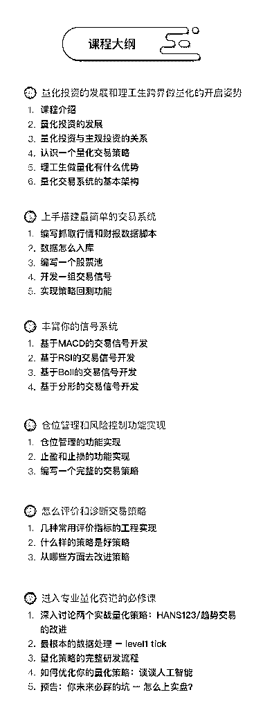

# 你还在嘲笑码农吗？他们才是你朋友圈里的真土豪！

> 原文：[`mp.weixin.qq.com/s?__biz=MzAxNTc0Mjg0Mg==&mid=2653288651&idx=1&sn=0e7c285119bc7419bef86cc38f39241e&chksm=802e3adeb759b3c8ff908fdd550231ef9307f3e4477fdbad90a6e0ffde417594fdf0c69a1906&scene=27#wechat_redirect`](http://mp.weixin.qq.com/s?__biz=MzAxNTc0Mjg0Mg==&mid=2653288651&idx=1&sn=0e7c285119bc7419bef86cc38f39241e&chksm=802e3adeb759b3c8ff908fdd550231ef9307f3e4477fdbad90a6e0ffde417594fdf0c69a1906&scene=27#wechat_redirect)

招聘网站上面随意一搜，顿时让我觉得北京西二旗就是赤裸裸的富人区。

北上广不相信眼泪，程序员里没有穷人。

对于擅长逻辑和代码的程序员来说，**如何让自己手中的钱持续增益**是现阶段的一个难题。

谁不渴望金钱？谁不期待财务自由的那一天？

身边有不少从事 IT 技术的程序员开始关注投资，有的咨询身边的人，有的开始到处听分享会，关注金融动态，加了一堆的金融销售微信，最后却发现：楼盘、股票、黄金、期货……五花八门的投资方向看花了眼也没有挑选到一个适合的投资方向。

**只有适合的投资才能为你带来收益。**

**什么样的投资是适合自己的投资？**

雷军早年做天使投资时有一个原则：只投熟人。

罗杰斯表示，投资的原则只能有一条，那就是：不要做自己不懂的事情。或者说，只做自己懂的事情。

简而言之就是投自己熟悉的领域，做你熟悉的事情。与其听金融销售们喋喋不休的推销那些云里雾里的投资项目，不如选择自己了解并能驾驭的。

程序员最擅长并且能够驾驭的是什么？用缜密的逻辑思维以代码的形式编写成计算机程序并让它运作起来。对于程序员来说，没有什么比自己用代码编写的计算机程序更安全。

有一种投资叫做**量化投资**，在百度百科中是这样解释的：通过数量化方式及计算机程序化发出买卖指令，以获取稳定收益为目的的交易方式。

作为一名程序员，除了**研究量化投资，让自己成为一名宽客，**好像找不到更适合的投资方式了。

无论你擅长哪一种语言，都不要觉得宽客离你很遥远。已经有很多程序员通过系统的学习量化投资课程，研究策略编写与系统搭建，而成为一名宽客。宽客带给他们的不仅是工作收入的提高

同时还擅长了量化交易，从而让自己的选择和判断更精准科学，投资更有价值。这些人，被叫做**IT 圈里的金融家，金融圈里的 IT 工程师。**

如果你想成为一名宽客；

如果你想系统的做量化策略；

如果你想驾驭主观思维、量化思维；

如果你想搭建稳定的量化交易系统；

如果你想为自己的未来多做些储备，并确信自己有足够的学习能力；

我们建议你来**接受挑战**

**《量化交易基础：策略编写与系统搭建》**

开课时间：7 月 16 日

主讲老师：汪浩、宋战江、孟康健、刘英斐

这次课程我们邀请到清华大学量化交易主讲老师，通过 12 小时的在线直播，手把手地教你**完整的代码示例****，在线答疑解惑。**将**4 万小时量化技术实战，上万次量化策略交易实盘**以及老师在现实中遇到的**实盘交易、量化系统实践**浓缩到课程当中，12 小时课程满满的都是干货哦~

课程详情请见如下**<课程大纲>**

点击**【阅读原文】**价格有惊喜哦~