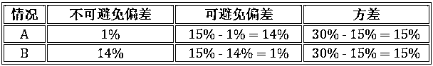

# 【全球第一帖】全面解读吴恩达新书（中）

> 原文：[`mp.weixin.qq.com/s?__biz=MzAxNTc0Mjg0Mg==&mid=2653288647&idx=1&sn=7b53e265e10ebcae4df3fcdad1b787e4&chksm=802e3ad2b759b3c4b1dd7c7d737ebb2a577e3e9f63c442b4e7a04bdcd39b4ecf0fd1725e140a&scene=27#wechat_redirect`](http://mp.weixin.qq.com/s?__biz=MzAxNTc0Mjg0Mg==&mid=2653288647&idx=1&sn=7b53e265e10ebcae4df3fcdad1b787e4&chksm=802e3ad2b759b3c4b1dd7c7d737ebb2a577e3e9f63c442b4e7a04bdcd39b4ecf0fd1725e140a&scene=27#wechat_redirect)

**公众号编辑部 | ****海外组**

[**【全球第一帖】全面解读吴恩达新书（上）**](https://mp.weixin.qq.com/s?__biz=MzAxNTc0Mjg0Mg==&mid=2653288222&idx=1&sn=6f673784dd45008746013779918e6e3e&chksm=802e350bb759bc1d9b3dc26363efe90e97d41e70969f67c934e0977832c505a5ec18f8d95c91&scene=21#wechat_redirect)

**获取书籍请在文末查看**

0 引言

吴恩达 (之后称大神) 在 2018 年 5 月 23 日北京时间早上 6 点 15 分将《Machine Learning Yearning》一书更新到第三十二章 (总共有 55 章)。

回顾该书要讲的七个要点：

1.  学习策略 (1 - 4 章)

2.  目标设定 (5 - 12 章)

3.  误差分析 (13 - 19 章)

4.  偏差方差 (20 - 32 章)

5.  性能对比 (33 - 35 章)

6.  数据修正 (36 – 43 章)

7.  端对端学习 (44 - 55 章)

上帖已经解读前三个要点，而本帖主要解读第四、五个，即偏差方差和性能对比。虽然大神第 33-35 章还没有出，但我根据他在 Cousera 讲的课内容帮大家提前解读到第三十五章，因为个人认为第四、五个要点联系非常紧。

整篇主要讲实用派 (大神) 如何将理论派 (各种书籍) 的偏差方差概念用在深度学习中，以及如何用学习曲线做合理检验 (sanity check)。 

1 偏差方差

本章介绍的内容流程如下：

1.  书中 (理论派) 对偏差方差的严谨定义 (实用性弱)

2.  大神 (实用派) 对偏差方差的友好定义 (实用性强)

3.  理论派和实用派中的最优误差

4.  理论派和实用派中的偏差方差权衡，如何减小偏差和方差

5.  从误差点 (单个偏差方差) 到误差线 (学习曲线)

1.1

**严谨定义**

**要点：偏差和方差是误差的两大来源。**

从字面上来讲 

*   偏差 (bias) 是预测值的期望与真实值之间的差距

*   方差 (variance) 是预测值的离散程度

不明白偏差？想想“认知偏差”的定义，是人们常因自身或情境的原因使得知觉结果出现失真的现象，关键词是**失真**，也就是人们预测与真实的差距。

不明白方差？想想“统计方差”的定义，是各个数据与其算术平均数的离差平方和的平均数，关键词是**离差**，也就是预测值的离散程度。

套用上面定义，用一个真实例子(用面积来预测房价的线性回归模型) 来介绍偏差方差，我们需要以下类比：

*   真实值：目标模型 g (未知的最优的)

*   预测值：一套数据集 D 上训练出来的模型 h^((D))

要讨论该模型的误差和方差，就要弄清该模型的**真实误差**，而真实误差是测量模型在**所有**数据上(训练用的，没见过的)。真实误差是不可能精确计算出的，因为里面涉及到没见过的数据，但是我们可以在不同的数据集上做线性回归得到不同的模型，如下图所示：

继续类比得到

*   预测值的期望：多套数据集 D[1], D[2],…, D[m]上训练出来的模型 h^((D1)), h^((D2) ),…, h^((Dm)), 再求其平均得到模型 f = E[D][h^((D))]

*   预测值的离差：每个模型和平均模型的差距 h^((D1)) - f, h^((D2)) - f, …, h^((Dm)) - f

再看偏差 (用平方差距表示) 和方差的数学定义就简单多了

偏差 = (f - g)²

    方差 = E[D][(h^((D)) - f)²]

模型误差可分解成偏差和方差(为了简化问题，不考虑数据的噪声)，如下图所示：

对着偏差方差的定义，上面的图不能再清楚。更多关于偏差方差的详情可参考[**模型的评估和选择**](http://mp.weixin.qq.com/s?__biz=MzIzMjY0MjE1MA==&mid=2247483767&idx=1&sn=991489d0546b99a4b54e77652f91ad9e&chksm=e890827edfe70b6846503857ac79dafff23038b18a7b7fec6846828c92878d9cddd6765a99f5&scene=21#wechat_redirect)一贴的 3.9 小节。

现在问题是偏差和方差都不能精确的计算，因为目标函数 g 和数据分布 P(D) 都是未知的，“**误差 = 偏差 + 方差**” 只是一个美丽的等式，而下节大神会给出能计算的偏差和方差的定义。尽管不能计算，上面等式也不是一无所用，至少在降低模型误差时我们有两个目标：

1.  在降低偏差时不要显著增加方差

2.  在降低方差时不要显著增加偏差

听起来像废话，做起来不容易。

1.2

**大神定义**

**要点：偏差是模型在训练集上的误差，方差是模型在开发集和训练集上的误差的差异。**

大神对偏差方差的定义为：

*   偏差是模型在训练集上的误差

*   方差是模型在开发集和训练集上的误差的差别

咋一看，这是什么定义？所以说我们脑洞不够大，比不了大神。从严谨定义开始

    偏差 = (平均模型误差 – 目标模型误差)²

    方差 = E[(某个模型误差 – 平均模型误差)²]

和大神定义靠拢需要以下不是很严谨的观点或假设：

*   平均模型是在不同数据集上做平均，现在只有一个训练集 D[train]，因此平均模型就是 f = h^((train))，平均模型误差 = 训练误差

*   目标模型就是我们千方百计想要找的模型，找到的话目标模型误差 = 0

*   定义某个模型误差是 f 在开发集 D[dev ]上的误差，假设方差就是在该 D[dev] 划分时计算出来的

综上

    偏差 = (训练误差 – 0)² = 训练误差²

    方差 = (开发误差 – 训练误差)²

将上面方程右边再开方而定义为偏差和方差

    偏差 = 训练误差

    方差 = 开发误差 – 训练误差           

方差开方之后会有正负号，但是开发误差一般都比训练误差**大**，因为模型是从训练上得出来的，没可能在开发集的表现更好。

废了这么大的劲儿将偏差方差的“严谨定义”和“大神定义”联系起来，为了什么？就为了偏差和方差现在可以用训练误差和开发误差来**量化**！看下面 4 个情景。

如果你的模型达到情景 4 的表现，那么恭喜你成功了，其他情景的话还需要继续该模型，怎么改进就要看到底是偏差问题还是方差问题？怎么判断就要借助训练误差和开发误差。现在知道大神定义的偏差方差有用了吧。

1.3

**最优误差**

**要点：偏差可分成“不可避免偏差”和“可避免偏差”，前者是客观存在而不可能减小的，努力减小的是后者。**

上节说如果找到一个模型就是目标模型的话，那么目标模型误差 = 0，这时 

    偏差 = 训练误差

但是这种情况是理想化的，我们几乎不可能找到一个误差率为零的模型，换句话说最优误差接近于零但不等于零 (有些模型最优误差还可能很大，比如一个在很嘈杂背景下的一个语音识别器的最优误差高达 14%)。

这个最优误差也是不可避免偏差 (unavoidable bias)，顾名思义就是误差无法减小的部分，那么可避免偏差 (avoid bias) 就是误差可以减小的部分。因此偏差又可以继续分解成

    偏差 = 不可避免偏差 + 可避免偏差

重新回顾上节情景 3，假设不可避免偏差有以下两种情况：

*   情况 A：不可避免偏差 = 1%

*   情况 B：不可避免偏差 = 14%

这样看，情况 A 还是高偏差高偏差，但情况 B 却是低偏差高偏差。确定最优误差的好处是让我们只关注可避免偏差，而之后需要减小的也是可避免偏差。

1.4

**两者权衡**

**要点：在传统机器学习时代，减小偏差会增大方差，反之亦然。在深度学习时代，在减小可避免偏差时尽量不要显著增大方差，反之亦然。**

在传统机器学习时代，偏差和方差是有冲突的，称为偏差方差权衡。如下图：

*   当模型复杂度低时欠拟合，训练数据的扰动不足以是模型产生显著变化，此时偏差是总误差的主要来源。

*   当模型复杂度高时过拟合，数据发生的轻微扰动都会导致模型发生显著变化，此时方差是总误差的主要来源。

减少偏差的方法 (提高模型复杂度) 包括：

*   增多特征

*   减少正则化

减少方差的方法 (降低模型复杂度或者增加数据) 包括：

*   收集更多数据

*   减少特征

*   增加正则化

在深度学习时代，我们有大量的数据和更深的神经网络，很多时候我们减小偏差或方差是不会对另一方产生过多不良影响。我们的目标是

1.  **减小可避免偏差时不要显著增加方差**

2.  **减小方差时不要显著增加可避免偏差**

减少偏差的方法包括：

1.  用更深的模型 (增加层数) 或更大的模型 (增加每层的神经元)

2.  减少正则化作用 (L2, L1 和 dropout)

3.  训练更长时间

4.  训练更好的优化算法 (Adam)

5.  通过在训练集上做误差分析 (见**吴恩达新书的全球第一帖(上)**第 3 节)

6.  寻找更好的神经网络架构

小结一下：

*   方法 1 在减小偏差时很容易增加方差，一般一旦发现方差变大就增加正则化来降低方差。 

*   方法 2 在减小偏差时会增大方差，正则化一般不会单独使用。

*   方法 3-6 都是直接减小训练误差，因而会同时减少偏差和方差。注意的是方法 6 更好的神经网络架构通常很难找到。

*   **最有效的是方法 1：用更深更大的模型配着正则化。**

减少方差的方法包括：

1.  收集更多的数据

2.  增加正则化作用 (L2, L1 和 dropout)

3.  加入提前停止

4.  减少特征数量

5.  用更浅的模型 (减少层数) 或更小的模型 (减少每层的神经元)

6.  通过在训练集上做误差分析

7.  寻找更好的神经网络架构

小结一下：

*   方法 1 是最直接的，只要有足够处理大量数据的算力。

*   方法 2 和 3 在减小方差时会增大偏差，一般不会单独使用。

*   方法 4 在减小方差时会增大偏差，在数据很多时并不是很有效。

*   方法 5 大神不推荐，除非算力是最值得顾虑的因素。

*   方法 6 和 7 都是直接减小训练误差，因而会同时减少偏差和方差。注意的是方法 7 更好的神经网络架构通常很难找到。

*   **最有效的是方法 1：收集更多数据，唯一需要考虑的因素是算力。**

1.5

**学习曲线**

**要点：线永远比点表达的信息更多。**

在上一节，我们只在一个点 (固定数目的训练数据) 上比较训练误差和开发误差，进而推断到底该减小偏差或方差。诚然该方法是有效，但是能看出训练误差和开发误差随着训练数据数目的变化趋势不是更好么？如下图所示：

上右图就是学习曲线，它是将训练误差和开放误差作为训练数据数量的函数绘制的图表。直观来讲，随着训练集大小增加

*   开发误差会越来越**小**，数据越多模型泛化能力越强，因此在开发集表现会越好。

*   训练误差会越来越**大**，数据少时模型可以记住达到零误差，数据多时喂不进模型了，因为模型复杂度有限因此误差增大。

给定固定的训练集大小，开发误差会比训练误差大，因此蓝线在红线下面。

接下来看看三幅图：

*   高偏差低方差 

*   高方差低偏差

*   高偏差高方差

* * *

在**高偏差低方差**情况下，增加训练数据只会 

*   让训练误差越来越大，从而偏差越来越大

*   让开发误差越来越小，但小不过训练误差

这时候用更复杂的神经网络才是王道，增加训练数据只会浪费功夫。

* * *

在**高方差低偏差**情况下，增加训练数据 

*   虽然会让训练误差越来越大，从而偏差越来越大

*   但是会让开发误差越来越小，希望会越来越靠近训练误差

这时候用更复杂的神经网络没用，因为偏差已经很小，模型不用继续复杂化。

* * *

在**高偏差高方差**情况下，能做的事就多了，比如 

*   用更复杂的神经网络，减小偏差

*   增加训练数据，减小方差

*   人工分析误差，减小两者

*   换更好的网络架构，减小两者

学习曲线可以帮助我们快速诊断出问题在哪，再对症下药。深度学习本来就是一半科学一半艺术，通过不断“炼丹”，最终目标就是下图，**低偏差低方差**。 

* * *

在两种情况下绘制学习曲线会遇到问题。假设全集有 100 个数据，选取 10 个子集，分别包含 10, 20, 30 到 100 个数据点，在每个子集上训练模型，计算训练误差并画图。 

*   问题一：曲线前端 (比如第一个子集) 的误差值会随机振动。

*   问题二：当类别不平衡时，比如正类和反类比例为 80:20。很有可能随机选的 10  个数据点并不能反映全集的类别比，比如这 10 个数据点都是正类。

对这两个问题，大神也给了解决方案 (都是在取样上做文章)。

*   方案一：置换挑选 10 个数据点  3-10 次，每次计算误差，然后再平均作为最终误差。 

*   方案二：选取子集时，尽量使得其类别比例和全集的类别比例一致。

当数据很多时而且类别比较平衡时，可以忽略上述两个问题。

最后当数据很多时，绘制学习曲线会很耗时，因为会选取不同子集来训练模型。大神给的建议是不用等分数据来划分子集，比如有 10K 个数据，划分 2 比划分 1 好，而且也能清晰的看出趋势。

    划分 1：1K, 2K, 3K, …, 10K

    划分 2：1K, 2K, 4K, 6K, 10K

2 性能对比

上章最后一节主要讲如何根据学习曲线来减小偏差或方差最终取得低偏差低方差 (低误差)，本章来分析如果误差低到逼近人类水平甚至超过人类水平会发生什么。

2.1

**人类表现**

**要点：对于人类擅长的任务，可用人类误差近似不可避免偏差。**

人们经常比较机器学习系统表现和人类表现，通常趋势如下图： 

从上图可看出三点：

1.  开始当模型没有人类水平好时，往人类水平进展的速度是很快的。

2.  一旦模型过了人类水平，其精度提升变得很慢了。原因有二：

1.  数据是人类标记的

2.  错误分析是人类做的

4.  最后我们都希望模型能达到理论上最佳水平，但就是无法超越。

第 3 点里的理论上限就是 1 减去贝叶斯最优错误率 (Bayes optimal error rate)，姑且定义为贝叶斯水平吧。而贝叶斯最优错误率就是 1.3 小节提到的最优误差 (不可避免偏差），因此

    贝叶斯水平 = 1 - 不可避免偏差

人类擅长很多任务，比如图像识别和语音识别这类处理自然数据的任务，人类水平和贝叶斯水平相差不远，通常用人类水平来近似成贝叶斯水平，那么我们有

    人类水平 ≈ 贝叶斯水平

    人类误差 ≈ 不可避免偏差

假设下面两种分类情况，人类误差分别是 1% 和 7.5%，模型的训练误差是 8%，开发误差是 10%。

很明显：

*   情况 A：可避免偏差 7% > 方差 2%，偏差问题比较严重，应该使用更深的神经网络

*   情况 B：可避免偏差 0.5% < 方差 2%，方差问题比较严重，应该获取更多数据

接下来我们来研究如何定义人类误差，既不可避免偏差。如医学图像分类问题上，假设有下面几种分类的水平：

*   普通人误差：3%

*   普通医生误差：1%

*   专家误差：0.7%

*   专家团队误差：0.5%

问题：人类误差到底是 0.5%, 0.7%, 1% 还是 3%？

答案：看机器学习系统表现而定，见下面三种情况。

情况 1：训练误差 5%，开发误差 6%，方差为 6% - 5% = 1%

不管选哪个作为人类误差，所有结论都是偏差严重，专注于减小偏差。

情况 2：训练误差 1%，开发误差 5%，方差为 5% - 1% = 4%

当训练误差到 1%这么小了，再选普通人 3% 作为人类误差已经无意义了。只有选等于或小于 1% 作为人类误差才能继续改进模型，比如选后三个 1%, 0.7% 和 0.5%，得到结论都是方差严重，专注于减小方差。

情况 3：训练误差 0.7%，开发误差 0.8%，方差为 0.8% - 0.7% = 0.1%

当训练误差到 0.7% 时，选 0.7% 或 0.5% 作为人类误差可以得到相反的结论，到底是要减小偏差还是减小方差？模型表现越好时也越难继续优化，因为这时候人类误差是比较模糊难以准确定义的。

这样看来，如果模型超过人类时，继续优化会更加困难！

2.2

**超人表现**

**要点：当机器学习系统表现超过人类表现，贝叶斯误差就很难估计，再从减少偏差或方差方面提升系统性能就很困难。**

对于自然感知类问题，机器学习的表现不及人类。但是在很多其它方面，机器学习模型的表现已经超过人类了，包括：**产品推荐**，**物流预测**和**贷款审批**等。注意这些任务的数据都是结构化 (structured) 数据 (两维数据，每一行是一个示范，每一列是一个特征)，而不像感知类问题的非结构化 (unstructured) 数据 (一张图片，一段语音等)。

当今，机器在处理结构化数据的表现远远超过了人类表现，此外，机器在某些语音识别和图像识别的任务中也超过了人类，因此想继续提升会非常困难。这也很正常，想想博尔特百米用时从 9.7 秒提升到 9.6 秒远比从 10.1 秒提升到 10 秒困难。

3 总结

明晰大神提出的几个定义：

*   不可避免偏差 ≈ 人类误差 

*   可避免偏差 = 训练误差 - 不可避免偏差

*   方差 = 开发误差 - 训练误差

用学习曲线来判断误差主要来源是偏差还是方差

*   如果是偏差问题，可以用更大更深神经网络加正则化

*   如果是方差问题，可以增加训练数据

*   如果是两者，可以试着所有方法，能找到更好的网络架构最好

终极目标是让机器学习系统表现逼近人类表现并超越人类，但是进展越来越慢 (分析误差效率越来越低)，原因有三：

1.  数据要靠人类标记的

2.  错误分析是用人类的见解

3.  贝叶斯误差定义越来越模糊，因此发现误差来源属于偏差或者方差这件事越来越困难

**在****后台对话框****回复**

**吴恩达最新**

**下载更新到第三十二章的书**

**知识在于分享**

**在量化投资的道路上**

**你不是一个人在战斗**

********