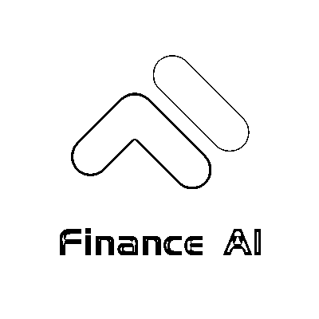

# 公众号•北京 | 一场不能错过的金融算法头脑风暴，约吗？

> 原文：[`mp.weixin.qq.com/s?__biz=MzAxNTc0Mjg0Mg==&mid=2653288644&idx=1&sn=5b9194187e8f851f830c39feca17d15d&chksm=802e3ad1b759b3c7f25c6b559fdd2c99a33125850fb7e3282c1d1276311a3d6aafeca4ecfb64&scene=27#wechat_redirect`](http://mp.weixin.qq.com/s?__biz=MzAxNTc0Mjg0Mg==&mid=2653288644&idx=1&sn=5b9194187e8f851f830c39feca17d15d&chksm=802e3ad1b759b3c7f25c6b559fdd2c99a33125850fb7e3282c1d1276311a3d6aafeca4ecfb64&scene=27#wechat_redirect)

**北京，我们不见不散**

**Finance·AI 金融算法社区由 DataGirls 独家策划承办**

**量化投资与机器学习公众号为媒体协办方为此次活动全程打 call**

弗诺文奇

“我们已经到了濒临变革的边缘，而这种变革将会像人类的诞生一样改变一切。”

创新工场董事长 李开复

“随着人工智能技术的发展及产业的应用，人工智能会产生巨大经济的价值。其中，金融领域将会是 AI 最快产生商业价值的领域之一。”

5 月 24 日，德银官方正式宣布，计划在 2019 年前裁员 7000 人；

到 2025 年，全球金融机构近 23 万人将受到影响，电脑将取代他们的工作；

很多简单重复性的工作，都将被程序取代了。而更复杂的分析工作则被机器学习、深度学习等所取代。

**在中国成为金融科技和 AI 的最大受益国之时，金融金领彻底沦为 AI 浪潮中的"炮灰"。**

如何在当下的金融变革浪潮中，尽快的升级技能，找准定位成为变革中的积极参与者和价值创造者呢？**7****月****14 号下午**，**我们将和 1 位金融数据领域的企业家和 2 位算法技术大咖一起来开启金融算法的学习旅程。**

**活动议程**

**2:00PM-2:30PM  签到社交，下午茶自助**

**2:30PM-2:40PM  Finance·AI 社区金融算法介绍  Aislinn **

**2:40PM-2:55PM  主题分享《大牛组团的年代，怎么做才能突围》  Kevin**

主题简介：当下中国各金融机构都在大力投入 AI，很多顶尖 AI 研究院人才也组团投身金融创业，如何能在这样的竞争狂潮中保持稳定上升的竞争力，Kevin 会用自己 14 年服务不同类型金融客户以及与美国顶尖数据公司深度交流的经历，分享如何把 AI 这个热门趋势转变成一个有实质推进结果和客户认可价值的有效武器。

**2:55PM-3:10PM  深度对话 《AI 时代个人成长迭代之路 》 Aislinn 对话 Kevin**

对话简介：目前整个金融行业都都处在变革的节点，国内国外都在裁员，与此同时更多的工作交付给了机器与算法。从个人在金融领域的职业发展来看，如何培养成长迭代型心态并且在 AI 时代让自己更快的掌握必要的技能找准合适的定位，使得自己可以跟上时代的步伐，不被淘汰。

**3:10PM-3:40PM  主题分享 《区块链链上数据的认知与探索》 张丹  **

主题简介：区块链上所有的交易都是公开透明的，链上账本会记录所有参与者交易行为，包括资金流转规律，庄家操盘，筹码分布等，价值巨大，从数据科学的角度，分享对区块链链上数据进行的认知与探索。

**3:40PM-4:10PM  主题分享 《知识图谱在金融风控中的应用》 邵平**

主题简介：在金融领域中，如何突破既有的数据使用模式，更高效、精准获得数据带来的价值，一直都是金融机构重点关注的问题。利用基于关联关系的知识图谱概念，可以突破现有的关系型数据库的限制，让数据在金融行业中发挥更大的价值。

**4:10PM-4:40PM  圆桌论坛 《金融算法职场与精进》Aislinn 对话邵平和张丹**

对话简介：Aislinn 会针对每个主讲嘉宾的金融与算法背景进行职业选择与转变的提问，邵平从互联网数据挖掘工程师转到金融领域数据科学家有什么可以转移的技能，张丹从量化交易创业者到银行量化交易员到区块链技术负责人，在金融领域不同公司与角色间的切换的历程。

**4:40PM-4:50PM  金融算法社区学习计划   Aislinn**

**分享嘉宾**

Kevin

上市公司索信达数据创始人&CEO，中欧国际工商学院管理学、法学背景。专注金融大数据+AI 服务，创业 14 年成功带领公司发展为 400+人的团队、年营业额近 2 亿元（2017 年）的规模。

张丹

分布式科技 CTO，《R 的极客理想-量化投资篇》作者，微软 MVP。10 年编程经验，获得 10 项 SUN 及 IBM 技术认证。前民生银行大数据分析师。个人博客 http://fens.me， Alexa 全球排名 70K。

邵平

12 年数据挖掘与建模经验，暨南大学概率与数理统计硕士，热爱数据科学，互联网转型金融的资深算法工程师，AI 实验室负责人。相信兴趣是激发做好一件事的真正动力。

**主持人**

Aislinn

DataGirls 创始人，专注数据分析 7 年，新加坡国立大学全额奖学金得主，求学求职创业于亚欧美多国，热衷于终身学习社区打造。金融算法社区总策划。

**适合这样的你**

技术产品算法背景希望进入金融领域，金融领域希望了解算法提升自己的人。需要对金融、数据或算法有强烈兴趣或者一定了解的人。

**日期**

**7 月 14 日 | 周六**

**下午 2:00PM~5:00PM**

**地点** 

**北京 · 云享客 · 长富宫中心**

**（朝阳区建国门外大街 26 号 5 号楼一层）**

**报名方式**

活动行（**阅读原文**或扫描以下二维码）参与报名，请填写完整的报名信息，审核通过后付款即为报名成功。价格**30RMB**，包含精美自助下午茶。 

名额有限，不接受现场报名，若有任何疑问，请联系微信客服 DataGirls00，或者邮件 finance.ai@datagirls.cn。

**主办方** 

**金融算法（Finance·AI)社区**是由索信达数据公司独家支持创办，旨在连接和培养海内外金融 AI 人才，共同探索用 AI 助力金融变革的人工智能学习社区。所有分享嘉宾均为金融数据领域成功企业家或者资深算法技术达人，坚持优质知识分享，共同构建一个高品质的学习社区。

**合作伙伴** 

云享客是由 MIT 校友创建的共享办公创新平台，秉持“全球联合创新”的理念，聚焦科技、教育、文创、健康、零售、地产等产业。 在北上有 6 家共享办公空间，服务于上万名企业和个人会员，并致力于建设全球联合创新实验室、创新学院、大师论坛、中外加速器等创新平台，与美国、欧洲、以色列、日本等境外伙伴紧密合作，共同推进中国企业的国际化创新和产业升级。

**媒体伙伴** 

作为微信全网量化&量化投资搜索排名第一的技术类公众号。公众号汇集了一群来自清华、北大、复旦、人大、中科大、上交、华中科技大、同济、武大、北邮、川大、上财、东财、央财、西财、中大、暨大、华师、华工、LSE、NUS 等海内外优秀院校毕业的博士、硕士和相关研究从业人员。为大家带来关于量化投资和机器学习相关的知识和干货。

**点击“****阅读原文****”参与报名**