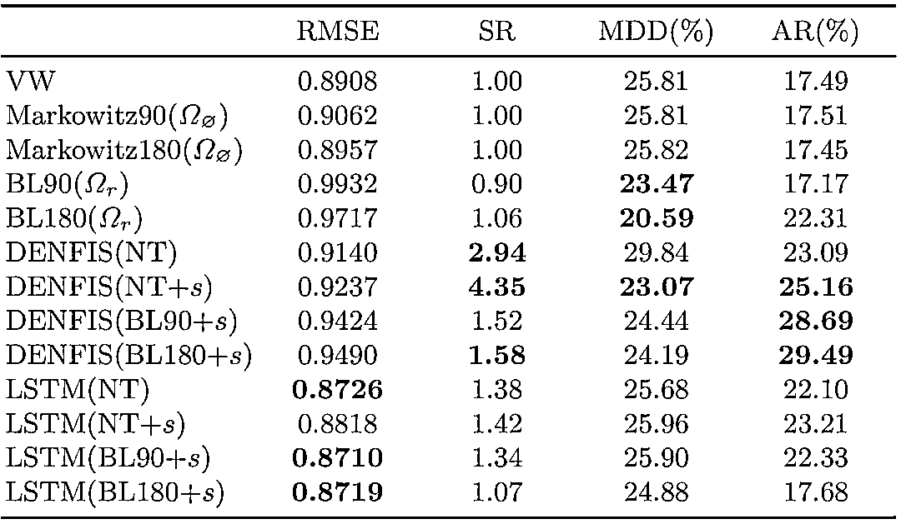

# 【独家前沿策略】机器学习应用投资组合系列（代码+论文）

> 原文：[`mp.weixin.qq.com/s?__biz=MzAxNTc0Mjg0Mg==&mid=2653288639&idx=1&sn=4a803ae1db86a6a014c4ac7868db9e9b&chksm=802e3aaab759b3bc1466d7e9af75f7e0aea20bcc13cf9392f5422a5f9ae3a64b16b6d0338568&scene=27#wechat_redirect`](http://mp.weixin.qq.com/s?__biz=MzAxNTc0Mjg0Mg==&mid=2653288639&idx=1&sn=4a803ae1db86a6a014c4ac7868db9e9b&chksm=802e3aaab759b3bc1466d7e9af75f7e0aea20bcc13cf9392f5422a5f9ae3a64b16b6d0338568&scene=27#wechat_redirect)

**公众号**近期**文章预告**

 1、红宝书读书笔记（中文版）

[*2、量化金融面试 Q&A 系列（中文版）*](https://mp.weixin.qq.com/s?__biz=MzAxNTc0Mjg0Mg==&mid=2653288556&idx=1&sn=38c68fea3a8be7edc68af9a70e5a9416&chksm=802e3a79b759b36fdb830f5e94ed0cf0258cc96e635d7e782334a0b65eb65de227d027afcd0e&scene=21#wechat_redirect)

[*3、比特币高频交易策略*](https://mp.weixin.qq.com/s?__biz=MzAxNTc0Mjg0Mg==&mid=2653288600&idx=1&sn=5d168ee620f1c91537807e34098acafc&chksm=802e3a8db759b39bd9693443519b98b92bbe6a94cb1b8204381633912eb59a3621f1c5af1ed4&scene=21#wechat_redirect)

[*4、高频交易策略解决方案基于机器学习*](https://mp.weixin.qq.com/s?__biz=MzAxNTc0Mjg0Mg==&mid=2653288278&idx=1&sn=73c6749fa89384391031c78a55768681&chksm=802e3543b759bc55fdaa974ac1d5a3c7a0a6ea11a272030dcb989978a96db6f2be8e5a0902cc&scene=21#wechat_redirect)

[*5、高频交易基于强化学习*](https://mp.weixin.qq.com/s?__biz=MzAxNTc0Mjg0Mg==&mid=2653288292&idx=1&sn=322bcd5400b339616e480775cce98bdf&chksm=802e3571b759bc6739d7fe48366a02f59f9e58a07360ac089b1e17b6350c4fd0ef4b8d735a7d&scene=21#wechat_redirect)

[*6、高频价格动态策略*](https://mp.weixin.qq.com/s?__biz=MzAxNTc0Mjg0Mg==&mid=2653288413&idx=1&sn=cddb1fbdefbcbd470e539bc030be28df&chksm=802e35c8b759bcdeeb836bfebaec2dc72570273b4ee4f39ee46137bff6798bcb5e392701e247&scene=21#wechat_redirect)

7、模式识别下的人工智能量化策略

[*8、近期最热门的券商金工研报分享*](https://mp.weixin.qq.com/s?__biz=MzAxNTc0Mjg0Mg==&mid=2653288446&idx=1&sn=9c9eff76734dc2a9f1b046eb9184704a&chksm=802e35ebb759bcfdf5843d5b0892c8c2142e15a62454e31846fd979c215ae56ebab2a717cefa&scene=21#wechat_redirect)

9、深度学习在金融中的论述

10、海内外优秀量化文献解读

[*11、**基于风险中性的深度学习选股策略*](https://mp.weixin.qq.com/s?__biz=MzAxNTc0Mjg0Mg==&mid=2653288319&idx=1&sn=e2be2ffda6b8c63f46a966790e8147ad&chksm=802e356ab759bc7c9a607ffb2145a020b454b2a97dac956684d484d5ed8bba5b09770d049dab&scene=21#wechat_redirect)

**12、资产配置系列（二）**

[*13、券商研报解读系列*](https://mp.weixin.qq.com/s?__biz=MzAxNTc0Mjg0Mg==&mid=2653288484&idx=1&sn=c79dd635c89ba4db546df535c4c81715&chksm=802e3a31b759b327d31d12f506526c3081cf49f8297d824809d79f3f45c37110e9f9ab218c26&scene=21#wechat_redirect)

14、人工智能应用量化系列

**公众号编辑部 |** **PhD 组**

Frank Z. Xing、Erik Cambria、

Lorenzo Malandri、Carlo Vercellis

**市场情绪与投资组合**

今天公众号为大家导读机器学习在投资组合应用方面的最前沿成果。

南洋理工大学计算机系和米兰理工数据挖掘研究组的科学家发现，虽然公众情绪已经被认为是股市预测的关键因素，但近十年来在利用公共情绪来解决资产配置问题的理论方面，学术界几乎没有什么进展。他们在论文中提出了一种可信赖和可解释的学习架构来生成市场观点，并且和其他的基线资产配置策略进行了比较。回测结果表明模拟盘在特定风险水平下的盈利能力提高了 5%-10%。

**前言**

我们认为公众的情绪作为一个变量不会直接影响市场——它通过市场参与者间接起作用。一个直观的假设可能是：更乐观的公众情绪导致股价上升越高。然而在现实市场中，这种关系要复杂得多。因此，黑箱(black-box)机器学习模型对专业投资者来说并不具有说服力。在本文中，我们试图提出一种考虑公众情绪的市场观点来填补这一空白。这个框架具有一定的可解释性(interpretability)。本文的主要贡献可归纳如下：

*   基于贝叶斯资产配置模型的更严格，更易于计算的市场观点定义

*   一个新的在线优化(online optimization)方法来估计收益率

*   实验表明考虑了公众情绪的神经网络模型比直接训练基于历史数据的神经网络表现更好

**贝叶斯资产配置**

贝叶斯资产配置基于资本资产定价模型(CAPM)和另一个关于收益率的先验输入，例如 Black-Litterman 模型。最优的头寸仍然具有和 Markowitz 模型相似的形式：

然而 Black-Litterman 模型的缺陷在于依赖经验观点的输入，本文就试图通过公共情绪对市场观点进行计算，从而摆脱模型先验的主观随意性。

**市场观点建模**

市场观点被定义为一组矩阵{P, Q,  Ω}

最佳市场观点将使用贝叶斯资产分配模型最大化每个时期的回报：

代入 Black-Litterman 模型得到：

我们使用神经网络模型拟合 Q：

**数据准备**

1\. 缺失值处理, 股票分割复原

2\. 标准化(normalization)

3\. 使用 PsychSignal 的公共情绪指数

**收益回测**

使用 8 年的历史数据在 NYSE 和 NASDAQ 市场进行日间策略的回测，文章报告了 RMSE, 夏普指数(SR)，最大回撤(MDD)和年化收益。交易成本没有纳入计算。VW 是大盘指数。

表中可见使用了情绪指数的模型在年化收益和夏普指数上都有较大提升。

**总结**

1、模型距离最优头寸的误差和年化收益之间没有线性对应关系。

2、简单 Markowitz 模型的行为和按市值分配权重(market-following)高度相似。

3、随机市场观点基本上是无效的。

4、使用情绪指数生成的市场观点显著提高了投资组合的表现。

论文英文原版在**阅读原文**查看