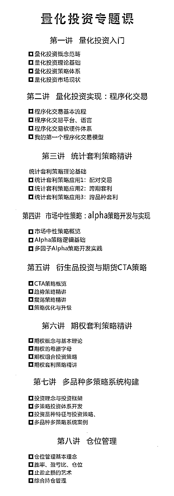
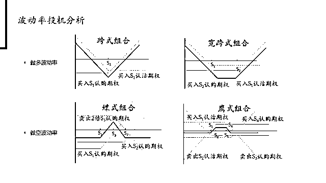
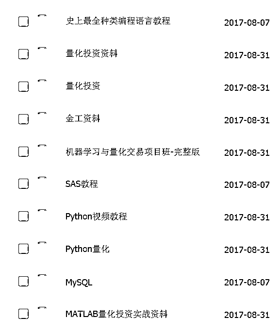
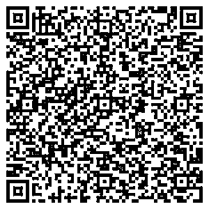

# 如何快速掌握量化投资技能？内赠两套量化交易策略 EA~

> 原文：[`mp.weixin.qq.com/s?__biz=MzAxNTc0Mjg0Mg==&mid=2653288620&idx=1&sn=90aa6c55cbd47961efd844012bcde41d&chksm=802e3ab9b759b3afcede9b610695fc4d43f1d9a6c721f1cb76344f46803876da46c65ad00924&scene=27#wechat_redirect`](http://mp.weixin.qq.com/s?__biz=MzAxNTc0Mjg0Mg==&mid=2653288620&idx=1&sn=90aa6c55cbd47961efd844012bcde41d&chksm=802e3ab9b759b3afcede9b610695fc4d43f1d9a6c721f1cb76344f46803876da46c65ad00924&scene=27#wechat_redirect)

> 近日，随着 A 股市场"一九"行情的扩散、商品期货市场波动率的上升，沉寂多时的量化产品逐渐走出低谷。Wind 数据显示，自今年下半年以来仅有 5 只可比基金的收益率为负，其余全部实现正收益。从去年至今，华泰柏瑞、银河、博时、平安大华、中金、富国等多家公司都在发行量化基金。并且，同一天多只基金不约而同地公告发行。

量化投资起源于国外

在美国金融市场发展最成熟

随着金融创新与人工智能快速发展

越来越多的机构/个人基于量化做投资决策

通过计算机实现程序化交易

真正做到"躺着挣钱"

程序化交易

不受人为情绪影响

能够快速的实现买卖证券

可以解决人少资金大的交易困境

......

在国内，量化投资兴起于 2010 年

目前中国资本市场中

不完全统计，有超过 8000 只量化投资产品

规模已经超过 1200 亿元，绝对不容小觑

随着资本市场的深化，金融产品的丰富

通过程序化进行交易的品种越来越多

未来量化投资必将崭露头角

在金融市场中，独领风骚

而此时此刻

在校学生，或已参加工作的你

我们已经错过了太多的市场红利了

从创业板到新三板，从信托到互联网金融

等等...这些都与我们擦肩而过

那现在的"量化投资"别再错过啦

当下对量化投资深入的学习与探索

就是对自己未来的投资

赶快搭上量化投资的顺风车吧

不久的将来你必将名利双收，脱颖而出

此时不习量化投资，更待何时

为了帮助大家对量化投资进行系统学习

华尔街学堂联合冠恒资本

**邀请国内知名基金经理**

推出量化投资专题课+学习大礼包

**量化投资专题系统课程**

**python+R 语言+matlab+学习视频大全免费送**

**外赠两套完整的 EA**

**最厉害的明星导师**

> 为了保证课程质量，我们邀请**国内顶级量化投资团队，他们都毕业于知名高校，来自于国内外顶级金融机构，从事量化投资工作超过 5 年**，拥有优秀且稳定的量化投资业绩。

> **罗老师**

- 北京大学理学硕士，加州伯克利金融学博士，历任花旗银行外汇交易中心高级投资经理，摩根大通交易总监，冠恒资本控股有限公司海外投资委员会主席。在量化投资，股票投资，外汇交易等方面拥有丰富实战经验。连续三年基金投资收益率超过 26%，业绩优秀且稳定。

> **谢老师**

- 北京大学金融学硕士，历任宜信普泽金融工程师、嵌入期权结构化产品投资经理，鲁证期货黄金和指数挂钩型结构化分级产品高级顾问，华宝证券高级投资经理，冠恒大华投资管理有限公司副总裁，通过程序化策略管理资产规模累计超过 60 亿元人民币。长期负责嵌入场外期权结构化产品设计和运作，高频交易系统搭建和策略开发，国内早期场外期权实践者。

> **张老师**

- 中国科学院理学博士，历任鲁证期货北京营业部研发总监，海川天地投资管理有限公司基金经理。多家期货公司高频交易和阿尔法策略团队负责人或高级顾问，长期负责 Alpha 策略开发，高频交易系统搭建，具有较长时间的股票量化投资实践经验，国内早期高频交易实践者。

**课程内容**

**课件示例**

（以上为本次课程 PPT 课件）

**本次课程适合的人群**

*   金融统计类背景的同学/工作人士，希望能够在课本之外工作之余进一步了解量化投资在金融市场的实战应用

*   非金融统计类专业背景的同学/工作人士，希望能够系统性了解量化投资以及在投资中的实际应用 

*   在证券公司/基金/银行/期货公司/交易所等相关领域工作的职场新人，希望进一步提升自己的竞争力

*   希望通过学习系统掌握量化投资相关的实务技能，为后续跳槽/转行做必要的知识技能准备与提升

**参加这节课你会获得什么？**

*   通过我们的课程，学员能够掌握量化投资相关知识，能够独立开发策略，对常用的编程语言有一个深刻的认识和理解

*   能够了解不同的金融产品，及与之相适应的投资策略，对统计套利、Alpha 策略、期货 CTA、期权套利策略有深刻的认识

*   能够根据自己的投资逻辑，选择并开发适合自己的一套完整的量化交易策略，并在市场中取得相对稳健的业绩

**课程资料大礼包 **

我们为学员准备了丰富的大礼包，内容涵盖精选量化投资电子书，不同投资机构的量化投资讲义，海量优质的量化投资编程语言学习材料等。希望能给学员带来不一样的课外参考读物帮助大家快速提量化投资技能。

**赠送量化策略  **

报名课程，我们将在课程进行过程中附送**两套完整的****量化投资策略 EA**。让你直接上手立马拥有属于自己的程序化交易策略。

**课程详情**

******课程原价：******399 元****

******开课时间：**********交费即可学****

******学习时长：************一年内可以随时随地反复学习******

**课程形式：****录播视频+小组讨论**

************上课地点:**************华尔街学堂官网 www.wallstreets.cn**

**团购返现**

如果你带着你的小伙伴一起报名

3 人以上（含 3 人）可享受团购价

**每人将获得 50 元返现**

团购学员请联系课程助教微信

微信号: wangxy9510

** 报 名 方 式**

**本次课程通过此二维码报名**

**报名后添加课程助教加入课程群**

**↓↓↓戳此码报名↓↓↓**

**详情可咨询 ****助教微****信【wangxy9510******】********

****（助教会在 24 小时内回复，请耐心等待）****

**如未能添加上助教**

**请在【华尔街学堂公众号】后台**

****留言：课程名+微信号（或手机号）****

**我们会主动联系您**

**//   试 听   //**

**欢迎登陆****华尔街学堂****官网**

**www.wallstreets.cn**

**进行试听**

**//  Q&A  //**

**Q：如何****上课?**

**A：****上课流程操作如下**

1\. 长按本文上方二维码完成付费

2\. 付费后添加课程助教微信 wangxy9510

3\. 请把您的付费截图发给助教

4\. 向助教提供您的手机号(国内)或邮箱(国外)

5\. 由助教开通您的付费课程，给您注册密码

6\. 打开官网→登录账号→点击我的学习→开始学习

**Q：**请问有事错过或者**可以看回放**吗？

**A：**可以的，**课程视频一年内会留存供复习使用**，本次课程方式是录播+直播形式，正式课件是录播好的，随时随地可以学习，问题答疑选用直播形式，如果您错过了，我们会整理成文档，以便您回顾学习。                           

**Q：请问购买课程之后能否开具发票？**

A：可以申请发票，发票为电子版普通发票，购买后可以添加助教微信向助教申请。

***以上产品最终解释权归华尔街学堂所有***