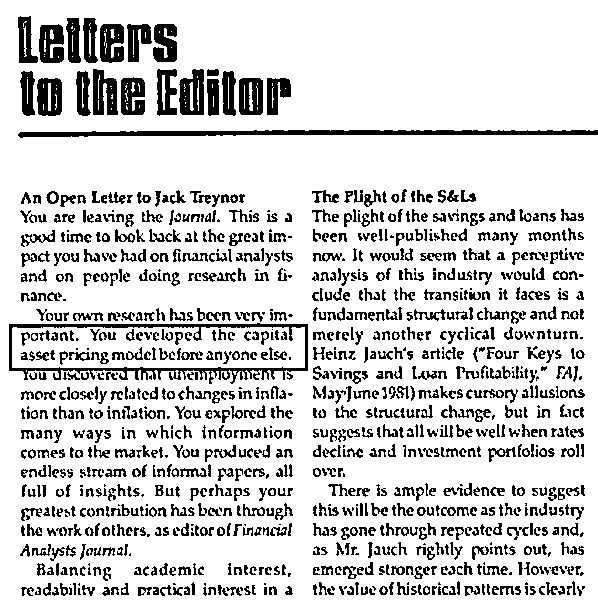
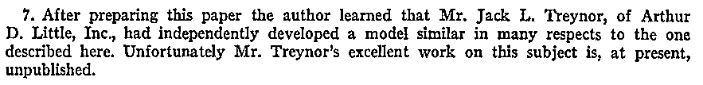
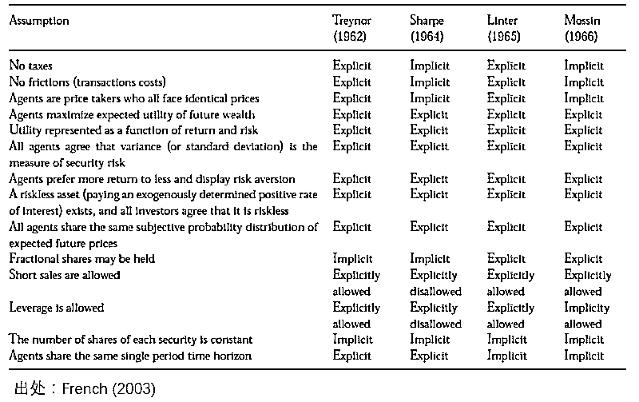
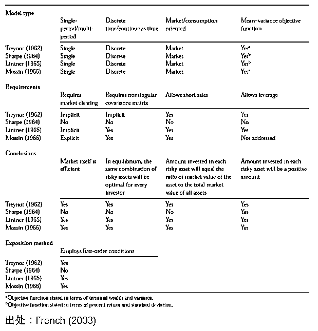
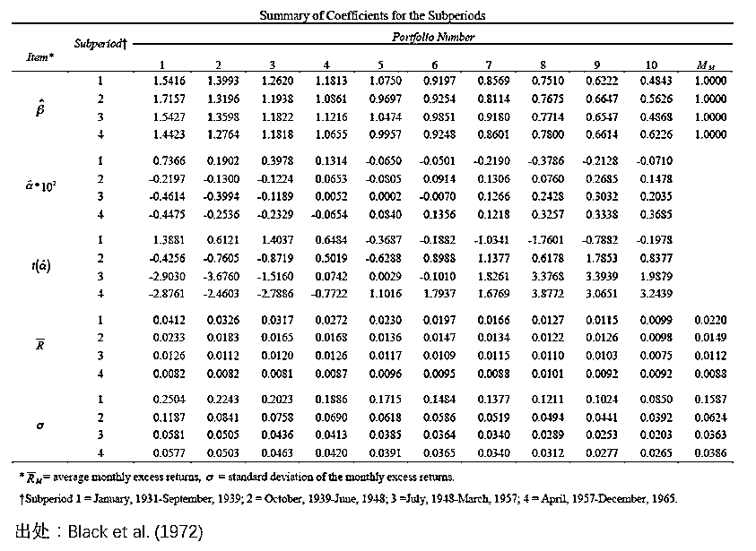
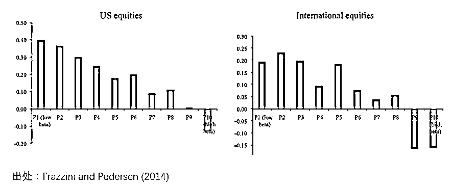
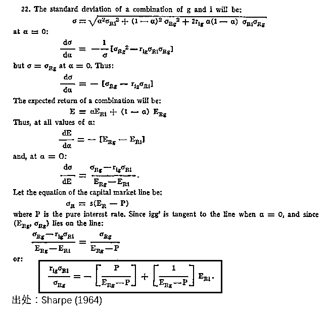

# 【独家研究】CAPM ——你不知道的那些事

> 原文：[`mp.weixin.qq.com/s?__biz=MzAxNTc0Mjg0Mg==&mid=2653288614&idx=1&sn=7bbe84135ecb1ce115a446a7a0c68504&chksm=802e3ab3b759b3a5401bca8e1fef0e20aa5ea6ff7a628dcf71120e651c4cb54c023835652c40&scene=27#wechat_redirect`](http://mp.weixin.qq.com/s?__biz=MzAxNTc0Mjg0Mg==&mid=2653288614&idx=1&sn=7bbe84135ecb1ce115a446a7a0c68504&chksm=802e3ab3b759b3a5401bca8e1fef0e20aa5ea6ff7a628dcf71120e651c4cb54c023835652c40&scene=27#wechat_redirect)

**量化投资与机器学习**

在 QI 的道路上，你不是一个人战斗！

 

****

特别说明：本文首发于 [量化投资与机器学习] 公众号。

摘

要

本文介绍一段 CAPM 的历史。这些前辈、先驱、大咖们创造性的开拓工作，带领我们在理解市场的道路上艰难前行。而他们的努力和贡献，将绝不会被遗忘。荣耀也许会迟到，但不会缺席。

**1**

**迟来的认可**

对于金融领域的从业者来说，Jack Treynor  这个名字一定不陌生。比如，以他名字命名的 Treynor Ratio 是一个和夏普率类似的衡量收益和波动关系的指标（它和夏普率不同之处在于其分母是 β 而非 σ）。考过 CFA 的小伙伴也许对 Treynor 更熟悉一些，因为他曾经是 CFA 旗下期刊 Financial Analysts Journal 的编辑。

然而我们今天谈到 Treynor，并不是因为上述两个原因，而是由于当代金融市场价格理论的支柱 —— **资本资产定价模型（Capital Asset Pricing Model，CAPM）****。**

1981 年，当 Treynor 即将卸任 Financial Analysts Journal 编辑一职的时候（此前他已经为这个期刊奉献了 13 年），Fischer Black 在当期的 Letters to the Editor 专栏中撰写了一封写给 Treynor 的公开信，感激他的巨大贡献，并指出**“你是第一个发明 CAPM 的人”****。**

我不知道 Treynor 看到这个评价时作何感想，也许他心如止水，因为在他眼中追求认知市场远比赢得名声重要。但在我们这些作为后人的凡夫俗子看来，这是对 Treynor 巨大贡献的一种肯定。 

下面我们就来看看是什么让 Fischer Black 得出了上述结论。

**2**

**四个发明者**

关于 CAPM 的发明者，Wikipedia 上的说明如下：

“

*The CAPM was introduced by Jack Treynor, William F. Sharpe, John Lintner and Jan Mossin independently.*

”

对于绝大多数像你、我一样的读者，谈到 CAPM，恐怕条件反射直接想到的只有 William Sharpe（毕竟他太出名，而且也因此获得了诺贝尔奖）。真正深耕金融领域的小伙伴可能除了 Sharpe 之外会知道 Lintner 和 Mossin（尤其应该知道 Lintner，因为他推导 CAPM 的出发点和 Sharpe 不同）。但是由于 Treynor 太低调，恐怕很少有人知道他也是 CAPM 的发明者之一（事实上，他应该是最早的发明者，但是他早期的论述并没有公开发表）。下面我们就来重温这段历史。本节的介绍参考了 French (2003) 以及 Sullivan (2006)。

**2.1 Jack Treynor**

在 CAPM 被提出之前，人们对于风险（risk）如何影响一个公司的资本成本（cost of capital，或者 discount rate）、进而如何影响收益并没有清晰的认识。1958 年，Modigliani 和 Miller 提出了著名的 MM 定理（Modigliani and Miller 1958），它也称为**资本结构无关原理**。该定理认为，在不考虑税，破产成本，信息不对称并且假设在有效市场里面，企业价值不会因为企业融资方式改变而改变。这个定理让如何量化风险对于贴现率的影响更加扑朔迷离，这也直接促成了 Treynor 的研究。

Treynor 于 1953 年到 1955 年在哈佛大学攻读 MBA 学位。毕业后他就职于 Arthur D. Little。1958 年夏天，在他休假时读到了 Modigliani and Miller (1958) 这篇论文，这引发了他的思考，并在三周休假内完成了一篇 44 页的文稿。这篇文稿的题目是 Market Value, Time, and Risk。在随后的两年里，他对这篇文稿进行了改进，这便是 Treynor 版的 CAPM 的雏形（Treynor 1961）。

1960 年，Treynor 将他的论文发给了哈佛大学的 John Lintner —— 这是他当时唯一认识的经济学家。然而 Lintner 并没有给 Treynor 太多回应（而 Lintner 自己于几年后也提出了 CAPM，玄妙吧）。机缘巧合，Treynor 的一个朋友在没有告知他的前提下把他的论文发给了 Merton Miller，而 Miller 又把它发给了 Franco Modigliani。Modigliani 读了之后建议 Treynor 到麻省理工学院攻读经济学。Treynor 后续在 Modigliani 的主张下，把他最早的论文分成了两部分，第一部名为 Toward a Theory of Market Value of Risky Asset（Treynor 1962），这便是最终 Treynor 版本的 CAPM，可惜它到了 1999 年才被公开出版、呈现在世人面前。

**2.2 William Sharpe**

Sharpe 在即将开始他博士学习时迎来了人生的重要节点。他在 RAND Corporation（兰德公司）出任经济学家并同时攻读博士学位。在那里，他遇到了一个对其产生重大影响的人 —— Harry Markowitz。用 Sharpe 自己的话说“My debt to him [Markowitz] is truly enormous”。

继续介绍 Sharpe 的 CAPM 之前，让我们“插播”两句 Markowitz 的工作。1952 年，Markowitz 在他著名的文章 Portfolio Selection 中提出了投资组合理论（Markowitz 1952，1959）。Portfolio Selection 对 CAPM 的诞生影响深远。在提出投资组合理论后，Markowitz 尝试提出一种简化模型来实现 portfolio selection。这是因为在他的 mean-variance 框架中，协方差矩阵需要估计的参数太多，实操起来可行性有限。Markowitz 希望把它简化成一个**“单因子”模型**来考察风险和收益之间的关系，而 Sharpe 的研究动机正源于此。下面让我们回到 Sharpe。

在 RAND，Markowitz 提议 Sharpe 研究的课题正是 Portfolio Analysis based on a Simplified Model of the Relationships among Securities。虽然 Markowitz 并不在 Sharpe 的论文委员会，但是他对 Sharpe 的指导不亚于他的导师。1961 年，Sharpe 答辩通过获得博士学位，而在他论文的最后一章正是 Sharpe 提出的 CAPM。**Sharpe 和 Treynor 在同时期（1960 前后）、互相独立的提出了各自的 CAPM。考虑到 Treynor 最初的工作于 1958 年完成，他应该比 Sharpe 还要早一些。**

Sharpe 和 Treynor 彼此是知道对方也在同时进行 CAPM 的研究，而给他们牵线搭桥的人正是 Modigliani。Modigliani 建议他们双方交换论文，这使他们有机会认识到对方的研究。在 Sharpe (1964) 提出 CAPM 这篇文章的脚注 7 中，Sharpe 对 Treynor 的工作进行了认可，也对于 Treynor 没有公开发表他的成果感到惋惜（至于 Treynor 为什么不发表，留到本文结尾揭晓）：

Sharpe 于 1961 年提出 CAPM，之后几经抛光打磨，把文章投给了 Journal of Finance。然而，他的第一次提交被拒了，原因是一个审稿人认为他的第二个假设（所有投资人对于资产 —— 预期收益率，标准差，协方差这些 —— 持有相同的看法）的限制太强，因此文章的结论“uninteresting”。幸运的是，后来该期刊换了一个编辑，使得 Sharpe 的 CAPM 于 1964 年问世。

**2.3 John Lintner**

Lintner 的早期研究兴趣是 Corporate finance。他提出 CAPM 的动机也是源于 Modigliani 和 Miller 的论文（Mehrling 2005）。他认为 MM 的分析是有问题的，并试图通过找到风险资产的定价理论来说明存在最优的资本结构。Lintner 于 1965 年提出 CAPM（Linter 1965a, 1965b）。

前面提到，Treynor 曾在 1961 年将自己的文稿送给 Lintner 评论，但是没有得到太多反馈。我们这里不能不负责任的猜疑 Lintner 是否借鉴了 Treynor 的想法。Mehrling (2005) 对于 Lintner 独立提出 CAPM 这个观点从一定程度上做了背书。公允的说，比较四个最早的 CAPM，Lintner 的文章在数学上最为严谨，他给出了很多证明，并且讨论了很多特殊的情况。在这些情况下，他的模型都是成立的。

有意思的是，在提出 CAPM 之后，Lintner 将他自己的模型和当时已经发表的 Sharpe 的模型进行了比较，并指出他们的模型并不相同，而且他的模型适用性更强。在一段时间内，Sharpe 似乎被说服了，并承认 Lintner 的模型确实优于自己的。然而 Fama (1968) 指出“仔细检查发现，二者的 CAPM 模型是等价的”。

**2.4 Jan Mossin**

Mossin 于 1966 年发表了他的 CAPM 论文（Mossin 1966）。Mossin 从 1962 年开始于卡耐基梅隆大学攻读博士学位。在他的博士论文中有一章就是其 CAPM 模型的雏形。Mossin 及时的意识到了这个发现的重要性，因此先于其博士论文完成两年就发表了他的 CAPM（他的博士论文于 1968 年通过）。

和 Sharpe 一样，Mossin 研究的出发点也源自投资组合理论。但是，在他的研究中是否借鉴了 Sharpe 的工作我们不得而知。在 Mossin (1966) 中，对 Sharpe (1964) 进行了“批评”，认为其没有精确的阐述均衡条件的定义。

在最初的那段四个 CAPM 模型相继被提出的岁月里，由于不同论文中使用的数学符号大相径庭，人们很难意识到他们之间的等价性（**需要非常细致的检查者四篇论文中繁杂的数学符号，才能找到关键方程之间的等价性**）。直到 1970 年，Stone (1970) 才说明了 Mossin 的模型和其他三个的等价性。

虽然在数学上等价，但是这四篇论文揭示了不同的视角（Sullivan 2006）：Treynor 受到 MM 理论的影响，因此他的着眼点是 MM 定理中的命题一：企业的资本结构和它的价值无关。Linter 的研究更关注通过发行股票融资的公司，并认为公司的财务政策非常重要。Sharpe 则毫无疑问受到了 Markowitz 工作的影响，他研究的出发点是最优化投资组合选择。同样，Mossin 的工作也来自投资组合理论，但是他关注的重点是刻画资产市场的均衡条件。

French (2003) 从假设和结论这些角度对这四个模型进行了更加细致的对比（见下面两图）。感兴趣的小伙伴可以进一步阅读。

从上面历史的复原中可以看到，**Treynor 应该是第一个提出 CAPM 的人。**

**3**

**Fischer Black 的改进版 CAPM**

Treynor、Sharpe、Lintner 和 Mossin 这四位先驱的杰出工作奠定了资本资产定价研究的基础。在 CAPM 被提出之后，在这领域的研究如雨后春笋般层出不穷，从单因子，到双因子、三因子，乃至多因子。大量的后续研究放松了 CAPM 中的一些假设，使得模型更加切合实际、更合理的解释风险和收益之间的关系。在这些非凡的工作中，我想在本文中简单提一下 Black et al. (1972) 这篇。

Black et al. (1972) 观察到，实际的市场数据证明，真实的股票收益率和它们的  β  画出来的资本市场线（SML）远比 CAPM 预测的要更平缓，这说明风险和收益的关系不能非常很好的满足 CAPM。Black et al. (1972) 从时间序列回归和截面回归两个维度实证了上述猜想。

例如，Black et al. (1972) 按照股票的 β 大小把股票分成十组（第一组中 β 最大），然后在时序上回归（检验时考虑了各种偏差和误差的影响），得到了如下结果。按照 CAPM，线性回归的截距项（即 α）应该为 0，**然而 Black et al. (1972) 观察到在很多历史时期，α 显著不为 0，且和 β 呈负相关** —— β 大于 1 的股票，α 倾向于是负的。

观察到实际数据和 CAPM 之间的背离，Black et al. (1972) 抛弃了 CAPM 中存在无风险利率这个假设并提出了一个双因子模型：

上式中没有所谓的无风险收益率，因此小写字母 r 表示股票或者组合的绝对收益。由于第二个因子 r_z 和 β 有关，因此它被称为 β 因子，而 r_z 代表着一个 β 中性的组合的收益率。这是因为 r_z 和 r_m 的协方差为零。这个改进的 CAPM 模型又称为 **Black CAPM 模型（或 zero-beta CAPM 模型）**，它比最初的 CAPM 更加符合实际数据，因此应用更加广泛。

在 Black CAPM 被提出的 40 年之后，Frazzini and Pedersen (2014) 从另外的角度解释了 α 和 β 的关系。**他们指出在实际投资中，不同的投资者受到不同资金使用的限制****。**在这种背景下，为了追求更高的收益，一些投资者（特别是机构）会把有限的资金投资于高风险的投资品，比如高 β 的股票，这便造成了它们超额收益（α）的下降。作者用 ψ 来表示资金限制强弱程度，并得出 α 和 β 的关系如下：

Frazzini and Pedersen (2014) 在不同的市场中（包括股票、商品、债券、外汇）实证了他们的模型。下图显示了在美国股票和全球股票市场中，按照 β 的高低将股票分成十档，每一档的超额收益（超额收益是总收益减去一些常见因子能够解释的部分）。他们针对这个现象提出了 Betting Against Beta 策略、构建投资组合、赚取其他因子无法解释的超额收益。

在 CAPM 出现之前，人们不了解风险和预期收益之前的关系。而 CAPM 说明，不是所有的风险都能带来回报 —— 只有那些无法通过多样化而消除的系统性（市场）风险才能带来回报。从最早的 CAPM，再到 Black zero-beta CAPM，再到上面的这个 betting against beta。举这个例子是想说明**无数学者前赴后继的投身于理解市场真谛的努力中，让我们逐渐看清什么是正确的****。**

最后，我想以 Perold (2014) 的总结作为本小节的收尾：

“

*资本资产定价模型对我们理解资产价格决定因素至关重要。CAPM 告诉我们，多样化投资者对资产的所有权降低了资产的预期回报、提高了它们的价格。此外，持有非多样化投资组合的投资者则很有可能持有了无法获得回报的风险。由于该模型的结果 —— 尽管它的经验表现喜忧参半 —— 我们现在对预期回报与风险之间的关系有了不同的看法；我们对投资者应如何分配其投资组合有了不同的看法；我们对业绩计量和资本预算等问题有了不同的看法。*

”

**4**

**结语**

我在本文第一节中曾写到“在他 [Treynor] 眼中追求认知市场远比赢得名声重要”。我之所以有如此想法是因为 Treynor 在回忆为什么不发表他的 CAPM 模型时曾说（Sullivan 2006）：

“

*I thought that if Sharpe was going to publish, what’s the point of my publishing my paper?*

*译：我想既然 Sharpe 要发表（它的模型），那么我发表我的意义何在呢？*

”

低调！还有比这更低调的吗？

其实 Sharpe 也很低调（他和 Tyernor 在当初都没有充分意识到 CAPM 的重要性）。Fama (1968) 就指出，在 Sharpe (1964) 中，Sharpe 将最重要的结论放在了**脚注** 22 中（下图，圈出来的式子就是 CAPM，左侧是 β 的定义）。

1990 年，Sharpe 和 Markowitz 以及 Miller 一起获得诺贝尔经济学奖。Sharpe 获奖的原因正是 CAPM。稍显遗憾的是 Lintner 和 Mossin 分别于 1983 年和 1987 年去世，因此无缘此殊荣。而 Treynor 无缘获奖更令人唏嘘 —— 由于他没有公开发表研究成果，他对资产定价所做的贡献一直没有走进大众的视野。

在学术研究中，学术引用通常按照“达尔文主义”来演进。新生代学者几乎很少引用他们的学术前辈不曾引用的那些古老文献。在资产定价领域，早期的重要学者 Lintner、Mossin、Fama 以及 Merton 都或多或少的忽视了 Treynor 的研究。因此后来的学者往往都不知道 Treynor 对 CAPM 的重大贡献。

但我想 Treynor 的努力和贡献，绝不会被遗忘。荣耀也许会迟到，但不会缺席，正如本文开篇提到的那篇 Fischer Black 写给 Treynor 的信一样。但也许 Treynor 早已看淡了这些。在提出 CAPM 之后，他持续地为探究金融市场的真谛做出巨大的贡献。其研究涉及金融、投资中的广泛领域，包括风险、业绩衡量、微观和宏观经济学、交易、会计、投资价值、积极管理、养老金等；他的很多论文发表于 Harvard Business Review，Financial Analysts Journal，Journal of Portfolio Management，Journal of Finance，Journal of Business 以及 Journal of Accounting Research 等高水平期刊。

2007，国际金融工程师协会将 Treynor 选为年度 IAFE/SungARD 金融工程师，以表彰他对金融理论和实践的卓越贡献，尤其是资本资产定价模型。Treynor 于 2016 年 5 月 11 日逝世，享年 86 岁。他留下的无数智慧结晶将源源不竭的造福后人。

**参考文献**

Black, F. (1981). An Open Letter to Jack Treynor. *Financial Analysts Journal*, July/August. Letters to the Editor, 14.

Black, F., M. C. Jensen and M. Scholes (1972). The Capital Asset Pricing Model: Some Empirical Tests. In *Studies in the Theory of Capital Markets*. M. C. Jensen (editor), New York: Praeger, 79 – 121.

Fama, E. (1968). Risk, Return, and Equilibrium: Some Clarifying Comments. *Journal of Finance*, Vol. 23, 29 – 40.

Frazzini, A. and L. H. Pedersen (2014). Betting against beta. *Journal of Financial Economics*, Vol. 111, 1 – 25.

French, C. W. (2003). The Treynor Capital Asset Pricing Model. *Journal of Investment Management*, Vol. 1(2), 60 – 72.

Lintner, J. (1965a). The Valuation of Risk Assets and the Selection of Risky Investments in Stock Portfolios and Capital Budgets. *The Review of Economics and Statistics*, Vol. 47, 13 – 37.

Lintner, J. (1965b). Securities Prices, Risk, and Maximal Gains from Diversification. *Journal of Finance*, Vol. 20(4), 587 – 615.

Markowitz, H. (1952). Portfolio Selection. *Journal of Finance*, Vol. 12, 71 – 91.

Markowitz, H. (1959). *Portfolio Selection: Efficient Diversification of Investments.* New York: John Wiley & Sons.

Mehrling, P. (2005). *Fischer Black and the Revolutionary Idea of Finance.* Hoboken: John Wiley & Sons.

Modigliani, F. and M. Miller (1958). The Cost of Capital, Corporation Finance, and the Theory of Investment. *American Economic Review*, Vol. 48(3), 261 – 297.

Mossin, J. (1966). Equilibrium in a Capital Asset Market. *Econometrica*, Vol. 34(4), 768 – 783.

Perold, A. F. (2004). The Capital Asset Pricing Model. *Journal of Economic Perspectives*, Vol. 18(3), 3 – 24.

Sharpe, W. F. (1964). Capital Asset Prices: A Theory of Market Equilibrium Under Conditions of Risk. *Journal of Finance*, Vol. 19(3), 425 – 442.

Stone, B. K. (1970). *Risk, Return, and Equilibrium: A General Single-Period Theory of Asset Selection and Capital Market Equilibrium.* Cambridge: MIT Press.

Sullivan, E. J. (2006). *A Brief History of the Capital Asset Pricing Model.* APUBEF Proceedings.

Treynor, J. L. (1961). Market Value, Time, and Risk. Unpublished manuscript. “Rough Draft” dated 8/8/61, #95-209.

Treynor, J. L. (1962). Toward a Theory of Market Value of Risky Assets. Unpublished manuscript. “Rough Draft” dated by Treynor to the fall of 1962\. A final version was published in 1999, in *Asset Pricing and Portfolio Performance.* R. A. Korajczyk (editor), London: Risk Books, 15 – 22.

**知识在于分享**

**在量化投资的道路上**

**你不是一个人在战斗**