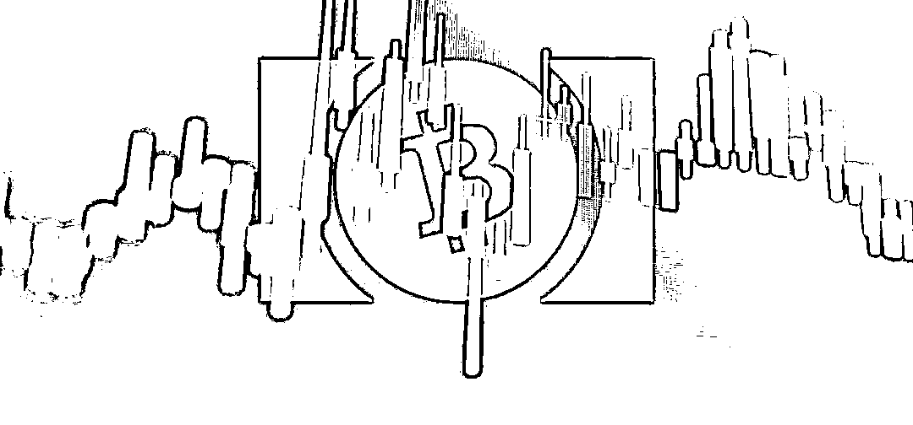
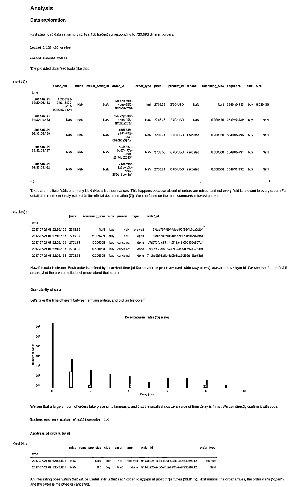
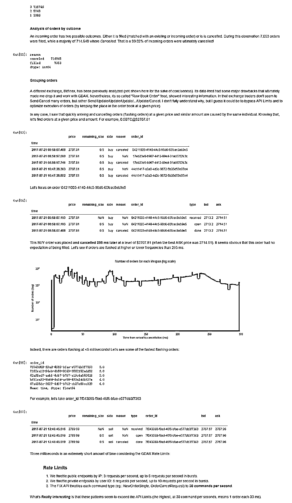
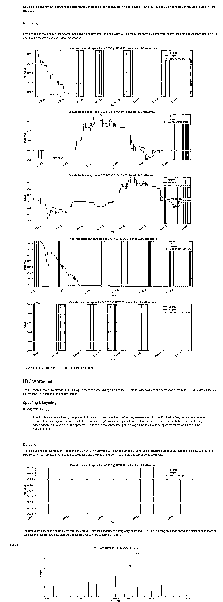
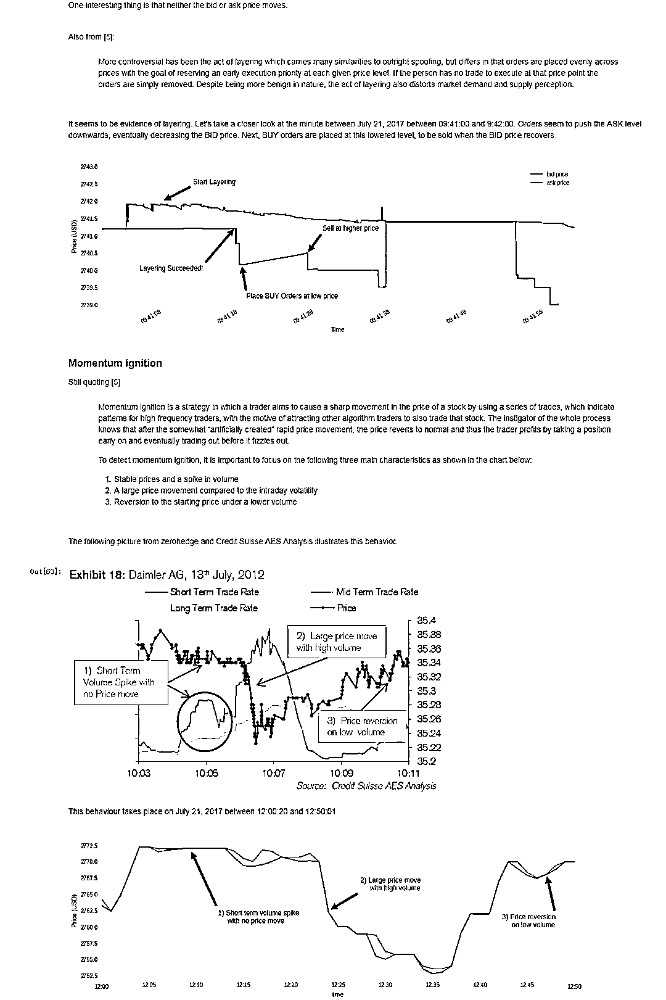
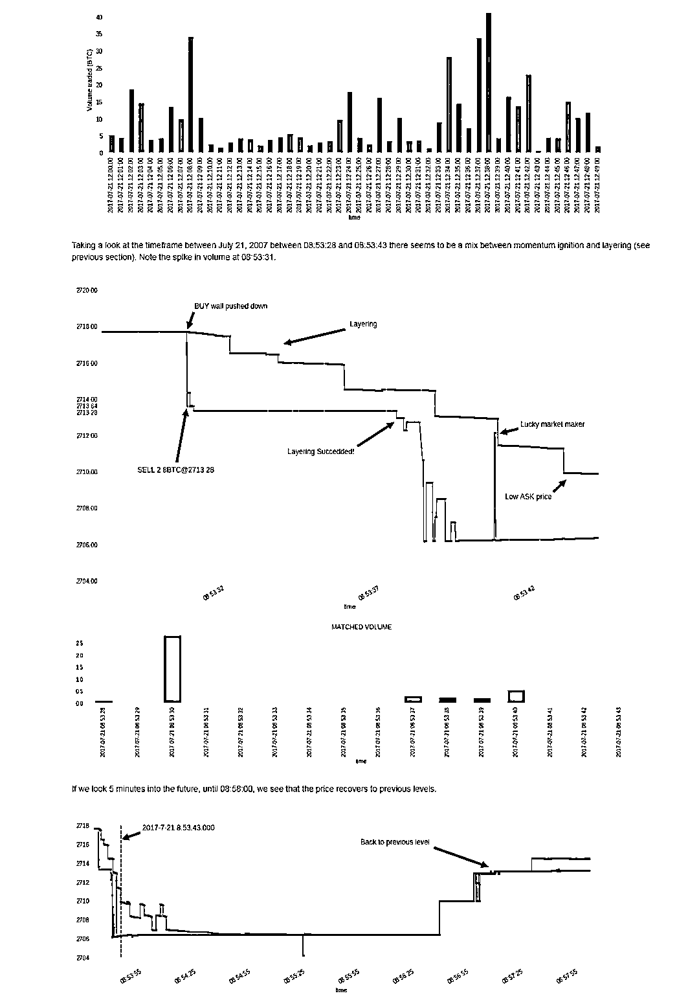

# 【深入研究】比特币高频交易策略（项目+代码）

> 原文：[`mp.weixin.qq.com/s?__biz=MzAxNTc0Mjg0Mg==&mid=2653288600&idx=1&sn=5d168ee620f1c91537807e34098acafc&chksm=802e3a8db759b39bd9693443519b98b92bbe6a94cb1b8204381633912eb59a3621f1c5af1ed4&scene=27#wechat_redirect`](http://mp.weixin.qq.com/s?__biz=MzAxNTc0Mjg0Mg==&mid=2653288600&idx=1&sn=5d168ee620f1c91537807e34098acafc&chksm=802e3a8db759b39bd9693443519b98b92bbe6a94cb1b8204381633912eb59a3621f1c5af1ed4&scene=27#wechat_redirect)

**公众号**近期**文章预告**

 1、红宝书读书笔记（中文版）

[*2、量化金融面试 Q&A 系列（中文版）*](https://mp.weixin.qq.com/s?__biz=MzAxNTc0Mjg0Mg==&mid=2653288556&idx=1&sn=38c68fea3a8be7edc68af9a70e5a9416&chksm=802e3a79b759b36fdb830f5e94ed0cf0258cc96e635d7e782334a0b65eb65de227d027afcd0e&scene=21#wechat_redirect)

**3、比特币高频交易策略**

[*4、高频交易策略解决方案基于机器学习*](https://mp.weixin.qq.com/s?__biz=MzAxNTc0Mjg0Mg==&mid=2653288278&idx=1&sn=73c6749fa89384391031c78a55768681&chksm=802e3543b759bc55fdaa974ac1d5a3c7a0a6ea11a272030dcb989978a96db6f2be8e5a0902cc&scene=21#wechat_redirect)

[*5、高频交易基于强化学习*](https://mp.weixin.qq.com/s?__biz=MzAxNTc0Mjg0Mg==&mid=2653288292&idx=1&sn=322bcd5400b339616e480775cce98bdf&chksm=802e3571b759bc6739d7fe48366a02f59f9e58a07360ac089b1e17b6350c4fd0ef4b8d735a7d&scene=21#wechat_redirect)

[*6、高频价格动态策略*](https://mp.weixin.qq.com/s?__biz=MzAxNTc0Mjg0Mg==&mid=2653288413&idx=1&sn=cddb1fbdefbcbd470e539bc030be28df&chksm=802e35c8b759bcdeeb836bfebaec2dc72570273b4ee4f39ee46137bff6798bcb5e392701e247&scene=21#wechat_redirect)

7、模式识别下的人工智能量化策略

[*8、近期最热门的券商金工研报分享*](https://mp.weixin.qq.com/s?__biz=MzAxNTc0Mjg0Mg==&mid=2653288446&idx=1&sn=9c9eff76734dc2a9f1b046eb9184704a&chksm=802e35ebb759bcfdf5843d5b0892c8c2142e15a62454e31846fd979c215ae56ebab2a717cefa&scene=21#wechat_redirect)

9、深度学习在金融中的论述

10、海内外优秀量化文献解读

[*11、**基于风险中性的深度学习选股策略*](https://mp.weixin.qq.com/s?__biz=MzAxNTc0Mjg0Mg==&mid=2653288319&idx=1&sn=e2be2ffda6b8c63f46a966790e8147ad&chksm=802e356ab759bc7c9a607ffb2145a020b454b2a97dac956684d484d5ed8bba5b09770d049dab&scene=21#wechat_redirect)

12、资产配置系列（二）

[*13、券商研报解读系列*](https://mp.weixin.qq.com/s?__biz=MzAxNTc0Mjg0Mg==&mid=2653288484&idx=1&sn=c79dd635c89ba4db546df535c4c81715&chksm=802e3a31b759b327d31d12f506526c3081cf49f8297d824809d79f3f45c37110e9f9ab218c26&scene=21#wechat_redirect)

14、人工智能应用量化系列

作者：Eduardo Pena Vina

今天为大家分享一篇比特币高频交易的文章，以项目形展示，附有代码，大家可以从文末进行下载。

在这篇文章中，分析了比特币交易所中高频交易一些问题。 由于迄今为止这个市场极不受管制，因此这种行为几乎没有任何限制。 文章展示了超过 99％的订单是如何填补的，而不是扭曲市场的看法。 此外，文章还尝试发现常见的 HFT 策略，例如 Quote Spoofing, Layering 和 Momentum ignition。 鉴于这些交换的匿名性质，最后的这些结果在某种程度上都是主观的。

This analysis has been carried out with order data from the Websocket stream from GDAX, a US based digital asset exchange owned by Coinbase. It is one of the largest markets (over 42 MM USD/day) and it exposes a high performance socket where all orders are broadcasted. In addition, it offers some interesting features for data analysis:

> 1、Orders are timestamped (as opposed to Bitfinex, for example)
> 
> 2、It has millisecond granularity (again, as opposed to Bitfinex)
> 
> 3、It says whether an order has been matched or canceled -one could argue that disappearing orders far from the bid/ask spread must have been canceled (and it's true), but for orders inside the spread, this information is necessary.

While data has been captured for several days (at the time of this post I'm still capturing data), for the following analysis only data from July 21, 2017has been taken. Mind you, there are still over 2 Million datapoints.

Since the GDAX feed does not explicitly keep information of the current best bid/ask, a little preprocessing is needed. The best bid is the highestprice for currently open BUY orders, while the best ask is the lowest price for open SELL orders. Although this calculation is not complicated nor particularly slow, it's better to append the current best bid/ask as additional columns. No further preprocessing has been carried out.

**代码实现部分**

[1]https://en.wikipedia.org/wiki/Bitfinex

[2] https://www.gdax.com/

[3] Source: https://coinmarketcap.com

[4] http://parasec.net/blog/order-book-visualisation/

[5]  http://www.bsic.it/marketmanipulation/

[6] https://www.theatlantic.com/technology/archive/2010/08/explaining-bizarre-robot-stock-trader-behavior/61028/

[7] https://docs.gdax.com/

来源：https://nbviewer.jupyter.org/github/ghgr/HFT_Bitcoin/blob/master/hftbitcoin.ipynb

**知识在于分享**

**在量化投资的道路上**

**你不是一个人在战斗**