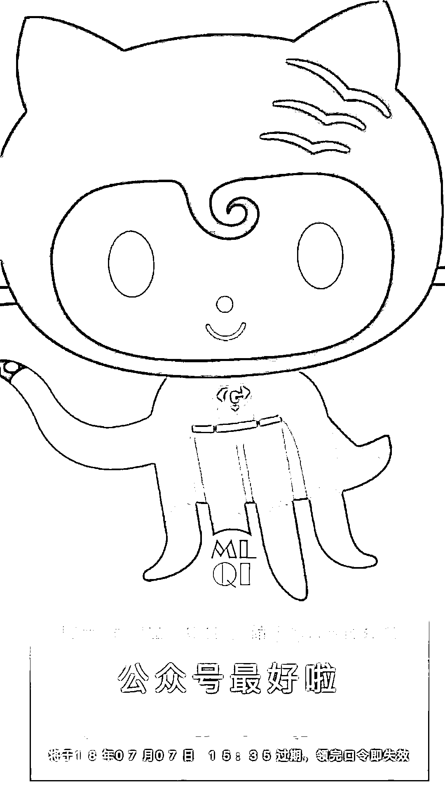
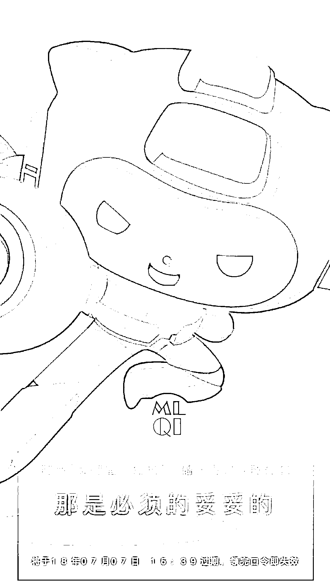
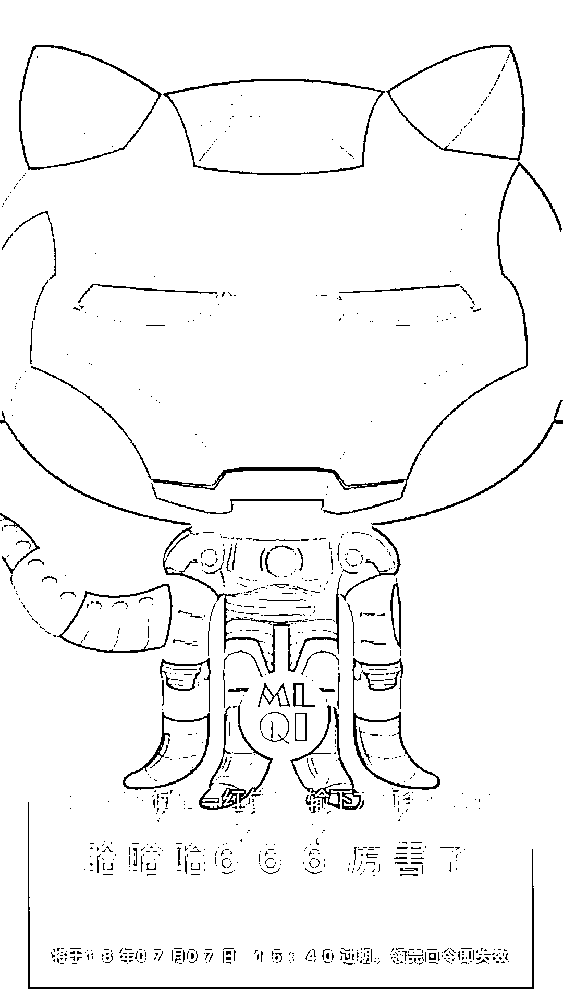

# 我们说了太多的再见，今天就不必了吧！（公众号发红包啦）

> 原文：[`mp.weixin.qq.com/s?__biz=MzAxNTc0Mjg0Mg==&mid=2653288589&idx=1&sn=e9ebfec91478f7e19b18caa99106fa1d&chksm=802e3a98b759b38ecec8eb50179f830e2624917e8661e9bbe0e93859864d65e9883c8476c60c&scene=27#wechat_redirect`](http://mp.weixin.qq.com/s?__biz=MzAxNTc0Mjg0Mg==&mid=2653288589&idx=1&sn=e9ebfec91478f7e19b18caa99106fa1d&chksm=802e3a98b759b38ecec8eb50179f830e2624917e8661e9bbe0e93859864d65e9883c8476c60c&scene=27#wechat_redirect)

31 岁的梅西和 33 岁的 C 罗，在同一天离开了俄罗斯世界杯。

今夜，内马尔要不要和 C 罗梅西一起回家，小编希望不要哈。

引用天下足球的一段话： 

> 没有人能够永远年轻，但每个人又都偏偏都有年轻的时候。
> 
> **我们说了太多的再见，所以，今天就不必了吧**。我们不说再见，哪怕到了理论上这个时代的终结之日。至少现在，它余晖尚在，在下一个时代正式交接之前，我们还来得及静静驻足，去欣赏你们最后的绚烂章节。
> 
> **人最害怕两样东西：一是广袤宇宙里自身的渺小，二是多重维度下时间的跳动。可人又终究无惧这一切，耳鬓间相传的历史，再渺小也能镌刻，光影下堆垒的情感，再跳动，也能永恒。**

**今天让我们预测一下 1/4 决赛哪支球队会晋级吧**

对了

在**文末**领红包吧

公众号发**1000 元**的红包

愿你们这个周末伴随世界杯过得开心

 /mp/newappmsgvote?action=show&__biz=MzAxNTc0Mjg0Mg==&supervoteid=468683631#wechat_redirect 

**今天随便留言**