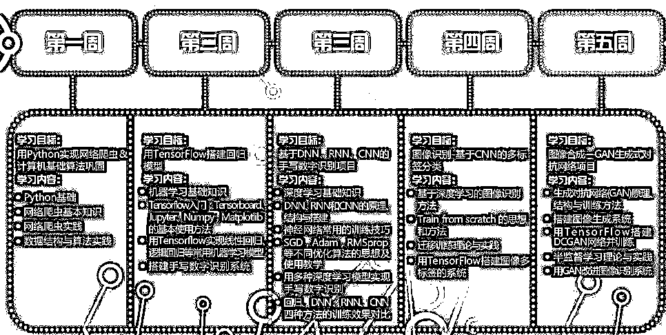
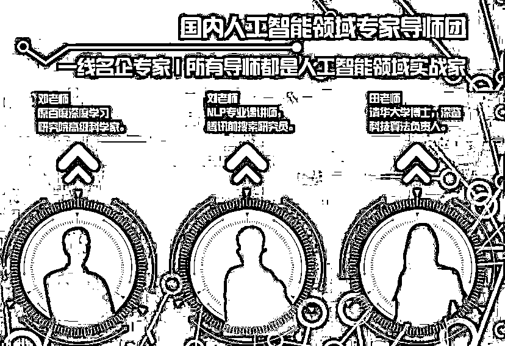
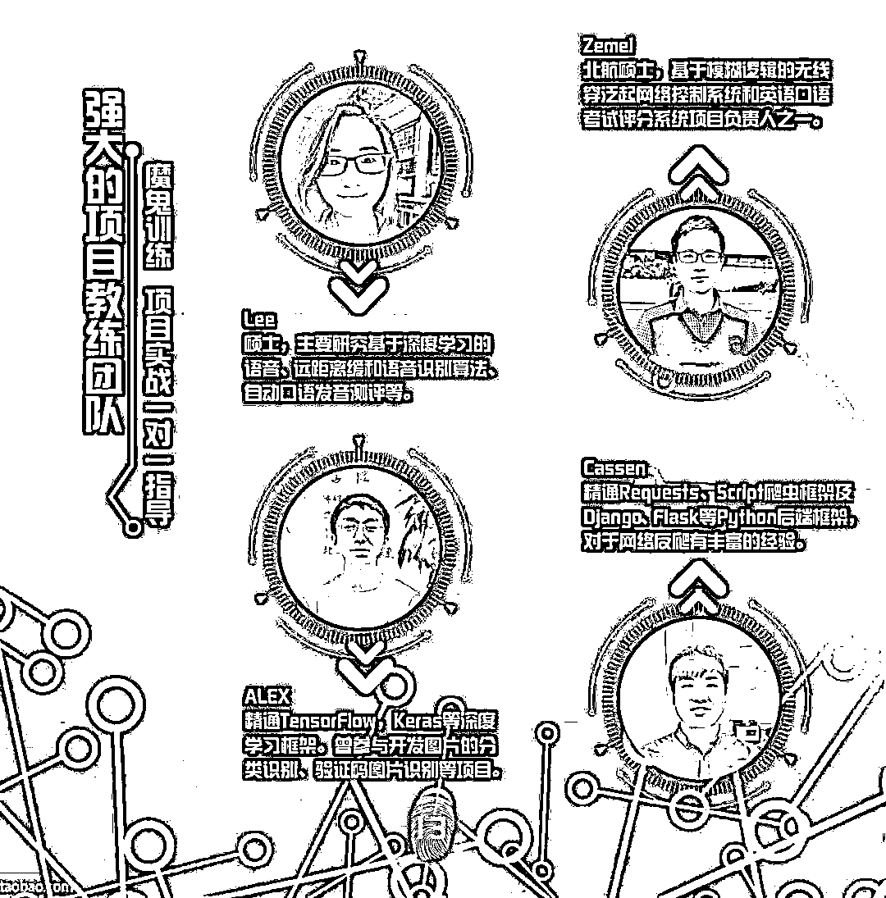
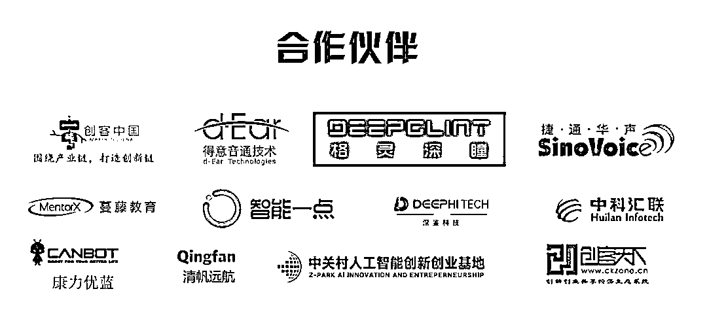
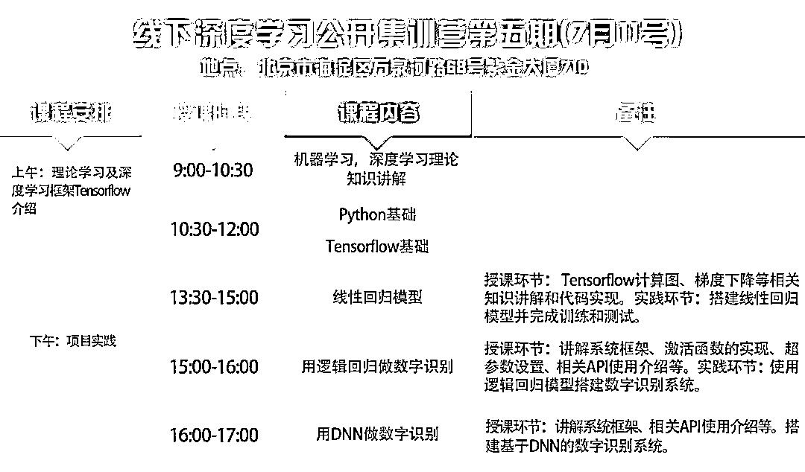

# 揭秘 | 人工智能暑期实习的真相

> 原文：[`mp.weixin.qq.com/s?__biz=MzAxNTc0Mjg0Mg==&mid=2653288579&idx=1&sn=12bf26d51385896ae906259d1f62d82c&chksm=802e3a96b759b3803d782995c8fd309024c6b8d2a7e927ac6593b9885d0ff064cb2ff4525434&scene=27#wechat_redirect`](http://mp.weixin.qq.com/s?__biz=MzAxNTc0Mjg0Mg==&mid=2653288579&idx=1&sn=12bf26d51385896ae906259d1f62d82c&chksm=802e3a96b759b3803d782995c8fd309024c6b8d2a7e927ac6593b9885d0ff064cb2ff4525434&scene=27#wechat_redirect)

女票比我小几岁，还在读研一。她学的是网络工程，但是想转型去搞 AI 算法。

她导师平时很忙，偶尔给她布置点实验，大多数时间都在外地出差，因此也给了她很多自己的时间。她一边上网看视频自学理论知识，一边也通过各种渠道找相关实习。 

眼看着暑期将至，她却一直没找到 AI 算法岗的实习，无奈之下决定去学姐内推的某度的运维岗做实习。

我表示反对：既然目标明确，毕业想做什么岗位就应该找什么岗位的实习，不应该三心二意。

女票却摊手表示：“**我也想找算法岗实习啊，但是核心技术岗招实习生标准都很高，要有相关学术背景与项目经验。我也就看了看西瓜书，题还没咋刷，根本没有企业招我；即使真入职了，如果没人带，我估计我也不知道怎么做。**”

于是，我拉着她开始呱唧呱唧地解释为啥要继续找算法岗。

实习实习，实践中学习。

我们之所以选择在校期间出去实习，就是要去寻找在校内学习不到的——**工作经验**。而在人工智能这个领域，学校开设相关的课程很少，课程培养目标也与企业实际需求相去甚远，所以将来打算从事人工智能这个领域的工作，就更加需要提前实习以增加项目经验、提升行业认知。

那实习为什么一定要找对口岗位呢？

首先，在实习中，同学们能**了解到该岗位实际的工作性质、流程、强度，确认是否符合自己的预期**。比如算法岗加班强度就有点大，我担心女票会接受不了；若亲自去实习的话，就会得到一个立体的感受。

其次，实习**能了解岗位和企业的需求**，真的下定决心从事这行了，就要开展针对性学习，查缺补漏，趁着还在校的时间努力提升自己。

同时，在对口的岗位实习能**积累相关的工作经历，丰富简历，为正式求职增加筹码**。毕竟面试的时候，除了回答题目，也需要有一些能佐证自己工作能力的案例嘛。

大小公司招实习生的标准有何异同？

实习生分两种：**干琐事的苦力**和**核心岗位需要储备的新人**，后者就是传说中的“可转正”。一般来说，小公司的核心岗很少招实习生，因为招了也没人带，如果招了多半就是为转正储备的。

大公司因为分工细化，招实习生又不愿像招正式工那样费精力去匹配岗位，所以干脆一刀切，**看重基础知识是否扎实，执行力如何**。小公司虽然通常被误解为要求没有大公司那么高，但其实小公司人手紧张，需要所有员工能尽可能独立负责一小块工作，因此对核心岗的实习生要求可能会更高。小公司会更关注实习生**解决问题的能力，即：脑子是否灵活**。

但在有一个能力上，大小公司的要求都是相同的，那就是**学习能力**。因为实习生在校内所学与企业实际需求可能差别很大，所以雇主都希望实习生能在占用尽可能少的指导资源的情况下，尽快掌握公司所用的语言、框架、工具等。

不过话说回来，大公司招的干活的“苦力”实习生也不是没有机会转正，大小公司对于优秀的应届生都会尽力挽留。

大小公司做实习生的收益

说完了企业的招人要求，我们也来看看在大小公司做实习生的收益。

在大公司实习好处众多。如**认识很多优秀的小伙伴**啊；有助于求职啊；**了解大公司的工作流程**，毕业后进入角色快啊等。但最大的收获应该是**良好的工作习惯**，因为大公司对于员工的培训和要求都不仅仅限于完成工作，更是工作过程中的记录、分享、总结等工作习惯的训练。好的工作习惯会让与你共事的上下游同事都感到很舒服，工作效率也更高，可以说受益终身。

而在小公司实习也会带来特有的收益。那就是**接****触核心工作早；加速成长；学习东西比较全面**。因为小公司人少事多，业务压力大，需要新人尽可能快地投入战斗，帮忙分担一些工作任务，因此虽然免不了干一些打杂的活儿，但会很快就能参与到核心工作中去。另一方面，由于部门内人也比较少，领导对于实习生的关注度会更高些，不像在大公司，你需要在一大堆清北海归里脱颖而出才会有人关注你的想法。

每年暑假实习大家都十分重视，因为暑期之后就是“金九银十”的秋招季，所以现在还没有找到算法岗的小伙伴们是不是就意味着秋招没有机会成为神圣的“算（调）法（参）工（大）程（法）师”了呢？

答案当然是“**不**”！！

——稳住！你们还有天学网人工智能学院举办的**AI 实战-**深度学习夏令营。****与其去做一个与算法无关的实习，不如来做几个 AI 项目，冲刺秋招算法岗！

本次夏令营旨在通过**5 周 25 天的全日制魔鬼集训**，在行业专家和一线工程师的辅助下，系统地进行算法项目实战，让想从事 AI 算法工程师的小伙伴找到理想的实习岗位！

不仅如此，这只是“AI 菁英人才培养计划”的 A 阶段！在 B 阶段，我们更为大家准备了**三种培养方案**，帮助大家直接面向 AI 算法的正式工作岗发起冲击！

不同于传统培训“填鸭式”的教学，我们采用特色的“学、练、研”三环节的教学方式，辅助大家建立自主学习、主动思考，为职场自我学习培养好习惯！

导师+项目教练，全是在职 AI 工程师与老手：

不仅如此，当你在教室里专心学习的时候，我们的小信使们已经把你的简历送到各大 AI 用人单位的手上啦！甚至很可能，B 阶段的企业实训就直接发生在你想去的公司里面！

看完这些，一颗想成为 AI 工程师的心是不是已经蠢蠢欲动了呢？

夏令营开课时间：7 月 25 日

线下面授，小班教学，名额有限

**前 10 名立减 1000 元，并赠送价值 300 元配套精选书刊**

你以为这样就结束了吗？？？

天学网人工智能学院**深度学习线下公开集训营限时提供****30 个免费名额****，**此次集训营将通过“理论+项目实践”的方式进行。不管你是想转行的在职人员，还是即将毕业的在校生，都是一次难能可贵的机会，都能解决你因没有项目经验、做项目遇到问题没有老师解答等各种烦恼。

**此外，通过这次项目实践不仅能增强你算法能力，让你的简历更加丰富，项目经验+1，增加面试获邀几率。你还将认识 AI 领域的一线大佬，结交志同道合的学习伙伴，拓展人脉！**

满满一天的课程，超级干货，赶紧扫描下二维码添加小天老师，抢占名额

**报名/更多信息咨询  请添加小天老师微信**

点击“阅读原文”，直达官网了解更多课程信息 ！