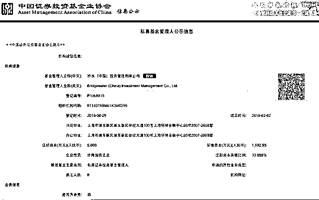
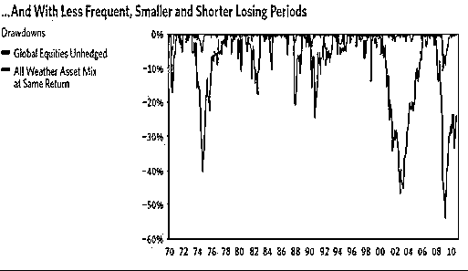

# 就问你怕不怕？世界头号私募桥水基金正式入华割韭菜（附投资策略详解）

> 原文：[`mp.weixin.qq.com/s?__biz=MzAxNTc0Mjg0Mg==&mid=2653288574&idx=1&sn=9f46e51a9ce1c34121a05371eb0dcd20&chksm=802e3a6bb759b37d01c4196357f78692fefc1b68cce77220e3b206993eeff85bfa0f7edb7184&scene=27#wechat_redirect`](http://mp.weixin.qq.com/s?__biz=MzAxNTc0Mjg0Mg==&mid=2653288574&idx=1&sn=9f46e51a9ce1c34121a05371eb0dcd20&chksm=802e3a6bb759b37d01c4196357f78692fefc1b68cce77220e3b206993eeff85bfa0f7edb7184&scene=27#wechat_redirect)

**量化投资与机器学习**

在 QI 的道路上，你不是一个人战斗！

 

点击图片即可

文章来自：Career In 投行 PEVC

根据基金业协会消息，世界头号对冲基金桥水已经完成备案登记，正式成为境内私募管理人。按照私募基金管理人登记备案的相关规定，最迟 6 个月后，桥水基金的境内私募产品将发行。桥水基金（Bridgewater）目前是 iShares MSCI 新兴市场 ETF 最大的机构投资者，桥水基金已成为超越索罗斯，绝对规模盈利最多的基金。

前海开源基金管理有限公司执行总经理杨德龙今日发表了对此事的看法。他称，**中国资本市场扩大开放，外资纷纷进来找机会了，国内很多资金却在不断离场，可惜又被外资抄了大底！**

如是金融研究院院长、首席经济学家管清友有不同看法，**“桥水基金成为境内私募基金管理人，这是金融业开放的一个重要事件，有利于改善业内生态，吸引海外资金投资者投资 A 股，也有利于倒逼国内资本市场改革。中国资本市场真的需要一次彻底的制度基础设施改革了。 ”**

**桥水对冲基金公司成立于 1975 年，创始人叫 Ray Dalio。上世纪 90 年代，公司把总部从纽约搬到了现在的康乃迪克州。**

来自美国权威机构 Institutional Investor's Alpha 的 2017 年全球前百对冲基金榜单 （Hedge Fund 100）指出，桥水基金为全球第一大对冲基金。

**Top100 名单如下（部分基金公司排名并列）**

不像一般的对冲基金公司，Bridgewater 不为富人管理资产，**它的服务对象主要是机构投资者，其客户包括养老基金、捐赠基金、国外的政府以及中央银行等。**现在，它有超过 270 家机构客户，一半在美国，一半在海外。

Bridgewater 公司是多种创新投资策略的先锋者，如货币管理外包、分离 Alpha 和 Beta 策略、绝对收益产品以及风险平价等。2000-2005 年期间，Bridgewater 成为了资产增长速度最快的基金管理公司。在 2005 年，由于资产规模的限制，Dalio 决定暂停接收新的投资者。过去的 10 年里，公司的管理资产以每年 25%的速率增长，公司员工数量也足足比 2000 年增长了 11 倍。现在，公司管理着大约 1200 亿美元的资产以及拥有 1200 名员工。Bridgewater 的”日常观察”（Daily Observation）已经成为全世界各大中央银行高管以及养老基金经理的必读内容。

Bridgewater 对冲基金的投资历史主要分为两大阶段。

**第一个阶段（1975-1990）是以投资顾问的身份开展咨询业务；**

**第二个阶段（1991 至今）是开发各种投资策略与投资工具在世界范围内进行投资。**

**一、桥水内部总览**

**第一个阶段（1975-1990）：咨询与资金管理**

1975 年 Ray Dalio 成立 Bridgewater 时，公司只从事两种业务，**一种是为机构投资者提供咨询服务，另一种是国内外货币和利率风险的管理业务。**之后，公司改变了其战略，开始向政府以及像麦当劳这种大型企业销售经济咨询报告。

在 20 世纪 80 年代初期，公司开始发行付费的调查报告—“日常观察”（Daily Observation）。这份报告得到了很多大型公司以及银行的青睐。

**1987 年，公司获得了第一笔投资基金——世界银行 50 亿美元的固定收益投资。**在 20 世纪 80 年代中期，公司把其业务重心放在了机构投资者的债券和货币管理。1990 年，公开开始正式为其客户提供货币管理外包产品。

**第二个阶段（1991 至今）：创新投资策略**

在 20 世纪 90 年代，Bridgewater 公司开发了多种创新投资工具，如通货膨胀联动债券、货币管理外包、新兴市场债务、全球债券以及超长期债券。

在 1991 年，Bridgewater 公司建立了自己的旗舰基金——“绝对阿尔法（Pure Alpha）”，这个基金在 2000-2003 年的市场低迷期表现十分出色。1992 年公司引进了环球债券风险投资项目。

1995 年，公司发行了“全天候（All Weather）”对冲基金，并且于 1996 年开创性地运用风险平价技术去管理投资组合。

2006 年，公司的旗舰基金“绝对阿尔法”为了保持其投资策略以及增强容量限制，它开始返还部分资金给其投资者。同时，Bridgewater 开始让其投资者可以自由选择不同的投资策略（如绝对阿尔法基金和全天候基金），改变了其传统的投资组合模式。

仅仅在过去的 5 年时间里，Bridgewater 就已经获得了多达 22 项的行业荣誉，被公认为业界领先的资产管理公司以及行业先锋。在 2010 和 2011 年，Bridgewater 已经连续两年成为了世界上规模最大和业绩最好的的对冲基金公司。

**1.1 公司员工**

Bridgewater 公司的员工数量从 2003 年的 100 人增长到 2011 年的 1200 人。公司愿意雇佣应届毕业生作为它的分析师，这在对冲行业里面是不多见的。**耶鲁大学、哈佛大学、普林斯顿大学等美国常青藤学校源源不断地为 Bridgewater 公司提供优秀的应届毕业生。**

Bridgewater 的创始人在 2011 年的 7 月份辞去了 CEO 的职位，在公司担任“导师”的职责。公司有 3 位 CEO：Greg Jensen、Eileen Murray 和 David McCormick，以及 3 位投资总监：Dalio、Bob Prince 和 Jensen。

在 Bridgewater 公司，任何人的贡献都能得到一种合乎逻辑与原则的评价，而不是凭当权者的好恶。

公司员工都要求做到以下几点：

1、为自己工作而不是为别人而工作；

2、能独立提出最优的解决方案来达到自己的目标；

3、找最有经验最有能力的人去挑战自己的想法和方案以发现不足；

4、保持谦虚，善于“无知”；

5、用现实检验自己决策的结果，并努力思考如何得到提高。

可是根据报道，Bridgewater 每年有将近 30%的离职率，这对于一个大型的对冲基金来说是很不正常的。很多离职的员工都反映，由于任何事情都无法挽回，并且不能在背后谈论其他员工，Bridgewater 公司是一个很难工作下去的地方，很容易令人丧失斗志。但 Bridgewater 公司则反对这一说法，它认为离职的员工都会喜欢说公司的坏话而不是谈论好的一面。

**1.2 公司文化**

**在 Bridgewater 公司，最重要的目标是追求卓越、准确无误和持续改进。**他们相信追求卓越需要在工作和人际交往时遵循一定的准则。他们希望找出什么是准确的事情，以及如何才能以最优的方案解决这件事情。

**Bridgewater 非常注重独立思考以及创新，因为独立思考可以带来思想的碰撞，而创新则需要不断犯错误。**为了推动这种思考和创新的文化氛围，他们营造了一种彻底开放的工作环境。在 Bridgewater 公司里，每个人都有权利和义务去保证工作出色完成，因此，公司鼓励每位员工时刻保持自信和谦虚的态度去寻找最优的工作路径。

**争论和错误在公司是非常必要的，因为它们是持续学习的动力，能最大化激发员工的潜能。**公司要求员工经常做出直言不讳的反馈，包括召开“刨根问底”会议，讨论员工没能完成任务的原因，但是绝对不允许员工私底下说长道短。同时，每当出现问题，员工都必须在所谓的“问题日志”里写一份备忘录。公司实行全透明的管理模式，任何会议都需要录音，并且对所有员工开放。

这种独特的文化，使人能够充分发挥作用，让公司员工得以出色地完成任务，并与同事以及顾客维持着良好的关系。

**1.3 公司管理准则**

Bridgewater 创始人 Dalio 认为，清晰的工作准则以及价值观有助于员工更好地设立目标、识别和诊断问题、提出解决方案以及增强员工的执行力。因此，Dalio 根据自己的生活经验建立一套非常完善公司管理准则，主要包括以下三个方面：如何营造理想的公司文化，如何培养出色的人才以及如何有效处理问题。

图 1：Bridgewater 公司管理准则描述图

 

**1.3.1 营造理想的公司文化**

**（1） 营造开放的透明的文化。**每个人都必须有开放的态度和宽阔的胸怀，愿意接受别人的正面批评。但决不允许欺诈和私下的说长道短。

**（2） 营造从错误中学习的文化氛围，鼓励犯错误。**不要为犯了错误而感到羞愧，任何人都有犯错误的时刻。学会从错误中总结，从错误中得到自我反馈。注重实现目标的结果，而不是注重过程的准确无误。

**（3） 营造信息同步的文化氛围。**一致同步意味着需要明晰什么是正确的事情，如何正确处理事情。争论对于解决信息不同步至关重要，争论不意味着全盘接受，每个员工都要知道什么时候停止争论从而为如何解决问题达成一致。

**1.3.2 寻找并培养优秀的人才**

**（1） 匹配不同的员工到不同的责任方，责任关联的员工之间需要拥有相似的价值观。**员工需要清楚谁是为自己的目标、产出以及整个工作流程负责的。

**（2） 承认员工之间的差异，因才施用。**公司需要仔细考虑员工的不同价值观、能力以及专业技术，把公司的期望以及职位的需求与员工的能力相匹配。不要忽视这些个体差异，要最大化利用这些差异为公司服务。

**（3） 招聘合适的员工，否则代价会非常大。**在招聘前，公司得明确需要怎样的人，个人的价值观以及综合能力要比专业技术更加重要。公司需要寻找善于问问题的员工，寻找可以可以长期共同工作的员工，以及那些有闪光点异于别人的员工。

**（4） 懂得如何做好管理。**这要求管理者不断地比较实际产出和目标的差距，找出问题所在的根源，并学会用宏观的角度去看问题。不要通过给予命令来控制员工，当需要做出改变或者决策时，去聆听员工的反馈。当员工无法完成任务时，不要告诉员工具体怎样做，而是要帮助他们识别问题的原因，以及问题所带来的与预设目标的偏移。

**（5） 正确地评价别人，而不是善意地评价。**公司必须认识到当大部分员工都喜欢恭维而不是批评时，没有什么比正面的批评更有价值了。公司应该给员工提供持续、清晰和客观的反馈评价，并鼓励员工对这些评价进行讨论。但需要注意的是，对别人评价时，不要对自己的评价过于自信，也不要对其他人的评价不屑一顾。

**（6） 以经验培训和测试员工。**在员工培训的过程中，公司要持续提供反馈，帮助员工以正确的方法、以明确的目标学习。培训的目的不是授之以鱼，而是授之以渔。

**（7） 当发现员工不适合此份工作，把他从原来的岗位调离，或者直接辞退。**要知道，员工处于不适合自己的位置要比被解雇更加糟糕。

**1.3.3 有效处理问题**

**（1） 需要懂得如何有效地发现问题。**善于发现问题是有效管理的第一步，也是持续改进的源动力。不要忍受任何的不完善，主动去做出改变，并且任何时候都要具体化所发现的问题。

**（2） 识别问题的症结所在。**通常需要经过对人和产品设计方面识别，找出问题的根源所在。识别问题对于过程管理以及质量管理都非常重要。识别问题需要问以下几点：问题带来了什么不良影响？谁要对这次的问题负责任？理想状态下工作的产出是怎样的？实际发生的与理想预期的差别在哪里？是设计方面的问题吗？为什么这样处理问题？这样处理的结果会是怎样？应该由谁如何处理这个问题？

**（3） 让事情重新回到正确的轨道。**在继续向前推进时，需要回顾一下以往的工作，通过识别哪些地方在正确地运作，哪些地方出现问题，就会发现哪些地方需要改进。

**（4） 改进“机器”，去实现目标。**在行动前，必须进行详尽的思考，花时间去做出详细的改进计划。

**二、投资策略和投资理念**

**2.1 公司投资策略**

Bridgewater 公司运用的投资策略主要是全球宏观策略。全球宏观策略是根据全球经济指标的变动对股票、货币、利率以及商品市场的价格波动的影响进行杠杆押注，来尝试获得尽可能高的正投资收益。基金经理运用各种投资技术，包括人为决策和系统决策，结合从上往下和从下往上宗旨，数理或者基本面分析，长短持有期结合。

**●全球宏观策略根据操作的积极性分主动型和保守型策略。**

主动交易策略是指评估历史和现在的价格，用一些技术面，基本面和量化市场数据捕捉短暂存在几秒钟或几天的交易机会。基于动量、均值回复、价差套利进行交易，特点是换手周期短、交易资产种类多、地域广、常运用杠杆。此策略经常运用融资、期货和期权，活跃于各个市场板块，包括股票，固定收益，外汇和大宗商品资产，通常在投资地域上很分散。此策略强调对信息做出迅速反应，从市场的波动中获得 alpha。

保守型策略则倾向于采取零杠杆，多使用非衍生工具，仓位调整频率不高且有规律（如在每个月中或月底），通过把握全球经济周期的规律来追求中长线的投资机会。

**●全球宏观策略按照资产间相对定价分定向型和相对价值型交易。**

定向型交易指经理们对一种资产的离散价格的波动情况下注，进一步分为宏观大宗商品策略和货币主观策略。其中，宏观大宗商品策略包括农业策略，能源策略以及金属策略。

相对价值型交易，指通过同时持有不同国家或市场的一对类似资产的多头和空头，以期利用相对定价偏差来盈利。

**2.2 公司投资理念**

在全球宏观策略下，Bridgewater 公司的主要投资理念主要有以下三种：Alpha 和 Beta 的分离投资、系统风险高度分散化以及“D 过程”（D-Process）。

**2.2.1 Alpha 和 Beta 分离投资**

Alpha 和 Beta 分离的投资策略最开始是由 Dalio 在 1990 年引进的，然后在 2000 年初逐渐被各大基金经理认可。**Bridgewater 公司是第一个运用 Alpha 和 Beta 分离的投资策略的对冲基金，并且为这两个投资模式各自设立了相应的投资基金：Pure Alpha 对冲基金和 All Weather 对冲基金。**

Beta 是衡量投资组合与市场整体表现的一个相关性指标。Beta 投资的收益和风险几乎完全与市场的整体表现一致，并且投资产品的成本小、流动性高。这类投资主要集中在被动型的收益产品，如指数基金、固定收益产品等。通过 beta 投资，投资者可以以高流动性以及高透明度获得市场收益率，同时只需要承担比较小的风险和费用。

**Alpha 投资是一种主动型的投资方式，目的是形成与市场相关性低的超额收益回报。**Alpha 指标刻画了主动投资所带来的超额收益的大小，高的 Alpha 值反映了该资产（或组合）与市场相比有较高的超额收益，同时表示一个积极的基金经理有较好的投资管理能力。这类投资主要集中在包括私募股权基金、商品基金、期货基金等。通过 Alpha 投资，可以寻求一些难以发现的、对投资技巧要求很高的超额收益项目。

Bridgewater 公司认为传统投资组合中，股票的风险过大，组合收益对股票市场的表现过于敏感。它通过各种金融衍生品，如期货、期权和互换等，把 Beta 和 Alpha 的收益分离开，同时通过大范围的分散投资，大大缩小投资的风险。在这个投资理念下，Bridgewater 公司设计了一个叫“Alpha Overlay”的策略。

传统的投资组合与 Alpha 和 Beta 分离的投资策略比较如图 2 和图 3 所示所示。

图 2 以图表的形式显示了传统的投资策略与 Alpha 和 Beta 分离策略下的区别。可以看到，分离策略下，内部的 Beta 收益是稳定且低风险的，而外部 Alpha 策略则可以通过投资其他的高风险产品获得超额收益。

图 3 以公式的形式显示了传统的投资策略与 Alpha 和 Beta 分离策略下的区别并总结了 Alpha 和 Beta 投资的主要区别。

图 2 传统投资组合与 Alpha/Beta 分离策略图表对比

图 3 传统投资组合与 Alpha/Beta 分离策略公式对比

**2.2.2 系统风险分散化**

Bridgewater 通过利用出色的投资系统，结合传统的风险分散工具，在全世界进行投资项目的量化搜索，投资于相关性小的投资品种，从而大大降低了其投资组合的系统风险。

在建立 Beta 收益的投资组合中，通过运用杠杆，提高低风险资产的风险和收益或者降低高风险资产的风险和收益，大大分散市场风险，如图 4 所示。

图 5 显示了系统风险分散化后，典型的投资组合和 Beta 分散化组合的风险和收益比较。可以看到，在收益相同的情况下，beta 分散化组合的风险更低；在风险相同的情况下，beta 分散化组合的收益更高。

图 4 典型的投资组合与 Beta 分散化组合的比较

图 5 典型的投资组合与 Beta 分散化组合的风险收益比较

同样，建立 Alpha 收益组合是通过分散投资于大量相关性很低的资产，从而无论在任何经济环境下都可以获得稳定的 alpha 收益流。图 6 和图 7 显示了大量的分散投资，可以获得更高的超额收益。

图 6 分散 Alpha 投资的结构优势

图 7 Alpha Overlay 投资组合与其他投资组合的收益率比较

**2.2.3 D 过程（D-Process）**

Ray Dalio 认为，世界经济不断在经历长时期的债务周期，并且这是一个自我强化的过程。简单来说，任何经济体都会经历这样一个周期：大众借钱融资，债务相对于收入快速上升，意味着债务清偿相对于收入也在快速上升。在顶峰时期，大家都是以足够高的价格借钱购买资产，收入和现金流开始无法满足偿债的需求。于是人们开始进行减少债务等一些反向操作。Dalio 称这个债务增加和减少的过程叫“D-Process”。

Dalio 认真研究了美国大萧条等一些极端经济现象，他发现极端超额借债的结果都会是一次剧烈的影响范围极广的市场调整，直到经济环境回到常态。因此，正是深刻认识到“D-Process”的普遍性，Bridgewater 公司经常能够通过准确预测市场的走势，赚取惊人的收益。

**三、公司产品分析**

Bridgewater 公司为其机构客户提供了 3 种不同的对冲基金，其中包括一个以积极性的投资为特点的基金-----绝对阿尔法（Pure Alpha），一个以限制性积极型的专注于绝对阿尔法投资市场的子市场的投资基金----绝对阿尔法主要市场（Pure Alpha Major Markets）,以及一个以资产分配为主要策略的对冲基金---全气候（All Weather）。除此之外，公司还出版了一个名叫 daily observation 的日常刊物，供全世界的投资者付费阅览。

**3.1 绝对阿尔法（Pure Alpha）对冲基金**

**3.1.1 Pure Alpha 介绍**

绝对阿尔法(pure alpha)对冲基金是在 1989 年建立的，这个对冲基金投资于多个品种资产，希望获得市场超额收益的同时承受更低的风险。“可携阿尔法”策略（Portable alpha）和“阿尔法覆盖”策略（Alpha overlay）是绝对阿尔法（pure alpha）对冲基金的主要两个投资原则。绝对阿尔法通过积极的资产管理技术在一系列的不相关资产里分散投资风险。它拥有 30 或者 40 个同时交易的债券、货币、股指和大宗商品头寸，以避免投资于单一市场所造成的价格大幅度波动。

在绝对阿尔法（pure alpha）投资策略下，Bridgewater 公司以波动性为标准建立了两个不同的对冲基金：Bridgewater Pure Alpha I------12%的波动率以及 100 亿美元的管理资产，和 Bridgewater Pure Alpha II,18%的目标波动率和 230 亿美元的管理资产。

**3.1.2 Pure Alpha 对冲基金收益分析**

从成立以来，绝对阿尔法对冲基金只在 3 个年度遭遇亏损，但亏损的额度均不超过 2%。在过去 20 年的时间里，绝对阿尔法对冲基金获得了接近 15%的年收益。

如图 8 所示，在 1992 年 1 月到 2011 年 11 月这个期间，Bridgewater Pure Alpha II 的年化收益率为 14.44%，年化标准差为 14.6%

图 8 20 年期风险收益分析

从图 9 可以看出，在过去的 20 年时间里，Bridgewater Pure Alpha II 的累积收益为标准普尔指数的 3 倍。

图中有两个地方需要特别注意的：

**Bridgewater Pure Alpha II 的累计收益超过标准普尔指数仅仅是在最近的一个十年，特别是在 2002 年 4 月之后。**

**Bridgewater Pure Alpha II 在 2008 年秋季后，绝对及相对累计收益都出现了加速上升的趋势。**

图 9 累积收益对比

**3.1.3 Pure Alpha 对冲基金策略----最优阿尔法组合**

Pure Alpha 的主要的投资策略是建立最优的阿尔法组合-----一个资产足够分散的投资组合，组合里各资产种类的相关性很小甚至不相关，从而在不同经济环境下 Alpha 收益能保持稳定。

建立最优的阿尔法组合最流行策略是可携阿尔法策略（portable alpha），或者叫阿尔法覆盖（alpha overlay）。

**可携阿尔法（Portable Alpha）是指零市场风险（贝塔为 0）的投资组合的收益。它与市场表现以及运行方向是完全独立的，由基金经理的投资能力和技巧所决定。**可携阿尔法（Portable Alpha）是通过运用像期权、互换或者期货等金融衍生工具对市场风险进行对冲所得到的。在这种策略下，Alpha 收益与 Beta 收益是完全分离的。

下面，将举例简单说明如何运用可携阿尔法投资策略获益。

假如一个客户需要保持其在大盘股投资比例（如 36%）的同时，增加所获得的收益，我们将通过给投资组合增加小盘股的阿尔法收益帮助其达到目的。小盘股的投资资金可以通过降低大盘股的资产比例（从 36%降到 26%）获得，假设这 10%的资产等于 1000000 元。

具体的投资步骤如下：

步骤一：投资经理把 50000 元存到保证金账户，利用杠杆可以买价值 1000000 元的股指期货，这意味着剩下 950000 进行小盘股的投资；

步骤二： 投资经理购买 1000000 元的标准普尔 500 指数期货，使顾客在大盘股的投资比例重新回到 36%。

步骤三：投资经理用 950000 元购买精选的小盘股股票（与小盘股指数的贝塔值为 1），而这些精选的股票收益可以打败小盘股指数的收益；

步骤四：投资经理卖空价值 950000 元的小盘股股指期货来对冲小盘股市场风险；

以上的投资结果是顾客保持了其固有的 36%的大盘股投资比例（初始的 26%加上后来的 10%道琼斯 500 指数期货），并且可以获得小盘股的可携阿尔法收益。（如图 10 所示）

图 11 和图 12 分别显示了 portable alpha 投资策略在牛市和熊市时的表现。

图 10 Portable Alpha 策略叙述图

图 11 牛市中可携阿尔法策略获利过程

图 12 熊市中可携阿尔法策略获利过程

通常，基金经理会去建立一个高度分散化的 Alpha 投资组合。图 13 显示了低分散化 Alpha 投资组合和高分散化组合在信息比率（衡量超额风险所带来的超额收益）方面的区别。可以看到，虽然两个组合的每种资产的信息比率相同，但是组合 2 整体的信息比率足足是组合 1 的 2.5 倍，可见大量分散化后的 Alpha 投资组合更优。**因此，通过选择高 Alpha 收益的资产，并且建立大量分散化投资组合，就可以建立一个更优的风险调整阿尔法组合。**

图 13 最优阿尔法组合的构造

图 14 Pure Alpha 最近成功投资事件

**3.2 全天候对冲基金（The All Weather Fund）**

**3.2.1 All Weather 对冲基金介绍**

1996 年，Bridgewater 建立了其第二个对冲基金：全天候对冲基金（the ALL Weather Fund）。这个名字意味着无论在什么市场环境下，这个基金都可以收获较高的风险调整收益。正如 Pure Alpha 对冲基金是建立最优的 alpha 组合，All Weather 对冲基金是通过建立最优的 beta 资产组合，来获得更高的市场收益。

不同于 Pure Alpha，All Weather 对冲基金强调低投资费用，资产组合集中在全球的通货联动型债券以及全球固定收益产品。其目标是获得超过市场收益的更高的风险调整收益。在 2011 年，All Weather 对冲基金已经拥有 460 亿美元的资产，成为了美国最大的基金之一。

**All Weather 对冲基金的核心理念之一是风险平价。Bridgewater 也是第一个运用风险平价概念进行投资的资产管理公司。**通过资产配置，对低风险资产运用更高的杠杆，对高风险资产运用低杠杆，使得投资组合里所有资产的预期收益和风险都接近相同。这种资产配置的方法，可以形成一个更优的收益风险比率，因为分散化投资降低的风险要比杠杆运用增加的风险要多。

**3.2.2 All Weather 对冲基金收益分析**

自 1996 年以来，All Weather 对冲基金经历了股票市场的牛熊市，两次大的经济衰退，一次房地产泡沫，两次扩张和紧缩时期，一次全球金融危机以及这之间市场无数次的波动起伏。在这各种不同的经济环境下，All Weather 对冲基金的投资组合的夏普比率超过了 0.6 的期望值，在名义目标风险 10%下，它表现明显好于股票、债券以及传统的资产组合。

自发行以来，All Weather 基金获得了 9.5%的年收益率，比大部分机构投资组合收益率的高将近 50%。另外，它通过风险平价策略，把风险有效地降低了 25%。

下面分别从 4 个不同的角度去衡量 All Weather 对冲基金的收益。

第一个是在累积收益相同的情况下比较 All Weather 对冲基金投资组合与股票市场的风险；

第二个是在风险相同的情况下，比较累计收益的大小；

第三个是从亏损的时间和幅度角度去对比；

第四个是针对其某一系列来具体分析收益。

图 14 给出了截止到 2011 年末，在累积收益相同的情况下，All Weather 投资组合与股票市场组合的风险对比。All Weather 对冲基金的投资组合收益率的波动一直不大，在获得了与股票市场相同的累积收益时，其风险仅仅是股票市场风险的三分之一。

图 15 给出了在相同的风险情况下，All Weather 的投资组合与股票市场的累积收益对比。All Weather 投资组合每年的收益（蓝线）比同期股票市场的收益（红线）平均高出 300-400 个基点。

图 16 以水位线的形式，对比了 All Weather 与股票市场的亏损表现。All Weather 对冲基金的投资组合亏损的时间比股票市场更加短，频率更低，亏损的幅度更小。

图 14 All Weather 投资组合风险对比

图 15 All Weather 投资组合收益对比

图 16 All Weather 水位线分析

 

下面，将以具体的地区——澳大利亚为例，分析 All Weather 对冲基金的盈利情况。

图 17 显示了 All Weather 基金澳大利亚系列的累积收益率（蓝线）和每个时期的绝对收益率。可以看出，自澳大利亚系列自 2009 年 7 月以来，其每个月的收益率都为正，并且月收益率在 2010 年 4 月到 2011 年 7 月期间达到顶峰。

图 18 以表格形式列出了 All Weather 基金澳大利亚系列的年累积收益和年离散收益。除了 2008 年金融危机期间，All Weather 的年收益率都在 13%以上，去年更获得超过 23%的高收益率。

图 17 All Weather 基金澳大利亚系列收益率

图 18 All Weather 基金澳大利亚系列的年累积收益和年离散收益

**3.2.3 All Weather 投资策略——最优贝塔组合**

All Weather 的核心投资原则是风险平价，而与这种理念相对应的便是构建最优的贝塔组合的投资策略。风险评价是指平衡多种收益资产的风险暴露以在未来任何环境下都可以获得稳定的回报。

Ray Dalio 运用风险平价投资原则是因为他发现传统的平衡资产配置有一个非常严重的问题——传统的投资组合方法是通过忍受很高的短期风险（集中投资于股票）来获得高的长期回报。例如 60%的股票和 40%的债券，表面上看，这样的资产配置已经平衡了，但是，其实从风险的角度看，这样一种资产配置是极度不平衡的-----有将近 90%的风险来自股票，而债券投资带来的风险只占 10%。如果短期的风险高度集中在一种类型的资产，那么就很容易带来低长期回报的巨大风险，从而威胁到未来的偿债能力。这是因为如果环境变化造成了市场的长时期低迷，每种资产的收益都会收到非常大的影响，因此集中持有股票的长期风险对于投资者而言将非常巨大。**因此，这些传统的投资组合由于十分依赖股票的表现来实现其预期收益，它们将受制于股票市场的波动（贝塔），这与平衡资产配置的初衷是相悖的。**

为了履行风险评价的投资理念并构建最优贝塔组合，通常需要以下两个步骤：

**第一，通过使用杠杆降低或者增加资产的风险水平使每个资产都拥有相近的预期收益和风险。**借款购买更多的低风险（低贝塔）、低收益资产，如债券，使其具有与股票类似的风险和收益水平。同时（如果有必要），通过去杠杆化降低高风险（高贝塔）收益的投资品种（如股票），降低其风险和预期收益水平。因此，这样就形成了具有相近预期收益和风险，但不同经济相关性的投资收益流。

**第二，从以上的投资收益流中选出投资组合，使其在任何经济环境下都不会与预期收益出现偏差。**这主要是通过持有类似风险水平的投资组合，并且组合里的资产会在以下情形之一表现得很好：通货膨胀；通货紧缩；经济增长；经济下滑。

**如图 19 和图 20 所示，通过杠杆化和去杠杆化，并从中挑选相关性小的资产，构建出“最优贝塔组合”（图 14 左上方蓝点）。**可以看出，相对于传统投资组合，最优贝塔组合在具有相同风险的同时，其收益率更高；而对于单个运用杠杆后的投资资产，最优贝塔组合的风险更小。

图 19 多种资产的预期收益和风险水平

图 20 传统组合与杠杆化后分散组合的风险收益对比

**3.2.4 All Weather 事件回顾——08 年金融危机**

一直以来，All Weather 的投资策略都受到大众的怀疑：杠杆作用所产生的风险会比资产分散化所降低的风险大；不稳定的相关性会产生无法预测的风险。这种怀疑的声音直到最近 2008 年的金融危机才销声匿迹-----All Weather 的杠杆策略和资产相关性经受住了这次严重的危机。

如图 21 所示，All Weather 的资产组合的表现如预期般出色。相对于其他几乎所有的资产组合和投资策略，All Weather 的资产组合有更低的风险和更高的投资回报。自金融危机发生以来，All Weather 的资产组合（蓝线）获得了将近 19%的收益，而同期的传统资产组合（绿线）则亏损了 6%。

图 21 经济危机后 All Weather 资产组合的表现

针对在这次金融危机的突出收益，Bridgewater 公司给出了它的解释：

**第一，杠杆所增加的风险要远远比资产分散化所降低的风险小。**首先，因为杠杆式用来增加低风险资产的波动性，而这部分杠杆化的低风险资产相对于没有杠杆会形成更好的风险分散化。其次，All Weather 不会使用太多的杠杆-----只会运用 2 倍杠杆，远远低于美国银行所运用的 10 倍杠杆。而且，杠杆是运用在一系列高流动性的资产，这部分资产在价格下降的时候可以很容易重新配置或者进行清算。

**第二，不正确的资产相关性假设不会运用在制定资产权重的过程中，因为它们的相关性是不稳定。**相反，Bridgewater 制定资产组合权重是以经济环境变化对资产价格的影响为基础的，同时，保证资产组合的风险在所有环境中，特别是在经济增长和通货膨胀发生变化的时候，都能相互抵消。

**知识在于分享**

**在量化投资的道路上**

**你不是一个人在战斗**