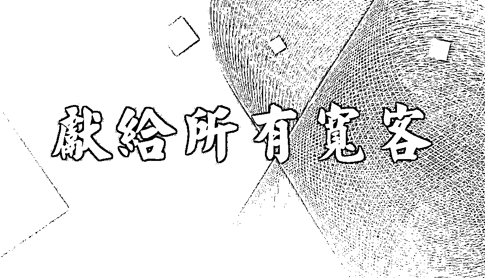

# 【量化成长之路】——高手，从不拔刀，只见刀光剑影！

> 原文：[`mp.weixin.qq.com/s?__biz=MzAxNTc0Mjg0Mg==&mid=2653288568&idx=1&sn=9e6bd1e236ebf55465f8c17baae69f62&chksm=802e3a6db759b37bca0b80a172afc5e5946137a6678029dbb4ef0c6d511107174c6adeb736d9&scene=27#wechat_redirect`](http://mp.weixin.qq.com/s?__biz=MzAxNTc0Mjg0Mg==&mid=2653288568&idx=1&sn=9e6bd1e236ebf55465f8c17baae69f62&chksm=802e3a6db759b37bca0b80a172afc5e5946137a6678029dbb4ef0c6d511107174c6adeb736d9&scene=27#wechat_redirect)

**量化投资与机器学习**

在 QI 的道路上，你不是一个人战斗！

 

****

****「更多的人，都是俗人一个」****

**穷，是怎样一种体验？知乎上的答案总是带点小扎心，戳着本来就神经大条的敏感。**

*   **“每次准备从背后抓弄我的朋友，总能提前被发现，可能是被穷得叮当响的声音出卖了”**

*   **“大概就是天天大保健和大宝天天见的区别吧”**

*   **“看着别人的人生开挂，深度怀疑自己人生是出了 bug 的”**

*   **“微信都不给我推送广告”（哦，微信有广告？！）**

**隐形贫困人口也成了自嘲热词，事实上这正反映了大多数年轻人的生活现状：在精致的路上十八般武艺全上阵，在午夜摸着空空如也的口袋。毕竟，在如今的资本市场里，资本的门槛是倾向于有钱人的，财富似乎只掌握在少数人手里。富人玩着资本游戏，钱滚钱。穷人用六位数守着不能被戳穿的存款。**

**普通人到了一定年龄，婚姻、房子、家人、孩子、欲望慢慢纳入做决定前的考虑范围之内，对金钱的追逐时刻不敢放松。“二十弱冠、三十而立、四十不惑、五十而知天命。”或许，惑的前半生都带些许经济的压力吧。**

**都想过上如诗般的生活，但更多的人还是成了“俗人”一个。**

**也罢，逐利，本身也并不是件羞耻的事。**

****「脱不了俗，那就一俗到底吧」****

**“如何变得有钱？”这真是一个俗得令人感兴趣的问题。为什么许多人都渴望财富自由，却过着忙碌而略显贫穷的生活？为什么勤勉工作，依旧没有摆脱经济窘境？**

****

**于是，开始有人试图做一些“投资尝试”。 但，结果似乎总是不尽人意。**

**最近，世界杯频繁爆冷。熬夜看球的真假球迷们纷纷排队相约天台。**

**大 A 股股民喊话赌球的兄弟天台让一让，这里有波人想插个队。**

**所以，总有人善意提醒：赌球/炒股不要买，别墅靠着海。**

**但是，这并不等于说我们要放弃理财，而是告诉我们，理财或许该用更**聪明**的方法了。**

****「高手，从不拔刀」****

**投资是有输有赢的博弈，未必人人熟悉，但玩过扑克牌的人就多了，看似简单的输赢游戏，不光要和一个或多个竞争对手斗智斗勇，还要和最少 13 个数字、4 种花色构成的无数排列组合打交道。可以说玩扑克是一种简单的量化投资竞赛。从 21 点、桥牌到德州扑克，玩家凑一块投入时间和大大小小的筹码，换来各式各样的愉悦满足。**

**游戏的背后，隐藏着某些智慧。赌桌上也逐渐演化出宽客。**

**2018 年 2 月，《2018 胡润全球富豪榜》发布，87 岁的股神巴菲特排在第二位，作为一名投资人，巴菲特的成功无人能及，同样在全球富豪榜单中，另一位投资人格外引人注目，他就是“量化投资之王”詹姆斯·西蒙斯，财富越过 200 亿美元，在福布斯全球富豪榜上位居第 52 位。**

**量化投资是指通过数量化方式及计算机程序化发出买卖指令，以获取稳定收益为目的的交易方式。说人话，就是通过**算法来帮你赚**钱，去掉主观操作的同时还能帮你节省大量的时间，减少失误的可能，做出合理的行为。**

**可以说，这是一门科学+艺术的活了。**

**如今量化投资的方法在海外的发展已有 30 多年的历史，投资业绩稳定，市场规模和份额不断扩大、得到了越来越多投资者认可。但是真正的量化投资在国内兴起是在 2014 年，到目前为止仅 4 年时间，在国内研究的人还比较少。想要做好量化投资，需要高素质的人才。**

**面对国内庞大的量化投资市场需求，量化人才，一直是投资机构的必争之地。**

****「高手，都是数字间的过招」****

**“莫欺少年穷”，有时候你和闪闪发光的金子间只少了一个“平台”。**

**最近，**京东金融**联合**华鑫证券**共同举办了首届**“华鑫杯”京东量化炒股模拟大****赛**（大赛分为模拟赛和实盘赛）。**

****

****模拟赛报名时间****

**5 月 1 日-6 月 30 日，于 6 月 1 日正式启动， 7 月 1 日及 8 月 1 日分别评出模拟赛月度榜单和总榜单；**

****实盘赛报名时间****

**7 月 26 日-9 月 2 日， 9 月 3 日正式启动为期三个月的竞赛，于 11 月底结束。**

**活动为证券量化投资者搭建起一个集策略高手展示、互动交流、操盘技能学习为一体的平台，更有全程的嘉宾导师，为你解答大赛期间策略相关的疑问。无论是个人投资者或者机构投资者都可报名参加比赛，进行一场高手间的较量。**

****

**“量化大赛”为优秀的参赛者准备了丰厚的实物奖励。总决赛设立一等奖 1 名，二等奖 3 名，三等奖 6 名。获奖选手将获得 Bose 音响及现金等豪华奖品，还可亲临全球量化金融峰会或 QuantCon2019 等量化投资会议。此外华鑫证券将成立量化私募基金孵化平台，孵化优秀选手的参赛策略为量化私募基金产品。**

 **模拟赛即将于 7 月 1 日评出月度排行榜单，获奖者将获得万元现金大奖。通过排行榜单，也可领略参赛选手的风采。**

**据了解，国内市场中量化产品及量化从业人群快速增长，但受限于量化投资平台受高门槛、高开发成本，发展处于停滞状态，不能满足个人私募用户对专业量化投资平台、整体解决方案的迫切需求。**

**为此，京东金融打造了“一站式”在线量化交易平台——京东量化，以“成为国内最值得信赖的量化交易平台”为使命，为个人客户、机构客户提供专业的量化交易服务。另一方面，主办方华鑫证券作为一家秉持“对客户负责、满足客户需求、不断提升客户价值”的核心价值观的券商，以“规范、专业、创新”为经营理念，着力打造 “五位一体”的整体解决方案，满足了量化私募用户的迫切需求。**

**点击**阅读原文**，即可报名！**