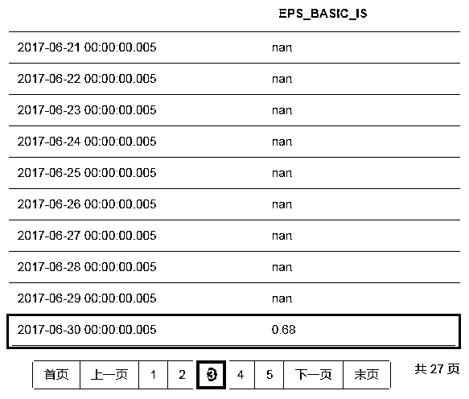

# 【福利升级】400+量化因子库强势来袭，你还在等什么！

> 原文：[`mp.weixin.qq.com/s?__biz=MzAxNTc0Mjg0Mg==&mid=2653288566&idx=1&sn=b9e4edb20f833dfd0115cbb86ce4d638&chksm=802e3a63b759b375ff48b76a976e36c93d51bcc319bf7462b62beeea273daf10622ddb87e790&scene=27#wechat_redirect`](http://mp.weixin.qq.com/s?__biz=MzAxNTc0Mjg0Mg==&mid=2653288566&idx=1&sn=b9e4edb20f833dfd0115cbb86ce4d638&chksm=802e3a63b759b375ff48b76a976e36c93d51bcc319bf7462b62beeea273daf10622ddb87e790&scene=27#wechat_redirect)

**量化投资与机器学习**

在 QI 的道路上，你不是一个人战斗！

 

前几天，公众号给大家带来了年度福利。详情请点击下方链接：

[**公众号年度福利**](https://mp.weixin.qq.com/s?__biz=MzAxNTc0Mjg0Mg==&mid=2653288432&idx=1&sn=6af2278e2bd40e30ee5b056f292d5e4b&chksm=802e35e5b759bcf31d4603d6e7d40d7eedd89eb2ad7ddb7ffce3966312297f5abc62eec80b32&scene=21#wechat_redirect)

今天福利升级啦！具体请看下文

2018 年俄罗斯世界杯已经过半，激烈的 1/8 淘汰赛也在如火如荼的进行，每支球队都渴望晋级，渴望夺冠。梅球王给蒙牛代言的广告也给大家传递出：**天生要强是人们与生俱来的自然力量**。

同样，在金融市场上，掌握更多金融信息，拥有更多特色金融数据，对投资者来说是十分重要的。因为，它可以作为你的投资增光添彩，朝圣杯更进一步！

今天，万矿**Wind 量化因子库**上线

**携手公众号给大家继续增加福利啦！**

据小编了解，**Wind 量化因子库**是目前全网数据最准最全的啦！让我们先了解一下吧！

小伙伴们，这项活动是**完全****免费**哈！

**（之前获得福利的小伙伴，可直接使用）**

量化因子库介绍

随着定价模型的不断深入，因子不断从基本面因子扩展到技术因子，到分析师预测因子，基于高频数据的因子也应运而生；量化投资机会的增加，也提炼出了量化因子。

为了解决量化因子的需求，Wind 专门推出 Wind 量化数据库（因子库），Wind 量化因子库是经过标准化和正态化，量化研究和投资所需因子的数据库，包含**20+大类，400+个因子**，提供 A 股市场上市以来的所有因子数据。

量化因子库指标树

量化因子库优势

**优势 1：****Point in Time**

**提供每个时点发布的报表数据，避免在回测中引用未来数据！**利用万矿量化云分析平台进行测量搭建与回测，提高回测结果的准确性。

**案例说明：**

*   万矿的常规财务指标是取**每个季度最后一天**作为报告期，如取 2017 年的四个定期报告数据，报告期设置分别为 ：一季报：2017-03-31，半年报：2017-06-30，三季报：2017-09-30，年报:2017-12-31。

*   如果要用**wsd**取多个报告期的公告数据，则需要将**周期设置为****季**，**日期类型设置****为****日历日**(因为有的季度最后一天不是交易日)。

那么我们以基本每股收益指标为例：

**测试指标：**基本每股收益

**时间范围：**2017-06-01——2018-07-02

**日期类型：**日历日

在常规的数据表中，我们看到在第二季度（**6 月 30 日**）时，该指标的数据为**0.68**。

但是，实际上，第二季度的财务数据是 8 月 11 日（见下图）公布后回填至 6 月 30 日的，如果在回测过程中，直接使用常规指标回测，则会引入**未来数据**。

而**Wind 因子库**财务指标是**实时更新**的，在当天公布该指标后，会立即更新相关数据。所以大家在回测的时候，不会有未来数据的产生。这会让你的**回测更加精准**！

****优势 2：****多维衍生****

**提供**多维度衍生计算报表及指标**，无论是你想根据 MRQ（最新一季）财务报表或是根据 TTM（滚动 12 个月）。**

******优势 3：**** 更新及时******

****因子库的相关数据在**交易日当天全部更新完毕**。****

******优势 4：****回测分析******

****从**上市至今数据**均保留，**20+余年**可回测。****

********优势 5：****信息准确********

******配备专业的数据团队进行因子库设计、开以及后期维护工作，**人****工校验与 IT 智能相结合**，确保因子库信息准确。******

******如何使用因子库******

******我们以 WSD 函数为例。****** 

********第一步：**新建一个 Notebook。******

************

********第二步：**创建单元格，点击**API 函数**，在**选择指标**中选择**量化因子**。******

************

******然后我们就可以复制代码到单元格进行数据获取啦！******

********如何获取项目福利？********

******大家需根据万矿具体要求完成相应的项目任务（很简单的！）******

******具体要求请添加项目负责人咨询即可（有群）：******

******添加微信号：**zxlgglr********

******或******

******扫下方二维码进行添加******

************

******在职请备注：【公司+职位+姓名】****** 

******学生请备注：【学校+院系+姓名】******

******量化投资与机器学习公众号成立 2 年多来，一直致力为全网所有宽客提供免费的量化资源与福利。我们一直坚持分享的精神，让宽客们有所收获，学到知识。******

******这一次与万矿的合作，是公众号经过长时间的筛选才最终确定的。对大家的福利也是经过多此协商争取来的，希望大家可珍惜这个机会。******

******祝你们在量化投资的道路上******

********一战成名！********

********知识在于分享********

********在量化投资的道路上********

********你不是一个人在战斗********