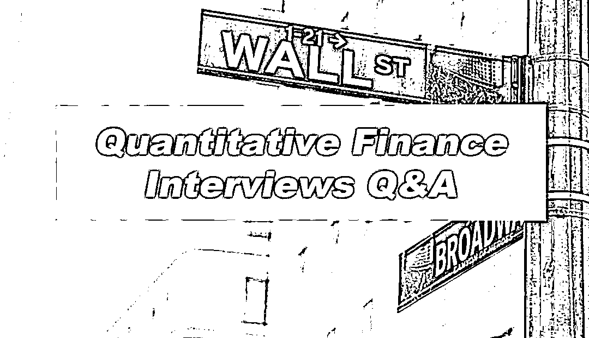
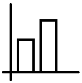
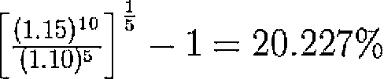
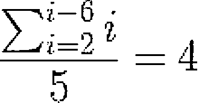
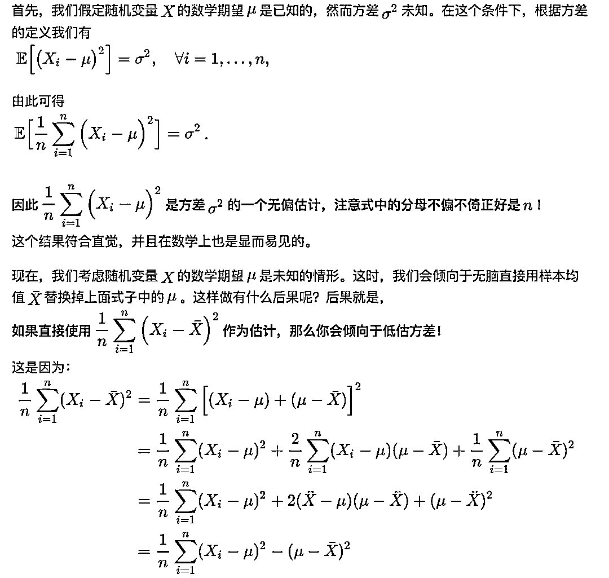
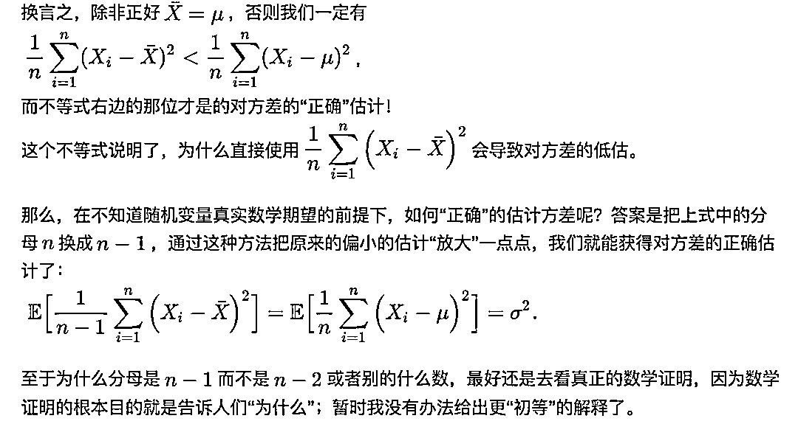
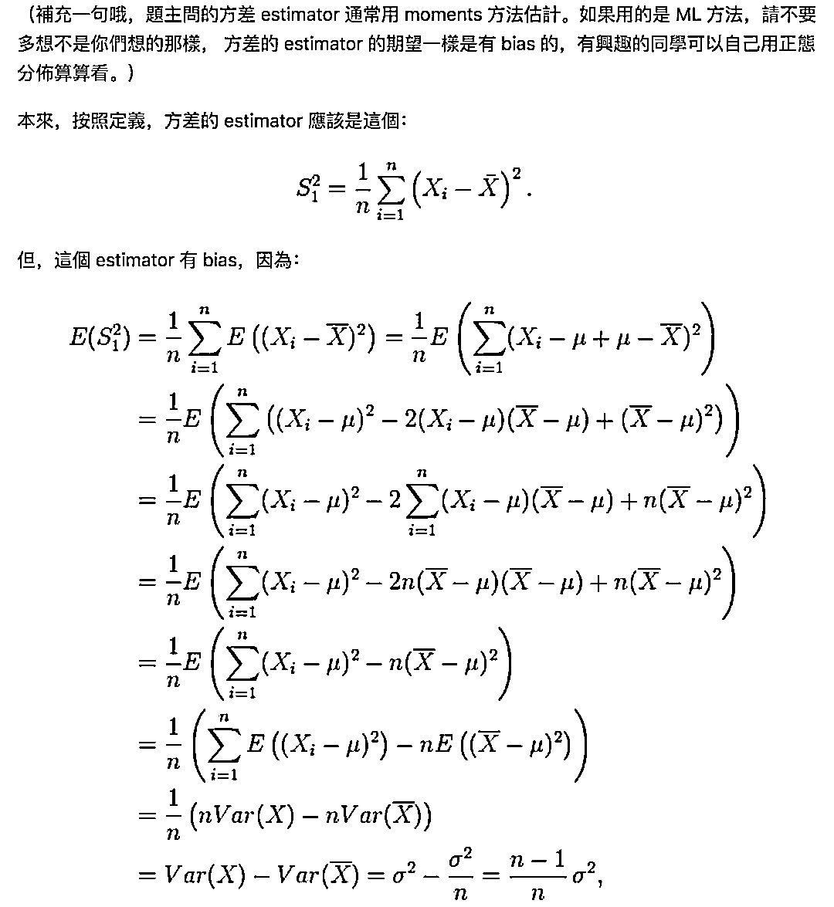
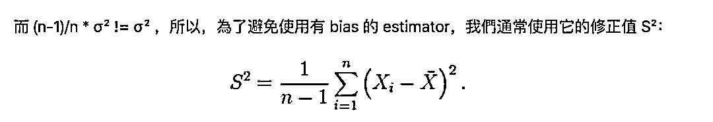

# 【独家重磅】来自华尔街的量化金融面试 Q&A（第二期）

> 原文：[`mp.weixin.qq.com/s?__biz=MzAxNTc0Mjg0Mg==&mid=2653288556&idx=1&sn=38c68fea3a8be7edc68af9a70e5a9416&chksm=802e3a79b759b36fdb830f5e94ed0cf0258cc96e635d7e782334a0b65eb65de227d027afcd0e&scene=27#wechat_redirect`](http://mp.weixin.qq.com/s?__biz=MzAxNTc0Mjg0Mg==&mid=2653288556&idx=1&sn=38c68fea3a8be7edc68af9a70e5a9416&chksm=802e3a79b759b36fdb830f5e94ed0cf0258cc96e635d7e782334a0b65eb65de227d027afcd0e&scene=27#wechat_redirect)

**量化投资与机器学习**

在 QI 的道路上，你不是一个人战斗！

 

量化投资与机器学习微信公众号从今日起，将定期推送至少**200 期以上**的**华尔街量化金融面试 Q&A**。所有题目均来自国外高质量的面试宝典，**我们做了精心的翻译和解读**。这些面试题目涉及 Quantitative Finance 的所有方面，**超级全面！**。

**此内容对那些想从事量化方面的求职者和相关行业人员都有一定的借鉴意义。我们希望大家通过阅读此系列的文章对其在职业发展上有一定的帮助，我们会感到十分很欣慰。*

往期传送门

[**第一期**](https://mp.weixin.qq.com/s?__biz=MzAxNTc0Mjg0Mg==&mid=2653288520&idx=1&sn=8e5040f41d3ef632d901f163c3a0d4c9&chksm=802e3a5db759b34bddd7635267baec0a485f1a8f108bc47e60a4b9c1829bc2e9422babb53ead&scene=21#wechat_redirect)

**Questions6**

如果一只股票每年连续复利收益率的标准差是 10%，那么连续复利 4 年股票收益率的标准差是多少？

**学习新单词：**

1、continuously compounded（连续复利）

2、standard deviation（标准差）

**Answer6**

假设连续复利收益率遵循布朗运动算法，收益的方差与复利计算期呈线性增长。这是因为随机游走中的连续回报是有限的。而独立随机变量喝的方差的和就是方差的和。这意味着 4 年的 σ2 等于 1 年 σ2 的 4 倍。因此，4 年的 σ 是 1 年 σ 的 2 倍，因此，答案就是 20%。

**Questions7**

从利率的期限结构来看，5 年即期利率为每年 10%，10 年即期利率为每年 15%。那么从第 5 年到第 10 年的隐含远期收益率是多少？

**学习新单词：**

1、term-structure（期限结构）

2、interest rate（利率）

3、spot rate（即期汇率）

4、implied forward rate（隐含远期收益率）

**Answer7**

这是一道经典的期限结构的题目。你的脑海里第一反应应该是如下的思想：前五年的利率和后五年的利率必须是平均的，这样才能给出整个 10 年的利率。也就是说，10%的平均值和未知的远期利率必须是 15%。未知的必须是 20%。要快速计算出来，请注意，未知（20%）远高于平均值（15%）低于已知（10%）。

事实上，如果你要具体计算出来，远期利率是：

**补充：**

即期利率是债券票面所标明的利率或购买债券时所获得的折价收益与债券当前价格的比率。是某一给定时点上无息证券的到期收益率。

远期利率是隐含在给定的即期利率中从未来的某一时点到另一时点的利率水平。确定了收益率曲线后，所有的远期利率都可以根据收益率曲线上的即期利率求得，远期利率是和收益率曲线紧密相连的。在现代金融分析中，远期利率应用广泛。它们可以预示市场对未来利率走势的期望，是中央银行制定和执行货币政策的参考工具。在成熟市场中几乎所有利率衍生品的定价都依赖于远期利率。

**Questions8**

请详细解释说明债券的“yield”和“rate of return”的区别。

**Answer8**

债券的“yield”是“internal rate of return”或“yield-to-maturity”或“promised- yield”。如果你持有债券到期，那就是你的收入。

债券的“rate of return”是已实现现金流的内部收益率对持有者，如果债券在到期日之前出售，（已实现的）“rate of return”可以为正，可以为负。

假设你购买了一份 promised 5%的债券如果你卖掉该债券，你的资本将受损失并且得到一个负的“rate of return”。然而，如果你持有债券直至到期，你将会得到 promised 5%。

**Questions9**

什么是混沌理论？可以用它来预测股票收益率吗？如果可以，请说明为什么？

**学习新单词：**

1、chaos theory（混沌理论）

**Answer9**

第一问：大家可以百度出很多内容，这里不过多陈述。

第二问：如果你想预测股票收益率，建议你使用神经网络或者其他非线性模型。混论理论在自然科学中是伟大的，但它在金融中却是失败的。

**Questions10**

两个玩一个游戏，甲掷骰子除了 1 以外的数字第一次出现时，乙付给甲对应数字的钱数，游戏结束。那么这个游戏的期望回报是多少？

**Answer10**

这是一道最基本的题目。这个游戏的规则已经将 1 从样本空间中移除，因此，可能有 5 种结果（2 到 6），每种结果的可能性都是相等的。则：

**Questions11**

Python 中单下划线和双下划线分别是什么？

**Answer11**

1、__name__：一种约定，Python 内部的名字，用来与用户自定义的名字区分开，防止冲突。

2、_name：一种约定，用来指定变量私有。

3、__name：解释器用 _classname__name 来代替这个名字用以区别和其他类相同的命名。

**延伸：**

https://segmentfault.com/a/1190000002611411

**Questions12**

样本方差的分母为什么是 n-1，而不是 n？

**Answer12**

我们看了很多网上的答案，决定选取知乎上 2 位作者的回答，因为这 2 个回答有严格的公式证明，说的也很本质。直接贴出来：

作者：魏天闻

**公式推导**

作者：茉茉

**如果你想获取更多干货、课程、福利。请在后台查看。**

**知识在于分享**

**在量化投资的道路上**

**你不是一个人在战斗**