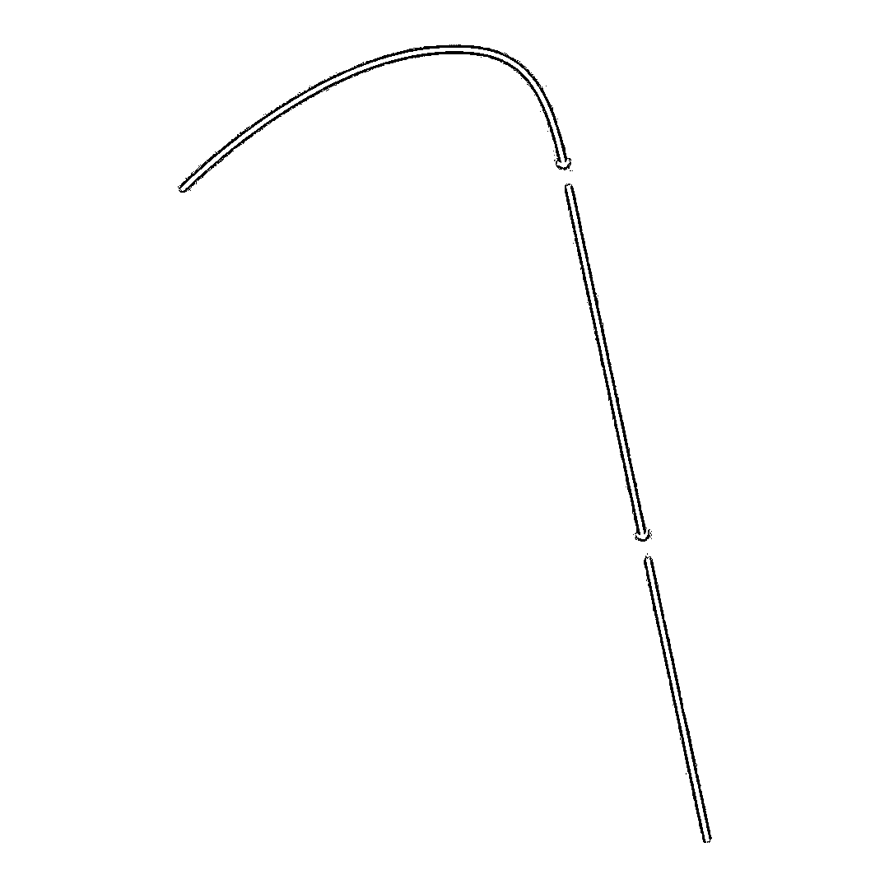

# 【最新解读】Ray Dalio——中美之间的误解、争议和战争

> 原文：[`mp.weixin.qq.com/s?__biz=MzAxNTc0Mjg0Mg==&mid=2653288545&idx=1&sn=9b0eca96a24fe062bb312bc25c45bde7&chksm=802e3a74b759b3626bf656280abe1f31c36ddd0856035e50318e452b589657f371137c2b5ce2&scene=27#wechat_redirect`](http://mp.weixin.qq.com/s?__biz=MzAxNTc0Mjg0Mg==&mid=2653288545&idx=1&sn=9b0eca96a24fe062bb312bc25c45bde7&chksm=802e3a74b759b3626bf656280abe1f31c36ddd0856035e50318e452b589657f371137c2b5ce2&scene=27#wechat_redirect)

今天公众号给大家分享解读一篇达里奥在领英发表的一篇十分富有见解的文章。

同时，我们会在今后的每篇文章中为大家分享一段关于《原则》的解读。

This evolutionary cycle is not just for people but for countries, companies, economies—for everything. And it is naturally self-correcting as a whole, though not necessarily for its parts. For example, if there is too much supply and waste in a market, prices will go down, companies will go out of business, and capacity will be reduced until the supply falls in line with the demand, at which time the cycle will start to move in the opposite direction. Similarly, if an economy turns bad enough, those responsible for running it will make the political and policy changes that are needed—or they will not survive, making room for their replacements to come along. These cycles are continuous and play out in logical ways—and they tend to be self-reinforcing.

**The key is to fail, learn, and improve quickly. If you’re constantly learning and improving, your evolutionary process will look like the one that’s ascending. Do it poorly and it will look like what you see below, or worse. **

**正文**

A wise Chinese leader who I will keep unnamed told me that it pays to negotiate by finding out what the other party wants most and try to give it to them and to have them reciprocate rather than to find out what will hurt the other party and give that to them because little wars have a tendency to quickly get out of control to become big wars and anyone who has ever gotten into a big war wishes that they hadn’t because they are so horrible. He referred to World War I as the classic example, while noting that it was true for most wars. He hopes that the Chinese-US trade disagreement doesn’t move from a dispute to a war of any sort.

**解读**

找出对方最需要的方式进行谈判是值得的。不要因小失大。 他提到第一次世界大战是一个典型的例子，同时指出大多数战争 都是如此。 他希望中美贸易分歧不会从争端转向任何形式的战争。

What is moving the disagreement from a dispute to a war is the fact that there are no international rules or international organizations (like WTO) that the disagreeing parties are willing to go to for binding arbitration, so they use carrots and sticks to test each other’s strengths, pushing each other until one backs down. Because Chinese and American leaders have all sorts of carrots and sticks (e.g., economic, military, cyber, etc.) that they can use, they are now determining which ones to use, how far to push the testing, and how far the other will go in inflicting pain and enduring it. The escalations come in the form of tit-for-tats—i.e., a series of escalations that can become progressively larger and more painful, and that take different forms that can extend beyond trade (e.g., to include capital wars). It’s this series of escalations that the wise Chinese leader that I referred to conveyed can easily get beyond anyone’s control.

**解读：**

中美可以通过很多方式进行对抗（例如经济，军事，网络等），这种针锋相对的形式，可以超越贸易战争（包括资本战争）。 正是这一系列的升级，很容易超出控制。

In response to the US putting on its $50 billion of tariffs, the Chinese responded saying, “the Chinese side doesn’t want to fight a trade war, but facing the shortsightedness of the US side, China has to fight back strongly. We will immediately introduce the same scale and equal taxation measures, and all economic and trade achievements reached by the two sides will be invalidated.” The Trump administration threatened to retaliate to that by adding another $100 billion of tariffs. Right now, these numbers are very small in relation to the US’s nearly $20 trillion economy and China’s economy, which is of comparable size in purchasing power terms, so that the shots that have been fired have been more of symbolic and political significance than of material economic significance. For that reason, it’s too early to get excited about them though, as the previously referred to Chinese leader said, they can escalate to become very serious, so we are all watching intently.

**解读：**

中国回应说，中国方面不想打一场贸易战，但面对美方的藐视，中国必须大力反击。所以我们都在观察事态的变化。

While I and people who are more knowledgeable than I believe the trade-balance issue can be solved so that everyone is better off, the more challenging disputes revolve around how the two countries believe their countries should be run and how that affects their perceptions of what “fair trade” is and how their companies should be supported.

**The Fundamental Differences in Values and Approaches.**

A different wise and high-ranking Chinese official told me the most important cultural difference between Americans and the Chinese arises from the fact that to Americans the individual is of paramount importance while to the Chinese the family is most important. He explained that these deep-seated differences extend to how Americans and the Chinese run their governments, noting that the two characters that make up the word country in China are “state” and “family.” As a result of these deep-seated differences in views about what is best, leaders in China seek to run the country the way a family head would run a family, from the top down, putting the collective interest ahead of the individual’s self-interest, with each member knowing their place so the system works in a harmonious way. In the US, the opposite is true. Individuals are of paramount importance so the country is run from the bottom up, putting the interests of the individual ahead of the interests of the collective, with more open conflict and less respect for authority considered preferable. These differences become manifest in all sorts of ways. For example, when a highway needs to go through personal property, individual property rights will more likely stand in the way of that happening in the US than in China, and when leaders are chosen, it’s more from the top down in China while it’s more bottom up in the US. Similarly, leaders in China manage the companies in key industries more from the top down in support of the national interests, whereas the opposite is true in the US, where how companies are managed comes from the bottom up. That’s where the rub lies.

**解读：**

美国人和中国人之间最重要的文化差异源自这样一个事实：对美国人来说，个人是最重要的，而对于中国人来说，家庭是最重要的。这些根深蒂固的分歧延伸到美国人和中国人如何管理他们的政府，并指出构成中国这个词的两个角色是“国家”和“家庭”。这些差异以各种方式表现出来。例如：中国的领导者为支持国家利益更多地从上至下管理重点行业公司，而在美国则相反，在这种情况下，公司的管理方式来自于自下而上。这就是摩擦所在。

**From the US perspective, there are three major criticisms:**

1\. The Chinese government pursues a wide range of evolving interventionist policies and practices aimed at limiting market access for imported goods, services, and businesses, thus protecting its domestic industries by creating unfair practices.

2\. The Chinese offer significant government guidance, resources, and regularly support Chinese industries, most notably including policies designed to extract advanced technologies from foreign companies particularly in sensitive sectors.

3\. The Chinese are stealing intellectual property and/or not adequately protecting it—some of which is believed to be state-sponsored and some of which is believed to be outside the government’s direct control.

In other words, the Chinese government is helping its companies compete in ways that the US doesn’t do and doesn’t like, and it is making plans to do that (e.g., the China 2025 plan) while the US doesn’t make such plans and objects to China making them. While these different approaches exist in most areas, they are especially important in technology because both countries know that the country that is technologically strongest will be strongest in most other ways. While some of these differences can be negotiated to both countries’ mutual satisfactions, the most core ones that are extensions of what each country deeply believes is best can’t be negotiated away.

**China Is Now a Competitor and Will Soon Will Be Much Stronger Than the US**

While the trade-balance issue is important, the most important questions are a) how will these countries deal with each other given their different perspectives and b) which system will work best. Most likely (and hopefully) the trade dispute we are seeing won’t lead to a disruptive war so that both countries will evolve to very different places based on how effective their approaches are. That will have huge effects on their individual well-beings as well as their relative powers. For that reason, it is most important for the leaders of these countries to focus on what they need to do to get their own countries to do well.

In considering the question of how well these two different approaches will work, it’s important to recognize that both “communism” in China and “capitalism” in the US are now very different than they were 30 years ago and, as a result, they’re delivering very different results to their populations. It would be a mistake to think that China is a communist country that works similar to the way communism has classically worked around the world or in China 30 years ago—i.e., very ineffectively. Instead think of what’s happening in China as being “state capitalism,” in which strategically important companies are being supported to become very competitive while the economy has a lot of entrepreneurship and the markets have quite a lot of freedom. Though different, China is being run much more like Singapore has been run for the last 30 years than how China was run 30 years ago or than how “communist” countries have classically being run. Think of it as being capitalism with the Chinese cultural characteristics previously explained. In comparison to the US, it’s more from the top down with the paramount goal to have competent decision makers put into decision-making roles to determine what’s best for the whole and to be held accountable for accomplishing those things.

**解读：**

尽管贸易平衡问题很重要，但最重要的问题是，这些国家如何以不同的观点来处理彼此问题，以及哪些方式最适合。这些国家的领导人最需要关注他们需要做些什么来让自己的国家变得更好。

我们更重要的是要认识到，中国的“共产主义”和美国的“资本主义”现在都与 30 年前截然不同。不能拿过去的眼光和角度看未来。把它看作是具有中国文化特色的资本主义。与美国相比，从上到下，最重要的目标是让决策者做出决策，确定什么是最好的，并为完成这些目标负责。

There is no doubt that China’s culture/approach has worked remarkably well and is rapidly getting better. When I first went there in 1984, I gave heads of companies $10 calculators, which they thought were amazing, and people in Beijing and Shanghai lived in what most people would consider slums without hot running water, adequate heat, and basic appliances like washing machines and TVs. Now it is as or more advanced than the US in many ways, and improving faster. There should be no doubt that the Chinese culture/system has been very effective. The chart below shows what has happened and what we expect will happen based on our leading indicators of what make countries succeed and fail (see "Why countries succeed and Fail; Productivity and Structural Reforms").

While China is a competitor and will soon be significantly larger than the US, and while such rivalries in the form of the Thucydides Trap (https://bit.ly/2th3Qtm) are dangerous, it is very doubtful that the capacities of either of these countries to inflict immeasurable harm on the other will end for a very long time frame. For these reasons, we hope and expect that rationale heads will prevail and tit-for-tat escalations won’t accelerate to produce horrible wars.

解读：

中国的变化是飞速的，和我当年去的时候有质的飞跃。虽然中国是一个竞争对手，并且很快会比美国强大很多。但是，it is very doubtful that the capacities of either of these countries to inflict immeasurable harm on the other will end for a very long time frame。出于这些原因，我希望面对针锋相对的升级不会加速一些战争的发生。

**知识在于分享**

**在量化投资的道路上**

**你不是一个人在战斗**