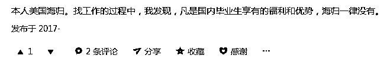

# 二百、万出国留学，回国月薪 2000 元？海归求职的那些坑！

> 原文：[`mp.weixin.qq.com/s?__biz=MzAxNTc0Mjg0Mg==&mid=2653288526&idx=1&sn=ac0be0619cfb9d8e09db767c454c3fbe&chksm=802e3a5bb759b34dd5a9bb15243d95c6052cfd2c219481d3d028b0a295d4fbf59b11250bcd42&scene=27#wechat_redirect`](http://mp.weixin.qq.com/s?__biz=MzAxNTc0Mjg0Mg==&mid=2653288526&idx=1&sn=ac0be0619cfb9d8e09db767c454c3fbe&chksm=802e3a5bb759b34dd5a9bb15243d95c6052cfd2c219481d3d028b0a295d4fbf59b11250bcd42&scene=27#wechat_redirect)

**量化投资与机器学习**

在 QI 的道路上，你不是一个人战斗！

 

文章来源：UniCareer

提到海归，普通青年会说：“这是白富美。”

文艺青年会 45°角仰望天空：

“这些年你一定很孤独吧？”

而 2B 青年会竖着大拇指说：**“有钱！”**

应届生，海外名校毕业，高分学霸

没成想回国求职一波三折

环环相扣就差改当惊悚片编剧了！

校招走不通

**连应届生应有的福利待遇也得不到**

本以为出国留学是镀层金

**为什么回国反而变得“更不值钱”？**

01

第一坑：海归秋招鄙视链 

“都说国内机会多，所以我也想回国看看。可是看到的都是**海归不如 985/211**，我一个美国前 100 高校，GPA 3.9 连**网申都过不了**！”

1

985＞美本＞美硕＞英国＞澳洲

 留学再厉害，花的钱再多，学了再多的东西，毕业回国的现实也不是“与国际接轨”，而是找不到工作。因为**放在 HR 眼里，海归还不如一个 985 本科毕业生。**

*   很多留学生都是**国内考不上好大学才出去的**，虽然他们英语水平要比国内毕业生好一些，但英语过六级国内高校学生，也足够用了

*   留学生**大多是富家子弟，不肯吃苦耐劳**，我们不喜欢招这样的学生。

这是大部分 HR 对海归的普遍印象（对于上面两点公众号有一些不认同，只能说这样的问题不能以点概面。）

*图片来源于网络

之前被炒得火爆的留澳女生只拿 2000 元底薪的新闻给了留学生们当头一棒。 

**有网友说：**

> 十年前，留学生回国都是要请入 VIP 室，直接领导接待的。现在，留学生也得跟国内大学应届毕业生一样，**参加招聘会**，**挤人才市场**。

近两年国内海归就业大趋势的确不容乐观，人才市场上已然形成了一条校招学历鄙视链：

**985 研究生>985 本科生>北美研究生>北美本科>英国本科>英国研究生>澳洲研究生>澳洲本科**

澳洲留学生莫名沦为**鄙视链最底层****。**

其实澳洲有很多无论是历史还是国际声誉都极高的大学，尤其是**澳洲八校联盟**（墨尔本大学、悉尼大学、澳洲国立大学、昆士兰大学等 8 家名校），**被普遍公认为是澳洲版的常春藤联盟**，在南半球与环太平洋地区居领导地位。

*图片来源于网络

可据内部消息透露，被奉为 Target School 的澳洲八大，**在****中国顶尖券商（中信证券、中金等）的 Target School 里却被默默排除**！

*图片来源于知乎

2

HR：我没听说过的，全是野鸡大学！

> 你不能指望 HR 电脑里有一份每年都更新的全球高校排名，每看一份简历都要上去查查对应学校，**招一个 985 的时间成本显然比海归更低，学校我熟悉，也不会因为是海归就自视甚高**，英语 6 级完全够用。其他的，**大家都是新手，谁不得从头学呢**？

海内外课程设置和审核标准完全不同，因此国内的 HR 很难判断一个海归的含金量，所以大多时候**国内 HR 只认海外名校**。在很多高端行业，对于留学生，分为 3 类：  

*   英国 G5 & 美国常青藤

*   听说过的 

- 美国：NYU，芝加哥大学，华盛顿大学等

- 英国：曼彻斯特大学，爱丁堡大学等

*   没听过的

**阿罗 | 名企 HR 助理（亲身经历）**

> 面试的时候，两个背景差不多的留学生，都是计算机专业，一个康奈尔，一个 NYU。有的 HR 认为 NYU 比康奈尔名气大。最后 HR 要了 NYU 的学生。**可其实在计算机专业排名上康奈尔排 13，NYU 排 54**！

**菲儿 | 新加坡金融硕士，今年投身秋招大军**

> 北京很多公司、大央企就只认北京生源，对国外很多大学认可度低，除非是世界顶级名校，否则**大多数海归还比不上国内 211 大学的本科毕业生！**

3

  综合排名 v.s. 专业排名  

当然，也不乏一些大企业海外招聘时，拿着 U.S. News，QS，the Times 各种排名，只看综合排名前 30 的学校。因此很多专业排名很靠前，**但综合排名并不是很突出的学校就很吃亏**。

*图片来源于网络

02

第二坑：专为海归设计的网申 Bug

1

本科能过简历的公司，现在硕士居然过不了

Uni 酱曾收到网友留言：

> 我一个朋友本科是对外经贸大学的，去美国读了两年硕士，回国之后发现，**本科能过简历的公司，现在硕士居然过不了了！**

**感觉两年的美硕白念了！**

某些国际知名公司留学生网申渠道**只留常春藤和英国 G5 高校**，而且每个公司对海外高校认可度不同，**有的甚至连 G5 都不认**。

*图片来源于知乎

2

留学生网申时间短，截止早

波士顿咨询以及贝恩北美网申截止时间都**比大陆整整提前了半个多月**。

*图片来源于网络

而麦肯锡的实习生申请时间香港截止**比内地早了整整 3 个月**！

*图片来源于网络

普华永道海外学子招聘计划**网申仅仅开启 1 个月**，而针对大陆的毕业生计划却持续将近 3 个月。

*图片来源于网络

03

应届生&往届生，傻傻分不清楚

1

我是应届生，为啥挂我网申？

校招网筛简历的时候非常在意你是不是应届生，而且他们的应届的定义是次年毕业。**美国海归常常毕业前一个月还在上课考试，根本无法提前参加国内秋招**，但网筛简历有时候就是这么残酷，不管特殊情况。**80%留学生网申都会因为非应届问题而网申被挂**。

2

等我毕业了，应聘也结束了

一直让海归觉得很痛的是：我毕业了，可你的招聘也结束了。

*   英国留学生：**9 月初毕业**

*   美国留学生：**5 月份毕业，12 月份毕业**

*   澳洲留学生：**9 月初毕业**

“**应届生” 这三个字已经成为了所有留学生的痛。**

Uni 酱曾收到这样一份留言：

> 今年秋招一开始就在网上投递了简历，但由于**没有办法回国参加统一的笔试、面试，错过了一些工作机会**。

**赵蓉蓉 | 美国某排名前 50 高校毕业**

> 5 月份毕业回国时，国内春季招聘的时间已经过去了，我要等半年参加秋季招聘。**很担心毕业和求职拉得时间太长，我会失去“应届生”的资格**。

04

如何网申才是海归的正确姿势？

1

如何写出接地气的简历

*   **不要强翻你的英文简历**

挺多同学可能在美国待久了，只有英文简历，写中文简历基本靠强翻，不符合中文的语法和表达方式，看起来让人哭笑不得。你就想想，**一份看起来浓浓中央六套配音电影范儿的简历，HR 看了是不是尴尬症都要犯了？**

*   **简历上没电话基本就被直接弃掉了**

外国的公司会首选用邮件联系你，但是国内 HR 习惯使用的是电话。写中文简历的时候，千万别忘了留电话号码。

*   **国内简历一定要放照片？**

国内简历一般都会准备中英文两个版本，两页放在同一个 PDF 里。国外简历大部分都不附照片（如美国有外貌歧视的嫌疑），但中文简历就看公司要求了，**简历照的选择，总而言之就是：要 professional。**

2

国内的笔试/群面都是套路满满

通常国内招聘的流程为网申-笔试-群面-小范围/单独面试-收到 offer：

*   **笔试：**

拿出 1-2 个月的时间正经准备笔试题目，这是海归最短板的地方，相信我，那些题目你真的不会做。国内国企民企笔试网测的很多题目都非常诡异，一堆性格测试，根本不知道选哪个才是对。所以一定要提前准备提前练，千万不要相信自己的智商。

*   **面试：**

国外通常会提前 1-3 周通知你，给你几个 time slot 选择，一般 HR 也不会在周末联系你。而国内面试，今天给你电话，也不问你有没有时间就叫你明天来的情况，也可能发生，要随时准备好作战状态。

*图片来源：Uni 学员

——END——

部分内容来源于：知乎、网络

UniCareer 独家整理

**知识在于分享**

**在量化投资的道路上**

**你不是一个人在战斗**