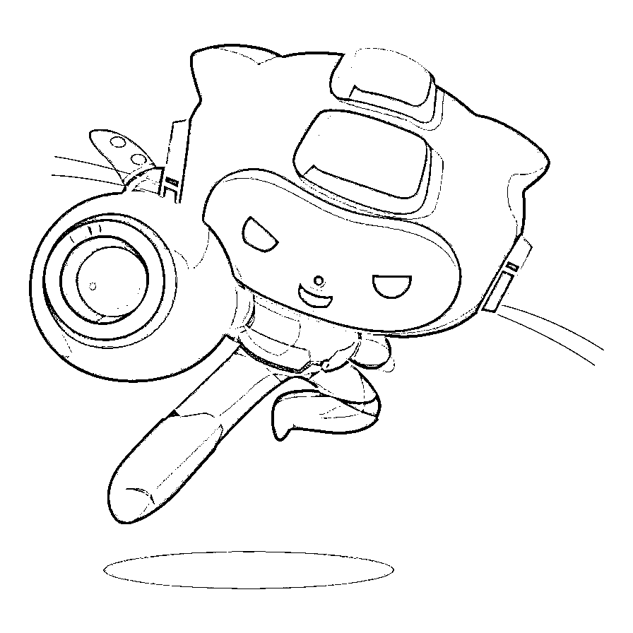
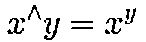
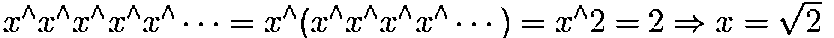

# 【独家重磅】来自华尔街的量化金融面试 Q&A（第一期）

> 原文：[`mp.weixin.qq.com/s?__biz=MzAxNTc0Mjg0Mg==&mid=2653288520&idx=1&sn=8e5040f41d3ef632d901f163c3a0d4c9&chksm=802e3a5db759b34bddd7635267baec0a485f1a8f108bc47e60a4b9c1829bc2e9422babb53ead&scene=27#wechat_redirect`](http://mp.weixin.qq.com/s?__biz=MzAxNTc0Mjg0Mg==&mid=2653288520&idx=1&sn=8e5040f41d3ef632d901f163c3a0d4c9&chksm=802e3a5db759b34bddd7635267baec0a485f1a8f108bc47e60a4b9c1829bc2e9422babb53ead&scene=27#wechat_redirect)


**量化投资与机器学习**

在 QI 的道路上，你不是一个人战斗！

 

量化投资与机器学习微信公众号从今日起，将定期推送至少**200 期以上**的**华尔街量化金融面试 Q&A**。所有题目均来自国外高质量的面试宝典，**我们做了精心的翻译和解读**。这些面试题目涉及 Quantitative Finance 的所有方面，**超级全面！**。

**此内容对那些想从事量化方面的求职者和相关行业人员都有一定的借鉴意义。我们希望大家通过阅读此系列的文章对其在职业发展上有一定的帮助，我们会感到十分很欣慰。*

从 2018 年 6 月 4 日起，公众号每发布一篇文章，就为大家分享一张 Octodex 的创意图。



**# 005**

**Questions1**

100 的阶乘（100!）后面有多少个零？

**Answer1**

这是一个十分简单的问题。因为 10=2*5，所以 0 的个数就是 100!因式分解后 2*5（必须配对）的个数。显然因式分解中 2 的个数比 5 多，因此问题划归为 5 的个数决定了后面 0 的数量。

先来数 5 因子有几个：在 100 内，5 作为因子的数有 5, 10, 15, 20, 25... 总共有 20 个。但是注意到 25, 50, 75, 100 都包含了 2 个 5 作为因子（25=5*5, 50=2*5*5 等）。因此对于这些数，我们要多数一次。所以总共就是有 24 个 5 因子。

因此 100 的阶乘后面有 24 个 0。


**Questions2**

如果


其中



那么 x 是多少？

**Answer2**

这个问题看似很困难，但是我们从一个简单的分析给出个较优的解决方案：


换句话说，当 n 趋近于无穷大时，加上或减去一个 x^ 应该会得到相同的结果，即：




**Questions3**

来自不同银行的 8 位宽客聚在一起喝酒。他们都想知道在坐 8 个人的平均工资。然而，每个人都不愿意向其他人透露自己的薪水。你能想出一个策略让这 8 个人在不知道别人薪水的情况下计算出在座各位稍微平均工资吗？

**Answer3**

这个问题有多个答案。我们给出如下的解法：

让第一个宽客选择一个随机数 a，把这个随机数加到他/她的工资中，假设这个数是 b。第二个宽客把他/她自己的工资加到 b 中，按照这个方法，依次到第八个宽客，假设最后结果是 c，同时第八个宽客把结果 c 再给到第一个宽客手中。然后第一个宽客从 c 中减去 a 得到 d，最后将 d 除以 8，就得到了大家的平均工资。

我们简单程序实现以下：

```py
#假设工资的范围在 3000-20000 之间
a = [random.randint(3000,20000) for _ in range(8)]  
print('a:',a)

b = 86940  #随机数
c = np.sum(a) + b
print('c:',c)

d = (c-b)/8
print('d:',d)
```

a: [6225, 4050, 10751, 14868, 5087, 7657, 5569, 4851]

c: 145998

d: 7382.25

你可能想担心这个策略是否有用，除了作为一个很好地智力题目测试面试者外，它在实践中确实有应用。例如，第三方数据提供商从所有参与公司中收集基金持仓数据，然后将信息分发给参与者。当然，大多数参与者不希望其他人知道他们持有的是什么。如果基金中的每个头寸每天都有相同 ID，那么很容易从持有的基金中反推基金，并复制策略。所以不同的随机数(或者更确切地说是伪随机数，因为提供者知道在每个位置的基金 ID 中添加了什么数字，并且需要通过复杂的算法来实现一一映射）在分配之前被添加到基金中每个位置的基金 ID 中。因此，同一基金中的头寸似乎有不同 ID。这防止了参与者重建其他基金。使用这种方法，参与者可以共享市场信息，同时保持匿名。


**Questions4**

一个钟表（按顺时针方向编号 1-12）从墙上掉了下来，摔成三块。你会发现每一块上的数字之和是相等的。那么，每一块上的数字是多少呢？（不允许奇形怪状的碎块）

**Answer4**

使用求和方程，(1+12)*12/2=78，所以每一块的数字和必须是 26，每一块上的数字必须是连续的，因为题目已经说明不允许有奇形怪状的碎块，我们很容易知道：5+6+7+8=26，但是为什么再找不到更多的连续数字加起来是 26 呢？

这样的假设从 12 点到 1 点在钟表上就不正确了。一旦这个错误的假设被消除，那我们的思路就变得很明朗：12+1=13，11+2=13。因此第二个碎块应该是 11，12，1。那最后一块自然而然就是 3，4，9，10。


**Questions5**

假设有 98 个不同的整数从 1 到 100。有什么好的方法找出两个缺失的整数在[1,100]内？

**Answer5**

将缺失的整数表示为 x 和 y。现有的整数表示为 z1 到 z98。应用求和方程：


通过上面两个方程，我们可以很容易的解出 x 和 y。

**知识在于分享**

**在量化投资的道路上**

**你不是一个人在战斗**