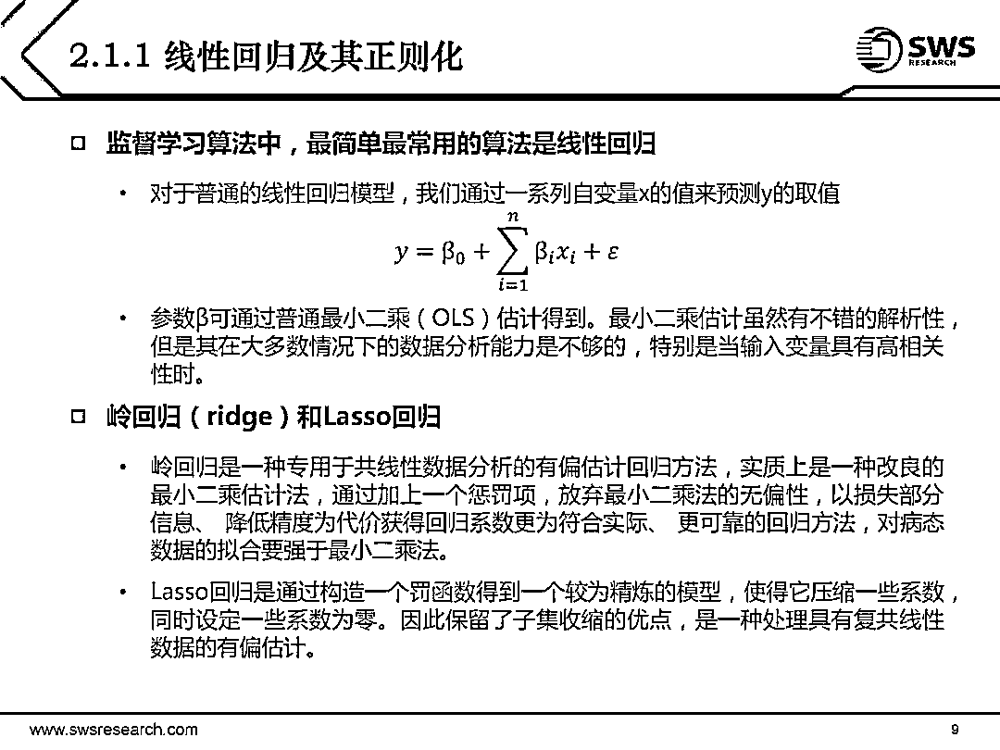
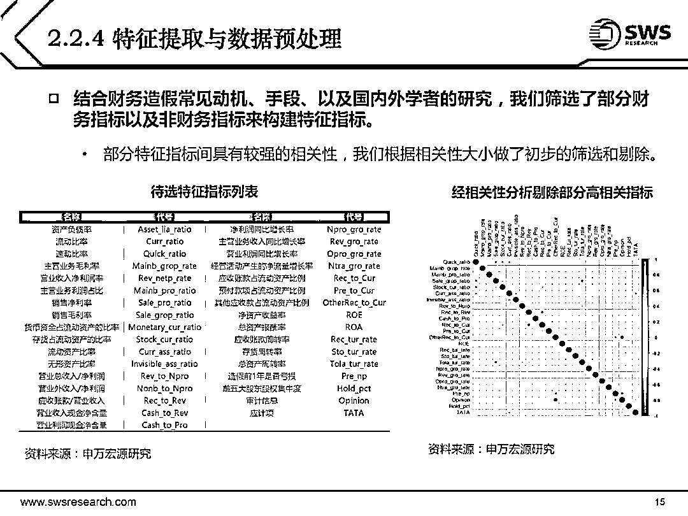

# 【最新】机器学习及其在金融市场中的应用

> 原文：[`mp.weixin.qq.com/s?__biz=MzAxNTc0Mjg0Mg==&mid=2653288484&idx=1&sn=c79dd635c89ba4db546df535c4c81715&chksm=802e3a31b759b327d31d12f506526c3081cf49f8297d824809d79f3f45c37110e9f9ab218c26&scene=27#wechat_redirect`](http://mp.weixin.qq.com/s?__biz=MzAxNTc0Mjg0Mg==&mid=2653288484&idx=1&sn=c79dd635c89ba4db546df535c4c81715&chksm=802e3a31b759b327d31d12f506526c3081cf49f8297d824809d79f3f45c37110e9f9ab218c26&scene=27#wechat_redirect)

**量化投资与机器学习**

在 QI 的道路上，你不是一个人战斗！

 

**公众号**近期**文章预告**

 1、红宝书读书笔记（中文版）

2、金工、量化绿宝书精选解读（中文版）

3、比特币高频交易策略

[*4、高频交易策略解决方案基于机器学习*](https://mp.weixin.qq.com/s?__biz=MzAxNTc0Mjg0Mg==&mid=2653288278&idx=1&sn=73c6749fa89384391031c78a55768681&chksm=802e3543b759bc55fdaa974ac1d5a3c7a0a6ea11a272030dcb989978a96db6f2be8e5a0902cc&scene=21#wechat_redirect)

[*5、高频交易基于强化学习*](https://mp.weixin.qq.com/s?__biz=MzAxNTc0Mjg0Mg==&mid=2653288292&idx=1&sn=322bcd5400b339616e480775cce98bdf&chksm=802e3571b759bc6739d7fe48366a02f59f9e58a07360ac089b1e17b6350c4fd0ef4b8d735a7d&scene=21#wechat_redirect)

[*6、高频价格动态策略*](https://mp.weixin.qq.com/s?__biz=MzAxNTc0Mjg0Mg==&mid=2653288413&idx=1&sn=cddb1fbdefbcbd470e539bc030be28df&chksm=802e35c8b759bcdeeb836bfebaec2dc72570273b4ee4f39ee46137bff6798bcb5e392701e247&scene=21#wechat_redirect)

7、模式识别下的人工智能量化策略

[*8、近期最热门的券商金工研报分享*](https://mp.weixin.qq.com/s?__biz=MzAxNTc0Mjg0Mg==&mid=2653288446&idx=1&sn=9c9eff76734dc2a9f1b046eb9184704a&chksm=802e35ebb759bcfdf5843d5b0892c8c2142e15a62454e31846fd979c215ae56ebab2a717cefa&scene=21#wechat_redirect)

9、深度学习在金融中的论述

10、海内外优秀量化文献解读

[*11、**基于风险中性的深度学习选股策略*](https://mp.weixin.qq.com/s?__biz=MzAxNTc0Mjg0Mg==&mid=2653288319&idx=1&sn=e2be2ffda6b8c63f46a966790e8147ad&chksm=802e356ab759bc7c9a607ffb2145a020b454b2a97dac956684d484d5ed8bba5b09770d049dab&scene=21#wechat_redirect)

12、资产配置系列（二）

13、券商研报解读系列

14、人工智能应用量化系列

15、永不停歇的干货

分享一篇今天最新的研报，讲机器学习应用量化投资的，值得学习！

**点击图片查看**

**知识在于分享**

**在量化投资的道路上**

**你不是一个人在战斗**