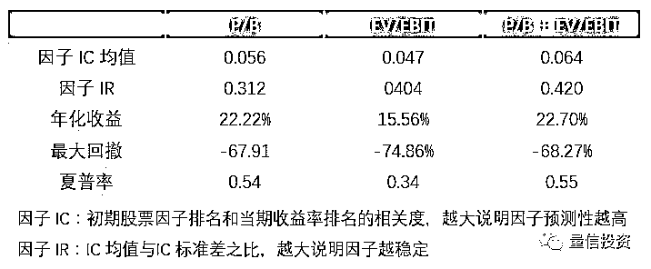
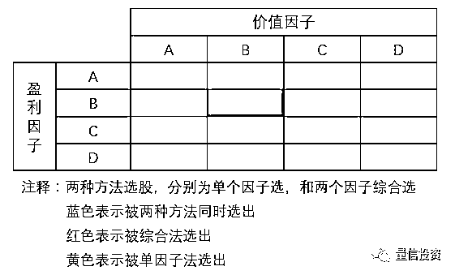
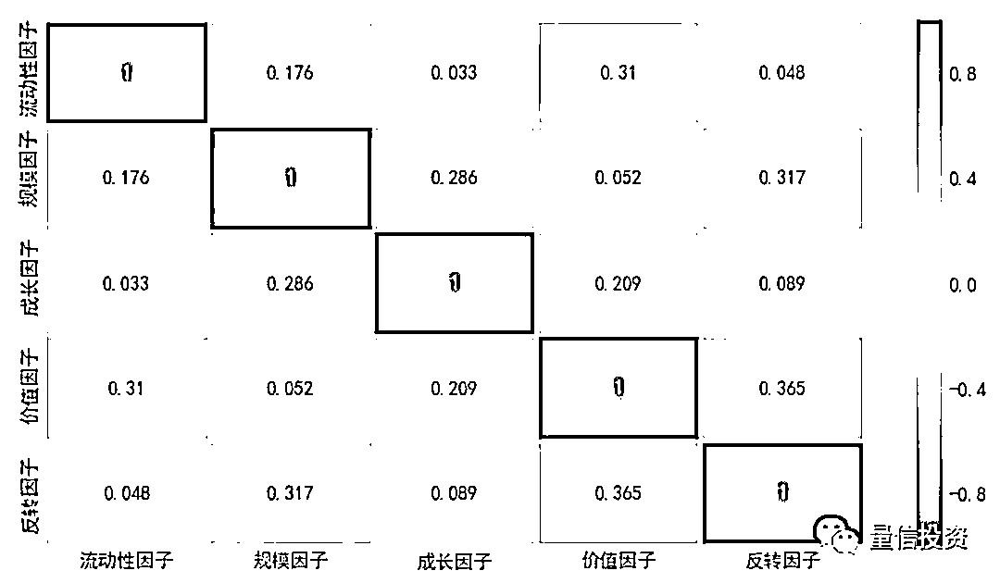
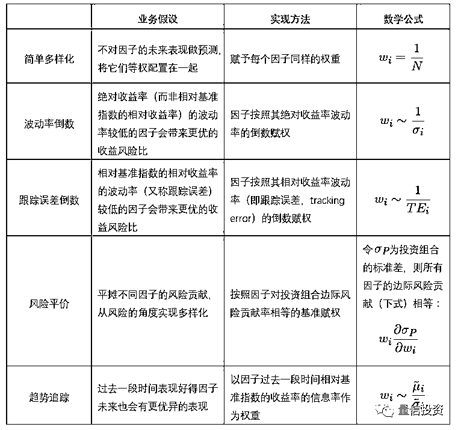
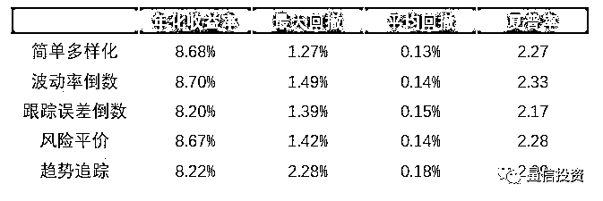

# 你用因子，他也用因子；你没赚钱，他却赚钱了

> 原文：[`mp.weixin.qq.com/s?__biz=MzAxNTc0Mjg0Mg==&mid=2653288456&idx=1&sn=d381a562097ff96c6fcdcee8f3da8242&chksm=802e3a1db759b30b7526753480c47ad9f28c3deb34b7f00e4d15087aa119874124d89814e692&scene=27#wechat_redirect`](http://mp.weixin.qq.com/s?__biz=MzAxNTc0Mjg0Mg==&mid=2653288456&idx=1&sn=d381a562097ff96c6fcdcee8f3da8242&chksm=802e3a1db759b30b7526753480c47ad9f28c3deb34b7f00e4d15087aa119874124d89814e692&scene=27#wechat_redirect)

**量化投资与机器学习**

在 QI 的道路上，你不是一个人战斗！

 

摘

要

市场的非有效性确保因子会持续有效。因子投资的关键在于执行时对各种细节的精确处理。本文探讨因子投资实践中的各种细节。在这方面，量化投资无疑有着巨大的优势。

**0**

**引言** 

前些天，有个小伙伴问了这么一个问题：**现在量化选股因子泛滥，大家都用同样的数据做同样的测试，最后也得出相似的结论，导致很多策略同质化。这个问题量信怎么看？**

今天这篇文章就来回答这个问题。

首先，**一个因子能够挣钱是因为市场在该因子方面存在非有效性。**用的人越多，市场在那方面越有效，导致因子的效果越差。但就现阶段而言就说市场在哪个因子上已经完全有效为时尚早。事实上，由于 A 股市场中噪声投资者的高度参与感，市场仍远不够有效。

拿我们熟悉的价值投资来说，价值投资有效的直接原因不是相关因子的额外风险溢价补偿（事实上，价值投资构建的投资组合风险较市场往往更低），而是由于噪音投资者的存在（见[《写在当越来越多人谈论价值投资时》](http://mp.weixin.qq.com/s?__biz=MzIyMDEwNDk1Mg==&mid=2650877775&idx=1&sn=91fbbd31de76d8ffc73e5bb5518e7ac0&chksm=8c249ed8bb5317ce9e52b365b4aab2a18cf527c4d49013f9fb2b8fb60e3ef83ec3da636a2338&scene=21#wechat_redirect)），这是不会消失的，所以它会持续有效。

在因子仍将会有效这个大前提下，我想更系统的谈谈第二个方面：**同样是使用主流的因子（比如价值、动量、质量等），有的人赚钱了，有的人却没赚钱。虽然是同质化的策略，但因子在靠谱的基金经理手里能发挥最大的效果，而在不靠谱的基金经理手里则变得非常平庸。**这里面的门道又在哪呢？

答案很简单：**细节决定成败。**

随着量化选股的普及，市面上出现了很多优秀的回测平台，能够快速的测试选股因子是否有效。然而，无论测试再怎么方便快捷，一旦真要实盘时，会有一些不得不面对的问题：每个因子应该选多少股票？不同因子如何取舍？股票之间的仓位如何确定？调仓频率如何选取？交易时如何降低成本？等等。因子投资的成败取决于能否很好的应对这些问题。

本文旨探讨在因子投资实践中必须考虑的细节问题。需要说明的是，这里面的某些问题并没有标准答案、不同的选择和投资者的风险偏好有关。

**1**

**细节一：选择合适的代理指标** 

**在确定风格因子后，首先要决定的就是找到合适的代理指标。**我们以价值（value）因子为例说明这个问题。

顺便提一句，现如今我们提到价值投资的时候，由于巴菲特精神深入人心，往往指的是“好公司”+“便宜”。**但是，最初的价值投资就是买便宜的。便宜的定义就是公司每单位市值的基本面价值更高，而不在乎基本面的好坏，这叫做 pure value。**

当我们使用价值这个因子来选股时，必须通过具体的指标来对股票的便宜程度排名。这就是选择因子的代理指标。在衡量便宜方面，有很多常见的 multiples（见下面的小贴士），比如 P/E，P/B，EV/EBIT 等。

在英文的资料中涉及价值因子的指标时，multiple 是个非常常见的词汇，因此拿出来解释一下，方便小伙伴们以后阅读英文文献。multiple 一词是倍数的意思，顾名思义，指的是两个指标相除。按照惯例，一般分子上指标的数值要大于分母上指标的数值。比如市盈率 P/E，它就是每股股价和每股 earnings 的比值，这就是一个 multiple；而 EV（Enterprise Value）和 EBIT（earnings before interest and taxes）的比值也是一个 multiple。

面对同一因子的多个代理指标时，我们可以选择回测时效果最好的那个，也可以使用多个指标同时选股。**单一指标可能由于财报数据的不准确而产生噪声**；使用多个指标可以避免这个问题。从实证来看，选择多个指标通常能提高该因子的选股效果（但这不是绝对的）。不过，由于同一因子的不同指标之间相关度较高，因此也没有必要选择太多的指标。

以中证 500 为例，使用 P/B 和 EV/EBIT 两个指标作为价值因子选股。简单回测的效果如下表所示。无论是从策略的风险收益特征，还是因子本身的 IC 和 IR 来看，同时使用两个因子都优于单一因子。

当然，同时使用多个代理指标虽然提高了效果，但我们也会问这里面是否有数据挖掘的成分呢？在这方面，著名的量化投资基金 AQR 告诉我们，使用多个指标并不是一种因子激增（因此没有数据挖掘问题），而是提高因子健壮性的一种方法，因为无论哪个单一指标都无法完美的代表我们的目标因子。

“

*It is important to note that using multiple measures is not a form of factor proliferation, which can lead to concerns about data mining; instead, using additional measures leads to a more robust version of the ideas behind the factors as there isn’t a single, perfect definition of each style.*

”

这种处理类似于机器学习中的集合学习算法，它和随机森林以及 AdaBoost 算法比单一的决策树算法分类效果更好有异曲同工之妙。

**2**

**细节二：构建因子投资组合** 

在使用因子选股、构建投资组合时，**因子暴露程度**和**可投资性**是必须考虑的两个因素，然而高的因子暴露是通过牺牲可投资性得到的，我们必须在二者之间取舍。

**可投资性是指投资组合中股票的仓位是否合理，该组合的换手率和交易成本是否实际，进入该组合的股票是否有足够的流动性、该投资组合能承担的资金量（即投资组合的容量）是否足够大等。**

下面的金字塔图描绘了五种构建因子投资组合的方法。**自下而上，它们的因子暴露越来越高，而可投资性却越来越低。**[《因子投资 —— “被动的”主动投资》](https://mp.weixin.qq.com/s?__biz=MzIyMDEwNDk1Mg==&mid=2650876332&idx=1&sn=ed5063dcc348bdf61b4174611e3bfac4&scene=21#wechat_redirect)曾对这五种方法进行了详细的阐述，本文只是简要说明一下。

在金字塔底部是市场组合，由所有股票按市值加权构成。我们认为市场组合中因子的暴露为零。往上移动是高容量因子组合 —— 这里的容量是就该组合中股票支撑的资金容量而言。该组合不剔除任何股票，但是它们的权重不再由市值决定，而是由股票在该因子上的暴露决定。较市场组合而言，该组合在目标因子上有更高的暴露。继续往上是高暴露组合，它会剔除部分因子暴露度低的个股而集中于剩下那些因子暴露度更高的股票，使得组合的因子暴露度更高，但牺牲了一定的可投资性。**这三种组合都是纯多头组合。**

最上面两类指的是 Fama-French 三因子模型中的多空构建方法以及 Barra 的纯因子组合（见[《正确理解 Barra 的纯因子模型》](https://mp.weixin.qq.com/s?__biz=MzIyMDEwNDk1Mg==&mid=2650877818&idx=1&sn=79f7794bdaf45b347e9bde0378bc89bc&scene=21#wechat_redirect)），它们更多的都是为了评价因子的效果。这两种组合都是多空组合，由于做空的限制，它们的可投资性比较差。尤其是 Barra 的纯因子组合，它在构建时没有考虑任何可投资性的限制，但它在风险管理中有着非常重要的作用，在本文的第六节还会提到它。

**在因子投资实务中，通常的做法是根据个股在因子上的排序选出一小部分在该因子上暴露高的个股，构建一个投资组合。这种做法相当于上述金字塔中的高暴露组合法。**

在选择股票时，值得考量的标准除了股票在该因子上的强弱外，还包括股票的市值（只有大市值才能支持大的资金容量）、所属的行业等因素（想要尽量分散行业从而规避行业特有的风险），目的是尽量构建一个行业中性且投资性高的组合。

**这种方法简单、透明、逻辑清晰，然而它不容易控制指数对其他风格因子的暴露。**比如我们针对价值因子构建的可投资性高的投资组合难免也会在其他因子上有一定的暴露。**如果我们观察到因子的投资组合表现不佳，这可能不是因为该因子失效造成的，而是由该组合在其他因子上的暴露带来的。**

**3**

**细节三：多个因子如何选股？** 

因子投资中通常使用多个风格因子，而非单一因子。这就引发了一个问题，多个因子如何选股？这时通常有两种做法：

**1.** 每个因子独立选，然后把选出来的股票放在一起。这个方法称为 portfolio mix。

**2.** 使用所有因子给股票打分，每个股票得到一个总分，然后按照总分的高低选择。该方法称作 integrated approach。

**这两种方法并无一定谁对谁错。但它们可能会选出完全不同的结果。**

考虑下面这个假想的例子，它使用价值因子和盈利因子选股，股票池中的股票在每个因子上的打分从好到坏被分为 A、B、C、D 四挡。

当我们使用 portfolio mix（单个因子独立选股）时，对于价值（盈利）因子，会把所有在该因子上得分为 A 的股票选出来然后放在一起。**该方法不看每支股票的综合实力，而更在乎它们是否有“偏科”（在特定因子上暴露高）。**按此种方法，我们会选出落入上图中蓝色和黄色格子里的那些股票。

另一方面，当使用 integrated approach（多个因子综合打分）时，只有股票在这些因子上的表现都不错时，才会被选入（比如在两个因子上的得分都不低于 B）。**该方法考察的是每支股票的综合实力，它会惩罚“偏科”选手。**使用此方法，我们会选出落入上图中蓝色和红色格子里的股票。

重申一遍：**这两种方法并无一定谁对谁错。**取舍的角度是到底想通过因子投资实现什么样的目标，以及策略的收益风险比和交易成本。以价值投资为例，它要求股票既满足盈利高又要便宜，因此在盈利和价值两个因子上都要表现突出，这时可以选择的是 integrated approach。而如果我们的目标并不是传统的价值投资，而只是希望把投资组合尽可能的暴露在盈利和价值这两个风格因子之上，那么 portfolio mix 这种方法未尝不是一个更好的选择。

在下一节，我们将会谈到多个因子的配置问题。**风格因子投资的范畴远远超过用因子法执行价值投资。**在风格因子投资领域，有很多优秀的因子，对它们的（主动）配置格外重要。

**4**

**细节四：因子择时和因子配置** 

以中证 500 的成分股为选股池，构建下列五个风格因子的纯多头组合：流动性因子、规模因子、成长因子、价值因子、反转因子。这五个投资组合相对中证 500 的**超额收益**的风险收益特性如下。

除了自身的优异表现外，这些因子之间的相关性也很低（下图）：

如同配置股票一样，**配置因子**也是量化投资中的一个重要课题。**它希望把相关性低的多个因子通过某种方式配置在一起，得到一个收益风险比更优的多因子配置组合。**

常见因子配置方法包括：简单多样化、波动率倒数、跟踪误差倒数、风险平价以及趋势追踪。它们的业务含义、实现方法以及相应的数学公式如下表所示。

除了简单多样化这种被动的静态配置方法外，其他四种配置方法都需要结合投资者的**主观判断**。它们从不同方面考虑因子在过去一段时间的表现，从而判断因子未来的表现，以此**动态**的配置因子在下一个配置周期的权重。关于这几种方法的具体解读，请参见[《多个因子配置实证》](https://mp.weixin.qq.com/s?__biz=MzIyMDEwNDk1Mg==&mid=2650876530&idx=2&sn=7dfb4a8538c4a4c4f6f5c3bd3df88ff7&scene=21#wechat_redirect)，这里不自赘述。

上述五种配置方法的效果如下图所示。**可以看到，被动的简单多样化就非常优秀。而其他四中主动配置方法并没有带来显著的提高（有两种方法甚至不如简单多样化）。**

对于简单多样化来说，每个因子的权重为 0.2 恒定。而在按照绝对收益率波动率的倒数以及风险平价这两种方法下，因子的权重虽然随着时间的推移略有波动，但是波动幅度非常小，整体效果与简单多样化非常接近，因此这两种方法的配置效果和简单多样化接近。

波动率的倒数配置策略与风险平价策略关注的都是因子**绝对收益率**的波动。反观跟踪误差倒数策略，它考量的是因子**相对收益率**的相关指标。在构建每个因子的投资组合时，我们在满足可投资性的前提下尽量的追逐投资组合在目标因子上的暴露；高的因子暴露意味着高的主动管理波动，即较大的跟踪误差。**较大的跟踪误差对因子的配置效果造成了负面的影响。**

最后来看看趋势追踪法。随着因子投资越来越流行，投资者在选择因子时往往看中的是因子最近的表现 —— 选择那些最近几年收益率高的因子。对业绩的追逐造成大量资金涌入过去有效的因子，从而大幅**提高了该因子的估值**。这么做造成了两个问题：

**1\.** 因子估值提升使得因子收益率被高估，容易使人们对因子的效果产生错误的预期。在任何理性投资中，哪怕一个标的再好，我们都不应该不计成本的买入。

**2.** 历史数据及经济规律表明，估值满足均值回归。一旦在过去表现过热的因子的估值回归，那么就会大大降低它在未来的收益率。

Arnott et al (2016) 指出因子收益率中包括很大的**估值溢价（valuation premium）**。他们把由估值上升带来的因子收益率称为环境 α。**当剔除了因子估值的变化后，很多因子竟然并不能获得超额收益。**Arnott et al. (2017) 的研究发现**选择那些估值处于历史低位的因子（即过去表现的不怎么好的因子）比选择那些过去一段时间过热的因子，能够在未来获得更高的收益。**这解释了为什么按照趋势追踪来配置因子效果并不好。

使用哪个因子是个因子择时问题；如何将资产分配到不同因子上是个因子配置问题。在实际投资中，任何主观的择时、配置方法都会比简单多样化这种被动方法带来更多的主动误差；这增加了交易难度、并有可能提高换手率、增加交易成本。从这个意义上说，被动的简单多样化足够优秀，可以胜任配置多个因子的重任。

**5**

**细节五：调仓频率和交易** 

在确定了使用的因子和如何根据因子挑选股票之后，紧接着的环节就是交易了。**交易涉及调仓的频率以及交易日内买卖如何成交。**

在调仓频率方面，可以采用定期（每隔固定的一段时间）和每日调仓。从大量实证经验来看，如果把调仓的粒度（周期）定为大于 1 个交易日，即**不是****每天调仓，那么策略的回测效果受实际的调仓日期影响较大（因为在一些特定的日期能恰好选出一些特别优秀的股票，而在其他日期却没选出）。**这一方面自然说明如此的多因子策略是有问题的（对输入太敏感），但同时也说明这种较低调仓周期也有自身的问题。

虽然财务因子的变化频率很低、只有当新的财报被披露时才会更新，但是对于和价格有关的因子，比如价值因子或者规模因子，由于价格每天都会变化，它们的数值也会频繁变化。每天刷新因子、重新选股可以保证及时的根据最新因子取值。但是每天都调仓可能造成过高的换手率。下图为在某个使用因子法执行的价值投资策略中，在每天更新因子并调仓的前提下，持股个数和年化换手率的关系。可以看到，当持股个数过少时（≤ 5 支），该策略的换手率非常高。当持股个数在 10 以上时，策略的换手率就比较稳定了。

除了换手率之外，每天交易需要交易者承受更大的心理压力。在当前的 A 股市场，自动化交易的限制还比较大，更多的是靠人来交易。人类的情绪、认知偏差等弱点不可避免的会给策略带来难以评估的不确定性，尤其是在交易频率高的时候。华尔街的前辈在谈及人对量化投资策略的影响时指出：**严格由机器执行得到的效果是量化策略的上限而非下限，任何人为的干预从长期来看都只能削弱策略的表现。**

**选股个数太少的另外一个问题是风险无法充分分散。**因子投资看中的是一揽子股票在风格因子上的共性。如果仅选择太少的股票，则和这个初衷背道而驰，而更多的是暴露在这些个股的特异性收益率上。此外，如果个股太少，会导致我们把资金重仓在几支个股上面。一旦持仓中的个别股票发生了较大的亏损，这会给交易者造成巨大的心理压力。

交易中的第二个问题是交易的执行，它涉及的是在交易日应该如何交易来减少滑点和交易费用。**对因子选股来说，通常的做法是在 T 日收盘后，根据最新的价格和财务数据计算出最新的股票仓单，然后在 T + 1 日择机交易。**那么我们是否应该 T + 1 日开盘交易？收盘交易？或者固定时点（比如上午 10 点）交易？亦或是按照 TWAP（时间平均）交易？一般来说，市场的成交量在交易日内呈现 U 型 —— 在开盘和收盘波动较大，因此滑点较高。

下图显示了某个因子选股策略根据 T + 1 日不同价格交易的效果（均假设千一的单边交易费用）。从收益率和夏普率来看，开盘价效果 > 10 点价格效果 > 中午收盘价效果 > 日均价效果 > 收盘价效果。**这说明选出来的股票是有效的，因此越早交易越好。**当然，在实际中，由于开盘波动率较高，因此需要考虑额外的滑点造成的冲击。

**6**

**细节六：风险管理** 

本文讨论的最后一个细节是**风险管理**。**在市场状态发生转换时会造成风格因子失效。然而，更加困难的是想要判断出一个因子有效或者失效需要较长的周期。**

比如规模因子在 2016 年之前一直有效（挑小市值），而在 2016 年之后则失效了。但我们之所以说它失效，是因为站在两年后的 2018 年回顾过去两年小市值的表现时发现了基于该因子的策略是持续下跌的。但显然在现实中，历经两年实打实的亏损（而且还亏的很惨）才得出因子失效的结论是很痛苦的。

前文提到，为了构建具有可投资性高的因子投资组合，该组合一定不可避免的在其他风格因子上有暴露。它们会对最终的选股带来额外的风险。**我们应该定期评测投资组合在不同风格因子上的动态暴露，进行风险归因和业绩归因。**

为此，Barra 的纯因子模型闪亮登场。纯因子模型是从数学角度出发构建的完美暴露于单一风格因子的投资组合，它虽然几乎不具备任何可投资性，但是在风险归因上具有重要作用。将选股投资组合的收益率在时序上用这些纯因子组合的收益率进行回归，就可以分析出选股投资组合的收益和风险成分中由哪些风格因子组成。

对于风险来说，Davis and Menchero (2010) 指出：

**σ = Exposure × Volatility × Correlation**

它的具体表现为下面这个数学关系：

其中 σ(R) 是选股投资组合收益率的标准差，而等式右侧的三要素分别为：

**Exposure（暴露）：**即 x_m，它衡量投资组合对每个风格因子的暴露大小。在风险归因时，不仅应该考虑我们自己选定的风格因子，还应该考虑其他常见的风格因子，因为选股组合会不可避免的暴露在它们上面。

**Volatility（波动性）：**即 σ(r_m)，它代表的是第 m 个风格因子收益率 r_m 的标准差。由于投资组合是暴露在不同的风格因子中，那么风格因子收益率的波动越大，它对投资组合的风险的贡献程度也越大。

**Correlation（相关性）：**即 ρ(r_m, R)，它是风格因子 m 和选股投资组合收益率之间的相关系数。这种相关性越高，投资组合收益率受风格因子影响的确定性越显著。

定期对选股投资组合做风险归因有助于判断不理想的选股结果是来自选定的风格因子本身（比如风格切换了，风格因子赚不到钱了），还是因为投资组合暴露在其他的因子上造成的。对于后一种情况，则需要考虑重新构建投资组合从而尽量降低其在不必要因子上的暴露。

**7**

**结语** 

本文抛砖引玉，介绍了一些在因子投资实践中必须要考虑的细节。不可否认，在大家都没有独门数据的今天，因子投资变得越来越同质化。但是，只要市场是非有效的，因子就还会有效，而因子投资的关键在于执行时对各种细节的精确处理。在这方面，量化投资无疑有着巨大的优势。

量化投资基金 AQR 针对因子投资中的这些问题也展开过相应的讨论，并把通过良好执行而真正实现因子投资收益的这个过程称为**“craftsmanship alpha（手艺 alpha）”**，意思是只有那些专注于做好每个细节的优秀基金经理才能把因子投资在理论上的超额收益转换成现实。

虽然在这些细节中并不总是有一定正确或者错误的决策，但靠谱的基金经理应该能够为自己的选择辩护并深谙每个决策对于投资收益和风险的影响。在这方面，基于经济原则和经验证据的细节处理决策将在大概率上为因子投资带来更好的结果。

**The devil is in the details.**

**参考文献**

Arnott, R. D., N. Beck, V. Kalesnik, and J. West (2016). How Can 'Smart Beta' Go Horribly Wrong?* SSRN: https://ssrn.com/abstract=3040949.*

Arnott, R. D., N. Beck, V. Kalesnik (2017). Forecasting Factor and Smart Beta Returns (Hint: History Is Worse than Useless). *SSRN: https://ssrn.com/abstract=3040953.*

Davis, B. and J. Menchero (2010). *Risk Contribution is Exposure times Volatility times Correlation.* Technical Report. MSCI Barra Research.

**点击图片查看**

**知识在于分享**

**在量化投资的道路上**

**你不是一个人在战斗**