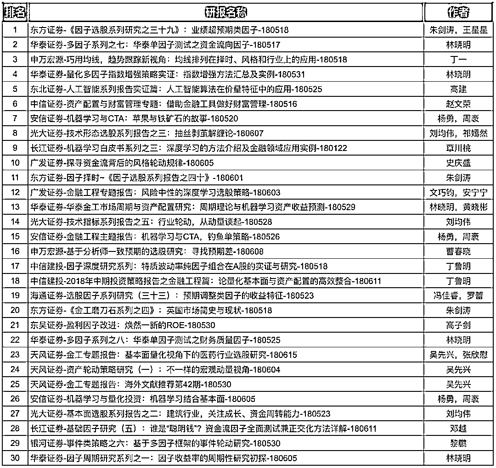
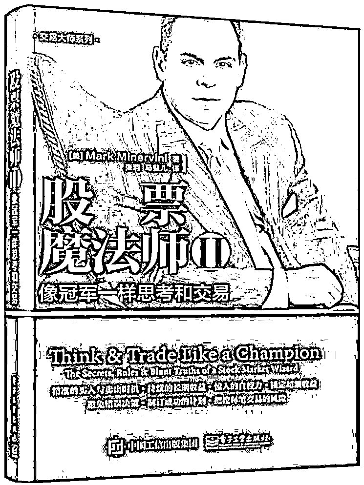

# 【干货】近期最受欢迎的券商金工研报汇总（文末送书）

> 原文：[`mp.weixin.qq.com/s?__biz=MzAxNTc0Mjg0Mg==&mid=2653288446&idx=1&sn=9c9eff76734dc2a9f1b046eb9184704a&chksm=802e35ebb759bcfdf5843d5b0892c8c2142e15a62454e31846fd979c215ae56ebab2a717cefa&scene=27#wechat_redirect`](http://mp.weixin.qq.com/s?__biz=MzAxNTc0Mjg0Mg==&mid=2653288446&idx=1&sn=9c9eff76734dc2a9f1b046eb9184704a&chksm=802e35ebb759bcfdf5843d5b0892c8c2142e15a62454e31846fd979c215ae56ebab2a717cefa&scene=27#wechat_redirect)

**量化投资与机器学习**

在 QI 的道路上，你不是一个人战斗！

 

**公众号**近期**文章预告**

 1、红宝书读书笔记（中文版）

2、金工、量化绿宝书精选解读（中文版）

3、比特币高频交易策略

[*4、高频交易策略解决方案基于机器学习*](https://mp.weixin.qq.com/s?__biz=MzAxNTc0Mjg0Mg==&mid=2653288278&idx=1&sn=73c6749fa89384391031c78a55768681&chksm=802e3543b759bc55fdaa974ac1d5a3c7a0a6ea11a272030dcb989978a96db6f2be8e5a0902cc&scene=21#wechat_redirect)

[*5、高频交易基于强化学习*](https://mp.weixin.qq.com/s?__biz=MzAxNTc0Mjg0Mg==&mid=2653288292&idx=1&sn=322bcd5400b339616e480775cce98bdf&chksm=802e3571b759bc6739d7fe48366a02f59f9e58a07360ac089b1e17b6350c4fd0ef4b8d735a7d&scene=21#wechat_redirect)

[*6、高频价格动态策略*](https://mp.weixin.qq.com/s?__biz=MzAxNTc0Mjg0Mg==&mid=2653288413&idx=1&sn=cddb1fbdefbcbd470e539bc030be28df&chksm=802e35c8b759bcdeeb836bfebaec2dc72570273b4ee4f39ee46137bff6798bcb5e392701e247&scene=21#wechat_redirect)

7、模式识别下的人工智能量化策略

**8、近期最热门的券商金工研报分享**

9、深度学习在金融中的论述

10、海内外优秀量化文献解读

[*11、**基于风险中性的深度学习选股策略*](https://mp.weixin.qq.com/s?__biz=MzAxNTc0Mjg0Mg==&mid=2653288319&idx=1&sn=e2be2ffda6b8c63f46a966790e8147ad&chksm=802e356ab759bc7c9a607ffb2145a020b454b2a97dac956684d484d5ed8bba5b09770d049dab&scene=21#wechat_redirect)

12、资产配置系列（二）

13、券商研报解读系列

14、人工智能应用量化系列

15、永不停歇的干货

从 2018 年 6 月 4 日起，公众号每发布一篇文章，就为大家分享一张 Octodex 的创意图。

**# 004**

从 2018 年，公众号不再对发布券商金工研报。

我们只对针对近期***（2018 年 5 月 17 日——2018 年 6 月 19 日）***研报做了统计分析，分享给大家最热门的研报。

当然

**送书活动**

一直继续

**近期热点**研报涉及**股票、CTA、资产配置**、**机器学习、多因子、海外研究**等共计 30 篇。相信不会让大家失望！

获取以上研报

在**后在**回复

**近期热点研报 1**

有些人不知道**后台回复**如何操作

为大家介绍一下：

**第 19 期赠书活动**

量化投资与机器学习公众号联合博文视点送出**5 本**《**股票魔法师 2——像冠军一样思考和交易******》****

******听说此书在网上大卖哦！******

> 从几千美元，到数百万美元，平均年收益率为 220%，换句话说，10 万美元的投资仅需要 5 年时间便激增至 3000 万美元，总回报率达 33 500%，怎么做到的？ 在《股票魔法师 II——像冠军一样思考和交易》一书中，作者揭示了交易规则和秘密技巧，一步步展示如何运用有效规则，改善投资回报，同时，由内而外培养获得超额回报的自信。读者将学到如何在自己的交易中运用该方法，从而真正像冠军一样交易！ Mark Minervini（马克·米勒维尼）是畅销书《股票魔法师——纵横天下股市的奥秘》的作者。从刚起步的数千美元，马克把他个人的交易账户规模增长到数百万美元，连续 5 年平均收益率达到 220%，并且没有一个季度出现亏损，总收益达到了令人惊叹的 33 500%。换句话说，仅仅 5 年时间，他用 10 万美元投资本金使账户增长到了 3 000 多万美元。 为了检验他创造的 SEPA 投资方法的可靠性，马克投入了 25 万美元加入全美投资大赛。与高杠杆的期货与期权投资者同台竞争，马克仅使用股票多头策略就赢得了比赛，当年投资收益率达到 155%。这个收益率几乎是同台竞技投资经理的两倍。

**原价：59.00 元**

**截止 2018.05.22 18:00**

大家在本篇推文【写留言】处发表留言，**获得****点赞****数****前五****的读者，即可免费获赠此书**。届时，工作人员会联系五位读者，寄出此书。