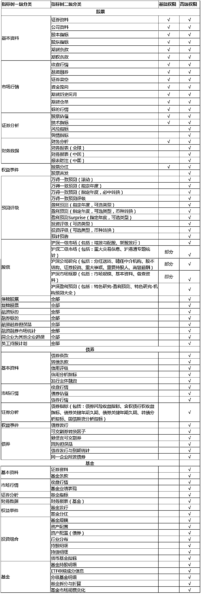
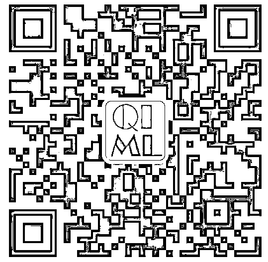

# 【大事件】公众号福利，强势来袭！

> 原文：[`mp.weixin.qq.com/s?__biz=MzAxNTc0Mjg0Mg==&mid=2653288432&idx=1&sn=6af2278e2bd40e30ee5b056f292d5e4b&chksm=802e35e5b759bcf31d4603d6e7d40d7eedd89eb2ad7ddb7ffce3966312297f5abc62eec80b32&scene=27#wechat_redirect`](http://mp.weixin.qq.com/s?__biz=MzAxNTc0Mjg0Mg==&mid=2653288432&idx=1&sn=6af2278e2bd40e30ee5b056f292d5e4b&chksm=802e35e5b759bcf31d4603d6e7d40d7eedd89eb2ad7ddb7ffce3966312297f5abc62eec80b32&scene=27#wechat_redirect)

**量化投资与机器学习**

你不是一个人战斗！

 

准备这个事情很久啦！今天给大家来个正式通知。目的只有一个，给所有关注公众号的读者带来最大的**福利**和**机遇**，希望你们在量化投资这条路上，越走越专业！

**大事件**

公众号在过去三个月的时间里，与很多家做量化的金融机构和创业公司进行了深入的交流和产品体验。就是想给所有关注公众号的读者们带来一些**实实在在的福利**。

最终我们与来自上海的*万得信息技术股份有限公司*（简称：**Wind**）旗下的 *WindQuant*量化云平台**（简称：**万****矿**）开展了一项合作。

这项合作可以让公众号的读者左手拿 Wind 数据，右手拿 Python，把量化玩的飞起！

为什么选万矿？原因有有三：

1、Wind 是大陆领先的金融数据、信息和软件服务企业。公众号目测目前 Wind 是国内最大的吧；

2、国内**几十万家金融机构**都在使用 Wind 的产品。对于搞量化的机构和个人来说，**Wind 几乎是首选必备**。

3、万矿的**量化****平台**属于**自主开发**，**数据则直接从 ****Wind API****接口调取**（这点我们觉得很给力也很重要，因为可以很好地衔接基于 Wind API 数据构建的的回测框架与量化研究）。

基于此

公众号最终选择了万矿

**看重它的数据优势和机构背景！**

这项合作的具体事宜请看下方

**项目福利**

> **1、用户可以获得万矿数据****高级权限****。**

> 其中基础免费权限是所有用户都具有的权限。主要包括**行情数据**、**股票基础财务数据**、**期货和期权数据**、**板块/指数成分数据**、**部分股票统计报表**等等。
> 
> 除基础免费权限外，**高级数据****权限**包括了所有股票的股票的**核心财务报表数据**、**衍生财务数据**、**券商盈利预测和评级数据**，以及**万得一致预期数据**等。

> 

> **2、Wind 举办的量化论坛、沙龙等优先参与权。**
> 
> **3、对接机构实习与就业。**

**如何获取项目福利？**

大家需根据万矿具体要求完成相应的项目任务（很简单的！）

具体要求请添加项目负责人，进**微信群**咨询：

添加微信号：**zxlgglr**

或

扫下方二维码进行添加

在职请备注：【公司+职位+姓名】

学生请备注：【学校+院系+姓名】

小伙伴们，这项活动是**完全****免费**哈！

量化投资与机器学习公众号成立 2 年多来，一直致力为全网所有宽客提供免费的量化资源与福利。我们一直坚持分享的精神，让宽客们有所收获，学到知识。

这一次与万矿的合作，是公众号经过长时间的筛选才最终确定的。对大家的福利也是经过多此协商争取来的，希望大家可珍惜这个机会。

祝你们在量化投资的道路上

**一战成名！**

**知识在于分享**

**在量化投资的道路上**

**你不是一个人在战斗**

量化投资于机器学习公众号