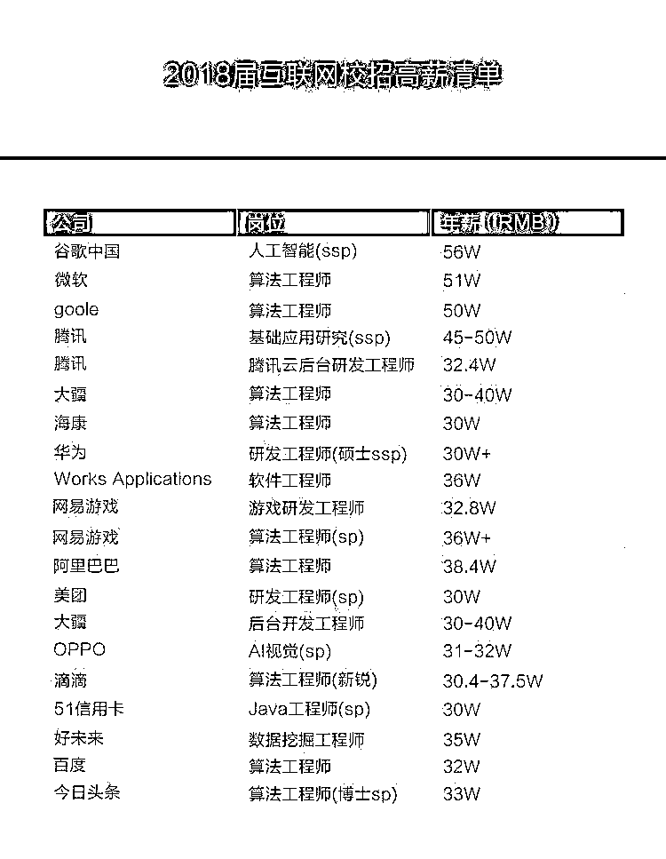
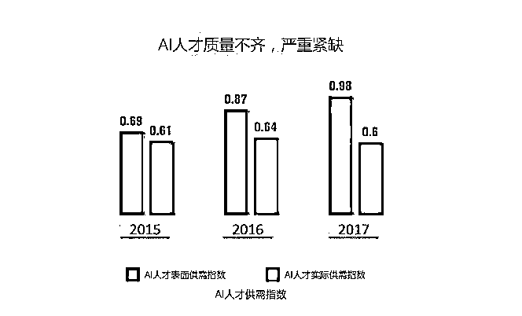
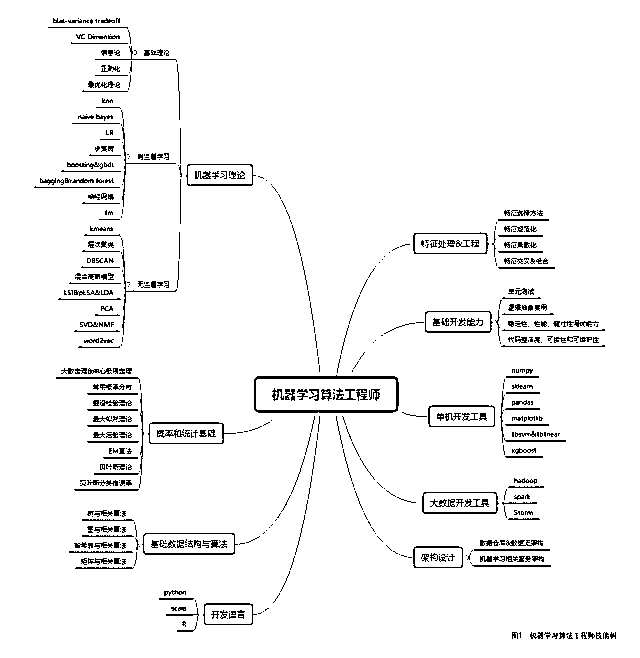
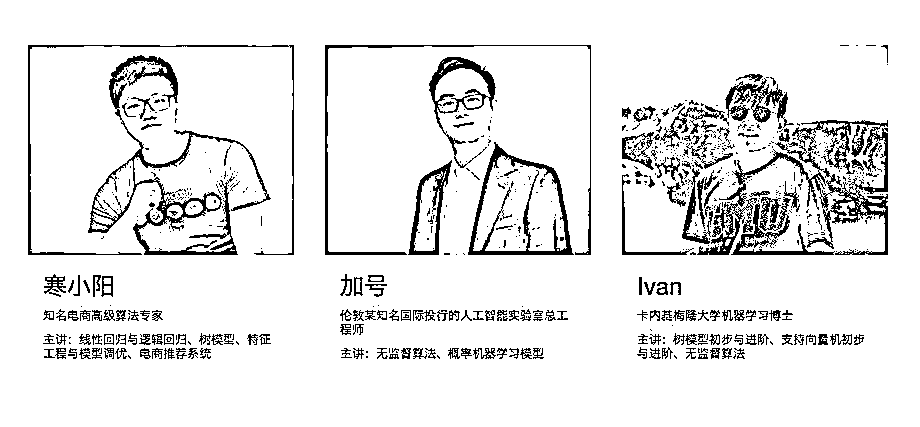
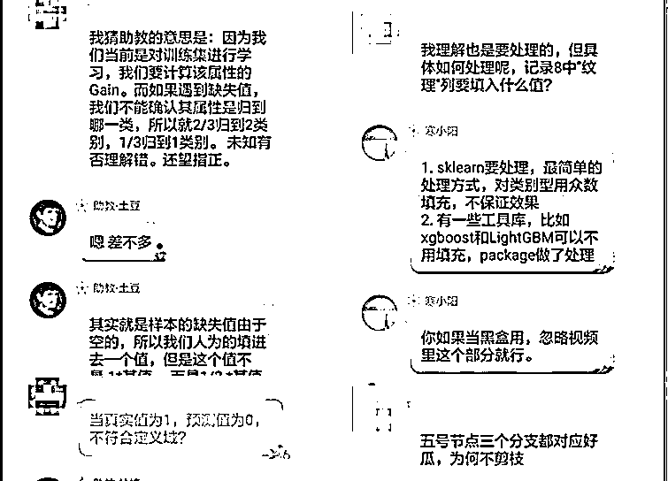
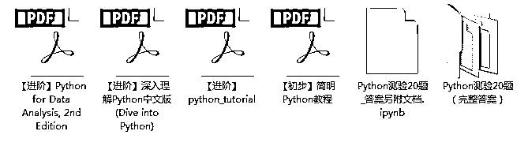
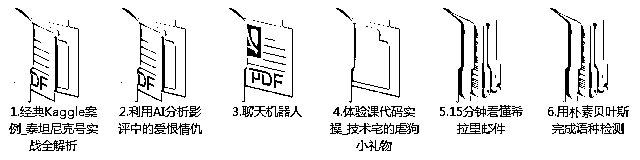
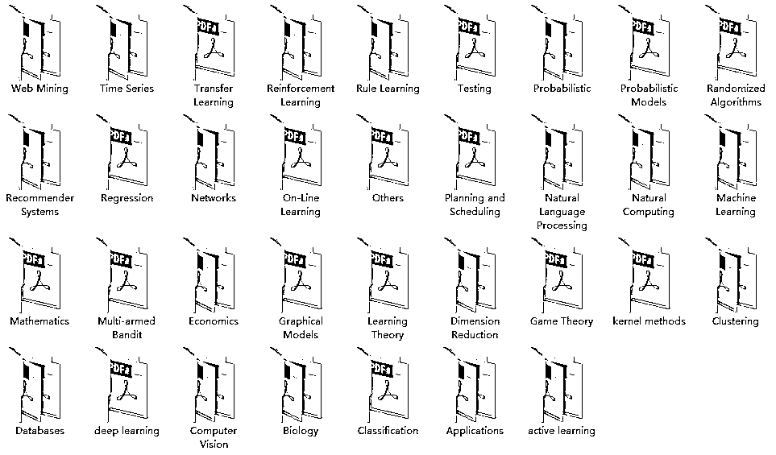

# 一毕业就拿 50 万年薪，超过 90%的互联网公司都在砸钱抢 AI 人才！

> 原文：[`mp.weixin.qq.com/s?__biz=MzAxNTc0Mjg0Mg==&mid=2653288417&idx=1&sn=8d7d04c18b70e3bda0658c441cf4ef47&chksm=802e35f4b759bce2fcd57ca46a874ac6be901c9d7977dcd0090e39ab596ca71539d5eebee8b5&scene=27#wechat_redirect`](http://mp.weixin.qq.com/s?__biz=MzAxNTc0Mjg0Mg==&mid=2653288417&idx=1&sn=8d7d04c18b70e3bda0658c441cf4ef47&chksm=802e35f4b759bce2fcd57ca46a874ac6be901c9d7977dcd0090e39ab596ca71539d5eebee8b5&scene=27#wechat_redirect)

毕业季到了！学生党们即将离开校园迈入社会。随着各个大厂的校招纷纷结束，一份流传于江湖的“18 届互联网校招薪酬表”引得众人羡慕！

 

**上面这份清单包括多家知名互联网企业 AI 类岗位的年薪水平，30 万起跳，40 万-50 万的也比比皆是。而从拿到这些企业 offer 的同学反馈来看，这份清单显示的年薪水平还是比较准确的。**

然而，即使有这么优厚的待遇，国内的 AI 公司依然处于缺人的状态。

近期由腾讯发布的报告显示，国内的 AI 人才缺口达 100 万甚至更多，而目前国内 AI 领域合格的研究人员不超过 30 万人。这么大的数额差，使得 2018 年以及未来的几年内，互联网企业还将开展更加激烈的 AI 人才争夺战。

图片来源：腾讯研究院-全球人工智能人才白皮书

**市场需求大，薪酬高，因此对广大技术从业者来说，目前是进入人工智能行业的好时机。**

不过，与之前的云计算、移动互联网相比，想要成为 AI 工程师需要掌握一张不算小的知识网络。如果以机器学习算法工程师的技能图谱为例，大概就是这样子的 

 

（拉到文末扫码进群，即可获取高清图表）

看到这里，相信很多同学已经跃跃欲试，想要加入到人工智能的大家庭中来了。然而迎头遇到的第一个问题就是该怎么入门？从什么开始学起？

最好的方法就是能找到一个比你自己更靠谱的前辈、老师帮你持续性的指导，并对你每一次练习都会给予一定的反馈，这样你才能真正掌握这些技能。

形象一点来说，就像是游戏中刚出新手村的你拉着一个高级老玩家帮你一起杀敌砍 Boss，赚经验值。最后的结果，当然是你的技能逐渐点亮，走向游戏人生巅峰。

因此，网易云课堂在此隆重推出《网易人工智能零基础入门》课程，由海内外顶尖工业界讲师精心打造，课程风格通俗易懂，并配合助教答疑，带你快速入门人工智能，实现 2018 互联网高薪 TOP1！今日限时免费！更有免费直播课提前扫盲！

更有免费附加赠送网易人工智能精品学习资料包，国外学习资料、行研报告免费领取～

**PART 1**

**《网易人工智能零基础入门》免费课程**

**课程讲师**

**▼**

由一线机器学习专家联合打造

基于实际应用场景的机器学习实战课程

**课程大纲**

**▼**

机器学习的就业前景

课前热身：Python 实战复习

机器学习工程师的实际应用案例

**PART 2**

**《全方位走进机器学习算法岗》**

**线上直播公开课**

**课程讲师**

**▼**

****

**寒小阳**

**知名电商高级算法专家**

**6 月 14 日 20:00-21:00**

****直播大纲****

******▼******

**1.盘点机器学习算法相关公司和岗位**

**2.一名机器学习算法工程师的日常**

**3.教你写一份能拿到 offer 的简历**

**4.揭秘必须掌握的面试核心考察点**

**5.学习路径简介与核心资源推荐**

****群内岗位解读****

**▼**

****

****PART 3****

****人工智能精品学习资料包****

**Python 入门方面的资料**

****▼****

****

**机器学习 6 个实战案例及项目源码**

**▼**

****

**134 篇国外 AI 论文**

**▼**

****

**** 如何获取？ ****

**扫码加入 QQ 群**

**即可免费攻读《网易人工智能零基础入门》**

**120 分钟精品入门课+6 大实战案例及项目源码**

****

**为了保证学习体验，** 

**本次“人工智能学习群"限时开放**

**数量有限，欲报从速**