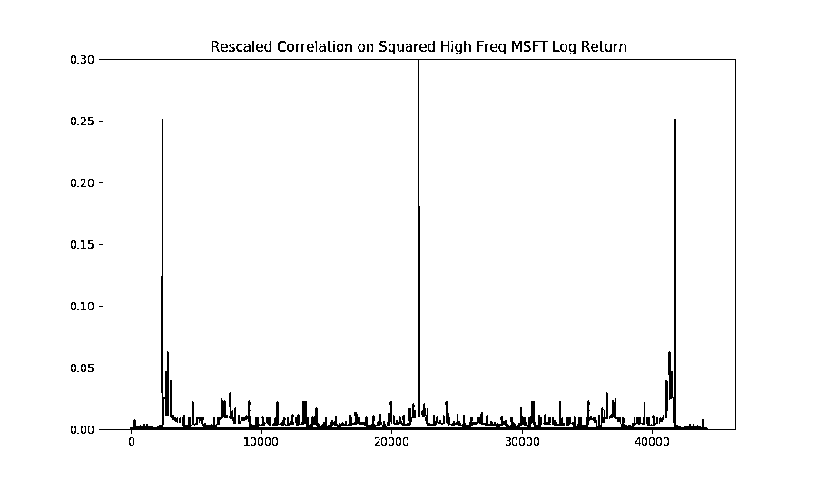
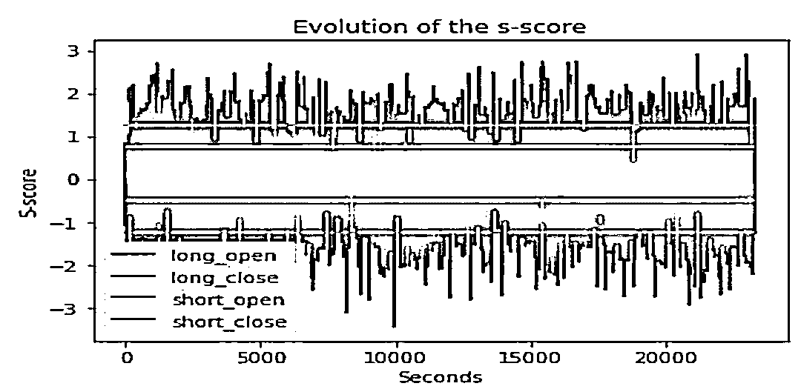
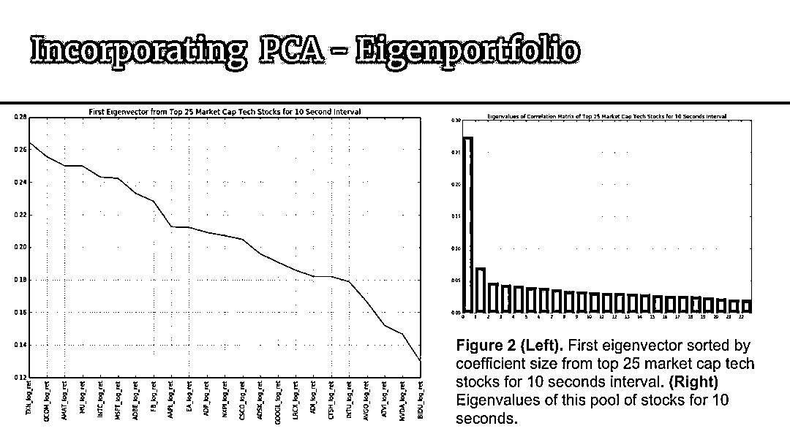

# 【HFT 系列】高频价格动态策略

> 原文：[`mp.weixin.qq.com/s?__biz=MzAxNTc0Mjg0Mg==&mid=2653288413&idx=1&sn=cddb1fbdefbcbd470e539bc030be28df&chksm=802e35c8b759bcdeeb836bfebaec2dc72570273b4ee4f39ee46137bff6798bcb5e392701e247&scene=27#wechat_redirect`](http://mp.weixin.qq.com/s?__biz=MzAxNTc0Mjg0Mg==&mid=2653288413&idx=1&sn=cddb1fbdefbcbd470e539bc030be28df&chksm=802e35c8b759bcdeeb836bfebaec2dc72570273b4ee4f39ee46137bff6798bcb5e392701e247&scene=27#wechat_redirect)

**量化投资与机器学习**

在 QI 的道路上，你不是一个人战斗！

 

**公众号**近期**文章预告**

 1、红宝书读书笔记（中文版）

2、金工、量化绿宝书精选解读（中文版）

3、比特币高频交易策略

[*4、高频交易策略解决方案基于机器学习*](https://mp.weixin.qq.com/s?__biz=MzAxNTc0Mjg0Mg==&mid=2653288278&idx=1&sn=73c6749fa89384391031c78a55768681&chksm=802e3543b759bc55fdaa974ac1d5a3c7a0a6ea11a272030dcb989978a96db6f2be8e5a0902cc&scene=21#wechat_redirect)

[*5、高频交易基于强化学习*](https://mp.weixin.qq.com/s?__biz=MzAxNTc0Mjg0Mg==&mid=2653288292&idx=1&sn=322bcd5400b339616e480775cce98bdf&chksm=802e3571b759bc6739d7fe48366a02f59f9e58a07360ac089b1e17b6350c4fd0ef4b8d735a7d&scene=21#wechat_redirect)

**6、高频价格动态策略**

7、模式识别下的人工智能量化策略

8、近期最热门的券商金工研报分享

9、深度学习在金融中的论述

10、海内外优秀量化文献解读

[*11、**基于风险中性的深度学习选股策略*](https://mp.weixin.qq.com/s?__biz=MzAxNTc0Mjg0Mg==&mid=2653288319&idx=1&sn=e2be2ffda6b8c63f46a966790e8147ad&chksm=802e356ab759bc7c9a607ffb2145a020b454b2a97dac956684d484d5ed8bba5b09770d049dab&scene=21#wechat_redirect)

12、资产配置系列（二）

13、券商研报解读系列

14、人工智能应用量化系列

15、永不停歇的干货

从 2018 年 6 月 4 日起，公众号每发布一篇文章，就为大家分享一张 Octodex 的创意图。

**# 003**

今天分享一篇基于 PPT 的高频交易研究。解读了部分内容，其余部分大家可以在【**阅****读原文】**下载代码自行研究。

**限价订单薄（LOB）**

*   Top of the Book - highest bid and the lowest ask orders

*   Price levels - several orders at the same price

*   Book depth - number of price levels available at a particular time in the book

*   The LOB data gives traders insight into supply and demand of market microstructure, and short-term price movements

解释 LOB

来源：https://nms.kcl.ac.uk/rll/enrique-miranda/index.html

推荐这个网站哈！

*   **高频价格与每日价格**

HF return - significantly smaller mean and variance, but sharper peak and fatter tail（肥尾）

代码展示

**自相关性**

High frequency log return - significantly less autocorrelation - fails to meet strong autocorrelation assumption of time series models.

代码展示

**GARCH 模拟**

结论：时间序列模型仍然适用于高频数据。 

缺点：

1、suboptimal parameters due to failure to converge.（**未收敛**） 

2、can’t model discrete / tick-size or zero price return.

代码展示

下面介绍其他的内容：

**综合应用**

*   **RNN 策略**

*   **特征与标签生成**

我们看到是一些基于量价和算法的特征

*   **模型构成**

*   **策略思路**

*   **结果和后续操作**

**统计套利策略**

*   **配对交易基于 Avellaneda-Lee**

举例

部分代码：

**全部代码：**

参考文献

[1] Avellaneda, M., & Lee, J. H. (2010). Statistical Arbitrage in the US Equities Market. Quantitative Finance, 10(7), p.761-782.

[2] Cartea, A., Jaimungal, S., and Peñalva, J. (2015). Algorithmic and high frequency trading. Cambridge University Press, chapter 11.

[3] Kercheval, A. and Zhang, Y. Modeling high-frequency limit order book dynamics with support vector machines. University of Florida, 2013

**知识在于分享**

**在量化投资的道路上**

**你不是一个人在战斗**

代码下载**【阅读原文】**