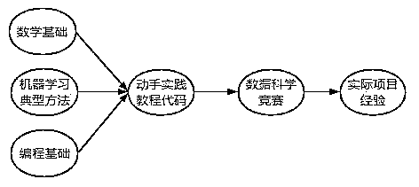
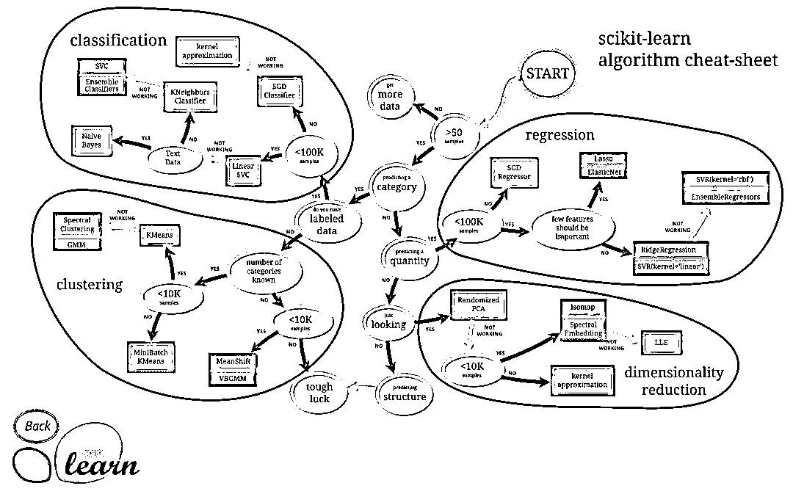

# 学好机器学习，这里有你想要的一切

> 原文：[`mp.weixin.qq.com/s?__biz=MzAxNTc0Mjg0Mg==&mid=2653288356&idx=1&sn=fe693f555feede2cd831875af449f0ef&chksm=802e35b1b759bca7f6e3e1453fcff06d96f27947331aef2ee46cb28cdddb1126e3caeadaecfd&scene=27#wechat_redirect`](http://mp.weixin.qq.com/s?__biz=MzAxNTc0Mjg0Mg==&mid=2653288356&idx=1&sn=fe693f555feede2cd831875af449f0ef&chksm=802e35b1b759bca7f6e3e1453fcff06d96f27947331aef2ee46cb28cdddb1126e3caeadaecfd&scene=27#wechat_redirect)

# 2017 年人工智能就已经列入了国务院的人工智能发展规划中，人工智能将成为推动中国发展的新生科技力量，并在未来扮演着越来越重要的角色，在这一背景下，机器学习会慢慢成为一个程序员必备的底层能力。

# 对于想要了解或从事 AI 行业工作的小伙伴们来说，能够快速、深入的掌握机器学习相关知识显得尤为重要，小编给大家整理机器学习的学习方法。 

## ** 机器学习学习方法**

如何去学，或者说如何高效的学以及学习的步骤和侧重点非常重要。

**1、切勿掉入书山中，实践理论结合重要**

很多人可能会一头扎进书山中埋头苦读，读完一本接着一本最后发现什么都懂点什么又都没懂，这样效率是很低的。在 IT 界，实践才能学到东西，不要一直看书，可以边看边试试写点代码，实现个小公式，小算法，这样进步快一些。

**2、采取并行学习法而非串行**

这幅图可以作为学习的基本流程，但是未必需要前面具备才往后进行，可以一边学基础，一边写代码，一边还可以做比赛，这样前期会痛苦一些，但在后面的学习过程中，速度会很快。

**3、建立知识框架，修补知识漏洞**

上面这幅图是是 sklearn 的机器学习算法笔记，你可以在学习中去建立类似的笔记，有助于建立起整个学习框架，对于不懂得，再不断从细节去学。

**4、找到适合你的课程，跟着从头到尾学**

如果你是上班族或者没有专业的老师给你讲这门课，那么报一门适合你的课程从头到尾跟着学就非常重要了，不要过于相信你的自制力，没有人和你一起学，你学了很久也看不到进步，慢慢兴趣就没了，所以找到能从头到尾给你讲的课程也很重要，这里，我想推荐一门**《机器学习》**给你。

**请相信我，这是一堂性价比爆炸的课程，超值到你如果不买，会后悔的那种。**

**先做个简单介绍：**

*   课程名：《机器学习》

*   上课时间：6 月 22 日开课；课程直播时间为**10 周**，**20**课时，**40 小时直播**；课程有效期为 12 个月，有效期内均可反复观看课程内容。

*   课程价格：仅售**399**元。

*   学习形式：在线直播课程+讲师答疑+微信班级群交流，全程由班主任+多位专业助教带班，报名后在小象学院官网或服务号可学习课程。

报名，咨询，查看课程，请点击文末【**阅读原文**】

****主讲老师****

****秦曾昌  ****

**英国布里斯托(Bristol)大学硕士、博士。美国加州大学伯克利分校(UC Berkeley)博士后、牛津 (Oxford) 大学与卡内基梅隆大学 (CMU) 访问学者。目前主要研究方向为数据挖掘、跨媒体检索与自然语言理解。出版英文专著 1 本（Springer 出版）、编辑论文集 1 本和专业论文或章节 (Book Chapter) 90 余篇。同时在 IT 工业界做机器学习、大数据、人工智能等专业技术咨询工作。** 

****升级特点****

**1.  本课程的教学重心是**从数学层面理解并掌握推导经典的机器学习算法**，从历史到细节深入了解机器学习的基本思想和各种算法的具体思路与方法。**

**2.  强化**数学、概率论、数理统计**的基础知识，夯实机器学习的基础必备知识。**

**3.  本课程将提供严谨的**数学推导过程文档**，帮助学员更好地掌握算法推导（面试必备）**

**4.  课程中讲设置**随堂测验环节**，帮助学员在课中巩固和理解重要知识点。**

****课程大纲****

****第一课：机器学习的数学基础****

**   1\.  机器学习的数学基础**

**        a. 函数与数据的泛化**

**        b. 推理与归纳 (Deduction and Induction)**

**   2\. 线性代数（Linear Algebra）**

**        a. 向量与矩阵 (Vector and Matrix)**

**        b. 特征值与特征向量**

**        c. 向量与高维空间**

**        d. 特征向量（Feature Vector）**

**   3\.  概率与统计（Probability and Statistics）**

**        a. 条件概率与经典问题 (Conditional Probability)**

**        b. 边缘概率 (Marginal Probability)**

**   4\.  **作业/实践： 财宝问题的概率计算程序****

****第二课：机器学习的数学基础****

**   1\.  统计推理（Statistical Inference）**

**        a. 贝叶斯原理与推理 (Bayesian Theorem)**

**        b. 极大似然估计 (Maximum Likelihood)**

**        c. 主观概率（Subjective Probability）**

**        d. 最大后延概率（MAP)**

**   2\.  随机变量（Random Variable）**

**        a. 独立与相关 (Independence)**

**        b. 均值与方差 （Mean and Variance）**

**        c. 协方差 (Co-Variance)**

**   3\.  概率分布（Probability Distributions)**

**   4\.  中心极限定理（Central Limit Theorem)**

**   5\.  **作业/实践： 概率分布采样与不同随机变量之间协方差计算****

****第三课：机器学习的数学基础****

**   1\.  梯度下降（Gradient Descent）**

**        a. 导数与梯度（Derivative and Gradient）**

**        b. 随机梯度下降（SGD）**

**        c. 牛顿方法（Newton's Method)**

**   2\.  凸函数（Convex Function）**

**        a. Jensen 不等式（Jensen's Inequality）**

**        b. 拉格朗日乘子（Lagrange Multiplier）**

**   3\.  **作业/实践： 利用牛顿方法求解给定的方程****

****第四课：机器学习的哲学（Philosophy of ML）****

**   1\.  算法的科学（Science of Algorithms）**

**        a. 输入与输出的神话（Mystery of I/O）**

**        b. 奥卡姆剃刀（Occam’s Razor）**

**   2\.  维数的诅咒（Curse of Dimensionality）**

**        a. 高维的几何特性 (Geometric Properity )**

**        b. 高维空间流形（High-dimensional Manifold）**

**   3\.  机器学习与人工智能（Machine learning and AI）**

**   4\.  机器学习的范式（Paradigms of ML）**

****第五课：经典机器学习模型（Classical ML Models）****

**   1\.  样本学习（Case-Based Reasoning）**

**        a. K-近邻（K-Nearest Neighbors）**

**        b. K-近邻预测（KNN for Prediction）**

**        c. 距离与测度（Distance and Metric）**

**   2\.  朴素贝叶斯（Naïve Bayes Classifier)**

**        a. 条件独立（Conditional Independence）**

**        b. 分类（Naive Bayes for Classification)**

**   3\.  **作业/实践：垃圾邮件分类的案例****

****第六课：经典机器学习模型（Classical ML Models）****

**   1\.   决策树（Decision Tree Learning）**

**         a. 信息论与概率**

**         b. 信息熵（Information Entropy）**

**         c. ID3**

**   2.  预测树（CART）**

**         a.  Gini 指标（Gini Index）**

**         b.  决策树与规则（DT and Rule Learning）**

**   3\.  **作业/实践：决策树分类实验****

****第七课：经典机器学习模型（Classical ML Models）****

**   1\.  集成学习（Ensemble learning）**

**        a. Bagging and Boosting**

**        b. AdaBoost **

**        c. 误差分解（Bias-Variance Decomposition）**

**        d. 随机森林（Boosting and Random Forest）**

**   2\. 模型评估（Model Evaluation）**

**        a. 交叉验证（Cross-Validation）**

**        b. ROC (Receiver Operating Characteristics)**

**        c. Cost-Sensitive Learning**

**   3\.  **作业/实践：随机森林与决策树分类实验的比较****

****第八课：线性模型（Linear Models）****

**   1\.  线性模型（Linear Models）**

**        a. 线性拟合（Linear Regression）**

**   2\.  最小二乘法（LMS）**

**        b. 线性分类器（Linear Classifier）**

**   3\.  感知器（Perceptron）**

**   4\.  对数几率回归（Logistic Regression）**

**   5\.  线性模型的概率解释 (Probabilistic Interpretation)**

**   6\.  **作业/实践：对数几率回归的文本情感分析中应用****

****第九课：线性模型（Linear Models）****

**   1\.  线性判别分析 (Linear Discrimination Analysis)**

**   2\.  约束线性模型 (Linear Model with Regularization)**

**         a. LASSO**

**         b. Ridge Regression**

**   3\.  稀疏表示与字典学习 **

**         a. Sparse Representation & Coding**

**         b. Dictionary Learning**

****第十课：核方法（Kernel Methods）****

**   1\.  支持向量机 SVM（Support Vector Machines）**

**        a. VC-维（VC-Dimension）**

**        b. 最大间距（Maximum Margin）**

**        c. 支撑向量（Support Vectors）**

**   2\.  **作业/实践：SVM 不同核函数在实际分类中比较****

****第十一课：核方法（Kernel Methods）****

**   1\.  对偶拉格朗日乘子**

**   2\.  KKT 条件（KKT Conditions）**

**   3\.  Support Vector Regression (SVR)**

**   4\.  核方法（Kernel Methods）**

****第十二课：统计学习（Statistical Learning）****

**   1\.  判别模型与生成模型**

**        a. 隐含变量（Latent Variable）**

**   2\.  混合模型（Mixture Model）**

**        a. 三枚硬币问题（3-Coin Problem）**

**        b. 高斯混合模型（Gaussian Mixture Model）**

**   3\.  EM 算法（Expectation Maximization）**

**        a. 期望最大（Expectation Maximization）**

**        b. 混合模型的 EM 算法（EM for Mixture Models）**

**        c. Jensen 不等式 (Jensen's Inequality)**

**        d. EM 算法推导与性能 (EM Algorithm)**

****第十三课：统计学习（Statistical Learning）****

**   1\.  隐马可夫模型（Hidden Markov Models）**

**        a. 动态混合模型（Dynamic Mixture Model）**

**        b. 维特比算法（Viterbi Algorithm）**

**        c. 算法推导 (Algorithm)**

**   2\.  条件随机场（Conditional Random Field）**

****第十四课：统计学习（Statistical Learning）****

**   1\.  层次图模型（Hierarchical Bayesian Model）**

**        a. 概率图模型 (Graphical Model)**

**        b. 从隐含语义模型到 p-LSA (From LSA to P-LSA)**

**        c. Dirichlet 分布与特点（Dirichlet Distribution）**

**        d. 对偶分布（Conjugate Distribution）**

****第十五课：统计学习（Statistical Learning）****

**   1\.  主题模型（Topic Model – LDA）**

**        a. Latent Dirichlet Allocation**

**        b. 文本分类（LDA for Text Classification）**

**   2\.  中文主题模型（Topic Modeling for Chinese）**

**   3\.  其他主题模型（Other Topic Variables）**

****第十六课：无监督学习（Unsupervised Learning）****

**   1\.  K-均值算法（K-Means）**

**        a. 核密度估计（Kernel Density Estimation）**

**        b. 层次聚类（Hierarchical Clustering）**

**   2\.  蒙特卡洛(Monte Carlo)**

**        a. 蒙特卡洛树搜索（Monte Carol Tree Search）**

**        b. MCMC（Markov Chain Monte Carlo）**

**        c. Gibbs Sampling**

****第十七课：流形学习（Manifold Learning）****

**   1\.  主成分分析（PCA）**

**        a. PCA and ICA**

**   2\.  低维嵌入（Low-Dimensional Embedding）**

**        a. 等度量映射（Isomap）**

**        b. 局部线性嵌入（Locally Linear Embedding）**

****第十八课：概念学习（Concept Learning）****

**   1.  概念学习（Concept Learning）**

**        a. 经典概念学习**

**        b. One-Short 概念学习**

**   2\.  高斯过程学习（Gaussian Process for ML）**

**        c. Dirichlet Process**

****第十九课：强化学习（Reinforcement Learning）****

**    1.  奖赏与惩罚（Reward and Penalty）**

**        a. 状态空间 (State-Space Model)**

**        b. Q-学习算法 (Q-Learning)**

**   2\.  路径规划 （Path Planning）**

**   3\.  游戏人工智能 （Game AI）**

**   4\.  **作业/实践：小鸟飞行游戏的自动学习算法****

****第二十课：神经网络****

**   1\.  多层神经网络**

**        a. 非线性映射（Nonlinear Mapping）**

**        b. 反向传播（Back-propagation）**

**   2\.  自动编码器（Auto-Encoder）**

**报名，咨询，查看课程，请点击**【阅读原文】****

****↓↓↓****