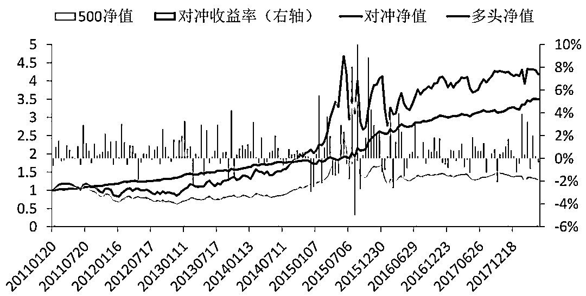

# 【最新研究】基于风险中性的深度学习选股策略

> 原文：[`mp.weixin.qq.com/s?__biz=MzAxNTc0Mjg0Mg==&mid=2653288319&idx=1&sn=e2be2ffda6b8c63f46a966790e8147ad&chksm=802e356ab759bc7c9a607ffb2145a020b454b2a97dac956684d484d5ed8bba5b09770d049dab&scene=27#wechat_redirect`](http://mp.weixin.qq.com/s?__biz=MzAxNTc0Mjg0Mg==&mid=2653288319&idx=1&sn=e2be2ffda6b8c63f46a966790e8147ad&chksm=802e356ab759bc7c9a607ffb2145a020b454b2a97dac956684d484d5ed8bba5b09770d049dab&scene=27#wechat_redirect)

**量化投资与机器学习**

在量化投资的道路上，你不是一个人战斗！

 

**公众号**近期**文章预告**

 1、红宝书读书笔记（中文版）

2、金工、量化绿宝书精选解读（中文版）

3、比特币高频交易策略

[*4、高频交易策略解决方案基于机器学习*](https://mp.weixin.qq.com/s?__biz=MzAxNTc0Mjg0Mg==&mid=2653288278&idx=1&sn=73c6749fa89384391031c78a55768681&chksm=802e3543b759bc55fdaa974ac1d5a3c7a0a6ea11a272030dcb989978a96db6f2be8e5a0902cc&scene=21#wechat_redirect)

[*5、高频交易基于强化学习*](https://mp.weixin.qq.com/s?__biz=MzAxNTc0Mjg0Mg==&mid=2653288292&idx=1&sn=322bcd5400b339616e480775cce98bdf&chksm=802e3571b759bc6739d7fe48366a02f59f9e58a07360ac089b1e17b6350c4fd0ef4b8d735a7d&scene=21#wechat_redirect)

6、高频交易基于核主成分分析

7、模式识别下的人工智能量化策略

8、近期 10 篇最热门的券商金工研报

9、深度学习在金融中的论述

10、海内外优秀量化文献解读

11、永不停歇的干货

**12、券商研报研读系列（一）**

从 2018 年 6 月 4 日起，公众号每发布一篇文章，就为大家分享一张 Octodex 的创意图。

**# 002**

今天我们为大家带来最新的研报内容，来自**广发证券金工团队**的**《风****险中性的深度学习选股策略》**。下面让我们来一起学习吧！

**风险中性的机器学习选股模型**

模型训练**：**通过训练样本，确定模型结构，优化模型参数。

预测输出 Y 的维度：3。

输入特征 X 的维度：156(128 个因子+28 个行业) 通过网格搜索获取最优的模型结构。

选取模型结构为: 156(输入层)-512-200-200-200-128-3(输出层) 即一共包含 5 个隐层。

隐层节点数依次为：512(隐层 1)、 200(隐层 2)、 200(隐层 3)、 200(隐层 4)、 128(隐层 5)。 

**提高深层神经网络选股性能的主要方法：**

> 1、采用 relu 等激活函数。 
> 
> 2、将优化目标函数 MSE 改成交叉熵。
> 
> 3、Batch normalization 技术。
> 
> 4、Dropout 技术。

**采用 Keras 作为机器学习平台：**

> 1、可以选择 Tensorflow、CNTK、Theano(目前已经停止更新)作为后端。
> 2、目前已经支持多 GPU。
> 3、显卡选择：Nvidia GTX Titan XP, GTX 1080Ti, GTX Titan, GTX 1080, GTX1070, GTX 1060。

机器学习多因子选股模型:从股票特征中提取信息，对股票未来的收益进行预 测，选出能够产生超额收益的股票组合。

**多因子选股模型：**

挑选出未来一期能够产，生超额收益的股票。

**↓↓↓**

**风险中性的多因子选股模型：**

挑选出未来一期，**在剥离风险因子影响后**，能够产生的超额收益的股票。

如何实现上述目标? 针对具体的应用场景，构建适当的机器学习预测模型。

**普通的样本标注方法**

训练时，根据未来一期的股票涨跌幅来给样本贴“标签”：上涨、下跌、平盘同一时刻，按照涨跌幅进行排序，确定样本的输出标签。

**行业中性的样本标注：寻找不同行业内能够跑出超额收益的股票**

训练时，根据未来一期的股票涨跌幅来给样本贴“标签”：上涨、下跌、平盘 同一时刻，按照涨跌幅进行排序，确定样本的输出标签。

**市值中性的样本标注：寻找不同市值区间内能够跑出超额收益的股票**

训练时，根据未来一期的股票涨跌幅来给样本贴“标签”：上涨、下跌、平盘 同一时刻，按照涨跌幅进行排序，确定样本的输出标签。

**风险中性的样本标注：更一般的方法**

未来一期股票收益率对风险因子做线性回归，获得残差，按残差进行样本标注

**策略与实证分析**

**策略流程**

**数据预处理**

**因子标准化：**

> 1、异常值、缺失值处理
> 
> 2、极值压边界处理
> 
> 3、沿时间方向的因子标准化
> 
> 4、沿截面的因子标准化
> 
> 5、按照机器学习模型来调整因子分布

**风险中性的深度学习选股模型的 IC**

IC 的平均值为 0.082，标准差为 0.108。

**深度学习因子与流通市值的相关性：IC 序列的相关性**

经过行业和市值中性化之后，深度学习因子更少受到市值因子的影响。

**深度学习因子与流通市值的相关性：截面相关性**

经过行业和市值中性化之后，深度学习因子更少受到流通市值因子的影响。

**回测参数设置 **

*   **调仓周期：**10 个交易日 

*   **股票池：**中证 500 成份股，剔除 ST 股票，剔除交易日停牌和涨停、跌停的股票 

*   **超配组合：**调仓时分 10 档，等权买入深度学习模型打分最高的一档 

*   **对冲基准：**中证 500 指数 

*   **原始因子数据：**估值因子、规模因子、反转因子、流动性因子、波动性因子、技术 指标，共计 128 个因子，以及 28 个行业 0-1 变量 

*   **风险因子：**行业、流通市值 

*   **深度学习模型训练：**每半年滚动更新模型，采用最近 4 年的样本作为训练集 

*   **策略回测：**2011 年 1 月-2018 年 4 月 30 日 

*   **交易成本：**千分之三

**普通的深度学习选股策略**

2011 年以来，年化收益率 19.71%，最大回撤 -5.35%，胜率为 69.5%，信息比 2.47。

**风险中性的深度学习选股策略** 2011 年以来，年化收益率 21.95%，最大回撤 -5.03%，胜率为 74.6%，信息比 2.92。

**风险中性深度学习选股策略** 年化收益率 21.95%，最大回撤 -5.03%，胜率为 74.6%，信息比 2.92

**普通深度学习选股策略** 年化收益率 19.71%，最大回撤 -5.35%，胜率为 69.5%，信息比 2.47

**机器学习策略表现的同质性：不同策略的表现有一定的相关性**

用普通深度学习模型的 IC 对风险中性深度学习模型的 IC 进行回归，R 方为 0.84。 说明两种策略的表现有较强的相关性。 

**机器学习策略每期组合的同质性：选取的组合有较大的差异**

当组合规模 N 为 50 时，两种深度学习选股策略平均每期选到的股票有 41.9%重合。（参考：两次独立的随机选股中，平均有 10%重合。）

当组合规模 N 为 100 时，两种深度学习选股策略平均每期选到的股票有 53.3%重合。（参考：两次独立的随机选股中，平均有 20%重合。）

**总结**

*   将风险因子中性化处理后，可以构建新的深度学习选股模型，该模型受风险 因子的影响较小。

*   2011 年以来，中证 500 内选股对冲策略年化收益率 21.95%，最大回撤 - 5.03%，胜率为 74.6%，信息比 2.92。

*   即使是采用同样的特征和模型结构，风险因子中性化之后，训练的策略也会 有较大的差别，可以通过此方法丰富深度学习选股策略的多样性。

> 本文旨在对所研究问题的主要关注点进行分析，因此对市场及相 关交易做了一些合理假设，但这样会导致建立的模型以及基于模型所得 出的结论并不能完全准确地刻画现实环境。而且由于分析时采用的相关 数据都是过去的时间序列，因此可能会与未来真实的情况出现偏差。本 文内容并不是适合所有的投资者，客户在制定投资策略时，必须结合自 身的环境和投资理念。

**知识在于分享**

**在量化投资的道路上**

**你不是一个人在战斗**