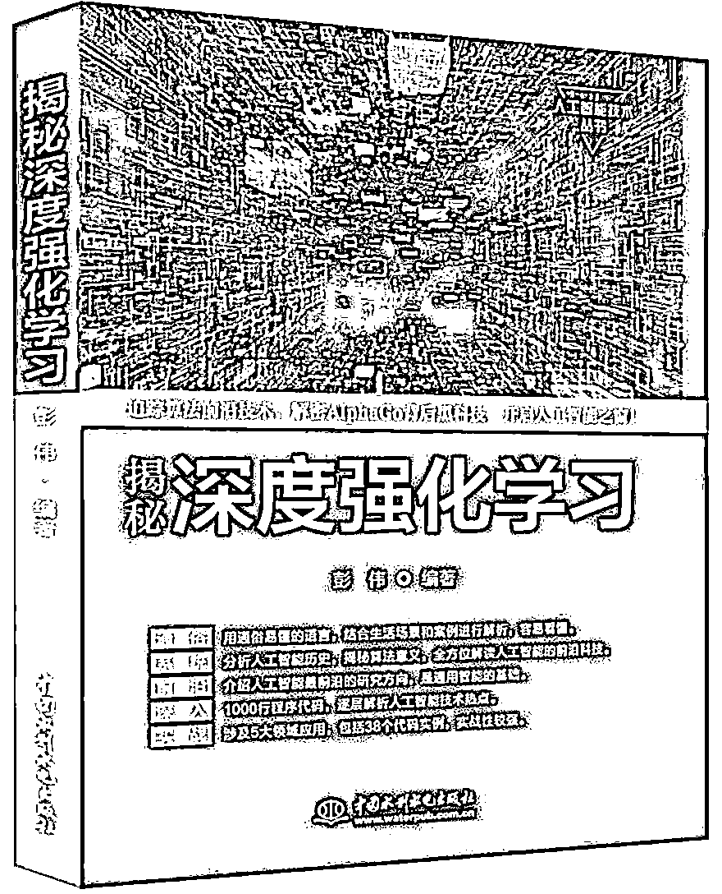

# 【HFT 系列】利用强化学习构建高频交易模型（文末送书）

> 原文：[`mp.weixin.qq.com/s?__biz=MzAxNTc0Mjg0Mg==&mid=2653288292&idx=1&sn=322bcd5400b339616e480775cce98bdf&chksm=802e3571b759bc6739d7fe48366a02f59f9e58a07360ac089b1e17b6350c4fd0ef4b8d735a7d&scene=27#wechat_redirect`](http://mp.weixin.qq.com/s?__biz=MzAxNTc0Mjg0Mg==&mid=2653288292&idx=1&sn=322bcd5400b339616e480775cce98bdf&chksm=802e3571b759bc6739d7fe48366a02f59f9e58a07360ac089b1e17b6350c4fd0ef4b8d735a7d&scene=27#wechat_redirect)

**量化投资与机器学习**

在量化投资的道路上，你不是一个人战斗！

 

**近期公众号文章预告**

 1、红宝书读书笔记（中文版）

2、金工、量化绿宝书精选解读（中文版）

3、比特币高频交易策略

[*4、高频交易策略解决方案基于机器学习*](https://mp.weixin.qq.com/s?__biz=MzAxNTc0Mjg0Mg==&mid=2653288278&idx=1&sn=73c6749fa89384391031c78a55768681&chksm=802e3543b759bc55fdaa974ac1d5a3c7a0a6ea11a272030dcb989978a96db6f2be8e5a0902cc&scene=21#wechat_redirect)

**5、高频交易基于强化学习**

6、高频交易基于核主成分分析

7、模式识别下的人工智能量化策略

8、近期 10 篇最热门的券商金工研报

9、深度学习在金融中的论述

10、海外优秀量化文献解读

11、永不停歇的干货

今天 Github 被微软收购的事情刷屏了，恰好，我们这篇文章就是来源于 Github。

从今天起，公众号每发布一篇文章，就为大家分享一张 Octodex 的创意图片。 

**# 001**

**前言**

The present study proposes the use of a reinforcement learning model to develop an interest rate trading strategy directly from historical high-frequency order book data. No assumption about market dynamics is made, but it requires creating a simulator wherewith the learning agent can interact to gain experience. Different variables related to the microstructure of the market are tested to compose the state of the environment. Functions based on P&L and/or consistency in the order placement by the agent are tested to evaluate the actions taken. The results suggest some success in bringing the proposed techniques to trading. However, it is presumed that the achievement of consistently profitable strategies is highly dependent on the constraints placed on the learning task. 

**Keywords:** Machine Learning. Reinforcement Learning. Q-learning. Yield Curve. High frequency trading.

**论文 PDF 下载地址：**

*http://bibliotecadigital.fgv.br/dspace/bitstream/handle/10438/18707/uira_caiado_tradingRL.pdf?sequence=1&isAllowed=y*

**Github 项目下载地址：**

*https://github.com/ucaiado/rl_trading*

**第十八期赠书活动**

量化投资与机器学习公众号联合中国水利水电出版社送出**5 本**《**揭秘深度强化学习******》****

> 深度强化学习（Deep Reinforcement Learning，DRL）是深度学习算法和强化学习算法的巧妙结合，它是一种新兴的通用人工智能算法技术，也是机器学习的前沿技术，DRL 算法潜力无限，AlphaGo 是目前该算法相当成功的使用案例。DRL 算法以马尔科夫决策过程为基础，是在深度学习强大的非线性函数的拟合能力下构成的一种增强算法。深度强化学习算法主要包括基于动态规划（DP）的算法以及基于策略优化的算法，本书的目的就是要把这两种主要的算法（及设计技巧）讲解清楚，使算法研究人员能够熟练地掌握。本书囊括了强化学习基础知识、马尔科夫决策过程、无模型强化学习、模仿学习、深度学习基础知识、神经网络基本组成、反向传播算法、功能神经网络层、循环神经网络、卷积神经网络（CNN）的基础和结构、循环神经网络（RNN）、深度强化学习基础、蒙特卡洛搜索树、策略梯度算法、深度强化学习算法框架、深度 Q 学习、双 Q 学习、异步优越性策略子-评价算法、深度强化学习应用实例等。深度强化学习算法可应用于量化投资、游戏智能、机器人决策、自动驾驶、无人机等。

**原价：89.80 元**

**截止 2018.06.07 18:00**

大家在本篇推文【写留言】处发表留言，**获得****点赞****数****前五****的读者，即可免费获赠此书**。届时，工作人员会联系五位读者，寄出此书。

**知识在于分享**

**在量化投资的道路上**

**你不是一个人在战斗**