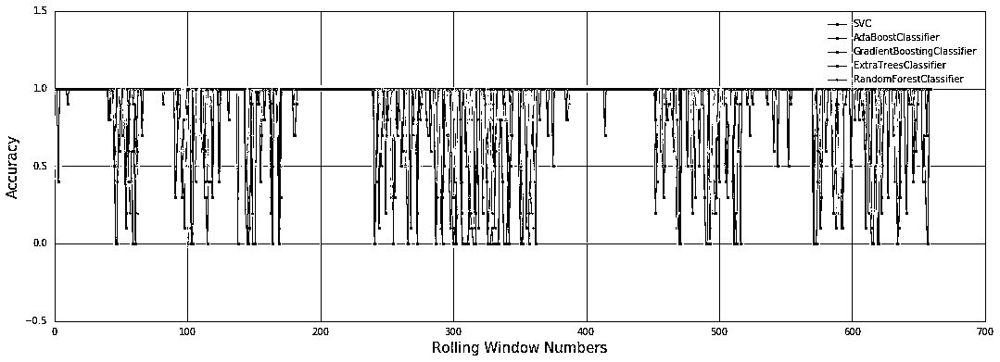
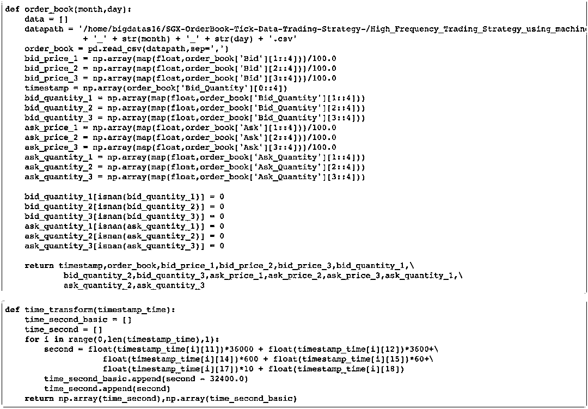
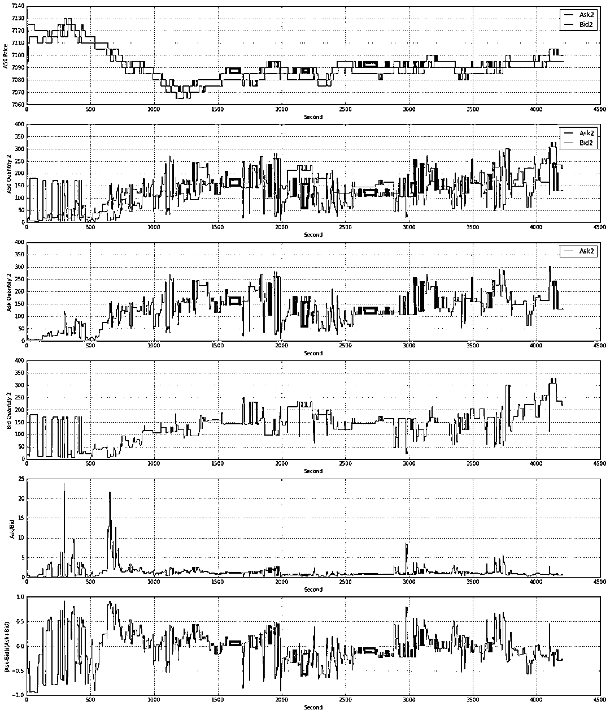

# 【HFT 系列】基于机器学习的动态高频限价订单簿框架（Tick 数据）

> 原文：[`mp.weixin.qq.com/s?__biz=MzAxNTc0Mjg0Mg==&mid=2653288278&idx=1&sn=73c6749fa89384391031c78a55768681&chksm=802e3543b759bc55fdaa974ac1d5a3c7a0a6ea11a272030dcb989978a96db6f2be8e5a0902cc&scene=27#wechat_redirect`](http://mp.weixin.qq.com/s?__biz=MzAxNTc0Mjg0Mg==&mid=2653288278&idx=1&sn=73c6749fa89384391031c78a55768681&chksm=802e3543b759bc55fdaa974ac1d5a3c7a0a6ea11a272030dcb989978a96db6f2be8e5a0902cc&scene=27#wechat_redirect)

**量化投资与机器学习**

在量化投资的道路上，你不是一个人战斗！

 

**近期公众号文章预告**

 1、红宝书读书笔记（中文版）。

2、金工、量化绿宝书精选解读（中文版）。

3、比特币高频交易策略。

**4、高频交易策略解决方案基于机器学习。**

5、高频交易基于强化学习。

6、高频交易基于核主成分分析。

7、模式识别下的人工智能量化策略。

8、近期 10 篇最热门的券商金工研报。

9、深度学习在金融中的论述。

10、海外优秀量化文献解读。

11、永不停歇的干货。

近期，我们发现了一个基于 SGX 市场的高频交易项目，分享给大家，以供学习和参考。**源代码**在请在**文末下载**

**动态高频限价订单框架**

# **前言**

# 使用机器学习方法来捕捉高频限价订单动态和简单的交易策略，以获得损益结果。

# **数据准备**

我们以某一天举例。

# **学习模型训练器**

1、RandomForestClassifier 

2、ExtraTreesClassifier

3、AdaBoostClassifier

4、GradientBoostingClassifier

5、SVM

**超参数调整**

**模型选择 Pipline**

**机器学习 Pipline**

# **使用最佳的模型预测下一个 10 秒**

**交叉验证**

**最佳模型**

**准确性在一天之内**

# ****预测结果****

# ****特征提取****

**上升比**

选取开盘 09:15 ~ 11:30

**深度比**

**代码展示**

#### **Bid 1 & Ask 1**

#### **Bid2 & Ask2**

其他时间段略。

**Bid123 订单数量**

**Bid123、Ask123 订单数量**

# **利润和损失**

来源参考：https://github.com/rorysroes/SGX-Full-OrderBook-Tick-Data-Trading-Strategy

**源代码**

**请在****后台****回复**

**高频系列 1**

有些人不知道**后台回复**如何操作

为大家介绍一下：

**知识在于分享**

**在量化投资的道路上**

**你不是一个人在战斗**