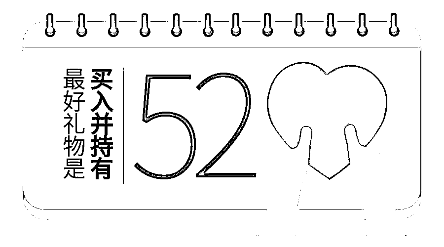

# 【前沿】人工智能+深度学习最强选股策略系统

> 原文：[`mp.weixin.qq.com/s?__biz=MzAxNTc0Mjg0Mg==&mid=2653288164&idx=1&sn=f0e742e45cb24132b062e536b5c887c5&chksm=802e34f1b759bde789ebd296dbc8da23bcfc5043ba3a6ef5a805136855453b95fc5cb157842b&scene=27#wechat_redirect`](http://mp.weixin.qq.com/s?__biz=MzAxNTc0Mjg0Mg==&mid=2653288164&idx=1&sn=f0e742e45cb24132b062e536b5c887c5&chksm=802e34f1b759bde789ebd296dbc8da23bcfc5043ba3a6ef5a805136855453b95fc5cb157842b&scene=27#wechat_redirect)

今日周末，恰逢一个有点情调的日子

买什么礼物！

买什么礼物！

买什么礼物！

**送她一只赚钱的股票**

**买入并持有**

就可以

买最靓的包包

摸最骚的口红

穿最野的衣服

先简单介绍一下我们的选股模型：

1、通过 Pattern Recognition（模式识别）预测大盘走走势；

2、通过 Image Classification（图像分类）算法分析股票 K 线形态； 

3、通过 NLP（自然语言处理）技术分析大数据下的公告、财报、网络媒体、搜索引擎、股吧、研究报告等检测市场舆情；

4、通过 Time Series Analysis（时间序列方法）在噪声序列中寻找信号；

5、通过 HMM（隐马尔科夫）模型进行市场风格切换判断；

6、通过 PCA（主成分分析）、Regression Analysis（回归分析） 挖掘驱动市场股票价格变化的潜在因素；

7、通过 Reinforcement Learning（增强学习）、Genetic Programming（遗传规划）算法选择最优交易决策；

8、通过 CNN（卷积神经网络）预测未来买点、卖点；

9、通过 Deep Learning（深度学习） 基于全市场特征，进行特征优化分析，选出最优的特征及特征组合；

10、通过仓位管理、风险分析等方式，构建选股体系，最终选出最优质的股票，中长期持有。

通过以上的简单描述，想必大家应该了解，这套选股系统的整个架构了吧。

下面我们再介绍一下截止今天，通过这套系统选出的股票池（仅供参考）：

**002582.SZ**

**002043.SZ**

**000428.SZ**

**002467.SZ**

祝大家周末愉快！