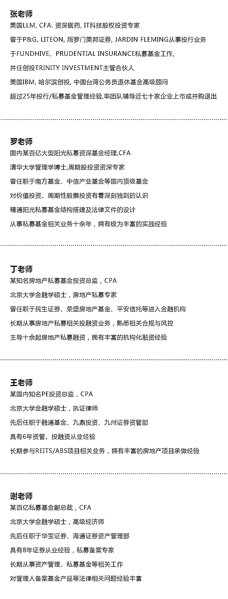
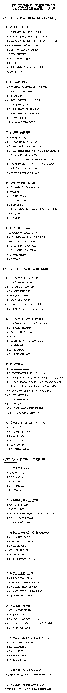
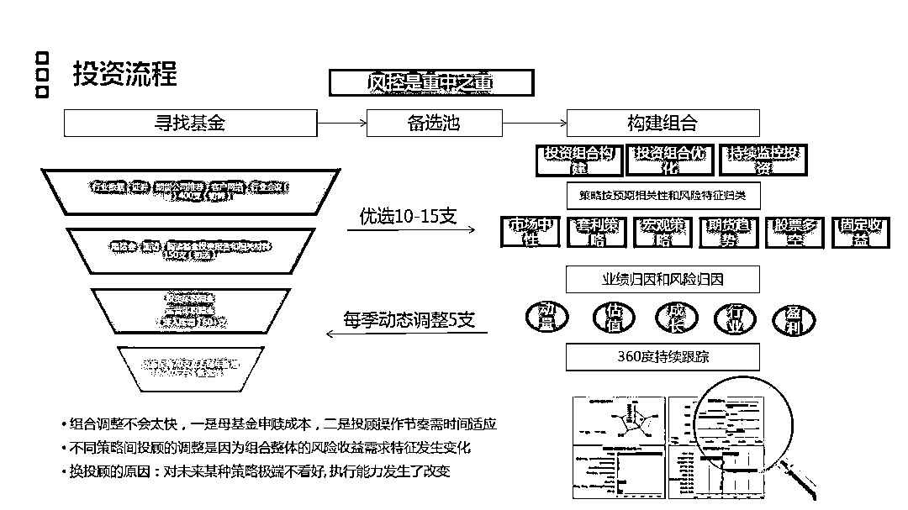
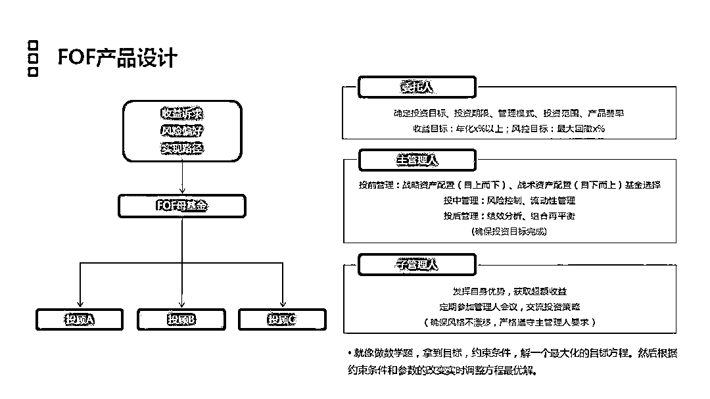
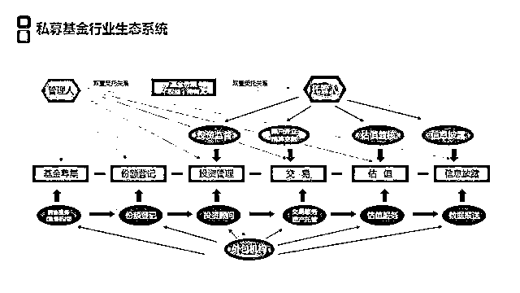
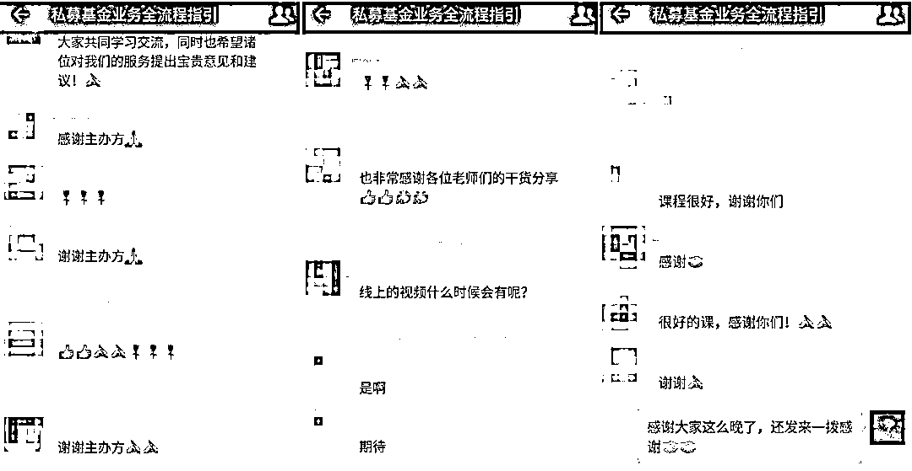
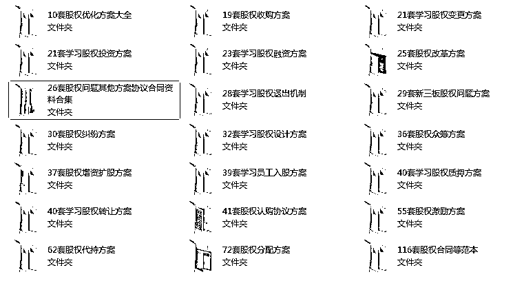
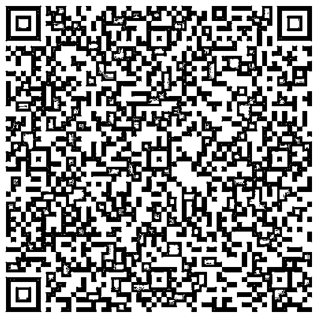

# 私募基金业务——从入门到精通

> 原文：[`mp.weixin.qq.com/s?__biz=MzAxNTc0Mjg0Mg==&mid=2653288159&idx=1&sn=e3d7dbf67449e5caf1e2dff727857fbd&chksm=802e34cab759bddc8e51857b2d5bff2ce4a48c37fc24bdedb34f2ff9304b0ca55a134743e46c&scene=27#wechat_redirect`](http://mp.weixin.qq.com/s?__biz=MzAxNTc0Mjg0Mg==&mid=2653288159&idx=1&sn=e3d7dbf67449e5caf1e2dff727857fbd&chksm=802e34cab759bddc8e51857b2d5bff2ce4a48c37fc24bdedb34f2ff9304b0ca55a134743e46c&scene=27#wechat_redirect)

截至 2017 年底，登记管理人数量 19896 家

已备案的私募基金数量超过 54000 只

认缴规模已经接近 15 万亿元

私募超过公募，发展步入快车道

▼

的确

私募正在快速崛起

抢占越来越多金融市场份额

正在逐步成为中国资本市场的主力军

参与早期投资/产业并购/定向增发/一二级

市场联动/结构化融资/价值投资/技术交易/量化投资/中概股私有化/MBO/PPP/对冲等核心业务

▼

此外

对于当前国内金融市场

佣金的快速下跌与市场的持续低迷

越来越多的券商/信托/上市公司/银行/互联网金融等机构开始重视私募基金的相关业务 

▼

目前

私募基金业务已呈现多维化发展

不再是单纯的创投(VC)  私募股权(PE)  阳光私募涉及房地产私募/REITs/FOF/结构化产品/收益权互换/明股实债/并购基金/PPP/影视基金等等

而这些业务知识，你是否已经弄清楚？

▼

随着私募基金纳入基金业协会监管以来

我们不光需要了解

"募投管退"等私募核心业务操作认识

资金来源/投资条款/退出机制设计/估值等

还需懂得设立/备案/产品设计与发行等事宜

明白内控制度/托管协议/基金合同/募资证明/投顾协议/税费优惠等

而这些，你又都清楚了吗？

鉴于此，华尔街学堂

**邀请 5 位著名私募基金高管**

经过 3 个月精心打磨研发，推出了

**私募基金业务-从入门到精通专题班**

**从基金备案、发行到募投管退全流程梳理**

**到基金产品运作的综合实践**

**让你 21 天精通私募基金全流程业务**

**让你离年薪百万更近一步**

▼

**具体内容涉及**

创业投资**募投管退**/阳光私募/房地产私募/REITS

管理人备案/产品备案/产品设计发行等

▼

通过业务解析/案例分享/直播答疑等方式

教会你如何轻松地玩转私募基金

置身于其中作为"当事人"

成为资本市场弄潮儿

**//  讲师简介  //**

**//  课程内容  //**

**//  课件示例  //**

**** //**  学员反馈  //**

**** //**  赠送资料  //**

报名即送私募基金资料包 

（资料包部分截图）

**** //**  你将收获  //**

> 1. 系统学习私募基金内容，制定完善的学习计划
> 
> 2\. 了解创投/阳光私募/房地产基金/REITS 业务
> 
> 3\. 全面认识私募基金备案相关的操作细则
> 
> 4. 学习导师资深经验，掌握综合技巧

**//  适合人群  //**

> 1. 金融在职人士或其他行业想学习私募的人士
> 
> 2\. 未来想从事于私募相关领域的大学生
> 
> 3\. 将从事 VCPE/阳光私募/房地产基金/REITS 的人
> 
> 4. 对私募行业感兴趣的相关人士
> 
> 5\. 正在或有意进行私募管理人备案的公司高管

**//  课程详情  //**

**活动优惠:******前 60 名学员，******499 元**

****课程原价**:********699 元**

******开课时间**:********5 月 25 日-6 月 15 日****

******学习时长**:**************一年内可以随时随地反复学习******

**课程形式******:******录播视频+社群互动+直播答疑**

****参与****方式**:****长按文章底部二维码支付，付款成功后添加**课程小助手并发送购买截图，由她为你开通课程**。**

**** 报 名 方 式****

****本次课程通过此二维码报名****

****报名后添加课程小助手入 QQ 群****

**↓↓↓戳此码报名↓↓↓**

****

**详情可咨询微信 wss_belle** 

******（小助手会在 24 小时内回复，请耐心等待）******

******如未能添加上助教请在华尔街学堂公众号后台******

******留言：附上您的手机号，我们将主动联系您******

**注：可开具发票，如有需求请与助教沟通**

**如果二维码打不开**

**您还可以直接登录华尔街学堂官网**

****www.wallstreets.cn****

**这里有更多更好的课程供您选择**

****//  Q&A  //****

****Q：**请问有事错过或者**可以看回放**吗？**

****A：****可以的，课程视频一年内会留存供复习使用**，本次课程方式是录播+直播形式，正式课件是录播好的，随时随地可以学习，问题答疑选用直播形式，如果您错过了，我们会整理成文档，以便您回顾学习。**

****Q：请问可以和导师互动交流答疑吗？****

**A：当然可以，导师会在直播答疑时间与大家在线互动交流，如果平时学习有问题，可将问题发至助教，导师会做出书面回复与解答。** 

****Q：请问课程的课件可以提供吗？****

**A：可以提供，本次课程的课件均为导师制作并提供至学员，但是一律不得外泄，仅供内部学员使用。导师直播答疑录音，也会整理后提供给大家复习回顾。** 

****Q：请问购买课程之后能否开具发票？****

**A：可以申请发票，发票为电子版普通发票，购买后可以添加助教微信向助教申请。**

***以上产品最终解释权归华尔街学堂所有***