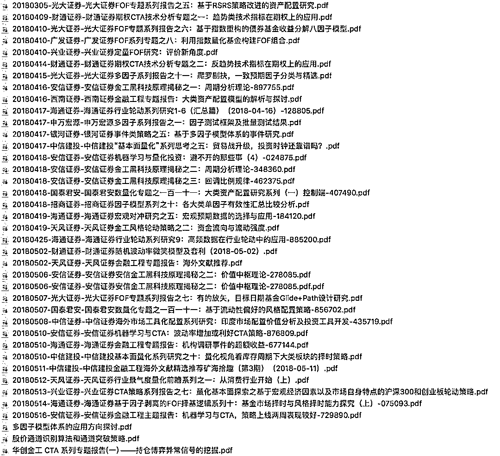
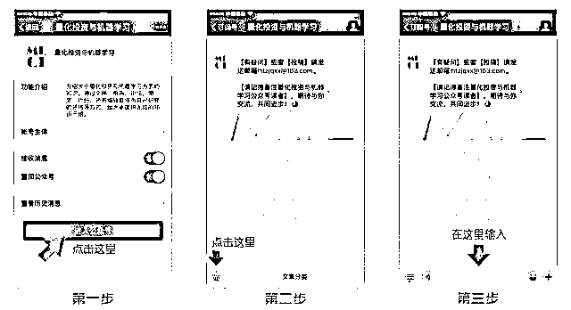
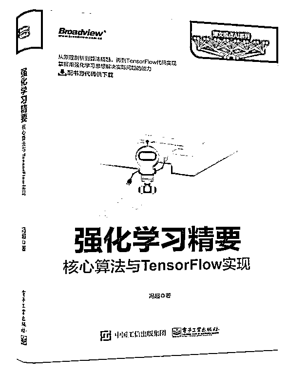

# 【干货】近期最受欢迎的券商金工研报汇总（文末彩蛋）

> 原文：[`mp.weixin.qq.com/s?__biz=MzAxNTc0Mjg0Mg==&mid=2653288146&idx=1&sn=bd43689e8b566872b93a6026f35480cc&chksm=802e34c7b759bdd1efa8b23b409321c14f3f056ad11375f28ca603a4315237a852f159b0fe55&scene=27#wechat_redirect`](http://mp.weixin.qq.com/s?__biz=MzAxNTc0Mjg0Mg==&mid=2653288146&idx=1&sn=bd43689e8b566872b93a6026f35480cc&chksm=802e34c7b759bdd1efa8b23b409321c14f3f056ad11375f28ca603a4315237a852f159b0fe55&scene=27#wechat_redirect)

从 2018 年，公众号不再对发布券商金工研报。

今天，我们针对近期研报做了一些统计分析，给大家分享一些比较热门研报。

当然

你们期待已久的

**彩蛋**

在文末 

**近期热点**研报涉及**股票、CTA、期权、FOF、资产配置**、**机器学习、多因子、海外研究**等共计 40 篇。相信不会让大家失望！

**获取以上研报**

**在****后台****回复**

**近期热点研报**

有些人不知道**后台回复**如何操作

为大家介绍一下：

**彩蛋来啦！**

当然是免费送书活动啦!

**赠书活动**

量化投资与机器学习公众号联合博文视点送出**5 本**《**强化学习精要核心算法与 TensorFlow 实现******》****

> 深度剖析强化学习基本概念、优化、计算框架 TensorFlow、Gym、算法集合 Baselines、马尔可夫决策过程、以 zui 优值函数、策略梯度为思想的一系列算法、反向强化学习算法等，并辅以代码实现！用通俗幽默的语言深入浅出地介绍了强化学习的基本算法与代码实现，为读者构建了一个完整的强化学习知识体系，同时介绍了这些算法的具体实现方式。从基本的马尔可夫决策过程，到各种复杂的强化学习算法，读者都可以从本书中学习到。本书除了介绍这些算法的原理，还深入分析了算法之间的内在联系，可以帮助读者举一反三，掌握算法精髓。书中介绍的代码可以帮助读者快速将算法应用到实践中。

**原价：80.00 元**

**截止 2018.05.19 18:00**

大家在本篇推文【写留言】处发表留言，**获得****点赞****数****前五****的读者，即可免费获赠此书**。届时，工作人员会联系五位读者，寄出此书。