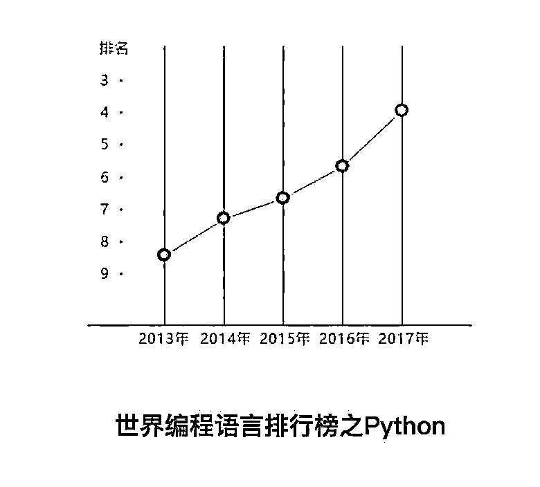

# 那个学 Python 的同龄人，也许已经抛弃了你

> 原文：[`mp.weixin.qq.com/s?__biz=MzAxNTc0Mjg0Mg==&mid=2653288139&idx=1&sn=ea1757e5907d30c5ee7854783e91b828&chksm=802e34deb759bdc810dd4065a42f0df51b922fe12e61464e9c104b3eb47be20dac3dc7f81680&scene=27#wechat_redirect`](http://mp.weixin.qq.com/s?__biz=MzAxNTc0Mjg0Mg==&mid=2653288139&idx=1&sn=ea1757e5907d30c5ee7854783e91b828&chksm=802e34deb759bdc810dd4065a42f0df51b922fe12e61464e9c104b3eb47be20dac3dc7f81680&scene=27#wechat_redirect)

### 

不久前 “摩拜单车创始人套现 15 亿：你的同龄人，正在抛弃你” 在朋友圈刷屏，一时引起众多争议。虽然受到了一些意见领袖的反感和声讨，但不可否认的是，这样的言论的确引起了很多人的焦虑。十多年来，随着 PC、移动互联网的发展，很多顶尖程序员已经通过技术改变了世界，更多的程序员也在薪资方面领跑同龄人。如今，随着人工智能的兴起，又掀起一轮程序员转型的浪潮。

但是，新的趋势下，该学习哪种编程语言呢？

今天笔者不想弯弯绕，直接抛结论：千万别小看你身边那个学 Python 的人，也许有一天他就悄悄跑到了你的前面。Python 被称为是最接近 AI 的语言，也被称为是最简洁的语言。在程序员的世界中，有句话广为流传：“人生苦短，快用 Python ”。这句话非常形象地说出了 Python 语言在程序员心目中的地位。

具体为什么，且听笔者慢慢道来。

## **************************************************************************▌****************************************************************************编程语言对比**

在 2017 年世界脚本语言排行榜中，Python 强势登顶；在 TIOBE 编程语言排行榜中，Python 地位也在逐月攀升，越来越受广大开发者的欢迎。对比长盛不衰的 Java、C、C++，后起之秀 Python 深受好评。

## **************************************************************************▌****************************************************************************Python 是最接近 AI 的语言**

Python 被称为是机器学习最优秀的语言，没有之一。很多人不禁会问，Python 究竟有什么优点呢？能够在短短时间内上升为编程界最受欢迎的语言。在一次有关于 Python 领域的交流会上，五位 Python 专家道出了原委。

**第一位：Python Twisted 网络编程框架创始人 Glyph Lefkowitz ，曾在 2017 年荣获 PSF 社区服务奖**

> 现在 Python 已经在很大程度上取代了 Lisp ，因为二者除了有相似的高层次属性外， Python 还拥有出色的第三方库，以及与操作系统完美地集成。此外，由于机器学习是一个集成度特别高的学科，任何 AI 系统都需要提取大量的源数据作为训练数据或系统输入，Python 自带的丰富的依赖库能够帮助用户更好地访问和转换数据。
> 
> Python 社区还为非程序员提供介绍和操作系统的支持，增加了其在数据科学和科学计算中的应用。科研工作者使用 Python 来进行数据分析，系统管理员使用 Python 管理 Linux 系统，开源的云计算平台 OpenStack 使用 Python 语言开发。编程也逐渐成了一种社交活动，这在 JavaScript 社区和 Python 社区都得到了充分的证明和认可。

**第二位：PSF 社区的联合创始人及 eGenix 的首席执行官 Marc-Andre Lemburg**

> Python 是一门理想的集成语言，它将各种技术绑定在一起。Python 是用于实现更高效的 C / C ++ 算法及 CUDA / cuDNN 的最好的“胶水”语言，这就是为什么现有的机器学习 / 深度学习库能够在 Python 中高效运行的原因，这对于 AI 领域的工作也是非常重要的。
> 
> Python 还是一个理想的粘合平台，为开发人员与外部库的低层次集成人员之间搭建连接。这主要是由于 Python 可以通过一个完整的 C API 来访问。

**第三位：《 Python Machine Learning 》一书的作者 Sebastian Raschka**

> Python 代码非常容易阅读和学习。大多数从事机器学习和人工智能的研究人员都希望以最方便的方式来实现自己的想法。他们的重点是研究和应用程序的开发，编程只是实现这个想法的工具。
> 
> 不仅如此，Python 代码可读极强，这有助于保持最新的机器学习和 AI 的现状，例如，实现 AI 的新思路往往需要相对复杂的算法，而在阅读相关代码时，语言越透明，可读性越好，代码的调试也越容易。

**第四位：ThoughtWorks 首席技术官及 PSF 社区会员 Luciano Ramalho**

> Python 之所以能够如此受欢迎的最重要和最直接原因是其 NumPy 和 SciPy 库能够支持 scikit-learn 这样的项目，这几乎是目前解决机器学习问题所需的标准配置。
> 
> 另一个原因是 Python 的运算符重载功能，能使代码可读性更好，简洁性更高。此外，Python 的缓冲协议 ( PEP 3118 ) ，是外部库在处理类似数组的数据结构时与 Python 进行高效交互的标准。最后，Python 为科学计算提供了丰富的依赖库和全面的操作系统，这也促进了更多的数据科学家使用。

**第五位：Red Hat 高级软件工程师；SQLAlchemy 开发者 Mike Bayer**

> 高级的脚本语言对于 AI 和机器学习是非常适合的，因为可以快速迁移并进行改动，我们创建的大部分代码代表的是实际问题中相关的数学知识和数据结构，而不是所谓的代码模板，因此我们可以根据实际问题的需要，尝试更改脚本的代码来解决我们的问题。同时，在 Python 语言中，几乎所有的想法都可以通过 30-40 行代码快速验证。
> 
> 像 Python 这样的脚本语言更适合 AI 的工作，因为它严格而一致的语法风格。每个 Python 使用者都可以更好地理解对方的 Python 代码，而其他语言的语法有可能会导致混淆和不一致的编程范例，这就是 Python 较其他编程语言的优势所在。

## **************************************************************************▌****************************************************************************Python 前景**

2018 年 3 月起，全国计算机二级考试新增 “ Python 语言程序设计” 科目；2018 年起，浙江省信息技术教材编程语言将会从 vb 更换为 Python。另外，北京和山东确定将 Python 编程基础纳入信息技术课程和高考的内容体系。

Python 的火爆不仅与它本身先天性的优势有关，还在于它成为了许多公司开发人工智能程序的首选编程语言。除了 Google 的 AlphaGo 应用 Python 语言而大获成功以外，在 Facebook 开源了人工智能编程工具箱 PyTorch 后，更是奠定了它作为人工智能时代的首选语言。

来自智联招聘、看准网、拉勾网、前程无忧、中华英才网等招聘网站的数据显示，随着 Python 语言的持续火热，对于 Python 技术人才的需求也在不断增加——日均需求量甚至达到了 15000+，北上广深等一线城市的需求更是庞大。

Python 在世界编程语言排行榜中，从 2013 年开始，到 2017 年，一直处于上升趋势中。从排名第九位到去年越居于排名第四位，并以持续上涨的势如破竹的气势冲顶前三。可谓是编程语言中的最佳潜力股，目前，Python 已经逐步在网络爬虫、数据分析、AI、机器学习、Web 开发、金融、运维、测试等多个领域扎根壮大。

而在薪资待遇上，Python 开发者也没有让人失望。职友集通过分析来自全国的 12809 份样例资料可以发现，全国 Python 工程师的平均月资能够达到 19160 元，其中 20 - 30K 的工程师数量更是超过了四成。

基于 Python 的种种优势，作为程序员的你该如何转型呢？“自学”不仅效率低下，还不能保证效率；“脱产”又要从新做回学生，全职学习；想要一个两全其美的方式？

在此，推荐 **C****S****DN 学院**开设的 Python 课程。 5 个月的授课周期内，会由 Python 技术专家张涛、CTO 邹义良两位，深入分享 Python 基础、Web 开发、爬虫技术、自动化运维、数据挖掘与机器学习这五大模块内容，抽丝剥茧，带领你全方位“玩转” Python 语言。

5、Python 自动化运维技术 （第 12 周 -第 13 周）

6、Python 数据挖掘与机器学习 （第 14 周）

......

不论你是已经领跑的 Python 老手，还是没有入门的程序猿新手，微信添加 **C****SDN****学院**小姐姐的微信，不妨和她聊聊吧。更多大纲详情、**千元优惠券**等你来拿！名额有限，抢到即是赚到。

☟☟☟点击 | 阅读原文 | 查看课程详情