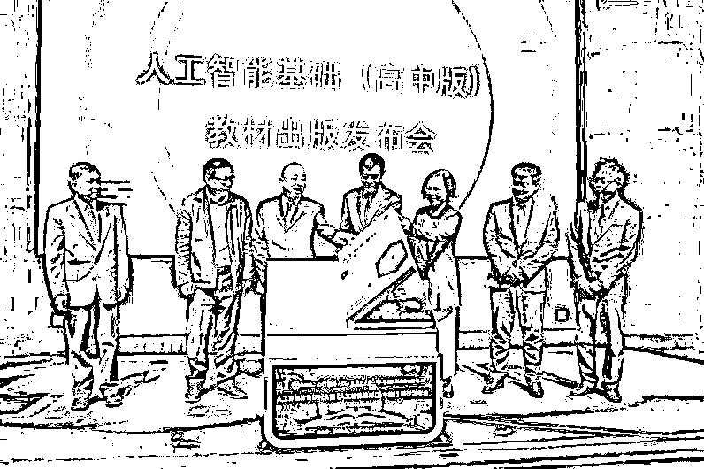
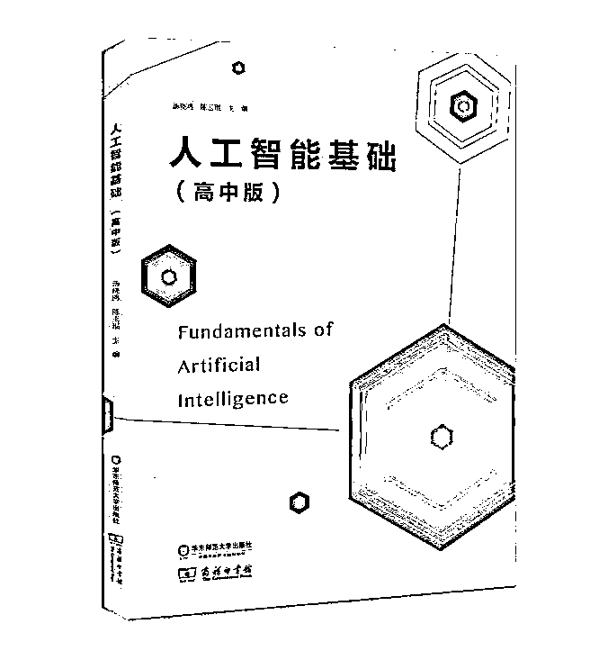
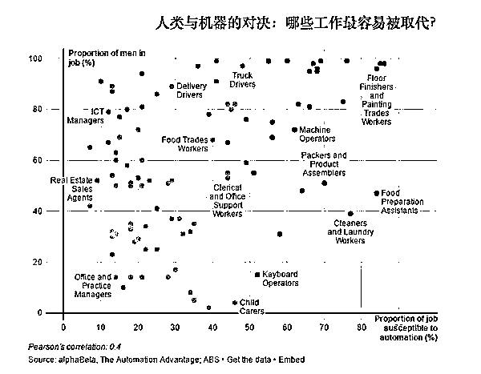
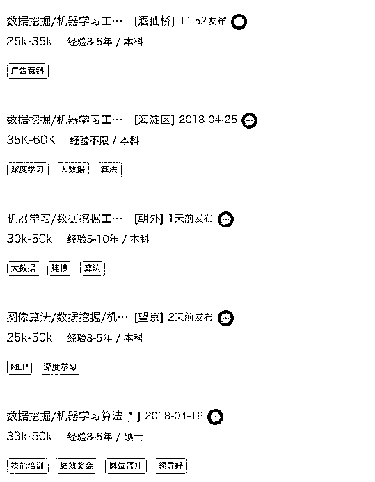
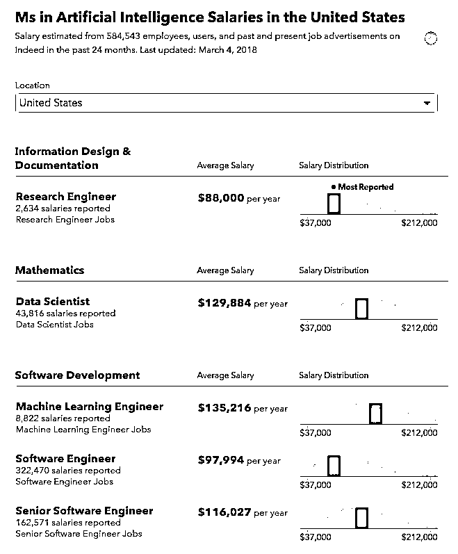
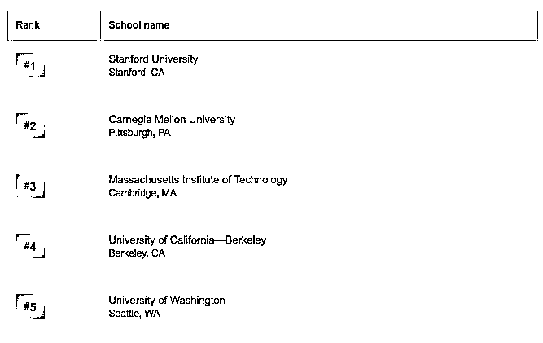
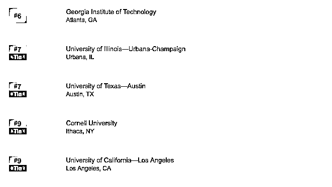
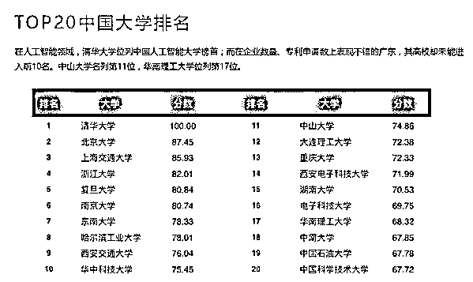

# AI 到底怎么了啊！时代！英雄！改变！认知！哎~

> 原文：[`mp.weixin.qq.com/s?__biz=MzAxNTc0Mjg0Mg==&mid=2653288033&idx=1&sn=d19b37952cc1fd713a947328c5455b21&chksm=802e3474b759bd623584660c89ffb144c4a7d26a90f7aa23d8f138d85e450ef8fca91262c71e&scene=27#wechat_redirect`](http://mp.weixin.qq.com/s?__biz=MzAxNTc0Mjg0Mg==&mid=2653288033&idx=1&sn=d19b37952cc1fd713a947328c5455b21&chksm=802e3474b759bd623584660c89ffb144c4a7d26a90f7aa23d8f138d85e450ef8fca91262c71e&scene=27#wechat_redirect)

内容来源：UniCareer

4 月 28 日，全球第一本人工智能教材

**《人工智能基础》（高中版）**

在**上海**正式发布

清华大学附属中学、上海交通大学附中等

全国**40 所高校**开始推行课程

在不久的将来

人工智能将成为每一个高中生掌握的**基本技能**

**长江后浪推前浪，前浪哭晕沙滩上**

现在回去读高中还来得及吗？

**1.为什么人工智能要大力推行？** 

**2.人工智能的薪资有多高？**

**3.想从事人工智能相关岗位，该如何准备？**

**4.非计算机专业，又如何进入这个行业？**

01

**AI 行业对传统岗位的巨大冲击**

人工智能是一种创造性的毁灭，它将**淘汰许多岗位**，但也将**创造新的角色和岗位**。根据 2017 年 8 月澳大利亚广播公司（ABC）的一项新闻调查显示，最容易被自动化取代的是程序化、重复性的工作岗位。

> *新闻来源：硅谷网 HV*

程序化的工作，例如售票员、流水线工人、基层财会人员等，这类**内容单一、机械重复的体力或脑力劳动岗位**，在智能人工的冲击下，很快面临失业的风险。

而非程序化工作，主要表现在**人际沟通工作、创造性工作、决策和信息综合****类工作**，人与机器最大的差别在于自主思维与认知，人工智能并不具备这一特点，因此这类型的工作很难被自动化取代。

在 AI 应用日趋广泛的今天，很多行业都将受益于 AI 的赋能，这点已经不可逆转，我们也应该以发展的眼光看待问题：人工智能系统解决 X 光片的本领已经比医生更高，查阅法律证据的能力比律师更高，飞机大部分时间由人工智能系统操作，图片智能分析成为可能，人工智能系统甚至战胜了人类顶级围棋选手···

人工智能将是一轮新的技术革命，**新的社会变革将带来资源与财富的重新分配**，敞开胸怀拥抱人工智能，让它成为我们职业道路上的强劲武器。

02

**AI 行业薪资诱人：应届生起步价 30w+**

为了吸引人才，**互联网各大厂纷纷开出了天价薪酬，从 2018 年互联网高校招聘情况来看，有 20 多家企业年薪突破了 30 万元。**在拉勾网上搜索人工智能，出来的工资都是这样的：

算法类岗位相比其他岗位在薪酬上**至少高出 20%****，**对于顶级人才更是不遗余力地**通过高薪和户口政策来吸引。**一些博士毕业的人才可能初入职场就跨过了所谓月薪 3 万的大坎儿，直接「走上人生巅峰」。

**那么 AI 专业在美国的薪资水平又是什么样的呢？**

> *图片来源：Indeed.com*

对于目前热度只增不减的人工智能，美国 Top5 的招聘网站 Glassdoor 也发布了相关主题的报告：

*   截至 2017 年底，**在 Glassdoor 上有 512 个开放的 AI 和深度学习工作岗位。**占据 Glassdoor 上开发的美国工作岗位的 0.009％。

*   就目前招聘 AI 人才的公司而言，亚马逊，NVIDIA 和微软等科技巨头领先。但是，*越来越多的金融、咨询也成为 AI 人才的主要雇主。*

*   人工智能岗位**薪酬因岗而异，总体偏高****，**AI 岗位每年基本工资估计为 24 万至 26 万美元。

03

**人工智能学什么？**

不管你选择什么专业方向，人工智能和机器人专业的主要课程包括数学、计算机课程，基本的***编程语言、算法设计、操作系统、数据结构、逻辑、概率论和数理统计***等方法。

AI 这个综合型学科的一个专业分支，总的来说可以分为以下四点：

*   **模式识别：**是指对表征事物或者现象的各种形式(数值的文字的逻辑关系的等)信息进行处理分析，以及对事物或现象进行描述分析分类解释的过程，例如汽车车牌号的辨识（涉及到图像处理分析等技术）。

*   **机器学习：**研究计算机怎样模拟或实现人类的学习行为，以获取新的知识或技能，重新组织已有的知识结构是指不断完善自身的性能，或者达到操作者的特定要求。

*   **数据挖掘：**知识库的知识发现，通过算法搜索挖掘出有用的信息，应用于市场分析、科学探索、疾病预测等。

*   **智能算法：**解决某类问题的一些特定模式算法。例如，我们最熟悉的最短路径问 c

**人工智能领域 TOP10 美国大学排名：**

> *图片来源：USNews*

**人工智能领域 TOP20 中国大学排名：**

> *图片来源：网易科技与乌镇智库出品的 2016《全球人工智能发展报告》*

04

**人工智能深入渗透各行业**

近年来，人工智能（AI）在各个领域的应用，也正在深刻改变着世界。 

**资本市场：**

*   **交易算法**已成为华尔街标配；

*   美国顶级量化对冲基金已经开始**大量使用机器学习技术进行策略建模，**而他们使用的技术和 AlphaGo 背后的人工智能技术十分类似；

*   2017 年 3 月贝莱德( BlackRock ) 宣布裁掉 40 多个主动型基金部门的岗位，其中包括 7 名投资组合经理，**转而用机器人代替**。

**保险领域：**

*   2016 年 4 月，弘康人寿成为国内第一家应用人工智能技术的保险企业。首次引入人脸识别技术，通过后台将客户身份证照片与公安部下辖的身份证认证中心照片进行智能比对，用以**替代人工认证**，从而将保全服务智能化；

*   2017 年，平安保险完成了“**智能定损**”和“**智能闪赔**”等 2 项黑科技，可以自动识别车型、车牌、受损部位，拦截理赔流程中的欺诈风险，从而实现智能定损，提高服务效率。

**银行领域：**

*   2018 年 2 月，澳洲国民银行 NAB 突然宣布进行大幅度裁员，NAB 总裁 Andrew Thorburn 表示：**很多工作可以由 AI 完成**，我们今后需要的员工数量将会减少；

*   2018 年 2 月，富国成立了一家新的人工智能公司，研究如何为银行客户提供更个性化、人性化服务，并大量关闭线下门店。

**会计领域：**

*   2017 年 5 月 26 日，普华永道推出**机器人流程自动化解决方案;**

*   2016 年 3 月 10 日，德勤与 Kira Systems 联手，正式将人工智能引入会计、税务、审计等工作当中

……

**各个领域的企业**都在积极尝试**把这些科技手段融入自己的日常运营中，**从而大大提升效率及业绩。在 Fintech 受到大量追捧的同时，传统金融行业和公司成为了一大“重灾区”，过半的券商从业者将不得不转型。Fintech 已经大势所趋，**AI 人才需求与日激增，**如何顺应时代才是当今金融人应该思考的问题。

JP Morgan 首席运营官曾表示：*“我们要保证行业领头羊地位，就必须得在金融科技上先拔头筹。” * JP Morgan 在金融技术领域也走在行业前沿，它专门设立了技术中心，聘用约 4 万名技术工作者，技术预算达 96 亿美元，专攻大数据，大数据可以为人工智能打基础。此外，它还和英特尔、微软等 30 多家企业组成了一个新的区块链联盟，以开发相关的标准和技术。

05

**时代浪潮之前，我们如何抓住机遇？**

对于学商科或想从事金融行业的你来说，靠过去的经验是不够的，这个时代需要的是：**专精金融且能和计算机从业者顺畅沟通的人才****。**正如 Steve Andriole 教授所言：**“区块链、AI、机器学习、IOE，掌握一项就可以让你在 2018 年大丰收。”**

因此除了继续研习金融专业知识外，你可以：

**1. 有所****侧重的补充计算机知识。**金融领域缺乏足够的大数据和人工智能人才储备（这就是未来最紧俏的金融人才）。

**2. 成为****懂 AI 的 PM 或商业人才。**商业和产品的 sense 以及人脉需要在行业中浸泡多年才能得到，另外还需要懂得技术的边界，并且技术的壁垒，其实远没有想象得那么高。

**3. 辅修****有关科技、编程语言的第二专业。**对于科技大环境有所了解，至少当一个 IT 出身的同事和你交流时，能顺畅地使用专业术语。

AI 行业并不缺少一般意义上的技术大牛，一大票的公司的科学家都在攻克 AI 底层，所以对编程的要求不是太高，并且从一定意义上讲，现在的技术已经成熟，而之所以没有广泛使用，是在应用上没有将底层技术的商业价值体现出来。

这个行业缺少的是**极具创造力和洞察力的商业人才**，从而发挥出技术的商用价值。人工智能或许会让一些行业永久消失，却是人类文明的一大进步。它解放了人类的创造力，但倘若你不去改变，就只能被社会淘汰，就只能失业。

**从今日起，尽量让自己的工作有更多创造性的内容，尽量掌握一门以想象力为核心的技能，尽量观察信息的风口，并不断迭代自己的认知储备。**

部分内容来源：中国青年报，大数据技术，第一财经网，

glassdoor，indeed，界面新闻，硅谷网等

***知识在于分享***

***在量化投资的道路上***

***你不是一个人在战斗***

****