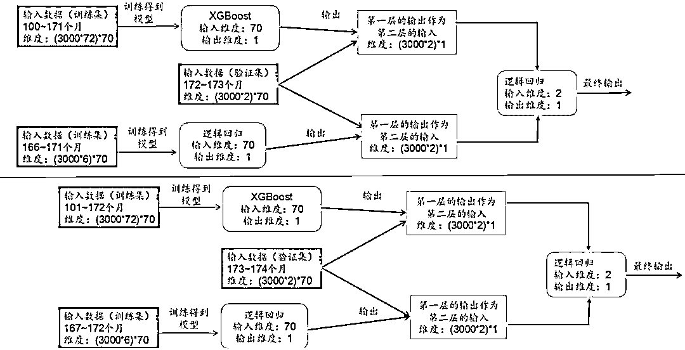
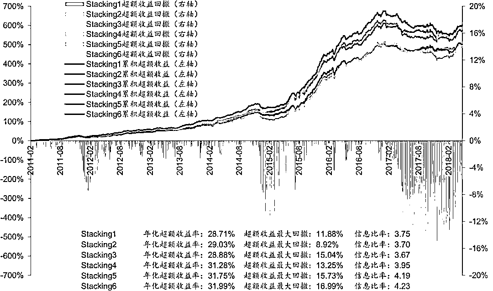

# 【深度研究】Stacking 集成学习在多因子选股中的应用

> 原文：[`mp.weixin.qq.com/s?__biz=MzAxNTc0Mjg0Mg==&mid=2653288016&idx=1&sn=40aa13abf64320512f18eac2ce4d059f&chksm=802e3445b759bd5342a8cbd95510f917f0ef64bdaccc33764ecc98b8e5104f3acb852aa5ba41&scene=27#wechat_redirect`](http://mp.weixin.qq.com/s?__biz=MzAxNTc0Mjg0Mg==&mid=2653288016&idx=1&sn=40aa13abf64320512f18eac2ce4d059f&chksm=802e3445b759bd5342a8cbd95510f917f0ef64bdaccc33764ecc98b8e5104f3acb852aa5ba41&scene=27#wechat_redirect)

今天我们来继续我们机器学习应用量化投资系列，本期，我们介绍一篇来自华泰证券金工的研究报告。将深入为你剖析 Stacking 集成学习在量化投资中的应用！希望大家有所收获！

**Stacking 集成学习模型简介**

**Stacking 集成学习的原理**

Stacking 是一种常见的集成学习框架。一般来说，Stacking 将训练一个多层(一般是两层， 本文中默认两层)的模型结构，第一层(也叫学习层)包含 n 个不同的模型，将得到的预 测结果合并为新的特征集，并作为下一层模型的输入，由下一层模型再次根据对应的数据 标签进行训练，得到一个完整的框架。简单的示意图如下:

通常情况下，Stacking 中第一层的模型会使用拟合度高的模型，以追求对训练数据的充分 学习(如 XGBoost、神经网络、SVM 等)。由于不同的模型在原理上和训练集上有所差别， 第一层模型可以认为是从原始数据中自动提取有效特征的过程。第一层模型中，由于使用 了复杂的非线性变化提取特征，Stacking 更易产生过拟合的情况。为了降低过拟合的风险， 第二层模型倾向于使用简单的模型，例如逻辑回归、Lasso 回归等广义线性模型。从以上 分析可以看出，Stacking 能够成功的关键在于第一层模型能针对原始训练数据得出有差异 性(相关性低)且预测能力好的输出值，这样通过第二层模型进一步学习后，能够在多个 第一层模型中取长补短，提升预测的准确度和稳定性。

**从传统的 Stacking 到改进的 Stacking**

一个传统的 Stacking 集成学习如下图所示。图中，所有的第一层模型都使用相同的训练 集数据，它们从不同的角度对相同的训练数据进行学习，得到具有差异性的输出值，再通过 第二层的逻辑回归得到输出值。该框架主要应用于一些训练和预测数据同分布的传统领域， 如图像分类。

本文使用的是一种改进的集成学习框架，如图表 3 所示，框架的第一层不仅使用不同的模 型，还使用有差异的训练数据，这进一步增大了模型输出值之间的差异性(相关性低)， 这样的差异性往往适用于训练数据和预测数据不是同分布的领域，可以增强预测的稳定性， 如金融数据的预测。

传统的 Stacking 和改进的 Stacking 在训练和测试数据的处理上也有一些不同，我们在本 文最后的附录部分详细介绍了相关内容。 

从本节的分析可以看出，Stacking 与其说是一种模型，不如说是一种机器学习框架，其应 用模式并不固定，而是需要根据具体的问题进行模型和训练数据的设计，这使得该框架的 应用非常灵活。下一章节中，我们将结合前期人工智能选股系列报告的研究结果，进一步 说明我们为何使用改进的 Stacking 集成学习。

**Stacking 集成学习中基模型的对比和选取**

在本文中，Stacking 模型主要对已有的机器学习模型进行集成。在华泰金工前期的人工智 能选股报告中，我们分别介绍了广义线性模型、SVM、朴素贝叶斯、随机森林、Boosting、 神经网络模型在多因子选股中的应用。各个模型在全 A 选股的表现各异，同一模型在使用 不同训练数据时的表现也有很大差异，本章我们将分别展示这些差异，并讨论如何选取 Stacking 模型中第一层的基模型。

**相同训练数据，不同模型对比**

本节中，我们选取 6 个模型:逻辑回归、SVM、朴素贝叶斯、随机森林、XGBoost、神经 网络模型，对比它们在相同训练数据下的选股表现。

**训练数据为 72 个月**

各个模型回测方法如下:

> 回测时间：2011 年 1 月 31 日至 2018 年 4 月 27 日。
> 训练数据长度：72 个月，每个月用之前 72 个月的因子数据训练模型。

> 组合构建方法：月频调仓，在全部 A 股中选股，行业权重配置和中证 500 保持一致，每 个行业内选择 4 只模型预测表现最好的股票进行等权配置。

回测得到的超额收益结果如图表 4 所示，总体来看 XGBoost 和随机森林表现最好，模型 之间有一定的区分度，但是所有模型在 2017 年后都有较大的回撤。

**训练数据为 6 个月**

各个模型回测方法如下：

> 回测时间：2011 年 1 月 31 日至 2018 年 4 月 27 日。

> 训练数据长度：6 个月，每个月用之前 6 个月的因子数据训练模型。 
> 
> 组合构建方法：月频调仓，在全部 A 股中选股，行业权重配置和中证 500 保持一致，每 个行业内选择 4 只模型预测表现最好的股票进行等权配置。

回测得到的超额收益结果如图表 5 所示，总体来看 XGBoost 最好，模型之间有一定的区分。

**不同训练数据，相同模型的对比**

本节中，我们主要考察 XGBoost 模型，使用长度分别为 6 个月、9 个月、12 个月、24 个 月、36 个月、72 个月的训练数据训练模型，对比它们的选股表现。

各个模型回测方法如下:

回测时间：

> 2011 年 1 月 31 日至 2018 年 4 月 27 日。
> 组合构建方法：月频调仓，在全部 A 股中选股，行业权重配置和中证 500 保持一致，每 个行业内选择 4 只模型预测表现最好的股票进行等权配置。

回测得到的超额收益结果如图表 6 所示，可以看出训练数据的长短对选股结果有很大影响。72 个月模型学习的是市场的长期规律，但当市场长期规律被打破时(2017 年后)，超额 收益回撤较大;6 个月模型学习的是市场的短期规律，超额收益增长缓慢且平稳，两个模 型各有优劣。其他训练期长度的模型表现位于中间。

**模型预测值相关性分析和夏普比率分析**

上一章提到过，Stacking 能够成功的关键在于第一层模型能针对原始训练数据得相关性低 且预测能力好的输出值。因此在挑选 Stacking 的第一层模型时，要衡量两方面的指标：

1\. 模型预测值的相关系数(Corr)低。
2\. 模型预测能力好。在选股领域，使用模型的夏普比率(Sharpe)来衡量。

为了减少挑选模型的工作量，我们不对所有基模型的预测值进行两两之间的相关性分析， 而是挑选出一个优秀的基模型之后，再将其和其他基模型的预测值进行相关性分析。

观察下面的图表发现 XGBoost 使用 72 个月数据训练的模型(以下简称 XGBoost_72m)在 2017 年之前有很大的优势，如果在其他基模型中挑选一些和 XGBoost_72m 集成，应该 可以达到更好的预测结果。接下来，我们进一步把基模型挑选的范围缩小到使用 6 个月数 据训练的模型中，因为只有这些模型才能在 2017 年之后回撤较小。在图表 7 中，展示了 回测区间内 6 个模型预测值与 XGBoost_72m 预测值的相关系数。在图表 8 中，展示了回 测区间内 6 个模型的 Sharpe 比率。

为了选出合适与 XGBoost_72m 模型集成的基模型，我们定义适应度指标 S 为： 

**S = Sharpe/Corr**

我们挑选 S 较大的那些模型与 XGBoost_72m 模型集成。图表 9 展示了 6 个模型的适应度 指标 S。可知，XGBoost_6m 以及逻辑回归 _6m 最适合与 XGBoost_72m 进行 Stacking 集成。 

**Stacking 集成学习测试流程**

**测试流程**

**模型构建**

上一节提到，我们使用月度滚动的方法进行模型训练和回测，本节我们将具体介绍每个月如何构建 Stacking 模型进行训练和预测。

**基本设定：**

1\. 设 1998 年 4 月为第 1 个月，之后月份序号依次递增，到 2018 年 4 月为第 241 个月。

2\. 回测区间：2011 年 1 月 31 日至 2018 年 4 月 27 日，即第 155 个月至第 241 个月。

3\. 股票池：全 A 股，剔除 ST 股票，剔除每个截面期下一交易日停牌的股票，剔除上市 3 个月以内的股票。每只股票视作一个样本。为了方便起见，在本节所举的例子中，假设有 3000 只股票。

4\. 因子数目：70 个。

5\. Stacking 模型构建：总共两层，第一层为使用 72 个月训练数据的 XGBoost 模型和使用 6 个月训练数据的逻辑回归模型，以保证两个模型及其训练数据都有差异。第二层为逻辑回归模型。

6\. 训练数据划分：样本内数据 74 个月，其中前 72 个月的数据为训练集，后 2 个月的数据为验证集。样本外数据（测试数据）为截面后 1 个月的数据。

**模型构建说明：**

假设当前测试数据为第 174 个月的数据，模型训练过程如图 12 所示，模型测试过程如下图所示：

模型训练和测试有以下步骤： 

1\. 首先选取第 100-171 个月的数据作为训练数据集，172-173 个月的数据作为验证集。利用 XGBoost 模型对训练数据集进行训练。训练完成后使用该模型对验证集进行预测，得到第一层输出。

2\. 其次选取第 166-171 个月的数据作为训练数据集，172-173 个月的数据作为验证集。利用逻辑回归模型对训练数据集进行训练。训练完成后使用该模型对验证集进行预测，得到第一层输出。

3\. 将两个模型预测得到的第一层输出值作为第二层输入，利用逻辑回归进行训练，得到最终 stacking 集成学习模型。

4\. 将第 174 个月的测试数据集代入 Stacking 集成学习模型中，计算预测值。

5\. 为了达到滚动预测的目的，下一期选取第 101-172 个月的数据作为训练数据集，173-174 个月的数据作为验证数据集，第 175 个月的数据作为测试集数据，以此类推。

**Stacking 模型分层回测分析**

Stacking 集成学习模型最终在每个月底可以产生对全部个股下月上涨或下跌的预测值。因此可以将其看作一个因子合成模型，即在每个月底将因子池中所有因子合成为一个“因子”。接下来，我们对该模型合成的这个“因子”（即个股下期收益预测值）进行分层回测，从各方面考察该模型的效果。仿照华泰单因子测试系列报告中的思路，分层回测模型构建方法如下：

1\. 股票池：全 A 股，剔除 ST 股票，剔除每个截面期下一交易日停牌的股票，剔除上市 3 个月以内的股票。

2\. 回测区间：2011-01-31 至 2018-04-27。

3\. 换仓期：在每个自然月最后一个交易日核算因子值，在下个自然月首个交易日按当日收盘价换仓。

4\. 数据处理方法：将 Stacking 集成学习模型的预测值视作单因子，因子值为空的股票不参与分层。

5\. 分层方法：在每个一级行业内部对所有个股按因子大小进行排序，每个行业内均分成 N 个分层组合。如图表 14 所示，黄色方块代表各行业内个股初始权重，可以相等也可以不等（我们直接取相等权重进行测试），分层具体操作方法为 N 等分行业内个股权重累加值，例如图示行业 1 中，5 只个股初始权重相等（不妨设每只个股权重为 0.2），假设我们欲分成 3 层，则分层组合 1 在权重累加值 1/3 处截断，即分层组合 1 包含个股 1 和个股 2，它们的权重配比为 0.2:(1/3-0.2)=3:2，同样推理，分层组合 2 包含个股 2、3、4，配比为(0.4-1/3):0.2:(2/3-0.6)=1:3:1，分层组合 4 包含个股 4、5，配比为 2:3。以上方法是用来计算各个一级行业内部个股权重配比的，行业间权重配比与基准组合（我们使用沪深 300）相同，也即行业中性。

6\. 评价方法：回测年化收益率、夏普比率、信息比率、最大回撤、胜率等。

这里我们将展示图表 12 中 Stacking 模型的分层测试结果。

下图是分五层组合回测绩效分析表(20110131~20180427)。其中组合 1~组合 5 为按该 因子从小到大排序构造的行业中性的分层组合。基准组合为行业中性的等权组合，具体来 说就是将组合 1~组合 5 合并，一级行业内部个股等权配置，行业权重按当期沪深 300 行 业权重配置。多空组合是在假设所有个股可以卖空的基础上，每月调仓时买入组合 1，卖 空组合 5。回测模型在每个自然月最后一个交易日核算因子值，在下个自然月首个交易日 按当日收盘价调仓。

下面四个图依次为：

1\. 分五层组合回测净值图。按前面说明的回测方法计算组合 1～组合 5、基准组合的净值，与沪深 300、中证 500 净值对比作图。

2\. 分五层组合回测，用组合 1～组合 5 的净值除以基准组合净值的示意图。可以更清晰地展示各层组合在不同时期的效果。

3\. 组合 1 相对沪深 300 月超额收益分布直方图。该直方图以[-0.5%,0.5%]为中心区间，向正负无穷方向保持组距为 1%延伸，在正负两个方向上均延伸到最后一个频数不为零的组为止（即维持组距一致，组数是根据样本情况自适应调整的）。

4\. 分五层时的多空组合收益图。再重复一下，多空组合是买入组合 1、卖空组合 5（月度调仓）的一个资产组合。多空组合收益率是由组合 1 的净值除以组合 5 的净值近似核算的。

下图为分十层组合回测时，各层组合在不同年份间的收益率及排名表。每个单元格的内容 为在指定年度某层组合的收益率(均为整年收益率)，以及某层组合在全部十层组合中的 收益率排名。最后一列是分层组合在 2011~2018 的排名的均值。其中组合 1 和组合 10 在所有回测年份中排名都没有变化。

下图是不同市值区间分层组合回测绩效指标对比图(分十层)。我们将全市场股票按市值 排名前 1/3，1/3~2/3，后 1/3 分成三个大类，在这三类股票中分别进行分层测试，基准组 合构成方法同前面所述(注意每个大类对应的基准组合并不相同)。

下图是不同行业间分层组合回测绩效分析表(分五层)。我们在不同一级行业内部都做了 分层测试，基准组合为各行业内该因子非空值的个股等权组合(注意每个行业对应的基准 组合并不相同)。

**模型选股测试结果和 IC 值分析**

在“Stacking 集成学习中基模型的对比和选取”一章中，我们得出在全 A 选股情况下，XGBoost_6m 以及逻辑回归 _6m 最适合与 XGBoost_72m 进行 Stacking 集成，本节中，我们将依次展示以下模型的回测结果。

1\. Stacking1：将 XGBoost_6m 和 XGBoost_72m 进行集成，验证集数据为 2 个月。

2\. Stacking2：将逻辑回归 _6m 和 XGBoost_72m 进行集成，验证集数据为 2 个月。

3\. Stacking3：将 XGBoost_6m 和 XGBoost_72m 进行集成，验证集数据为 3 个月。

4\. Stacking4：将逻辑回归 _6m 和 XGBoost_72m 进行集成，验证集数据为 3 个月。

5\. Stacking5：将 XGBoost_6m 和 XGBoost_72m 进行集成，验证集数据为 4 个月。

6\. Stacking6：将逻辑回归 _6m 和 XGBoost_72m 进行集成，验证集数据为 4 个月。

7\. Stacking7：将 XGBoost_6m，逻辑回归 _6m 和 XGBoost_72m 进行集成，验证集数据为 2 个月。

**对照组模型：**

1\. XGBoost_72m

2\. XGBoost_6m

3\. 逻辑回归 _6m

其中，主要进行三组对比测试：

对比测试 1：将 Stacking1，Stacking2 和对照组模型对比，主要观察 Stacking 集成学习相比使用单一模型有哪些区别。

对比测试 2：将 Stacking1~ Stacking6 模型进行对比，主要观察不同基模型和不同验证集数据长度对选股结果的影响。

对比测试 3：将 Stacking1，Stacking2，Stacking7 进行对比，主要观察 Stacking 中第一层基模型数量对选股结果的影响。

**对比测试 1**

对比测试 1 将 Stacking1，Stacking2 和对照组模型对比，主要观察 Stacking 集成学习相比使用单一模型有哪些区别。

我们构建了全 A 选股策略并进行回测，各项指标详见图表 23，选股策略是行业中性策略，策略组合的行业配置与基准（沪深 300、中证 500、中证全指）保持一致，各一级行业中选 N 个股票等权配置（N=2,3,4,5,6）。从图表 23 可以看出，XGBoost_72m 模型相比 XGBoost_6m 和逻辑回归 _6m 在年化超额收益率和信息比率上有很大优势，但是超额收益最大回撤更大。而 Stacking1 和 Stacking2 模型具有和 XGBoost_72m 相近的年化超收和信息比率并且超额收益最大回撤也较小，从而取得了最高的 Calmar 的比率。

上图展示了对比测试 1 中 5 种模型相对中证 500 的超额收益和回撤的走势。可以看出，Stacking1 和 Stacking2 模型在保持了较高的超额收益增长率的同时，有效地控制了超额 收益回撤，2017 年以来超额收益最大回撤在 8%以内。 

如果将模型的输出视为单因子，则可以对该单因子进行 IC 值分析，图表 25 和图表 26 展 示了 5 种模型输出值的 IC 值分析结果，可以看出，2011 年至今，Stacking1 和 Stacking2 模型的 IC 值都比较稳定，表现接近 XGBoost_72m。特别是在 2015 年至今，Stacking2 模型表现最好，显示出 Stacking 模型在预测能力方面相比单一模型的优势。

对比测试 1 中各种模型 IC 值累积曲线

对比测试 1 的结论为：Stacking 集成学习有效结合了基模型的优点（XGBoost_72m 的高收益、高信息比率，XGBoost_6m 和逻辑回归 _6m 的低回撤），在各项选股指标上都有不错的表现。

**对比测试 2**

对比测试 2 将 Stacking1~ Stacking6 模型进行对比，主要观察不同基模型和不同验证集数据长度对选股结果的影响。

我们构建了全 A 选股策略并进行回测，各项指标详见图表 27，选股策略是行业中性策略，策略组合的行业配置与基准（沪深 300、中证 500、中证全指）保持一致，各一级行业中选 N 个股票等权配置（N=2,3,4,5,6）。从图表 27 可以看出，验证集数据越长（Stacking5 和 Stacking6 最长，Stacking1 和 Stacking2 最短），年化超额收益率越大，但是超额收益最大回撤也越大，从 Calmar 比率的角度来看，Stacking2 模型表现最好。各模型信息比率相差不大。

上图展示了对比测试 2 中 6 种模型相对中证 500 的超额收益和回撤的走势。

如果将模型的输出视为单因子，则可以对该单因子进行 IC 值分析，图表 29 和图表 30 展 示了 6 种模型输出值的 IC 值分析结果，从 IR 比率的角度来看，Stacking2 和 Stacking4 模型表现最好。

对比测试 2 中各种模型 IC 值累积曲线

从对比测试 2 中，可以得出两个结论：

1\. 较短的验证集数据长度（2 个月）可以使得 Stacking 集成学习模型的超额收益最大回撤较小，Calmar 比率较高。

2\. 相同的验证集数据情况下，集成不同类模型的 Stacking（XGBoost_72m 和逻辑回归 _6m，对应 Stacking2、Stacking4、Stacking6）要比集成相同类模型的 Stacking（XGBoost_72m 和 XGBoost_6m，对应 Stacking1、Stacking3、Stacking5）表现更好。

**对比测试 3**

对比测试 3：将 Stacking1，Stacking2，Stacking7 进行对比，主要观察 Stacking 中第一层基模型数量对选股结果的影响。

我们构建了全 A 选股策略并进行回测，各项指标详见图表 31，选股策略是行业中性策略，策略组合的行业配置与基准（沪深 300、中证 500、中证全指）保持一致，各一级行业中选 N 个股票等权配置（N=2,3,4,5,6）。从图表 31 可以看出，集成 3 个模型的 Stacking（Stacking7）没有比集成 2 个模型的 Stacking（Stacking1 和 Stacking2）表现更好。

对比测试 3 中各种模型 IC 值累积曲线

**总结和展望**

本文我们对 Stacking 集成学习模型进行了系统的测试，并且构建了全 A 选股策略，初步得到以下结论：

1\. Stacking 是一种常见的集成学习框架，一般有两层。Stacking 能够成功的关键在于第一层模型能针对原始训练数据得出有差异性（相关性低）且预测能力好的输出值，这样通过第二层模型进一步学习后，能够在多个第一层模型中取长补短，提升预测的准确度和稳定性。

2\. 本文使用的是一种改进的 Stacking 集成学习框架，框架的第一层不仅使用不同的模型，还使用有差异的训练数据，进一步增大了模型输出值之间的差异性（相关性低），这样的差异性往往适用于训练数据和预测数据不是同分布的领域，可以增强预测的稳定性，如金融数据的预测。

3\. 对于 Stacking 集成学习在多因子选股领域的应用，本文提出了基于适应度指标的基模型选择方法，该方法本质是挑选预测值相关性低且预测能力好的模型进行集成。通过分析，我们认为使用 6 个月数据训练的 XGBoost 模型（XGBoost_6m）以及逻辑回归模型（逻辑回归 _6m）最适合与使用 72 个月数据训练的 XGBoost（XGBoost_72m）进行 Stacking 集成。

4\. 对于 Stacking 集成学习在多因子选股领域的应用，我们通过对比测试，得出以下结论：（1）Stacking 第一层应该使用不同种类的基模型和训练数据以达到最好的预测结果；（2）Stacking 第一层并非集成越多的基模型表现就越好，要达到更好的集成学习效果，需要各个基模型两两之间相关性低，且基模型有足够好的预测能力。（3）较短的验证集数据长度（2 个月）可以使得 Stacking 集成学习模型的超额收益最大回撤较小，Calmar 比率较高，模型预测值的 IR 比率较高。

5\. 在本文的测试中，我们认为最优的 Stacking 集成学习模型为将 XGBoost_72m 和逻辑回归 _6M 进行集成，并且验证集数据选用 2 个月的模型（以下简称最优模型）。最优模型有效结合了基模型的优点（XGBoost_72m 的高收益、高信息比率，逻辑回归 _6m 的低回撤）。2011 年 2 月至 2018 年 4 月，对于全 A 选股的行业中性策略，最优模型相对于中证 500 的年化超额收益在 27.75%~29.45%之间，超额收益最大回撤在 8.92%~10.18%之间，信息比率在 3.33~3.84 之间，Calmer 比率在 2.73~3.25 之间，Calmer 比率的提升最为显著。

6\. 我们对 Stacking 最优模型的输出值进行单因子测试。因子分 5 层测试多空组合年化收益率为 33.82%，夏普比率为 5.03。因子分 10 层测试组合 1 和组合 10 在所有回测年份中排名都没有变化，因子表现稳定。另外，因子在 2011 年至今的 IC 均值为 10.94%，IR 比率为 1.47，IC 值大于零比例为 91.86%；因子在 2015 年至今的 IC 均值为 12.57%，IR 比率为 1.59，IC 值大于零比例为 94.74%，2015 年以来因子表现更好。

Stacking 与其说是一种模型，不如说是一种机器学习框架，其应用模式并不固定，而是需要根据具体的问题进行模型和训练数据的设计，这使得该框架的应用非常灵活。本文是针对 Stacking 集成学习的一个初步探索，未来还有以下几个方向可以深入研究：

（1）本文最优的 Stacking 模型只集成了两个基模型，我们认为是因为备选模型相关性较高或预测能力一般，所以集成更多模型无法进一步提升 Stacking 的性能。未来我们会尝试寻找更多特异的基模型进行集成。

（2）本文的 Stacking 中基模型使用全部特征进行训练，未来我们会尝试在 Stacking 的不同层次中对特征进行选择。

（3）我们会持续关注 Stacking 技术的发展，并尝试把最新的研究成果应用在量化投资当中。

**附录：传统 Stacking 和改进 Stacking 的区别**

**传统 Stacking 模型的构建过程**

如下图所示，现有样本内数据集（Learn1，Learn2，Learn3，Learn4）和测试数据集（Test）。

步骤一：选择模型 1，如 XGBoost、神经网络、SVM 模型等

步骤二：将样本内数据集分为互不交叉的四份，记为 Learn1 - Learn4。对该数据集进行交叉验证。

步骤三：交叉验证。将 Learn1 - Learn3 作为训练数据集，Learn4 作为验证数据集，预测结果为 Predict4。以此类推，将 Learn1 - Learn4 全部预测，结果为 Predict1 - Predict4。

步骤四：将交叉验证的预测结果（Predict1 - Predict4）按照对应的位置补全，由预测结果生成的新的特征作为训练数据集在基模型上的 Stacking 转换。

步骤五：用交叉验证中产生的四个模型分别对测试数据集进行预测，将得到的四个预测值取平均值，由该平均值生成的新的特征作为预测数据集在基模型上 Stacking 转换。

步骤六：选取第二个基模型。重复步骤二至步骤五，以此类推。

步骤七：完成基模型的选取后，根据新的特征进行第二层建模，得到最终预测结果。

注：训练数据集和测试数据集的新特征和基模型的个数一致。

改进 Stacking 模型的构建过程

如下图所示，现有样本内数据集（Learn1，Learn2，Learn3，Learn4）和测试数据集（Test）。

步骤一：选择模型 1，如 XGBoost、神经网络、SVM 模型等。

步骤二：将样本内数据集按顺序分为互不交叉的四份，记为 Learn1 - Learn4。将前三个数据集视为训练数据集，最后一个作为验证数据集进行预测。

步骤三：将验证集上生成的预测结果作为新的特征，该特征是样本内数据在模型 1 上的 Stacking 转换。

步骤四：同时用模型 1 对测试数据集进行预测，由该预测结果生成的新的特征作为测试数据集在基模型上 Stacking 转换。

步骤五：选取模型 2。

步骤六：按照步骤二的样本内数据集划分法，将中间两个数据集视为训练集，最后一个作为验证数据集。

步骤七：重复步骤三和步骤四，以此类推。

步骤八：完成基模型的选取后，根据新的特征进行第二层建模，得到最终预测结果。

注 1：样本内数据集和测试数据集的新特征和基模型的个数一致。

注 2：此处样本内数据集的分法是考虑到金融时间序列的有序特征，即样本内数据是按照时间顺序排列，训练集数据时间应该早于验证集数据时间。

**风险提示**

Stacking 模型高度依赖基模型的表现。是对历史投资规律的挖掘，若未来市场投资环境发 生变化导致基模型全部失效，则 Stacking 模型存在失效的可能。

**知识在于分享**

**在量化投资的道路上**

**你不是一个人在战斗**

****