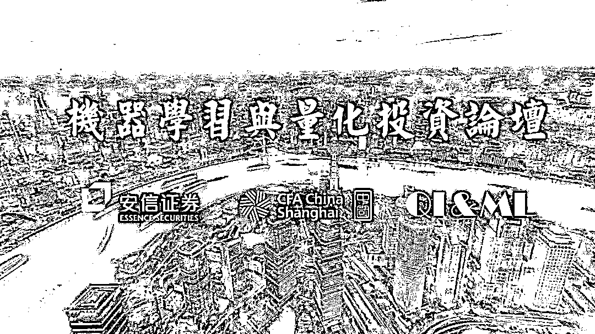

# 明天，上海见！

> 原文：[`mp.weixin.qq.com/s?__biz=MzAxNTc0Mjg0Mg==&mid=2653287980&idx=1&sn=1716ea6782ec64264182d9a84152fee8&chksm=802e3439b759bd2fdec3bee93daba2e97e82154e892e566edc570d45226ed8065affdc9eb4c0&scene=27#wechat_redirect`](http://mp.weixin.qq.com/s?__biz=MzAxNTc0Mjg0Mg==&mid=2653287980&idx=1&sn=1716ea6782ec64264182d9a84152fee8&chksm=802e3439b759bd2fdec3bee93daba2e97e82154e892e566edc570d45226ed8065affdc9eb4c0&scene=27#wechat_redirect)

**新时代春天里发生了什么？**

春风化雨，万物复苏。新时代的春天里，十九大提出加快发展以人工智能为代表的新经济。在人工智能与其他行业的碰撞中，人工智能与量化投资的结合无疑是一颗最为璀璨的明珠。**安信****证券金融工程部**与**CFA 中国上海**携手，量化投资与机器学习公众号有幸受邀。同时还有来自公募、私募的资深专业人士，分享在投资领域应用机器学习的心得和见解。

**活动概况**

**主办单位**

安信证券金融工程组、CFA 中国上海协会

**活动地点**

上海市徐汇区淮海西路 211 号上海高级金融学院 3 楼 303 教室（场地方一楼可停车，停车费 10 元）

**活动时间**

**2018 年 5 月 6 日**，星期日，**14:00 – 17:00**  (签到时间: 13:30 – 14:00)

**活动费用**

**免费**

**论坛介绍**

**1、机器学习量化价值挖掘初探**

**演讲嘉宾：**沈天瑞 | CFA

沈天瑞博士现任垒土投资创始合伙人兼首席投资官。剑桥大学认知脑科学博士、认知心理学硕士；复旦大学光源与照明学士，15 岁参加高考进入复旦大学。16 岁开始投资交易至今已经有 16 年国内外交易经历，历经中国多轮牛熊市。曾在英国伦敦及中国两家排名靠前的量化对冲基金公司担任研究、交易的自营交易员及基金经理职务。是“中国对冲基金元年”首批参与国际对冲基金全量化生产/交易系统中国本土化，编写、调试、改进生产程序、行情、交易接口、交易算法等模块，推动海外通行量化对冲基金标准与中国券商 PB 对接。熟悉中国市场，研发运行过多个中国市场的量化交易模型，涵盖市场中性阿尔法模型、事件驱动、CTA、套利等多种类型。

**2、机器学习与 A 股的量化投资**

**演讲嘉宾：**吴振翔

现任汇添富基金指数与量化投资负责人，长期从事 A 股市场的量化研究和投资，目前管理多只量化和指数公募基金，团队对机器学习在投资上应用有一定的实践和体会。

**3、机器学习与 CTA**

**演讲嘉宾：**付超     

现任某资产公司创始人，曾任明汯投资宏观对冲部负责人，富善投资 CTA 策略组合副主管。他在 CTA 策略领域尝试过各种机器学习的应用，目前该策略承载资金 10 亿以上，包括股票，期货以及电子货币市场。

**4、自然语言处理在金融市场预测中的应用**

**演讲嘉宾**：魏鹏

中科大机器学习硕士，量化投资与机器学习公众号编辑部成员。量化投资与机器学习公众号是目前是微信量化领域搜索排名第一的公众号。

**报名方式**

报名参会确认请联系【安信金工团队】

杨勇 | Tel：13918148315 

刘帅路 | Tel:13764594964

吕思江 | Tel:18512197996

周袤 | Tel:18601798125

**知识在于分享**

**在量化投资的道路上**

**你不是一个人在战斗**

****