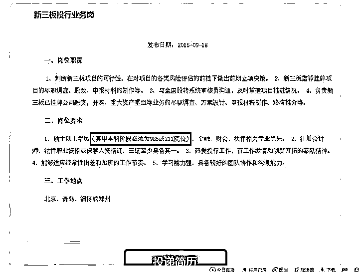
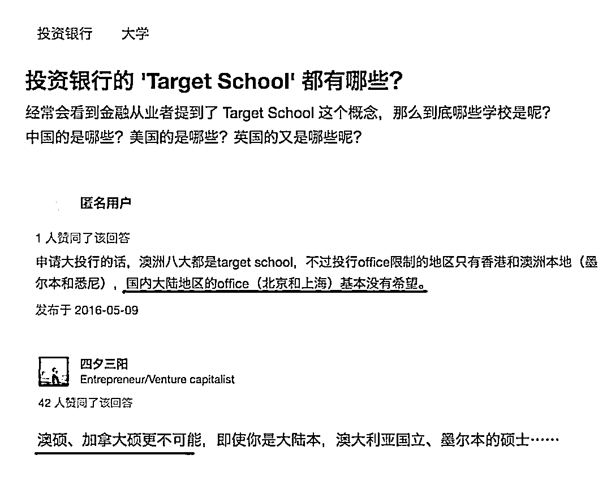
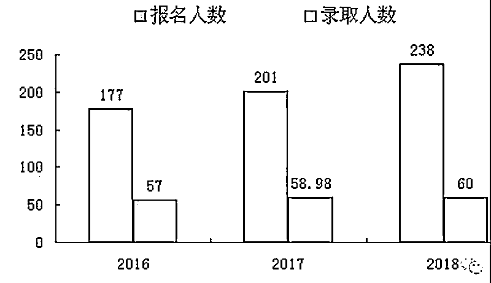

# 抱歉，我们只看第一学历！

> 原文：[`mp.weixin.qq.com/s?__biz=MzAxNTc0Mjg0Mg==&mid=2653287959&idx=1&sn=58f2a95fd052ce6749d30aef8d19798d&chksm=802e3402b759bd144a7bc984cea4460dbf218d3d6ea2255ba5d9b95e40cd1e2df27a804cc183&scene=27#wechat_redirect`](http://mp.weixin.qq.com/s?__biz=MzAxNTc0Mjg0Mg==&mid=2653287959&idx=1&sn=58f2a95fd052ce6749d30aef8d19798d&chksm=802e3402b759bd144a7bc984cea4460dbf218d3d6ea2255ba5d9b95e40cd1e2df27a804cc183&scene=27#wechat_redirect)

**量化投资与机器学习**

在量化投资的道路上，你不是一个人战斗！

 

 原文作者：UniCareer

五一小长假即将收尾

空闲之余也要看看好文章哦

今年考研季已结束

常州大学的一间宿舍成了网红

宿舍八人互相鼓励，全员考研成功

却有人冷嘲热讽：**“本科不好，考了 985 也没用”**

传说越热门越挣钱的行业

越注重第一学历

难道真是高考定终身？

**那双非本科考研还有什么用？**

01

**名企是否都“只看第一学历”？**

当当网创始人李国庆说只看第一学历,非 211 不要！MBB 也是以第一学历为主要筛选条件。国内券商，国外投行更是明确标注“本科阶段必须为 985/211 学校”。

*图片来源于网络丨券商招聘要求

02

**海归鄙视链真的存在吗？**

不仅国内学校遭歧视，国外的海归也有一条自己的鄙视链。

*海归鄙视链*：**美本＞美硕＞英国海归＞澳洲海归**

美国本科比较难进，大家在高中阶段，除非是学霸，否则英语水平达不到去美国生活的阶段，而且美国本科学费高昂，阻止了许多怀揣美国梦的少年。

相比美国硕士申请比较容易：一般情况下，有 GPA3.0 以上，即 80 以上，就可以申请到不错的学校。而且，美本至少在美国待四年，硕士两年，更容易锻炼英语，**每个暑假都可以在美国找实习，实习机会更多。**

对于英国和澳洲学校来说，硕士只要一年到一年半的时间即可毕业，并且澳洲相对美国知名学校少，**很多 HR 没听过的学校，在脑海里自然而然就归类成了“野鸡大学”。**

*图片来源于知乎

03

**为什么硕士没本科“值钱”？**

**考研变得容易 **： 

从 1998 年到 2018 年的 20 年间，考研报录比从 3.6 比 1 下降到了 2.6 比 1，这意味着考研成功的概率是越来越可观。

所以，人们容易认为考研是一件比高考更容易的事，再加上现在身边硕士遍地跑，自然人们心中通过考研上 985 和高考上 985 的含金量也是不一样的。

*数据来源于丨中国考研网

** 高分低能的“考研专业户”让导师头疼 **：

前几年更是频繁有关于“考研专业户”的负面消息被报道、被讨论。

起因是有些高考大省的高校的学生，一进学校就被灌输了“本科四年专为考研”的观念，**大部分时间都花在钻研考研上，研究和实操能力却没有得到培养。**

这些能力的缺失是作为一名研究生致命的短板，特别是在理工学科。这些学生因为考研制度的不足被吸纳，日后却**让导师和同学深感头疼，负面评价很多**。

*图片来源于网络

** 相比之下，高考水分少 **：

因为高考参加人数远多于硕博招生，且试题统一，所以考试结果具备甄别人才的作用，与中考类似。同时**大学扩招使得本科生这一标签失去本该承载自高考的甄别人才的功能，而这个功能如今被 985/211 体系继承了**。

与此同时，国家出于全面培养人才角度考虑，必然会将各行各业优秀人才实际需求数量作为 985/211 布局的考虑因素。表现之一就是北工大因此超过了首师大。

04

**招聘时看重第一学历的 HR 是什么心态？**

*@夏侯*

> **就学历本身来说，我觉得主要两个原因：**
> 
> *   **经过高考选拔出来的国内名校生，从概率上讲，含金量要高得多；**
>     
>     
> *   **本科时代对一个人的人格、品行、能力等各方面的塑造，影响深远，是其他后期的深造难以弥补的。**

*@ 吴梦楼*

> **人才太多，除了少数大牛，大多数人都差不多，所以必须设置一些条件进行筛选，比如学历。可是光看最终学历的话，还是基数太大，只能再用第一学历来筛。**

* @匿名用户*

> **不是看重第一学历，而是比较差异。好公司往往人才扎堆，HR 要在人才扎堆的资料库筛选精英，选第一学历是一种比较有效率的方式。**
> 
> **换句话说，不是你名校研究生不好，而是大家都是名校研究生，同等情况，大家都没有特殊技能，只能顺着往本科看，这也是一种择优录取的基本思维。**

*@匿名用户*

> **一、懒；二、省钱。**

*图片来源于网络

05

**学历的 bug 如何补救**

难道高考没考好，就只剩复读一条出路？ 

考研怎么说呢，像妹子夏天的安全裤，其实，真的没什么用，不会走光的根本没有看到的机会，而会走光的，安全裤和小内内真的没什么很大区别。可是，对穿着安全裤的我来说，是莫大的安慰，**我敢迈步走出去，而不是为了怕走光畏畏缩缩**。

首先：问题不在于第一学历，而是如果自己真是大牛，那就要**摆出能够 KO 掉第一学历的超能力来。**

举个例子，你想进券商，只让 HR 看到本科三本，研究生复旦，却没让 HR 看到：

*   参与本专业国际商赛比赛前三名

*   管院模拟交易大赛前三名

*   联合国国际组织的实习，帮助某个国家政府解决穷人饮用水供应问题

*   固收 FICC 配置超过 20%的 cagr

*   炒股自营盘综合收益超过 25%

*   托福 115，gmat750，对经济学人上的文章能很好的 presentation

*   参与过国内前几大券商过 10 亿以上的定增，再融资，发债 etc 项目

*   ......

其次，在校期间提升自己，让自己在某一方面小有成就，比如我是文科生，我就拼命扩大自己在文字方面的影响，让大家能真实看到我的文字功底。**有那么多时间打游戏看韩剧，不如多发表博客、微博、论文，日积月累，笔头纯熟，没坏处**。

*图片来源于网络

06

**第一学历不好的人，更要读好研究生**

为什么很多本科学历差的人都说：“你凭什么看不起我的学历？**此处不留爷，自有留爷处！**”

其实这**根本不是畸形的自我感觉良好，而是因为眼界狭隘造成的错误认知**，在自己名不见经传的母校，

*   也许你读的教科书是本校教授为了赚取版权费编撰的

*   也许身边的人不是通宵打游戏就是夜不归宿

*   也许周围有人一学期都没上过课，偶尔去一次是为了趴桌上补眠

人都是爱比较的，这个时候的你：

*   如果坚持不逃课不迟到，**你会觉得你是一股清流**

*   如果你不仅不逃课不迟到，晚上还按时睡觉周末泡在图书馆复习，**你会觉得自己很牛 X**

*   **每次大测小测都名列前茅，导师对你青睐有加，**你会觉得自己是大牛****

**自我膨胀的感觉一经发酵，不可收拾。但**却忘记这些只是一个名校生该有的素质**。读研，上好的学校，才能大开眼界，看到自身与其他人的差距，明白不足，才能更加努力往上冲**

**读完研找的工作，难道不比**曾经依靠本科学历找的工作好太多了**吗？**

****

***图片来源于网络**

****知识在于分享****

****在量化投资的道路上****

****你不是一个人在战斗****

********