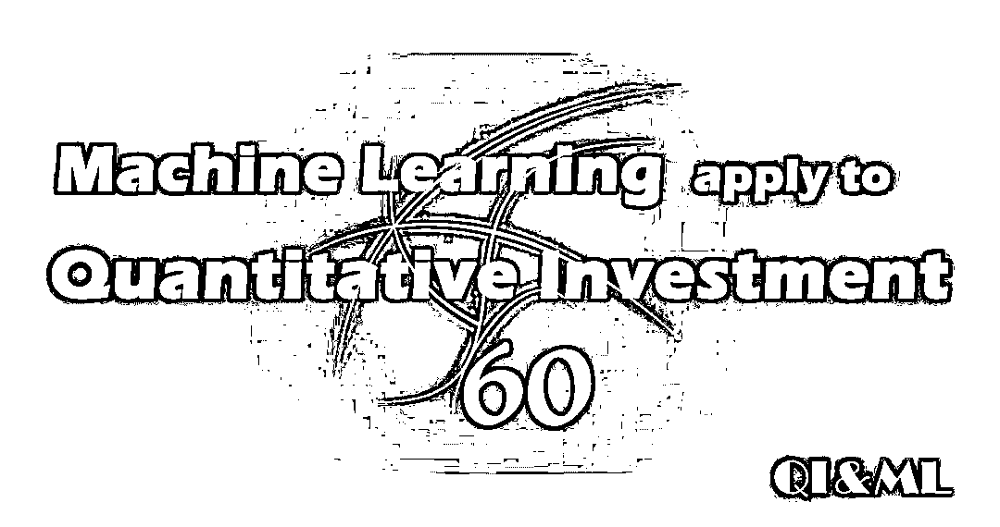
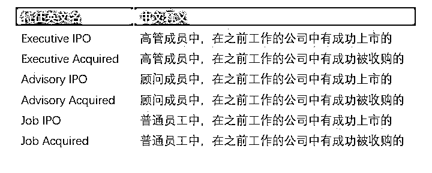
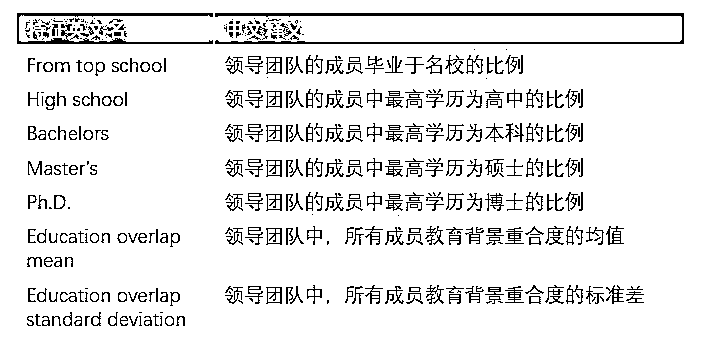
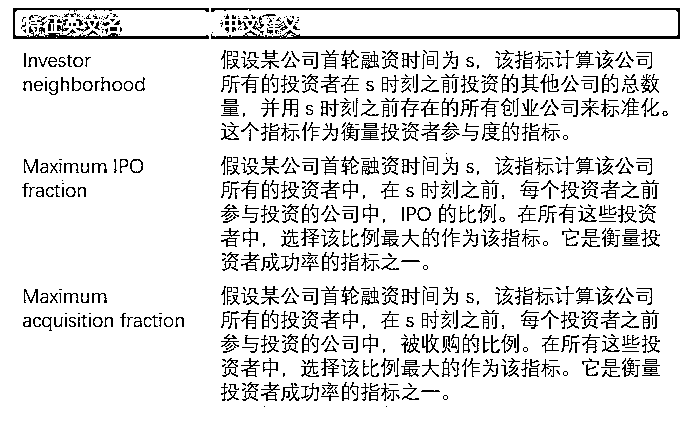
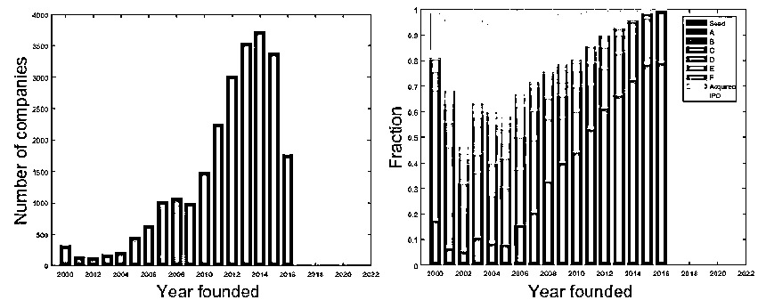
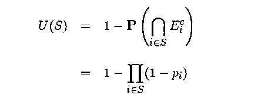
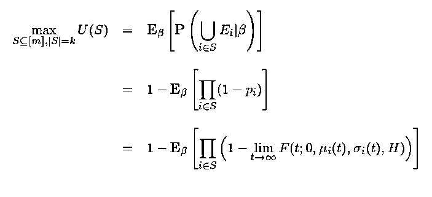
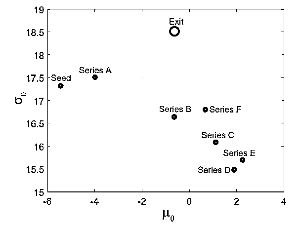
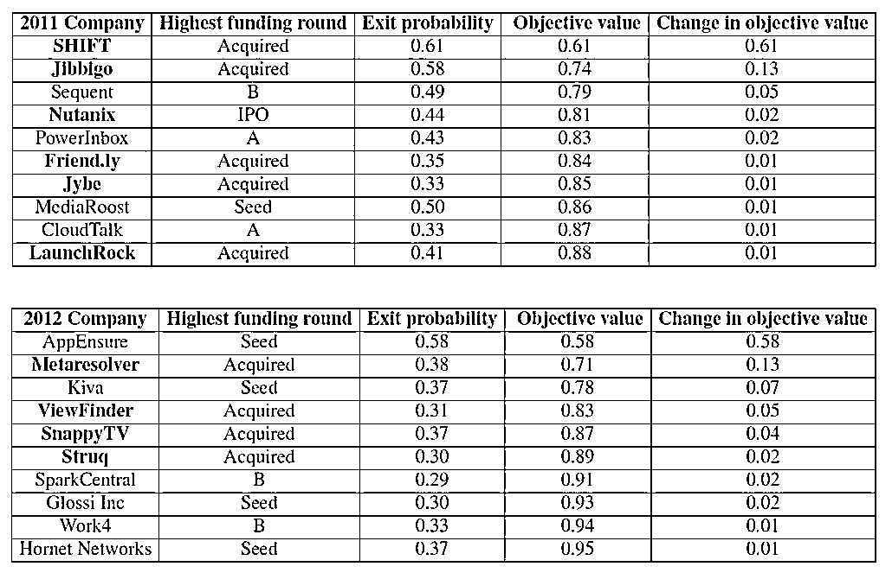
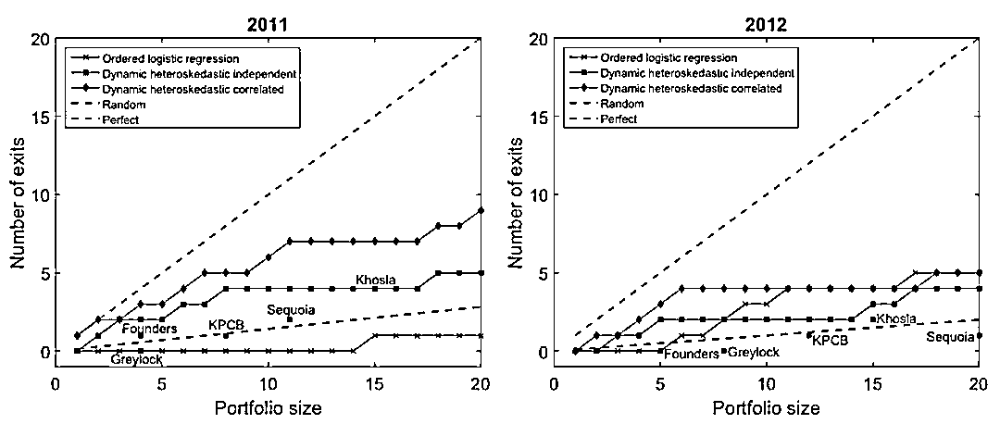

# 一个基于 ML 的纯量化框架出世，助力风险投资！

> 原文：[`mp.weixin.qq.com/s?__biz=MzAxNTc0Mjg0Mg==&mid=2653287954&idx=1&sn=0837fc42cb4062a6991742b5ec4e67cf&chksm=802e3407b759bd1102049108c4cb7d598fdfb968432ac729b689494a35de8689efd47701f537&scene=27#wechat_redirect`](http://mp.weixin.qq.com/s?__biz=MzAxNTc0Mjg0Mg==&mid=2653287954&idx=1&sn=0837fc42cb4062a6991742b5ec4e67cf&chksm=802e3407b759bd1102049108c4cb7d598fdfb968432ac729b689494a35de8689efd47701f537&scene=27#wechat_redirect)

**量化投资与机器学习**

在量化投资的道路上，你不是一个人战斗！

 

**引言**

近几年，以机器学习、特别是深度学习为代表的人工智能（AI）得到了长足的发展，机器学习和人工智能也成为出现在街头巷尾的高频词汇。今天我们把目光放在风险投资（venture capital），看看机器学习能否在一级市场有所作为。

写本文的动机源自作者最近读到的一篇来自麻省理工的论文 Hunter and Zaman (2017)。**该文提出了一个挑选优秀早期创业公司的量化分析框架，利用机器学习算法进行参数估计以及最优投资组合的构建，从而挑出那些最有可能成功的初创公司（成功的标准是风险投资人因该公司上市或者被收购而退出）。**

因为文章很新（2017 年的），而且将机器学习应用于了一个比较新的场景，读来让人耳目一新，因此希望把它介绍给关注公众号的小伙伴，开阔大家的视野。最重要的是，它在样本外挑出的创业公司的退出成功率高达惊人的 60%！

这篇论文本身非常 technical，因为一些建模的细节问题，我还和作者进行了邮件沟通，确保正确的领会了文章传达的内容。本文将避免涉及太多大数学公式（会有少量必要的），但会不吝篇幅、力争把该分析框架的重点 —— 包括如何构建特征、如何对参数建模求解、以及选取什么样的目标函数 —— 解释清楚。文章最后是关于这个话题的思考。

在介绍这个框架之前，首先来看看相较于二级市场，风险投资为什么更适合机器学习。

**风险投资更适合机器学习**

2016 年，AlphaGo 以无可争议的优势战胜了李世石；2017 年它的升级版更是风卷残云一般战胜了以柯洁为代表的中方各路围棋高手。AI 在围棋领域的大获全胜给了我们很大的启发，一个适合使用机器学习来解决的问题应该包括以下三个性质：

> 1. 信息边界明确，状态有限；
> 
> 2. 所有信息完全公开透明；
> 
> 3. 有明确的胜负判断标准。

我们来看看风险投资是否满足这三个条件。根据百度百科，风险投资的定义如下：

**风险投资**主要是指向初创企业提供资金支持并取得该公司股份的一种融资方式。风险投资公司为一专业的投资公司，由一群具有科技及财务相关知识与经验的人所组合而成的，经由直接投资被投资公司股权的方式，提供资金给需要资金者（被投资公司）。风投公司的资金大多用于投资新创事业或是未上市企业，并不以经营被投资公司为目的，仅是提供资金及专业上的知识与经验，以协助被投资公司获取更大的利润为目的，所以是一追求长期利润的高风险高报酬事业。

在一个创业公司融资的过程中，通常分为种子轮（seed）、A 轮、B 轮、……、F 轮（一般 IPO 前不超过 F 轮）、最后是 IPO。以 IPO 上市退出无疑会带给投资人最大的收益；在上市无望的情况下，被收购也是一种比较好的退出方式。**根据上面的定义，风投的手段是投资有希望的早期创业公司，目的是在退出时为投资人牟取超高额收益。**

从机器学习问题的角度来说，我们需要挖掘初创公司具备的特征与该公司最终能否为投资人带来了丰厚的报酬之间的关系：Y = f(X)，即回答“**什么样的公司能在未来成为独角兽**”这个问题（X 代表特征向量，Y 代表是否带来了丰厚回报这件事儿）。训练这个模型是一个典型的**有监督学习问题**。更重要的是，风险投资比较好的满足上面提到的三个条件：

> 1. 一个初创公司是否能够成功大概率受以下几方面的影响：所处的行业是否是风口行业、产品是否有核心竞争力、创始团队是否出色、是否有知名早期投资者扶持。与二级市场投资相比，风险投资问题的边界相对明确且状态有限。
> 
> 2. 关于初创公司的团队和融资路径数据，虽然还远非尽善尽美，但是也有足够多的数据（包括公开的和可花钱购买的）来建模。在美国，初创公司这方面数据的可得性（availability）可能更高一些，但是在国内也有像鲸准、IT 桔子、铅笔道这样的关于创业团队相关数据的提供方。
> 
> 3. 对于风投来说，成功的标准比较明确，就是成功退出（包括 IPO 退出或者被收购退出）。更加发散一步，在建模和参数估计时，也可以使用创业公司完成了哪一轮的融资作为判别的依据。

需要明确说明一下 Hunter and Zaman (2017) 研究的样本对象。**该文的样本点仅考虑了 2000 年之后在美国创办的、且从数据库中可以获得其可靠种子轮或 A 轮融资数据的公司**；**作者关注的是早期融资成功的那些公司中，哪些更有可能最终脱颖而出**。满足上述条件的公司超过 24,000 个。以它们为样本，该文作者使用机器学习算法找到了最有可能在未来成功的创业公司应具备的特质。由于样本中的公司都已完成了种子轮或 A 轮融资，因此早期投资人的背景和能力也成为对公司建模的一个特征维度。

下面就来说说 Hunter and Zaman (2017) 考虑的特征。

**选择特征**

上一节提到，创业公司的特征可以从以下四个方面考虑：

> 1、行业
> 
> 2、产品
> 
> 3、领导团队（包括高管和顾问）
> 
> 4、早期投资者（首轮融资）的资源和经验

Hunter and Zaman (2017) 在构建特征时并没有独立考虑产品这个维度（也没有过多的加以说明）。我的猜想可能是行业已经是产品的一个有效代理指标，话句话说，产品和行业维度比较相关。另外的原因就是在产品初期，能客观定量评价它的指标可能非常有限；产品本身太过细分，难以横向比较。事实上，马上我们将看到，Hunter and Zaman (2017) 考虑的行业已经非常细致，这也暗示了无需再进一步考虑产品这个维度了。接下来，分别从行业、领导团队以及早期投资者三个维度介绍特征。这些数据来自 Crunchbase 数据库以及 Linkedin（领英）。

**3.1 行业**

Hunter and Zaman (2017) 考虑了如下这些行业。当一个创业公司所属于某个行业时，它对应的行业特征取 1，否则为 0。这些行业包括：3D 打印、广告、分析、动画、Apps 应用程序开发、人工智能、汽车、无人驾驶汽车、大数据、生物信息、生物技术、比特币、商业智能、云计算、计算机、计算机视觉、约会交友、开发者 API、电子商务、线上学习、教育、线上虚拟体育、时尚、金融、金融服务、金融科技，健身、GPU、硬件、保健、健康诊断、医院、保险业、互联网、物联网、iOS 开发、生活方式、物流、机器学习、医疗、医疗设备、信息派送、移动通讯、纳米技术、网络安全、开放源码、个人健康、宠物、照片共享、可再生能源、共享出行、机器人、搜索引擎、社交媒体、社交网络、软件、太阳能、体育、交通、视频游戏、虚拟现实和虚拟化。

**3.2 领导团队**

领导团队笼统的包括高管（含创始人）以及顾问。主要考虑的角度包括，团队成员在过去是否有成功的创业经验、团队成员之间工作和教育背景的相似性和互补性、团队和公司所处行业的符合度、以及团队的平均年龄。下面分别说明。

首先，团队成员过去的创业经验包括如下六个指标。

其次，利用 Linkedin 的数据，Hunter and Zaman (2017) 抓取了所有领导团队成员在成立/加入本公司之前的工作经历，并从中计算出了如下代表他们工作经验和背景的特征。

在计算工作重合度时，Hunter and Zaman (2017) 采用了 Jaccard Index（一种评价两个集合中元素相似度的常见方法）。具体方法为，领导团队成员两两配对，找出他们之前工作单位的交集和并集，用交集中成员的数量除以并集中成员的数量求出 Jaccard Index。这个指标的取值在 0 到 1 之间，是工作重合度的度量，越高说明重合度越高。对于每个配对，都能得到一个 Jaccard Index，然后计算这些 Jaccard Index 的均值和标准差，作为工作重合度的均值和标准差。

在领导团队的教育背景方面，Hunter and Zaman (2017) 考虑了最高学历、是否毕业于名校、以及教育背景重合度等特征。这些特征包括：

在名校的表单中，Hunter and Zaman (2017) 仅考虑了美国的学校（这是个不足？），它们包括：伯克利、布朗大学、加州理工、卡耐基梅隆、哥伦比亚、康奈尔、达特茅斯、杜克大学、哈佛大学、约翰霍普金斯、麻省理工、西北大学、普林斯顿、斯坦福、芝加哥大学、宾夕法尼亚大学、以及耶鲁大学。在计算教育背景重合度时，同样采用的是 Jaccard Index，不再赘述。

对于团队教育背景和公司所处行业的相似性，Hunter and Zaman (2017) 使用了 WordNet 词汇数据库，计算每个领导团队成员学术专业和公司所处行业之间的语义相似度（具体方法是 Palmer-Wu 相似度分数，见 Wu and Palmer 1994）。得到由每个成员计算出的相似度后，取它们的均值作为团队教育背景和公司行业的相似性的度量。

最后一个关于创始团队的指标是在成立该公司时，团队的平均年龄。出于年龄数据不全的考量，作者假设团队成员 18 岁高中毕业、22 岁本科毕业，然后根据他们获得相应学位的年份和公司创办的年份计算出目标年龄。

**3.3 早期投资者**

在早期投资者这个维度，Hunter and Zaman (2017) 着实花了一番功夫，使用约 83,000 个公司和 48,000 个投资者数据构建了一个公司和投资者关系的动态知识图谱。该图谱随时间变化，对于任意给定的时间点，图谱中的给定节点表示在那个时刻某个投资者投资了某个公司。通过这个图谱，作者计算了两个评价早期投资者能力的指标：投资人的参与度和投资人的成功率。

以上介绍了从行业、团队和早期投资者这三个维度如何构建创业公司的特征。**其中的难点在于数据的抓取、数据的清洗（提高数据质量）、以及投资人和公司关系图谱的构建。**

**构建参数模型**

有了特征之后，下一步就是要把特征和最终模型学习的目标联系起来。对于选择优秀的初创公司这件事儿，目标应该是什么呢？

我们最终的目标是找到最有希望 IPO 的公司。**但是使用上述特征直接映射到创业公司能否 IPO （比如使用逻辑回归）太过简单粗暴了**。下图显示了在 Hunter and Zaman (2017) 的样本中，自 2000 年以来每年新成立的公司的数量以及每年处于各轮融资的公司的数量（从种子轮、A 轮、一直到被收购或者 IPO）。

从上面的右图可见，能够最终 IPO 的独角兽公司凤毛麟角。**如果仅仅以一个公司是否 IPO 作为标签的话，这样的样本数据是非常不均衡的**。以此来训练分类模型的话，常规的方法会过度的考虑对非 IPO 公司（占绝大多数）分类的准确性，而忽视对少数 IPO 公司的准确性。

从直觉上来看，我们似乎应关心对 IPO 公司预测的准确率，并为此可以牺牲对该类预测的召回率，以及对非 IPO 公司预测的精度。但是不要忘记，IPO 的回报是非常高的 —— 不夸张的说，早期 VC 投 100 个公司，有一个能够最终 IPO 就足够覆盖其他 99 个失败造成的损失并给他带来丰厚的收益了。这样的收益特性称为 top-heavy payoff structure。基于此，我们似乎更应该关注对 IPO 公司分类的召回率。

无论如何，直接以是否 IPO 作为标签来训练一个有监督分类问题是过于简化了。更合理的建模思路应该是什么呢？从业务上来考虑，一个创业公司在成功的历经各轮融资后，它的估值是在逐步提升的。因此，**使用创业公司的特征来对它估值的变化建模似乎是一条可行并合理的路径**。Hunter and Zaman (2017) 正是这么做的。

Hunter and Zaman (2017) 假设一**个公司的估值 V(t) 随时间的变化可以由一个布朗运动描述**，该布朗运动的漂移率和扩散率同样为时间 t 的函数，分别为 μ(t) 和 σ(t)。假设在成立时，公司的估值为 0，即 V(0) = 0，随着时间的推移，V(t) 按布朗运动波动。进一步假设不同的融资轮对应不同的估值阈值，当 V(t) 超过某轮阈值就意味着该公司成功完成该轮融资。**经过这样的假设，一个公司每完成新一轮融资所需要的时间就是这个布朗运动的 first passage time（首达时间）**。在进一步的数学假设下，作者给出了布朗运动首达时间的概率分布函数 f 以及累计分布函数 F（公式本身太“感人”了，因此我们仅仅给出它们的数学符号，具体表达式就不列出来了，感兴趣的读者请参考原文）：

其中 t_0 表示下一轮融资的起始时间、α 表示估值 V(t) 需要达到的阈值。结合创业公司的融资数据，作者观察到了如下特征，并将它们用于对 μ(t) 和 σ(t) 的建模中：

> 1. 大多数成功的创业公司在早期几轮融资中的间隔时间大致相同，这说明我们可以假设在一段时间内，μ(t) 和 σ(t) 保持不变；
> 
> 2. 很多公司虽然在前几轮融资成功，但是随着时间的推移，越来越多的不免走向失败，无法继续获得融资。这意味着当过一个公司发展了几年后，布朗运动的漂移率开始下降；
> 
> 3. 随着时间进一步推移，一个公司能够成功（IPO 或者被收购）的可能性越来越低（说明其估值 V(t) 到达某个极限，很难继续增长），这意味着 μ(t) 和 σ(t) 将随着 t 的增大趋近于 0。

考虑到这些特性，Hunter and Zaman (2017) 对 μ(t) 和 σ(t) 的表达式总结如下：

这表明当 t ≤ ν 时，μ(t) 和 σ(t) 为常数；而当 t ＞ ν 时，μ(t) 和 σ(t) 按指数衰减。ν、τ、μ_0 及 σ_0 需要根据训练集数据得到，其中 ν 和 τ 的取值对所有公司相同，而 μ_0 及 σ_0 是每个公司特有的参数。**用什么来决定每个公司的 μ_0 和 σ_0 呢？你一定已经猜到了：公司的特征！**如此一来，公司特征就和上述布朗运动有机的结合起来了。

对于 μ_0 和 σ_0，分别考虑两组参数向量 β 和 γ，并令 μ_0 和 σ_0 是特征向量 X 以 β 和 γ 分别为权重的线性组合：

此外，Hunter and Zaman (2017) 认为外**部环境的改变会影响公司特征对于公司能否成功的重要性**。为此，他们假设同年成立的公司共享一组 β，但不同年份之间 β 向量是不同的（当然不同年的 β 之间是不独立的）。对于给定年份，所有在该年成立的创业公司使用该年的 β 向量和自身的特征向量 X 来求解漂移率 μ_0。

**最终需要根据训练集来估计的参数包括 β 和 γ，以及用来描述漂移率和扩散率随时间变化结构的 ν 和 τ**。对于给定的参数，可以求出描述公司估值变化的布朗运动的漂移率和扩散率，即 μ(t) 和 σ(t)，从而计算出估值 V(t) 到达各轮融资阈值的首达时间的概率分布；有了这个概率分布便能求出每个创业公司在个给定的时间内是否能成功完成指定轮融资的概率。**在参数估计中，目标函数就是最大化所有训练集样本点各轮融资发生的概率。**

为了计算概率，需要给定各轮融资的阈值。Hunter and Zaman (2017) 将这些阈值作为模型的超参数直接给定，但他们也强调模型对融资阈值的选择并不敏感。由于在模型中融资阈值对所有公司都一样，因此它们仅对 β 和 γ 参数的大小起缩放（scaling）作用，并不影响特征和目标函数之间的内在关系。

由于目标函数太复杂，作者采用了 Broyden-Fletcher-Goldfarb-Shanno 算法（一种求解无约束非线性优化问题的迭代算法，见 Yuan 1991），它能比传统的梯度法更快的找到最优解。

**构建最优投资组合**

通过上述参数模型，作者构建了公司特征和公司估值 V 变化之间的关系。但到了这一步还没结束，仅仅有了这个关系，我们只能大致知道哪个公司可能更有希望获得融资。**为了从成千上万的创业公司中找出独角兽，我们最关心的是每个创业公司最终能够在有限时间内实现 IPO 的概率。**

有了首达时间的概率分布函数 F 和模型的参数，很容易通过下式求出任何公司 i 最终 IPO 的概率，记为 p_i（其中 H 为实现 IPO 所需要的阈值）：

有了每个公司成功的概率 p_i，那么 VC 是不是只需要将有限的资金投入给成功概率最高的那些公司就可以了呢？答案并非那么简单。假设一共有 m 个创业公司，由于资金有限制，VC 需要从中选出 k 个，**目标是这 k 个里面****至少有一个****最终会 IPO**。这个问题类似背包问题（knapsack problem）或集合覆盖问题（set covering problem），其目标函数可以写成：

其中 [m] = {1, 2, …, m} 构成了所有公司的集合，S 是 [m] 的子集、大小为 k，E_i 代表公司 i 成功 IPO（其概率为 p_i）。由于我们希望至少有一个 IPO 成功，因此只需要将不同的 E_i 求交集。U(S) 就是选出的 k 个公司中，至少有一个 IPO 成功的概率，所以我们希望最大化 U(S)。

这个问题是 HP-hard，难以求解。但是，该问题具备一些不错的数学性质使得贪心算法（greedy）可以找到不错的次优解。**使用贪心算法，每一轮从所有剩余公司中选择一个，选出来的应该是能够最大化目标函数的边际增长，直到 k 轮后，一共选择 k 个公司构成 S。**

如果令 S_G 和 S_W 分别表示贪心算法的解和全局最优解，那么可以证明，目标函数的准确性是有下界的：

当 E_i 之间独立时 S_G 和 S_W 完全一致。在实际的求解中，Hunter and Zaman (2017) 假设公司之间能否 IPO 是独立的。利用独立性可以把目标函数表示成 p_i 的形式（p_i 是公司 i 成功 IPO 的概率）：

最后需要指出的一点是，在上一节的建模中，作者令系数 β 随时间变化。因此在计算目标函数 U(S) 的时候必须考虑 β 的变化引入的随机性。这意味着 U(S) 实际是关于 β 的期望，即我们最终要最大化的是**按照 β 的概率分布计算出来的至少有一家创业公司成功 IPO 的期望概率：**

这个期望可以使用蒙特卡洛积分求解。这就是这个量化风投框架的全部内容。 

**量化效果**

Hunter and Zaman (2017) 使用 2000 到 2010 年的数据作为训练集，之后的数据作为测试集，检验了他们提出的量化框架。通过在训练集上训练模型，他们得到了每个公司估值布朗运动的漂移率 μ_0 和扩散率 σ_0。将所有公司按照其最高的融资轮次分组，并考察每组中公司的 μ_0 和 σ_0 的中位数有：

观察这张图可以得到如下启发：

1. 表现较差的创业公司（最高融资轮止步于种子轮或者 A 轮）通常有较低的漂移率；

2. 表现一般的创业公司（最高融资轮为 B 到 F 轮）通常有较高的漂移率，但是较低的扩散率；

3. 表现最好的公司（以 IPO 或者被收购退出）的漂移率仅仅是一般水平，但是却有很大的扩散率。

**这似乎说明足够大的扩散率是成功的必要条件**。这让我们自然的提出下一个问题：什么样的公司特征可能带来比较大的扩散率（和漂移率）？

作者给出了 2010 年对漂移率产生最大影响的五个行业和非行业特征及它们的系数（别忘了 β 每年是变的），以及对扩散率产生最大影响的五个行业和非行业特征及它们的系数：

从行业的角度来说，在 2010 年，影响漂移率的五大行业是线上学习、共享出行、开源、云计算以及生物信息学；影响扩散率的五大行业是社交媒体、信息派送、社交网络、APPs 应用程序开发以及云计算。这意味着这些行业的想象空间（波动）比较大。

从非行业特征角度来说，无论是对于漂移率还是扩散率，**最重要的特征就是创始团队的经验，特别是管理团队成员是否在成立本公司之前有过成功的创业经历。除此之外，教育背景（是否毕业于名校），和早期投资者过往的成功率（maximum acquisition fraction）也尤为重要。**

根据训练模型和最优投资组合的优化函数，作者分别在 2011 年和 2012 年构建了两个投资组合，每个里面包含 10 个创业公司。这两个组合如下表所示，其中第二列为到 2016 年底每个公司最终的融资或退出情况，第三列为模型预测的退出概率 p_i，第四列为组合中依次加入每个公司之后目标函数 U(S) 的变化。

结果显示，在 2011 年选出来的 10 个公司中，有 6 个如今已经成功退出了（包括 1 个 IPO 和 5 个被收购）；在 2012 年选出的 10 个公司中，有 4 个已经退出了（均是被收购）。这可以说是**令人称奇**的结果了。

为了横向比较，Hunter and Zaman (2017) 把他们的模型和顶级 VC 以及一个基准模型比较。基准模型采用了 ordered logistic regression 算法，它使用每个公司最高的融资轮作为标签，进行有监督分类。

上图中，左侧的为 2011 年的结果，右侧为 2012 年的结果。横坐标表示所投公司数量，纵坐标为成功退出公司的数量。其中红线和蓝线为基于 Hunter and Zaman (2017) 框架的两个版本的模型的结果，它们的成功率远超基准模型以及顶级 VC；在 2011 年的组合中，当投资个数增加时，基准模型 ordered logistic regression 也取得了不错的效果，但是当投资的创业公司较少时，Hunter and Zaman (2017) 的框架仍然是最出色的。

**启发与思考**

终于把这个框架介绍完了，首先的感受是“给跪了”。Hunter 和 Zaman 在这个量化风险投资框架中集成了大量的机器学习和数学优化算法。对它们的梳理如下：

> 1. 从创业公司数据库（如作者采用的 Crunchbase）和 Linkedin 抓取创业公司和创业者、投资人的数据；从行业、团队、早期投资人三个维度构建特征；这其中运用了知识图谱的构建以及语义分析等技术；
> 
> 2. 使用带漂移率和扩散率的布朗运动来建模创业公司估值的变化，以最大化训练集中所有公司各轮融资发生的概率为目标训练模型参数，这是一个有监督学习问题，求解时采用了 BFGS 算法；
> 
> 3. 根据模型的参数，使用布朗运动首达时间的概率分布计算出每个公司实现 IPO 的概率。
> 
> 4. 使用贪心算法和蒙特卡洛积分求解公司选取最优化问题，最优化的目标是最大化选出来的公司中至少有一个能够实现 IPO 的概率。

**一个优秀的风险投资公司必备的两点是一套科学的方法论（来洞察投资热点和评估创业团队），和丰富的资源（无论是募资能力还是社会资源）。**没有前者，它找不到好的项目；没有后者，好的项目不找它。**本文介绍的这个量化框架可以是这套科学方法论的有利助力。**

为什么这么说呢？因为哪怕是抛开该框架在样本外的预测效果而言，它通过训练集建模得到的参数就能给 VC 们带来很多非常有帮助的启发，这其中包括**对热点行业的追踪**以及**对优秀创业公司必备的特征的精准定位**。比如，通过模型的参数可以找出时下最热门的行业，并指出一个创业公司想要成功必备的特质是创始人的工作经历和教育背景 —— 资本尤其青睐连续创业者。这些发现和国内很多顶级 VC 的“投的是人，而不是项目”的理念不谋而合。

当然在现阶段，纯量化的风投框架无法解决一个风投公司的资源问题。换句话说，一个量化型风投基金如果没人脉没资源、没有足够的募资能力，那即便是它找到了最具成功潜质的公司，也很难得到股权投资的机会。但是对于那些已在市场中站稳脚跟的 VC 们，掌握一套量化的科学评估体系（无论是对行业还是对创业公司） —— 即便该体系没有本文介绍的这么复杂 —— 也都是大有裨益的。**该体系一定会在当下的风投界为这些 VC 们赢得一定的 edge。**

如果有一天，机器学习（或更广义的，人工智能）真的在投资界大有作为，那么一级市场的 VC 们恐怕会比二级市场的基金经理们率先“沦陷”，而“干掉”他们的正是他们扶持起来的这些人工智能领域的独角兽们。

犹未可知。

参考文献

Hunter, D. and T. Zaman (2017). Picking winners: a framework for venture capital investment. Working paper, Sloan School of Management, Massachusetts Institute of Technology. 

Wu, Z. and M. Palmer (1994). Verbs semantics and lexical selection. In Proceedings of the 32th annual meeting on association for computational linguistics, 133 – 138.

Yuan, Y.X. (1991). A modified BFGS algorithm for unconstrained optimization. IMA Journal of Numerical Analysis, Vol. 11(3), 325 – 332.

**知识在于分享**

**在量化投资的道路上**

**你不是一个人在战斗**

****