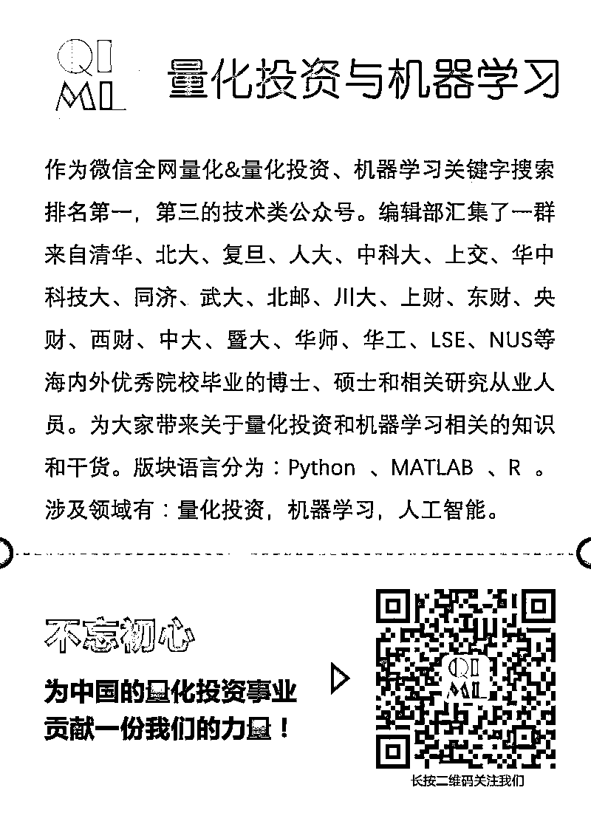

# 根据期权价格估算风险中性密度（第十六期免费赠书活动来啦！）

> 原文：[`mp.weixin.qq.com/s?__biz=MzAxNTc0Mjg0Mg==&mid=2653287931&idx=1&sn=70cf207803e3748964edfd13933e5f3c&chksm=802e37eeb759bef8c9f5f2389f90f6447858ca780374b65cbd25fa9ce2cc67abc5f668498300&scene=27#wechat_redirect`](http://mp.weixin.qq.com/s?__biz=MzAxNTc0Mjg0Mg==&mid=2653287931&idx=1&sn=70cf207803e3748964edfd13933e5f3c&chksm=802e37eeb759bef8c9f5f2389f90f6447858ca780374b65cbd25fa9ce2cc67abc5f668498300&scene=27#wechat_redirect)

**量化投资与机器学习**

为中国的量化投资事业贡献一份我们的力量!

 

作者：Andrea Barletta 和 Paolo Santucci de Magistris，Aarhus 大学

由于场外期权合约的买卖在交易双方间私下进行而非通过公开市场，因而可能很难确定合约的价格有利于买方还是卖方。为对这些合约进行定价，金融分析师往往依据看涨期权或看跌期权价格估算出风险中性密度 (RND)值。常规做法是根据历史数据来确定定价模型的参数值，进而 估算 RND 值。

根据参数定价模型估算 RND 有几个缺点，如处理时间较长而且可能存在误差。简单模型可快速完成调试，但很可能会与金融数据的一些历史经验特征不一致，生成的结果误差较大；复杂模型能够提供更精确的结果，但所需调试时间较长 — 如果没有闭式解（解析解），通常需要长达数小时。即使复杂的模型能够提供看似合理的结果，也可能由于没有应用有效的数值分析技术而存在偏差。此外，由于定价模型主要依据历史数据，由建模人员自行决定需要采纳的历史数据量 — 这种主观决定会影响结果。

Aarhus 大学的研究团队开发了一款非结构化无模型 RND 估算方法，不依赖参数化模型，而是完全由数据自身决定。这种方法利用当前数据（而非历史数据）通过正交多项式展开式估算 RND 和期权敏感度指标(Greeks)，这样能够比应用模型的方法更快得到结果 — 通常仅需几秒钟来估算 RND。

为演示我们的方法，便于学生、分析师和研究人员进行应用，我们将它封装为 MATLAB® 应用程序（图 1）。我们在两篇文章中对该方法进行了详述 (A Non-Structural Investigation of VIX Risk Neutral Density（估算 RND）和 It Only Takes a Few Moments to Hedge（估算敏感度指标）)，并用 Risk-Neutral Density Fitting Tool 应用程序具体实现了该方法。 

> 2 篇论文、1 个工具的链接如下：
> 
> *1、https://papers.ssrn.com/sol3/papers.cfm?abstract_id=2943964*
> 
> *2、https://papers.ssrn.com/sol3/papers.cfm?abstract_id=3086538*
> 
> *3、https://abarletta.github.io/rndfittool/*

图 1Risk-Neutral Density Fitting Tool 应用程序

**我们为什么选择 MATLAB**

我们决定创建 MATLAB 应用程序估算 RND，因为我们希望研究成果得到广泛应用，而不是仅限于在量化经济学领域或是熟悉 MATLAB 编程的金融研究人员使用。

我们发现，MATLAB 大大加快了了开发进度。我们在两到三个月内完成了大部分开发工作 — 据估算，使用传统编译语言大约需要两年时间。 MATLAB 是一种解释型语言并基于 JIT 编译器运行，这令我们避免了繁琐的“编辑-编译-测试”周期；相反，我们采用交互形式开发方法，调用 MATLAB 中的函数并反复检查结果。不依靠第三方库，也无需自行编写线性回归、主成分分析及其他功能算法，而是利用 Curve Fitting Toolbox™、Financial Toolbox™、Optimization Toolbox™ 和 Statistics and Machine Learning Toolbox™ 等工具包中经过验证的函数。使用解释型语言时，运算性能是我们关注的问题。但是，通过采用 MATLAB 中的向量化运算和优化的函数，其性能与编译语言基本接近。

除了加快实施我们的 RND 方法之外，MATLAB 还可以轻松构建界面并将其与底层代码封装成为一款应用程序。我们使用 MATLAB 应用程序开发工具设计窗口、按钮及界面中的其他控件。然后，将完整应用程序封装为单一安装程序文件，并发布到项目的 GitHub 页面供用户下载。*https://abarletta.github.io/rndfittool/*

**通过应用程序估算 RND 并查找敏感度指标**

下载并安装应用程序后，通常先从 OptionMetrics 或 Chicago Board Options Exchange (Cboe)等数据源加载期权价格数据（MATLAB 应用程序支持直接调用这两个数据源）。然后用户检查输入数据对应的价格曲线并根据需要调整行权价格的上下限（看跌或看涨期权最低和最高行权价格）。之后用户选择核、展开式阶数以及用于估算展开系数的方法（例如，主成分分析）。核指定概率分布,为 RND 提供一个初始值；而展开式阶数则定义正交多项式数量，“校正”核来估算 RND。

此应用程序包含多个内置核，包括 beta gamma、广义逆高斯、广义 Weibull 和对数正态，而且用户可以通过自己编写 MATLAB 函数来对内置核进行扩展。展开式阶数越高，展开式就越精确，但估算所需的时间也会更长（图 2）。

 图 2 隐含波动曲线及使用广义 Weibull 核、主成分分析和 17 阶 展开式估算出的 RND 值。图示中使用的数据集包含 2011 年 12 月 21 日在 Cboe Volatility Index® (VIX®) 上的 1 月期看涨期权和看跌期权。

最后，计算敏感性指标 delta、gamma 和 vega，用户只需单击应用程序的“查找敏感度指标”按钮。界面中会显示这三个指标图（图 3）。

 图 3 敏感度指标图：看涨期权 delta、 gamma 和 vega。

所有图均可另存为 MATLAB 图像或者 PNG、PDF 或 EPS 文件，所有结果均可导出并保存以便进一步分析。

**将来升级的功能**

从我们收到的反馈来看，用户对于该应用程序予以了肯定。基于这些反馈，我们将进一步改进应用程序并规划对其的升级。例如，我们考虑在分析中添加时间点和到期日，我们将研究使用多变量密度，并应用期权价格的历史数据来预测整个密度曲线，而非仅在某一个时间点的曲线。

# **MATLAB EXPO 2018 中国 | 精简和定制主题**

**公众号倾情推荐！**

### **会议说明**

首次推出 MATLAB EXPO 2018

**微信在线直播**（ 9:40 – 11:40）

特别精简三大热门主题：

**1、人工智能 & 你, 准备好了吗？**

**2、大师对话： 关于 Coder 的那些事  （定制）** 

**3、金融分会场（仅限在线）：MATLAB 最前线：风险管控知多少 **

无法参加北京现场全天活动的用户， 可报名参加 MATLAB EXPO 2018 微信两小时在线直播！ 

## **5 月 22 日** | **北京**

**扫下方二维码填写注册信息，即刻报名**

**赠书活动**

量化投资与机器学习公众号联合电子工业出版社送出**5 本**《**量化投资专家系统：开发与策略实战**》****

> 本书以软件工程的角度把一个看似不可能完成的大型金融软件系统，抽丝剥茧，层层剥离，逐步完善，从而提高技术人员的大局观、合作意识和问题分解能力。全书一共五章，第一章介绍了专家系统与金融专家系统，起到提纲挈领点明任务主题的作用。第二章是系统设计的核心思想是需求是设计更是算法，通用性极强。第三章则以 PHP 开发者的角度详细介绍了几个有代表性模块的开发与实现，从而达到举一反三的目的，为了增加读者的印象，第四章我们特意从基本面、技术面和高频方面分别列举了两个策略。最后我们通过一些小案例的方式提高读者的开发能力，从而突破金融专家系统的单一局限。

**原价：69.00 元**

**截止 2018.04.30 12:00**

大家在本篇推文【写留言】处发表留言，**获得****点赞****数****前五****的读者，即可免费获赠此书**。届时，工作人员会联系五位读者，寄出此书。