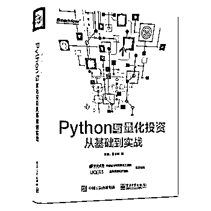

# 【世界读书日】2018 版十大引用数最高的深度学习论文集合（第十五期免费赠书活动来啦！）

> 原文：[`mp.weixin.qq.com/s?__biz=MzAxNTc0Mjg0Mg==&mid=2653287888&idx=1&sn=b53327d19748a78eeeaad6d8d72ef76d&chksm=802e37c5b759bed3c21dff5e2181acdc892dd13613aa0d4d40084b4d71b285e40e075821e306&scene=27#wechat_redirect`](http://mp.weixin.qq.com/s?__biz=MzAxNTc0Mjg0Mg==&mid=2653287888&idx=1&sn=b53327d19748a78eeeaad6d8d72ef76d&chksm=802e37c5b759bed3c21dff5e2181acdc892dd13613aa0d4d40084b4d71b285e40e075821e306&scene=27#wechat_redirect)

**量化投资与机器学习**

为中国的量化投资事业贡献一份我们的力量!

 

在过去的几年里，深度学习是机器学习和统计学习交叉领域的一个子集，强大的开源工具以及大数据的热潮让其取得了令人惊讶的进展。 本文根据微软学术的引用量作为评价指标，从中选取了 10 篇引用量最高的论文。希望在今天的读书日，能够给大家带来一份学习的干货。

**获取全部论文****，****请在****文末****查看。**

**Deep Learning, by Yann L., Yoshua B. & Geoffrey H. (2015) ****引用次数：5716**

Deep learning enables computational models that are composed of multiple processing layers to learn with multiple levels of abstraction, the representations of data. These methods have resulted in the improvement of the state-of-the-art in object detection, speech recognition, visual object recognition, and many other domains such as drug discovery and genomics dramatically. 

**TensorFlow: Large-Scale Machine Learning on Heterogeneous Distributed Systems, by Martín A., Ashish A. B., Eugene B. C., et al. (2015)** **引用次数：2423**

The system is flexible and can be used to express a variety of algorithms, that includes deep neural network models training as well as inference algorithms, and it has been used for conducting research and for the deployment of machine learning systems into production across more than a dozen areas of computer science and other fields, including the retrieval of information, speech recognition, robotics, computer vision, geographic information extraction, natural language processing, and computational drug discovery. 

**TensorFlow: a system for large-scale machine learning, by Martín A., Paul B., Jianmin C., Zhifeng C., Andy D. et al. (2016) ****引用次数：2227**

TensorFlow, an open-source project with its main focus on training and inference on deep neural networks. supports a variety of applications. Many services of Google in production make the use of TensorFlow and over time it has become widely used for research in the field of machine learning. 

**Deep learning in neural networks, by Juergen Schmidhuber (2015) ****引用次数：2196**

This historical survey has a compact summarization of relevant work, much of it from the previous millennium. Shallow as well as deep learners by the depth of their credit assignment paths are distinguished which are chains of possibly learnable, causal links between actions and effects.

**Human-level control through deep reinforcement learning, by Volodymyr M., Koray K., David S., Andrei A. R., Joel V et al (2015)** **引用次数：2086**

Here in order to develop a novel artificial agent, termed a deep Q-network, we make the use of recent advances in training deep neural networks that using end-to-end reinforcement learning can learn successful policies directly from high-dimensional sensory inputs. This agent was tested on the challenging domain of classic Atari 2600 games. 

**Faster R-CNN: Towards Real-Time Object Detection with Region Proposal Networks, by Shaoqing R., Kaiming H., Ross B. G. & Jian S. (2015)** **引用次数：1421**

In this work, you are introduced to a Region Proposal Network (RPN) that shares with the detection network, full-image Convolutional features, thus enabling nearly cost-free region proposals. A Region Proposal Network is a fully Convolutional network that at each position simultaneously predicts object bounds and objectness scores.

**Long-term recurrent convolutional networks for visual recognition and description, by Jeff D., Lisa Anne H., Sergio G., Marcus R., Subhashini V. et al. (2015) ****引用次数：1285**

In contrast to current models which assume a fixed spatio-temporal receptive field or simple temporal averaging for sequential processing, recurrent Convolutional models are “doubly deep” in that they can be compositional in spatial and temporal “layers”.

**MatConvNet: Convolutional Neural Networks for MATLAB, by Andrea Vedaldi & Karel Lenc (2015)** **引用次数：1148**

It as easy-to-use MATLAB functions exposes the building blocks of CNN's, providing routines for computing linear convolutions with filter banks, feature pooling, and many more. This document provides a great overview of Convolutional Neural Networks and how they have their implementation in MatConvNet and further also gives in the toolbox of each computational block the technical details of the same. 

**Unsupervised Representation Learning with Deep Convolutional Generative Adversarial Networks, by Alec R., Luke M. & Soumith C. (2015) ****引用次数：1054**

In this work, the main focus is to help bridge the gap between the success of CNN's for supervised learning and unsupervised learning. Here, you are introduced to a class of CNN's called deep convolutional generative adversarial networks (DCGANs), that have certain architectural constraints, and demonstrate that they are a strong candidate for unsupervised learning.

**U-Net: Convolutional Networks for Biomedical Image Segmentation, by Olaf R., Philipp F. &Thomas B. (2015)** **引用次数：975**

There is large consent that successful training of deep networks has a requirement of many annotated training samples. In this paper, you are presented a strategy in network and training that in order to more efficiently use the available annotated samples solely relies on the strong use of data augmentation. 

**获取全部论文**

**请在****后台回复**

**世界读书日**

**赠书活动**

量化投资与机器学习公众号联合博文视点送出**5 本**《**Python 与量化投资：从基础到实战**》****

> 量化投资界精英王小川领衔撰写。Python 基础与量化投资策略双管齐下。为不懂 Python 语言的读者提供零基础入门，为有 Python 基础的读者提供量化策略建模参考。提供大型回测平台及本书代码，可将本书代码直接实盘应用，进行投资。本书主要讲解如何利用 Python 进行量化投资，包括对数据的获取、整理、分析挖掘、信号构建、策略构建、回测、策略分析等。本书也是利用 Python 进行数据分析的指南，有大量的关于数据处理分析的应用，并将重点介绍如何高效地利用 Python 解决投资策略问题。本书分为 Python 基础篇和量化投资篇：Python 基础篇主要讲解 Python 软件的基础、各个重要模块及如何解决常见的数据分析问题。

**原价：99.00 元**

**截止 2018.04.26 18:00**

大家在本篇推文【写留言】处发表留言，**获得****点赞****数****前五****的读者，即可免费获赠此书**。届时，工作人员会联系五位读者，寄出此书。

****