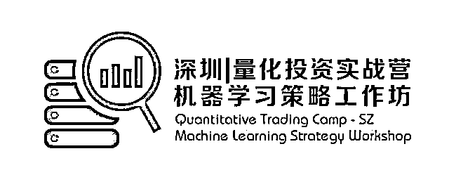
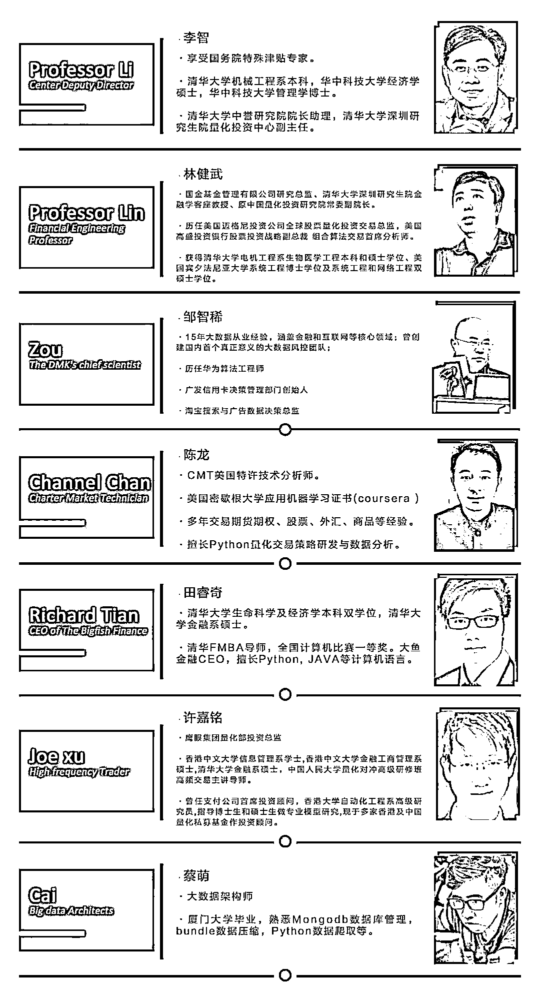
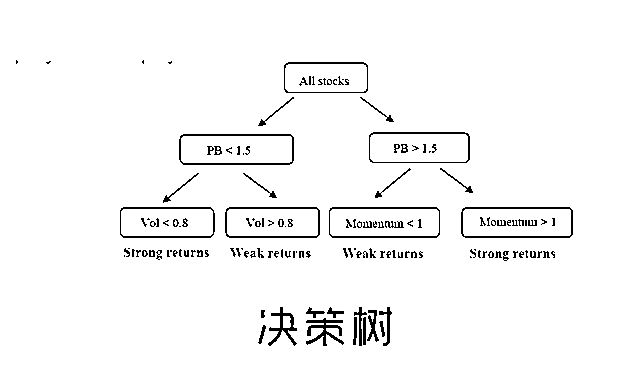
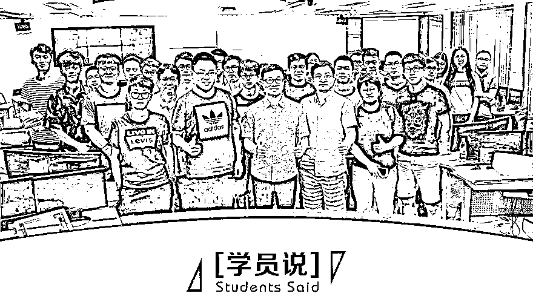

# 【假期充电】Python | 机器学习策略实战派

> 原文：[`mp.weixin.qq.com/s?__biz=MzAxNTc0Mjg0Mg==&mid=2653287882&idx=1&sn=192363a0e1bf9d9d37a94e50974b70dc&chksm=802e37dfb759bec910abcfc0c35660a3552d6b8e0ff7c43093547235d9ba8446e0ac9afc8021&scene=27#wechat_redirect`](http://mp.weixin.qq.com/s?__biz=MzAxNTc0Mjg0Mg==&mid=2653287882&idx=1&sn=192363a0e1bf9d9d37a94e50974b70dc&chksm=802e37dfb759bec910abcfc0c35660a3552d6b8e0ff7c43093547235d9ba8446e0ac9afc8021&scene=27#wechat_redirect)

**量化投资与机器学习**

为中国的量化投资事业贡献一份我们的力量!

 

先看一下往期机器学习工作坊精彩回顾！

 [`v.qq.com/iframe/preview.html?vid=b05611rvu8i&width=500&height=375&auto=0`](https://v.qq.com/iframe/preview.html?vid=b05611rvu8i&width=500&height=375&auto=0) 

**机器学习策略工作坊（五一假期）开放报名**

**时间：****2018.4.29~2018.5.1（三天全天候****）**

**地点：****清华大学深圳研究生院量化研究中心**

这是一份机器学习结合量化投资的深度实战指南

名额有限，欲报从速！

# **Python****机器学习策略工作坊**

## A Hands-On Learning Approach to Python Machine Learning Strategy

* * *

**■ 课程特点**

Python 机器学习策略工作坊**（QTC_MLS）**是由清华大学深圳研究生院量化研究中心公益支持，配合大鱼金融联手塑造的 Python 机器学习量化交易策略线下工作坊。

在这里不仅有专业导师当面传授机器学习模型理念与模块应用，还有技术团队解决工具安装与配置，提供优质的机器学习量化策略源代码，通过三**天高强度研习**，最终实现动手**编写实现机器学习策略代码。**

* * *

**■ 你将获得**

**1\.  Python 机器学习模块应用技能**

**2\.  pandas 大数据处理**

**3\.  机器学习策略代码模板与回测绩效**

**4\.  清华量化研究中心的研习证书**

****

* * *

****■ 支持方****

********

*   ******清华大学深圳研究生院量化研究中心******

****清华大学深圳研究生院与清华大学中誉研究院集前沿计算机技术、高端数学，与现代金融理论为一体，并整合了国内外一流的金融平台,逐步形成了研发核心团队，并开发了一批金融函数及上千个量化交易策略，并且经过实盘交易的检验,并有一定的经济基础和市场影响力。****

*   ******新格网络科技有限公司(大鱼金融)******

* * *

******■ ****拟邀嘉宾 ****■******

********

******一线研发与投资团队辅导******

****有别于校园的金融课程，工作坊不仅邀请到清华研究生院量化投资中心一线机器学习研究员指导教学，更请到 CMT 持证分析师，与数位多年从事机器学习的专家随同辅导,业界真实经验教学，打造全程真实编程体验。****

* * *

******■ 课程主题******

****The curriculum includes topics such as:****

******SVM、决策树、隐马尔可夫模型、******

******套索回归、卡尔曼滤波、******

******神经网络、深度学习…******

********

| **Day0**   |
|    安装机器学习工具（课前一周） |
|   微信群/QQ 群+视频与文档  sklearn/keras/tensorflow 工具安装  Git 下载所有课件  运行测试脚本  测试课件代码 |

| **Day1**   |
|    9:00-12:00   用黑客精神做量化投资——Channel,CMT |
|    现代量化投资的数据与模型   应用机器学习的重要概念   黑客精神与量化投资   无码机器学习   机器学习的工作流程 |
|    14:00-17:00   机器学习数据格式——蔡萌 |
|    金融数据可视化   获取股票因子与价格数据   Python 数据格式操作   市场宽度与多维数据运算   数据滚动切片，避免数据泄露   金融分类实际案例 |
|    19:30-21:30   Alpha 特征选取——田睿奇 |
|    因子 IC 值与 Quantile 收益曲线计算   自定义因子编写   因子数据特征选取   因子算法参数优化   多因子组合运算 |

| **Day2**   |
|    9:00-12:00   量化投资 _ 机器学习分类器应用——Channel,CMT |
|   KNN 模型  Logistic Regression   SVM 模型   决策树随机森林分类   交叉验证 _CrossValidation   混淆矩阵 _Confusion Matrix   隐马尔科夫模型案例 |
|    14:00-17:00   机器学习数据格式——许嘉铭 |
|    高频交易关键字   高频策略的定义与体系架构   高频算法交易与高频交易分析   高频对市场的影响 |
|    19:30-21:30   量化投资 _ 机器学习回归应用——Channel,CMT |
|    OLS 回归   Ridge & Lasso 回归   Polynomial 回归   Kalman Filter   R_Square   过度与欠拟合 _Overfitting and Underfitting   机器学习策略回测 |

| **Day3**   |
|    9:00-12:00   神经网络与深度学习——田睿奇 |
|   神经网络 _NN   卷积神经网络 _RNN   长短期网络 _LSTM   深度学习预测行情案例 |
|    14:00-17:00   机器学习策略大赛 |
|   选择题    填空题   操作题   Keras 编写深度学习策略编写 |

******▲应用型的经验传授与实操研习****** 

****要熟悉机器学习并用其模型作为量化投资的工具，不仅需要学习模型的理念与算法，调参优化与模型选择，更需要掌握 Sklearn 与 Keras 模块的使用，只有经验丰富的导师指导配合自己动手编写，才能在短时间掌握核心技能。****

* * *

********

****◥ **杨佳 | 四川大学 计算机金融双学位** ◤****

****在大学老师讲的都是相对基础的东西，然后涉及到结合的东西是比较少的，想来这里看看前沿的知识是怎样的。在这里老师从最开始的基本概念到辅助我们最后完成一个很完整的策略都给了我非常大的帮助，我觉得这让我能收获到很多使用 Python 人工智能处理金融问题的帮助。未来如果还有这么优秀的导师阵容我还会来继续参加的~！**** 

****◥ **胡强 | 上海保险资产管理公司** ◤****

****我平常工作接触的就是量化投资这一块，但是随着人工智能越来越火，很多同行包括做券商研究的都越来越推崇人工智能量化投资，我想这个应该是未来的大方向，我这次来就是想尽快站在未来的这个风口上面。这次课程确实是非常的充实，同学里面涵盖的行业领域也非常多，导师讲课里面也有涉及很多行业内的干货之类的。这次课程之后希望能在实际工作中获得更多的实践和印证，未来如果有机会的话会推荐更多的同事来这里学习更前沿的知识和打开更多的眼界。**** 

****◥ **朱代辉 | 诺亚财富 AI 团队总监** ◤****

****本身我在 AI 机器学习是属于科班出身，但对金融投资并不是十分深入。所以这次上课其实是想接触更多前沿的想法，我在课堂上并不见得需要学到非常多的知识，但我比较看重的是跟同行的沟通与了解，和老师进行经验的分享，看到国内其他同行现在的进展状况。我相信目前这个结合的方向应该是中国大陆最前沿的，很少有比我们这个课程还要前沿的了，我觉得这个是非常有意义非常棒的。****

******■ 项目详情****** 

******时间：****2018.4.29~2018.5.1（三天）******

******地点：****清华大学深圳研究生院量化研究中心******

******对象：**对 Python 机器学习与量化投资感兴趣的爱好者、投资者等。以及广大程序员、大学生、交易员、风控员、基金经理、产品经理、私募和公募管理者、金融从业人员、寻求投资合作机会的伙伴。****

******费用：****6980/人**** ，在校学生凭学生证可优惠 1000 元，即 5980 元/人******

****此费用不包含食宿费,在校学生报名后填写测试题更有机会获得** 500~1000**元优惠券！****

* * *

******■****SIGN UP****■******

******报名方式******

******点击****阅读原文******